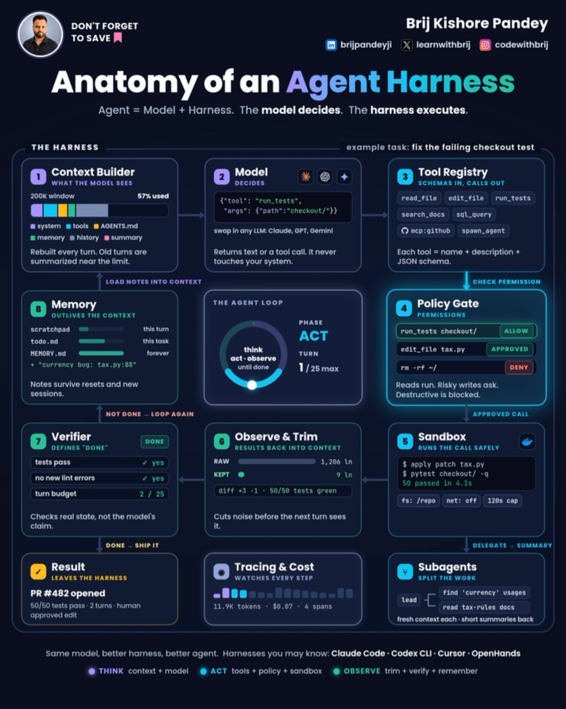

# 01 — Claude Code & Agents

**Thesis:** Claude Code's power isn't the model — it's the scaffolding around it. Taken together, these ten entries describe a complete operating system for the tool: skills that package repeatable behavior, subagents that keep the main context clean, dynamic workflows that let the agent write its own orchestration, and pipelines that offload heavy analysis to free external engines. The through-line is leverage — a small amount of setup (a skill file, a subagent definition, a slash command) that pays off on every subsequent session.

### Turn Instagram Saves into a Notion content system
- **Creator:** @justyn.ai · **Date:** 2026-07-01
- **What it suggests:** The Save button is a graveyard — posts go there to be forgotten. The fix is an automation that treats saves as raw material: a Claude Code (or Codex) session builds two Notion databases ("Instagram Saves" with columns for Caption, Collection, URL, Status, Type, Saved date), connects via Instagram session cookies, and syncs twice daily at 9 AM and 9 PM. Saved posts land categorized under collections like "Claude Code" or "Content Ideas," and from there the system transforms them into original content ideas, blog posts, or articles. The deeper lesson is architectural: social saves are an unstructured intake queue, and a scheduled agent plus a structured store turns them into a content supply chain. The same pattern works for any intake — bookmarks, read-later lists, meeting notes — as long as there's a schema and a sync cadence.
- **Repos/tools:** Notion (database + API), Claude Code / Codex
- **Extractable skill:** Scheduled intake automation — define a schema, connect the source, sync on a cadence, then run a transform step that converts raw captures into usable output.
- **Source:** https://www.instagram.com/reel/DaQqNWnvEMs/

### Dynamic workflows: let the agent write its own orchestration
- **Creator:** @rajistics · **Date:** 2026-05-31
- **What it suggests:** Anthropic's dynamic workflows collapse multi-agent orchestration from ~25 lines of hand-written node-edge-state config to a couple of lines, by giving the agent itself a tool to write its own orchestration logic. The demo walks through a research-deepening example — specialized agents for web search and fact-checking — where the model generates async coordination code live in the terminal, adapting the plan as it goes instead of following a predefined workflow. The critical discipline he adds: inspect the traces afterward (84 interaction traces in Langfuse in his demo) to understand what the system actually did. The takeaway for agent builders is to stop pre-scripting every branch and instead give agents orchestration primitives plus observability — flexibility at runtime, auditability after.
- **Repos/tools:** Claude Code (dynamic workflows), Langfuse (trace observability)
- **Extractable skill:** Agent-written orchestration — provide coordination tools, not fixed graphs; always keep trace inspection as the verification step.
- **Source:** https://www.instagram.com/reel/DZBiUWhtEvj/

### The 6 design skills worth keeping (after testing 70+)
- **Creator:** @omgluka · **Date:** 2026-05-02
- **What it suggests:** After testing 70+ Claude Code design skills, only six survived — three for web (stitch-skill, taste-skill, impeccable) and three for motion (remotion, hyperframes, gsap) — and he deleted the rest. The value isn't the specific list, it's the method: skills accumulate silently and most of them are redundant or low-quality, so periodic culling against real output is mandatory. A skill earns its place by surviving contact with actual work; everything else is context-weight. Note he renders video with remotion itself — dogfooding as the selection filter.
- **Repos/tools:** stitch-skill, taste-skill, impeccable, remotion, hyperframes, gsap (skill names as presented)
- **Extractable skill:** Skill portfolio review — regularly test your installed skills against real tasks, keep the winners, delete the rest. A small set of proven skills beats a large set of maybe-skills.
- **Source:** https://www.instagram.com/reel/DX2oGBDN7M0/

### YouTube pipeline skill: offload analysis to free engines
- **Creator:** @chase.h.ai · **Date:** 2026-03-17
- **What it suggests:** A custom seven-step "YouTube pipeline" skill: search YouTube for any topic, push the links to NotebookLM, let Google's free analysis engine do the synthesis, and receive the results back. The key insight is economic — the heavy analytical work happens on Google's free tier instead of inside your metered coding session, so it costs nothing and consumes none of your main context. This is the Jev pattern applied to research: a narrow, purpose-built pipeline handles the expensive comprehension step, and only the distilled answer crosses back into the working session. Any workflow with a "read and summarize a pile of stuff" step is a candidate for this offload.
- **Repos/tools:** Claude Code (custom skills), NotebookLM (notebooklm.google.com)
- **Extractable skill:** Free-engine offload — identify the comprehension-heavy step in a workflow, route it to a free external engine, import only the synthesis.
- **Source:** https://www.instagram.com/reel/DWA8YqVNP-N/

### Three systems to unlock Claude Code's design power
- **Creator:** @jens.heitmann · **Date:** 2026-03-03
- **What it suggests:** Most people only install front-end skills and miss the bigger lever: three systems working together. First, Google's Stitch MCP plus Nano Banana 2 to generate strong mockups that Claude Code uses as visual reference — the agent designs better when it can see a target. Second, the "UI UX Pro Max" design-intelligence skill from a GitHub library, which encodes design judgment as reusable rules. Third, an asset library like 21st.dev for production-grade 3D and reactive components, so the agent assembles rather than invents. The demo contrast (basic vs. polished outputs like "Eclipse," "Golden Hour," "Ethereal Glow") makes the point that AI design quality is bounded by its references. His closing line is the thesis: while designing with AI, humans set the quality standard — these systems just raise the floor.
- **Repos/tools:** Google Stitch (MCP), Nano Banana 2, UI UX Pro Max (GitHub skill library), 21st.dev
- **Extractable skill:** Reference-driven generation — never ask an agent to design from nothing; feed it mockups, encoded taste, and real components first.
- **Source:** https://www.instagram.com/reel/DVbfcdTkZ7R/

### Three Claude Code skills: GSD, superpowers, skill-creator
- **Creator:** @jens.heitmann · **Date:** 2026-02-21
- **What it suggests:** The claim is that most people use maybe 20% of Claude Code, and the skills feature is the other 80%. Three to install immediately: GSD ("Get Shit Done" v1.9.6), a workflow skill that multiplies output by imposing execution discipline; obra/superpowers, a skill library that — paired with GSD — puts Claude Code "on steroids"; and Anthropic's official skill-creator, the meta-skill that turns repetitive late-night sessions into saved, reusable skills. The third is the most strategic: it's the mechanism by which individual workflows become institutional assets. Together they form a stack — discipline (GSD), capability library (superpowers), and capture mechanism (skill-creator) — that converts usage into compounding advantage.
- **Repos/tools:** [obra/superpowers](https://github.com/obra/superpowers), Anthropic skill-creator (official), GSD v1.9.6
- **Extractable skill:** Skill-stack thinking — install an execution-discipline skill, a capability library, and a capture tool; the last one is how the other two keep improving.
- **Source:** https://www.instagram.com/reel/DVB32zvj91u/

### One frontend-design skill replaces 18 months of vibe-coding
- **Creator:** @sourcetms · **Date:** 2025-12-30
- **What it suggests:** Thomas Schlossmacher, a founder building AI-centric products, says Claude's skills feature made his previous 18 months of frontend vibe-coding obsolete: a single frontend-design skill plus one prompt rebuilt his entire personal website — a clean, modern bento-modular layout with social links, partners, Telegram community access, and articles — in under 30 minutes. The striking detail is that the skill absorbed his fragmented, messy "workspace" and returned it standardized and beautiful. The lesson generalizes: a well-built skill encodes taste and structure that would otherwise take months of iteration to develop, and it works in Claude Code or OpenAI's Codex. Skills aren't shortcuts; they're compressed expertise.
- **Repos/tools:** Claude Code / Codex (skills feature)
- **Extractable skill:** Taste-encoding — when a workflow finally produces great output, capture it as a skill immediately; that's the moment 18 months of learning becomes a file.
- **Source:** https://www.instagram.com/reel/DS5KGfdjHvL/

### Top 3 subagents: Explorer, Research Documenter, Historian
- **Creator:** @agentic.james · **Date:** 2025-10-13
- **What it suggests:** Three subagent archetypes for efficient Claude Code work, each solving a context problem. The Explorer locates code across the codebase so the main agent doesn't burn its context window on discovery. The Research Documenter handles large integrations with parallel web searches — fan-out work that would serialize and bloat the main thread. The Historian is a context-orchestration system that stores checkpoint snapshots as markdown files, giving long sessions a rewindable memory. Together they're a division of labor: discovery, parallel research, and state persistence all happen outside the expensive main context, which stays focused on decisions and edits.
- **Repos/tools:** Claude Code (subagents)
- **Extractable skill:** Context-labor division — push discovery, parallel research, and checkpointing into subagents; keep the main thread for judgment and edits only.
- **Source:** https://www.instagram.com/reel/DPxE0FDAe71/

### Building Great Agent Skills: The Missing Manual (recommended watch)
- **Creator:** @shareefico (recommending Matt Pocock's AI Engineer talk) · **Date:** 2026-10-03
- **What it suggests:** Names the trap "skill hell" — consuming skills with no rubric for what makes one good, the agent-era version of tutorial hell. The fix is a four-part checklist: **Trigger** (user-invoked vs model-invoked — model-invoked is flexible but costs context and predictability), **Structure** (steps + reference as the two units; keep SKILL.md minimal and push reference material behind context pointers), **Steering** ("leading words" — dense terms that steer reasoning traces; force more "leg work" by splitting complex processes into smaller skills that hide future steps), **Pruning** (one source of truth; delete "sediment," "crud," and no-ops that don't change behavior). This 20-minute talk is the authoring manual behind his mattpocock/skills repo (278k stars, already on this repo's GitHub Repos page at 8.5/10).
- **Repos/tools:** [mattpocock/skills](https://github.com/mattpocock/skills)
- **Extractable skill:** Skill authoring rubric — run every skill through trigger/structure/steering/pruning; re-audit and prune on every model upgrade.
- **Source:** https://www.instagram.com/p/DeCZn6JMmYf/ · Talk: https://www.youtube.com/watch?v=UNzCG3lw6O0

### "We Cut 80% of Claude Code's System Prompts" — Boris Cherny (recommended watch)
- **Creator:** @shareefico (recommending Boris Cherny's Y Combinator interview) · **Date:** 2026-10-03
- **What it suggests:** The creator of Claude Code explains that every model generation, Anthropic deletes and rewrites the system prompt, tool prompts, and tool set — because every model is different, and instructions written for one generation don't transfer to the next. For Opus 5 they cut over 80%: most of the prompt was scaffolding correcting behaviors a weaker model got wrong, and Opus 5 "just does it." Their internal method was ablation — delete the entire system prompt, bring it back line by line, measuring each line's impact (there's even an undocumented CLAUDE_CODE_SIMPLE=1 mode that strips all prompts for exactly this test). His advice to users: every 6 months, delete your CLAUDE.md, skills, and hooks, and see what the new model does unassisted. The tokenomics read: prompt mass is mostly compensation for old-model weakness — on every model upgrade, every instruction must re-earn its token cost or be deleted.
- **Repos/tools:** Claude Code (--system-prompt flag, CLAUDE_CODE_SIMPLE=1)
- **Extractable skill:** Prompt ablation cadence — on each model upgrade, delete custom instructions and re-add only what measured failures prove necessary.
- **Source:** https://www.instagram.com/p/DeCZn6JMmYf/ · Talk: https://www.youtube.com/watch?v=qyPCVqFUyDo

### Anatomy of an Agent Harness (infographic)
- **Creator:** @codewithbrij (Brij Kishore Pandey) · **Date:** 2026-10-08 · **Source:** Instagram reel
- **What it suggests:** "Agent = Model + Harness. The model decides. The harness executes." Eight boxes mapped onto one worked task (fixing a failing checkout test): **Context Builder** — what the model sees (200K window, system/tools/AGENTS.md/memory/history/summary; rebuilt every turn, old turns summarized near the limit). **Model** — decides; returns text or a tool call; swappable across Claude/GPT/Gemini; never touches the system. **Tool Registry** — each tool is a name, a description, and a JSON schema. **Policy Gate** — permissions; reads run, risky writes ask, destructive commands blocked. **Sandbox** — filesystem scoped to the repo, network off, 120s timeout. **Observe & Trim** — 1,206 raw output lines cut to 9 before the next turn sees them. **Verifier** — defines "done" (tests pass, no new lint errors, turn budget); checks real state, not the model's claim. **Memory** — scratchpad for the turn, todo.md for the task, MEMORY.md across sessions. Supporting boxes: **Tracing & Cost** (the example run: 11.9K tokens · $0.07 · 4 spans), **Subagents** (fresh context each, short summaries back), **Result** (PR #482, 50/50 tests, 2 turns, one human-approved edit). The loop: THINK (context + model) → ACT (tools + policy + sandbox) → OBSERVE (trim + verify + remember). Named harnesses: Claude Code, Codex CLI, Cursor, OpenHands.
- **Tokenomics angle:** the diagram is a token bill itemized — Observe & Trim (1,206 lines → 9) is the context-compression lever made visible; Tracing & Cost ($0.07 for the whole run) shows what a well-harnessed run costs; the turn budget and the verifier are spend controls. "Same model, better harness, better agent" is the playbook's thesis in one line: the harness, not the model, is where cost and quality get decided.
- **Repos/tools:** None (architecture infographic; harnesses named: Claude Code, Codex CLI, Cursor, OpenHands).
- **Extractable skill:** When two teams run the same model with very different results, audit the harness first — the eight boxes are the checklist: context builder, model, tool registry, policy gate, sandbox, observe & trim, verifier, memory, plus tracing/cost on every run.
- **Source:** Infographic by @codewithbrij, via Instagram reel (Oct 8, 2026).

### Glitch Walk: a skill that shows how your vibe-coded project really works
- **Creator:** @kem_glitch (Kem @ GlitchCatClub) · **Date:** 2026-10-08 · **Source:** Instagram reel
- **What it suggests:** A free agent skill for the "black box" problem — coding agents write complex code the developer doesn't fully understand, and it gets worse as projects scale. You ask "what happens when I send the topic request form?" and get a page with three layers: **what you do** (the real visible UI), **what happens out of sight** (every hidden step in order — client validation, serverless calls, email sending), and **the code behind it** (each step linked to the actual file and line; clicking reveals the code), plus suggested follow-up questions. The skill's own rules: it only walks — never fixes, changes, or judges; never makes anything up (code comes from the file, screens are the real screens); plain words, no analogies. Implementation is a skill folder (SKILL.md + Python scripts run via `uv`) that builds a self-contained HTML page (story.css/story.js); install is copy-the-folder into your AI tool's skills directory. MIT licensed, but day-zero: 2 stars, created the same day, author says "not finished."
- **Tokenomics angle:** codebase comprehension as context compression — a generated "how this works" page is onboarding context an agent (or a teammate) can consume instead of re-reading the whole repo every session. Same family as the diagram-design and archify skills on the repos page: visual, generated, agent-consumable context that cuts the per-session understanding tax.
- **Repos/tools:** [Glitch-Cat-Club/glitch-skills](https://github.com/Glitch-Cat-Club/glitch-skills) (2 ⭐, MIT, Python — scored 4.5/10 on the GitHub Repos page; concept strong, maturity day-zero).
- **Extractable skill:** For any vibe-coded or inherited codebase, generate the three-layer walk (UI → hidden steps → code) before assigning agent work on it — the walk becomes the shared context the agent reasons from instead of rediscovering the codebase per task.
- **Source:** https://www.instagram.com/reel/DePJAUftlJD/

## From X bookmarks (Sep 2026)
Distilled from Matt's X bookmarks, newest first. Full post text at each permalink (X truncates long posts in timelines).

### AI Engineer Paris talk: /retro, /pr, and getting more from agents
- **Creator:** @mattpocockuk · **Date:** 2026-09-25
- **What it suggests:** Shares the talk given at AI Engineer Paris 2026, announcing /retro and /pr commands and covering how to get more from coding agents (text truncates). Verifiable: /retro and /pr are new workflow commands — a retrospective command and a PR-focused command — presented on a main-stage talk with a YouTube card. The pattern is agent workflow commands as the unit of leverage: named, repeatable loops (review your own work, prepare a PR) that compound agent output quality. The talk's full content is at the permalink and the linked video.
- **Repos/tools:** None linked in post text.
- **Extractable skill:** Encode repeatable agent workflows (retrospectives, PR prep) as named commands, not ad-hoc prompts.
- **Source:** https://x.com/mattpocockuk/status/2103501498361798983

### Getting the most out of Opus 5.5: hand over whole tasks, define "done"
- **Creator:** @ClaudeDevs · **Date:** 2026-09-22
- **What it suggests:** Tips for a first Opus 5.5 session: hand over a whole task, define what "done" means, and decide when to check in (text truncates), linking the official blog post on getting the most out of Opus 5.5 in Claude and Claude Code. Verifiable: the advice pushes toward larger delegation units — whole tasks with explicit completion criteria and check-in points — rather than step-by-step micromanagement. This matches the delegation theme across the collection: agent output quality scales with how completely you specify the goal and the verification step. Full tips at the permalink and the linked blog.
- **Repos/tools:** claude.dev (blog link card in post)
- **Extractable skill:** Delegate whole tasks with an explicit definition of done and scheduled check-ins instead of micromanaging steps.
- **Source:** https://x.com/ClaudeDevs/status/2102491840612380934

### A real-world Opus 5.5 benchmark on actual knowledge-work tasks
- **Creator:** @danshipper · **Date:** 2026-09-22
- **What it suggests:** Points to a personal benchmark of Opus 5.5 on real-world knowledge-work tasks, reporting it performs at Fable level on many actual work tasks — though on a few it ran into trouble (text truncates, with an image showing more). The benchmark lives at the linked checks page. Verifiable: this is an eval grounded in one person's real work rather than synthetic benchmarks, which makes it more predictive of day-to-day usefulness. The caveat suggests failure modes on some tasks; the full results and methodology are at the permalink.
- **Repos/tools:** Mike's Checks benchmark — checks.every.to/p/mikes-checks
- **Extractable skill:** Evaluate models on your own real work tasks, not just synthetic benchmarks, before committing workflows to them.
- **Source:** https://x.com/danshipper/status/2102438173599297643

### A Jev plugin for Claude that audits tool calls and compacts context in 1 second
- **Creator:** @altryne · **Date:** 2026-09-17
- **What it suggests:** Highlights a Claude plugin using TypeSafe AI's Jev model to review unnecessary tool calls, running in about 1 second — quoting a post that found the ideal Jev use case: instant compaction. The text truncates, so install details are at the permalink; a short demo video and two images show it working. Verifiable: this is the decision-model pattern applied inside the agent loop itself — a cheap model auditing and compressing the expensive model's tool-call trace in real time. Compaction is one of the highest-leverage cost controls in long agent sessions.
- **Repos/tools:** None linked in post text (Jev plugin for Claude; @typesafeai mentioned).
- **Extractable skill:** Audit and compact your agent's tool-call trace with a cheap model in real time to control long-session costs.
- **Source:** https://x.com/altryne/status/2100739055923425589

### shadcn/lint: a linter for Tailwind design systems built for agents
- **Creator:** @ctatedev · **Date:** 2026-09-14
- **What it suggests:** Reacts with enthusiasm to the announcement of shadcn/lint, a linter for Tailwind design systems designed with agents as the primary user. The post is short and complete; the substance is the quoted announcement at the permalink. Verifiable: this is tooling built for agents as the operator — a linter that keeps AI-generated Tailwind consistent with a design system, which only matters once agents are writing most of the UI. The direction is clear: developer tools are being rebuilt around the agent, and linting is where design-system compliance gets enforced on machine-written code.
- **Repos/tools:** shadcn/lint (announced by @shadcn; no URL in post text)
- **Extractable skill:** Adopt agent-first tooling (like design-system linters) that enforces consistency on machine-written code.
- **Source:** https://x.com/ctatedev/status/2099536434285666550

### Skill-driven development: a full CRM dashboard in two days with Claude
- **Creator:** @rauchg · **Date:** 2026-09-14
- **What it suggests:** Names the pattern "skill-driven development," quoting a build where a complete Next.js CRM dashboard was assembled in roughly two days using Claude Fable 5.1, powered by published skills and deployed to a live URL, with a demo video. The quoted post names two skills on skills.sh and the deployed app. Verifiable: the claim is that reusable skills — not prompts — were the leverage that made a two-day full-app build possible. This reframes agent productivity: the asset is the skill library, and skill-driven development is the proposed methodology — compose skills, let the model execute.
- **Repos/tools:** Skills — skills.sh/jakubkrehel/sk; skills.sh/emilkowalski/s… (display truncated in source). Demo app — sales-crm-kargulstudio.vercel.app
- **Extractable skill:** Build a reusable skill library and compose skills to drive full-app builds instead of writing one-off prompts.
- **Source:** https://x.com/rauchg/status/2099500509451502043

### Put HTML-explainer instructions in your CLAUDE.md / AGENTS.md
- **Creator:** @nityeshaga · **Date:** 2026-09-14
- **What it suggests:** Advises that anyone making HTML explainers with an agent should add specific instructions to their CLAUDE.md / AGENTS.md files, quoting an article on the unreasonable effectiveness of HTML with Claude Code. The text truncates, so the actual instruction text is at the permalink. Verifiable: the pattern is persistent agent configuration — project-level instruction files that steer output format (here: HTML explainers) across sessions. The meta-point: the highest-leverage prompt engineering is the kind you write once into AGENTS.md and every future session inherits.
- **Repos/tools:** None linked in post text.
- **Extractable skill:** Write output-format instructions once into CLAUDE.md/AGENTS.md so every future session inherits them.
- **Source:** https://x.com/nityeshaga/status/2099394418877125035

### 24 reusable agent skills distilled from 14 years at Google
- **Creator:** @0xCodila · **Date:** 2026-09-13
- **What it suggests:** Quotes an Anthropic engineer and ex-Googler describing 14 years at Google distilled into 24 reusable skills for agents, linking the author's own article on graph engineering for building 1000+ agent loops from one prompt, with a 40-minute video. The post text is a quote and complete; the substance is the linked article at the permalink. Verifiable: the through-line with the skill-driven development post is that senior practitioners are converging on skills — not prompts, not single agents — as the durable unit of agent engineering. Fourteen years of platform experience compressed into 24 reusable skills is the model for how teams should accumulate agent leverage.
- **Repos/tools:** None linked in post text.
- **Extractable skill:** Accumulate agent leverage as a library of reusable skills, not as one-off prompts or single agents.
- **Source:** https://x.com/0xCodila/status/2099177605484179532

### Second batch (Aug 24 – Sep 12)

### claude plugin eval — measure what your plugin actually adds
- **Creator:** @ClaudeDevs · **Date:** 2026-09-11
- **What it suggests:** Claude Code gained a plugin eval command: run it against your plugin to see what value the plugin adds versus the baseline, or whether it needs more work (text truncates). This is evals discipline applied to the customization layer itself — most teams pile skills, hooks, and instructions into their setup and never measure whether any of it helps. The eval turns plugin development into an empirical loop: ship a plugin, measure the delta, keep what moves the needle, cut what doesn't. For anyone maintaining a shared Claude Code setup — and the Spotify and hackathon posts in this batch show those setups are getting large — this is the missing feedback mechanism that keeps a 286-skill setup from rotting into superstition.
- **Repos/tools:** Claude Code (claude plugin eval)
- **Extractable skill:** Eval every customization — measure plugin/skill delta against baseline before and after changes.
- **Source:** https://x.com/ClaudeDevs/status/2098500999656923145

### Spotify's internal Claude Code setup that cut token spend
- **Creator:** @undefinedKi · **Date:** 2026-09-04
- **What it suggests:** Spotify published the internal Claude Code setup its engineers use — the one that cut tok[en spend, truncated]. The post doesn't spell out the full mechanism in the visible text, but the shape is familiar from this batch's tokenomics theme: a large org standardizing the harness (shared skills, constrained tool use, routing) so the savings compound across every engineer. The verifiable core is a real company, a real internal setup, and real published numbers on token reduction. The pattern to steal is standardization itself — one good harness rolled out to everyone beats a hundred artisanal setups. Full details at the permalink.
- **Repos/tools:** None linked in visible text.
- **Extractable skill:** Standardize the winning harness org-wide; token savings multiply by headcount.
- **Source:** https://x.com/undefinedKi/status/2095942506433089832

### /show-me — a skill that makes PR descriptions readable
- **Creator:** @mattpocockuk · **Date:** 2026-09-03
- **What it suggests:** /show-me is called out as a phenomenal skill that makes PR descriptions extremely easy to read — "basically a toolbox of" [truncated]. It lives at github.com/humanlayer/skills under skills/plugins/show-me. The pattern is skills as composable tools for specific jobs: instead of prompting the model to "write a good PR description," you install a skill that encodes what a good one looks like and the steps to produce it. 7,611 likes and 559 reposts suggest this resonated as the canonical example of skill-driven development in practice.
- **Repos/tools:** github.com/humanlayer/skills (skills/plugins/show-me)
- **Extractable skill:** Package recurring jobs (PR descriptions, reviews) as installable skills, not prompts.
- **Source:** https://x.com/mattpocockuk/status/2095460192871698728

### Claude Commerce Agents — open-source blueprint for shopping agents
- **Creator:** @ClaudeDevs · **Date:** 2026-09-02
- **What it suggests:** Anthropic open-sourced Claude Commerce Agents: a blueprint for building shopping and merchant [agents, truncated]. 11,802 likes, 1,270 reposts — one of the biggest posts in the batch. The significance is the form factor: not a model release, a reference architecture. Blueprints like this do for agent builders what starter templates did for web apps — they encode the harness decisions (tool design, state management, checkout flows, trust boundaries) so teams don't rediscover them. For the playbook: treat reference architectures as the fastest way to absorb a domain's harness lessons.
- **Repos/tools:** Claude Commerce Agents (open source; link at permalink)
- **Extractable skill:** Start new agent domains from reference architectures, not blank prompts.
- **Source:** https://x.com/ClaudeDevs/status/2095233745167282602

### Audit your skills with /claude-api prompt-audit
- **Creator:** @petergyang · **Date:** 2026-09-01
- **What it suggests:** If you're trying Fable 5.1, run /claude-api prompt-audit on your skills. The recommendation pairs a model upgrade with a skill hygiene step — new models change what good instructions look like, so skills tuned for the old model deserve re-examination. The extractable practice: prompt-audit is a command that reviews your skills against the current model, catching stale instructions, redundant rules, and "claudese" the new model doesn't need. This is the skill-improvement loop made concrete: the outer loop from the factory talk, as a runnable command.
- **Repos/tools:** Claude Code (/claude-api prompt-audit)
- **Extractable skill:** Re-audit skills on every model upgrade; instructions tuned for the old model are technical debt.
- **Source:** https://x.com/petergyang/status/2094987791566622971

### Anthropic's prompt that eliminates "claudese"
- **Creator:** @ethanCaballero · **Date:** 2026-09-01
- **What it suggests:** Anthropic released a new prompt that eliminates "claudese" — the stilted, over-formatted output style models default to — with the canonical version at platform.claude.com under "Prompting Claude Fable 5.1." The interesting bit isn't the prompt itself; it's that output style is now treated as a configurable, versioned artifact from the model vendor rather than something every user hand-tunes. For skill authors: pin style guidance to the vendor's current recommendation and re-check it per model version, because the vendor keeps moving the target.
- **Repos/tools:** platform.claude.com (Prompting Claude Fable 5.1)
- **Extractable skill:** Treat output-style guidance as a versioned dependency; refresh it from vendor docs per model.
- **Source:** https://x.com/ethanCaballero/status/2094988944425267411

### Two account recommendations for learning Claude (brief)
- **Creators:** @Zephyr_hg · **Dates:** 2026-09-01, 2026-08-31
- **What it suggests:** Two short posts recommending accounts to follow for learning Claude (one names "Quo" [truncated]). Filed here as pointers rather than teachings — the full recommendations are at the permalinks.
- **Repos/tools:** None.
- **Extractable skill:** Curate a learning feed of practitioner accounts; the field moves too fast for static docs alone.
- **Source:** https://x.com/Zephyr_hg/status/2094822320107876544 · https://x.com/Zephyr_hg/status/2094385653945401366

### Hackathon winner's full Claude Code setup: 68 subagents, 286 skills
- **Creator:** @undefinedKi · **Date:** 2026-08-30
- **What it suggests:** The winner of an Anthropic hackathon open-sourced his entire Claude Code setup: 68 subagents and 286 sk[ills, truncated]. The numbers are the story — a competitive agent setup is no longer a prompt and a prayer; it's a small software system with 68 specialized subagents and nearly 300 skills. The open-sourcing matters because setups at this scale are otherwise invisible — everyone builds their own in private. For the playbook: study this as a reference architecture for large-scale personal agent systems — how subagents are divided, how skills are organized, what the top-level routing looks like.
- **Repos/tools:** Full setup open-sourced (link at permalink)
- **Extractable skill:** At scale, the agent setup is a system — study large open setups for subagent/skill organization patterns.
- **Source:** https://x.com/undefinedKi/status/2094088284443992514

### VS Code Learn: Java, idea to agent-ready (brief)
- **Creator:** @code · **Date:** 2026-08-28
- **What it suggests:** A VS Code Learn series episode on going from idea to agent-ready with Java (aka.ms/VSCode/Learn-Java). Filed as a learning pointer; the series format itself is the pattern — vendors now teach their tools through the agent workflow, not the GUI workflow.
- **Repos/tools:** aka.ms/VSCode/Learn-Java
- **Extractable skill:** Learn tools through their agent workflows; that's where vendors now put the leverage.
- **Source:** https://x.com/code/status/2093449548437786828

**Deep dives:** [spotify-shunt](../deep-dives/spotify-shunt.md) (routing I/O to cheap models) · [show-me-skill](../deep-dives/show-me-skill.md) (visual-explanation skill).
