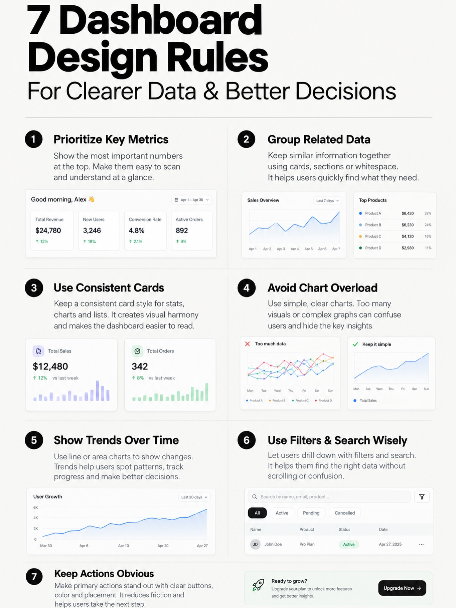

# 06 — Design & Vibe Coding

**Thesis:** AI-generated design converges on the mean — purple gradients, generic layouts, the look you can spot in two seconds — because models regress to their training data. These seven reels plus the Karpathy talk are the counter-system: reference libraries, locked style guides, curated skill sets, animation toolkits, and multi-agent divergence, all in service of one idea. Taste isn't a vibe; it's infrastructure. And the enterprise signal (@tory.trombley) says this is now how product work actually gets done inside big tech.

### Free interface starter skins for AI-built UIs
- **Creator:** @kem_glitch · **Date:** 2026-09-25
- **What it suggests:** A free repo of six "interface starter" skins — Tributary, Quest, Gulp, Thread, Arcade, Studio — all built with Claude Code from the same four prompts, demonstrating how small choices in font and terminal styling completely change the feel of an interface. The argument: design matters because it shapes end-user experience across chatbots, client projects, and personal tools, and most AI coding tools run headless streaming events — so the skin is the product surface. His practical advice generalizes: ask your own AI tool what events it streams, then pick a skin as a starting reference or guide rather than designing from zero. The deeper pattern is reference-driven generation — a concrete visual target beats a thousand adjectives in a prompt, and a shared skin library is how a team keeps AI output from drifting into generic territory.
- **Repos/tools:** Free starter-skins repo (via @kem_glitch), Claude Code
- **Extractable skill:** Reference-first UI — start every AI-built interface from a concrete skin or reference, not from a blank prompt.
- **Source:** https://www.instagram.com/reel/Ddt7qfgNFh8/

### Four JS animation libraries for modern sites
- **Creator:** @avi_vashishta29 · **Date:** 2026-07-07
- **What it suggests:** A field guide to the animation toolkit, one library per job: GSAP for scroll-based animations, Anime.js for vector animations, Motion.dev for block-based animations, and React Spring for real-life physics. The value is the taxonomy more than any single pick — animation libraries are not interchangeable, and matching the library to the motion type (scroll-driven vs. vector vs. physics) is what separates polished sites from janky ones. For vibe-coding workflows, this is the kind of concrete tooling knowledge worth encoding directly into a design skill or style guide, so the agent reaches for the right library instead of hand-rolling animation code.
- **Repos/tools:** GSAP (gsap.com), Anime.js (animejs.com), Motion.dev (motion.dev), React Spring (react-spring.dev)
- **Extractable skill:** Motion taxonomy — map each animation need to its purpose-built library; encode the mapping in your design skill.
- **Source:** https://www.instagram.com/reel/DafoIitSbr9/

### Landing pages via five-agent teams
- **Creator:** @agentic.james · **Date:** 2026-02-12
- **What it suggests:** A five-step method for landing pages with Claude Code agent teams. First, gather reputable front-end design skills from the internet and have Claude synthesize them into a single design skill — curation before generation. Then deploy a team of five agents, each building a unique landing page from that shared skill, communicating with each other to guarantee divergence, and incorporating custom assets and animated SVGs. Finally, review all five, pick the best elements, and synthesize the winner. The architecture is doing two things at once: the shared skill keeps quality high, while the multi-agent divergence plus cross-agent communication keeps the outputs from collapsing into the same generic design. It's evolution with selection pressure — generate diversity, then synthesize.
- **Repos/tools:** Claude Code (agent teams)
- **Extractable skill:** Diverge-then-synthesize — synthesize one strong skill, fan out N agents with anti-convergence communication, merge the best elements.
- **Source:** https://www.instagram.com/reel/DUrgkd1DDbk/

### 3D animated sites: Nano Banana Pro + Veo 3 + GSAP
- **Creator:** @agentic.james · **Date:** 2026-01-22
- **What it suggests:** The recipe behind the popular 3D animated landing-page effect, in four steps. First, generate a source image with Nano Banana Pro — critically, have the AI produce a structured JSON prompt with camera angle, lens, focal length, and lighting metadata, because structured generation inputs produce controllable outputs. Second, feed the image into Google's Veo 3 to generate the animated video clip. Third, have a coding agent dissect the video into individual frames. Fourth, use GSAP to scrub those frames on scroll — the classic Apple AirPods page effect, where the product assembles and disassembles as you scroll. The pattern worth extracting: chain specialized generative models (image → video → code), with a structured intermediate (JSON metadata, then frames) at each handoff so every step stays controllable.
- **Repos/tools:** Nano Banana Pro (Google), Veo 3 (Google), GSAP (gsap.com)
- **Extractable skill:** Chained generation with structured handoffs — image model → video model → frame dissection → scroll animation, with explicit metadata at each boundary.
- **Source:** https://www.instagram.com/reel/DT1WZ0lDc90/

### Four levels to de-genericize vibe-coded apps
- **Creator:** @janustiu · **Date:** 2026-01-30
- **What it suggests:** A designer explains why she can spot a vibe-coded app in two seconds — purple gradients, random emojis, generic UI — and offers a four-level ladder out. Level one: gather references from Mobbin or 21st.dev, screenshot what you like, upload to the vibe-coding tool, and use Google Stitch for concept generation. Level two: get ruthlessly specific in prompts — visual details plus explicit avoid-list (her example: "clean minimal UI like Notion, lots of white space, light grey dividers, soft accent colors"). Level three: lock a reusable style-guide prompt defining colors, fonts, spacing, and border radius, so consistency survives across sessions. Level four: for full control, wireframe in Figma and use Figma MCP to turn designs into code. Each level trades convenience for control; the key insight is that genericness is the default output of an unconstrained model, and every level is a constraint you add deliberately.
- **Repos/tools:** Mobbin (mobbin.com), 21st.dev, Google Stitch, Figma MCP
- **Extractable skill:** The constraint ladder — references → specific prompts with avoid-lists → locked style guide → Figma MCP; climb as far as the project warrants.
- **Source:** https://www.instagram.com/reel/DUIubwjDtj3/

### Vibe prototyping inside big tech
- **Creator:** @tory.trombley · **Date:** 2026-01-26
- **What it suggests:** A product manager at Instagram describes "vibe prototyping" as an internal process: instead of writing lengthy docs or scheduling alignment meetings, she uses an internal AI tool to generate a rough UI and build a clickable prototype, then presents a working demo to leadership within 24 hours. The significance isn't the tool — it's the organizational shift. Prototyping speed has become a competitive input to decision-making: a clickable demo in a day compresses the propose-align-decide cycle that used to take weeks. Her conclusion is direct: learning vibe coding is now essential for anyone in tech, because the people who can demo in 24 hours set the pace for everyone else. For enterprises, the read is that AI prototyping isn't a side skill — it's becoming the default medium for product proposals.
- **Repos/tools:** Internal AI tooling (Instagram/Meta)
- **Extractable skill:** Demo-driven proposals — replace the doc-and-meeting cycle with a 24-hour clickable prototype wherever decisions are slow.
- **Source:** https://www.instagram.com/reel/DT-6RFAD-aF/

### Nine UI design languages for vibe-coding
- **Creator:** @nelehacks · **Date:** 2026-07-24
- **What it suggests:** A tour of nine contemporary UI design languages — Skeuomorphism, Neumorphism, Glassmorphism, Claymorphism, Minimalism, Maximalism, Brutalism, Liquid Glass, Spatial UI — presented as the vocabulary she uses to direct AI-generated websites despite not knowing how to code. The demo shows the workflow: feed design guides and prompts into Manus AI, which generates a complete front-end site with images and text. The real lesson is that named design languages are compression: saying "glassmorphism" to a model (or an agent) transmits pages of visual specification in one word. Building a shared vocabulary of named styles — in a skill file, a style guide, a team wiki — is one of the cheapest ways to raise the floor of AI-generated design. (Note: the post is tagged #manuspartner — sponsored.)
- **Repos/tools:** Manus AI (manus.ai)
- **Extractable skill:** Named-style vocabulary — encode design languages as named tokens in your design skill; one word replaces pages of prompt.
- **Source:** https://www.instagram.com/reel/DbKrDR1IQ2v/

### From Vibe Coding to Agentic Engineering (recommended watch)
- **Creator:** @shareefico (recommending Andrej Karpathy's Sequoia AI Ascent 2026 talk, Apr 2026) · **Date:** 2026-10-03
- **What it suggests:** Karpathy places the agentic-coding inflection in December 2025 — agent-written chunks "just came out fine" and he stopped correcting them — and argues the discipline going forward isn't vibe coding but **agentic engineering**: humans hold spec, taste, and oversight while agents do the implementation. He frames the stack as Software 3.0 (prompts as programs, LLMs as interpreters), warns capability is jagged because RL trains around verifiable circuits, and lands on the line that defines this whole folder: you can outsource thinking but never understanding. The enterprise read: vibe coding is the prototype tier; agentic engineering — specs, evals, verification — is the production tier.
- **Repos/tools:** None (talk).
- **Extractable skill:** Spec-first agent work — write the spec and the verification step before the agent writes code; hold taste and oversight as the human's job.
- **Source:** https://www.instagram.com/p/DeCZn6JMmYf/ · Talk: https://www.youtube.com/watch?v=96jN2OCOfLs

### 7 Dashboard Design Rules (infographic)
- **Creator:** @uiux.build (Darpan, product designer) · **Date:** 2026-09-25 · **Source:** Instagram post
- **What it suggests:** Seven rules for dashboards that help users understand data faster: **prioritize key metrics** (most important numbers at top, scannable at a glance); **group related data** (cards, sections, whitespace so users find things fast); **use consistent cards** (one card style for stats, charts, lists — visual harmony); **avoid chart overload** (simple clear charts; too many visuals confuse and hide the key insights); **show trends over time** (line/area charts for patterns and progress); **use filters & search wisely** (drill down without scrolling or confusion); **keep actions obvious** (primary actions stand out — buttons, color, placement — to reduce friction).
- **Why it's here:** Honest tension with this playbook's own [dashboards-are-dead deep dive](../deep-dives/dashboards-are-dead.md) — the agent-native argument is that static dashboards are the wrong interface. But agents still generate dashboards, admin panels, and status pages constantly (vibe-coded or otherwise), and when they do, these seven rules are the cheapest quality bar available. Rule 4 (avoid chart overload) is the one agent-generated dashboards violate most: agents love adding one more chart.
- **Repos/tools:** None (design rules infographic).
- **Extractable skill:** When an agent builds any data UI, pin these seven rules in the spec — especially key-metrics-first, one card style, and no chart overload. Review agent-generated dashboards against the seven before shipping.
- **Source:** https://www.instagram.com/p/DdtcfHOt20t/

## From X bookmarks (Sep 2026)
Distilled from Matt's X bookmarks, newest first. Full post text at each permalink (X truncates long posts in timelines).

### Your project architecture on an interactive canvas
- **Creator:** @openshipio · **Date:** 2026-09-27
- **What it suggests:** Announces OpenShip's next step: project architecture rendered on an interactive canvas — see how services connect, click a node for detail (text truncates), quoting the project's own post with an image. Verifiable: this is architecture visualization as a product surface — services and their connections explorable visually rather than read from config. For vibe-coded projects where agents generate sprawling service topologies, a live architecture canvas is the comprehension layer that keeps humans in the loop. Details of the interaction are at the permalink.
- **Repos/tools:** None linked in post text (OpenShip).
- **Extractable skill:** Give every generated architecture an interactive visual map so humans can comprehend what agents built.
- **Source:** https://x.com/openshipio/status/2104187404533838043

### Why builders are endorsing OpenShip
- **Creator:** @ParthJadhav8 · **Date:** 2026-09-27
- **What it suggests:** An endorsement post calling OpenShip one of the best open-source projects of the year, quoting the architecture-canvas announcement. The post is short and complete; it carries no technical detail itself. Verifiable: the signal is social-proof velocity — the announcement is pulling strong endorsements from the builder community within the same day. For the playbook, the takeaway is to put OpenShip on the evaluation shortlist for architecture visualization, with the actual product details in the quoted post at the permalink.
- **Repos/tools:** None (opinion/endorsement).
- **Extractable skill:** Track which open-source dev tools earn same-day builder endorsements; that's your evaluation shortlist.
- **Source:** https://x.com/ParthJadhav8/status/2104224156191715473

### A transitions library built for agent-generated UIs
- **Creator:** @jonathan_wilke · **Date:** 2026-09-12
- **What it suggests:** Discovers transitions.dev — a catalog of small animations that make UIs feel better — with the site positioned for AI agents to use (text truncates). Verifiable: this is a transitions and animation library explicitly aimed at agents — the missing polish layer in vibe-coded UIs. Agent-generated interfaces tend to be functional but lifeless; a transitions library the agent can reach for closes the gap between shipped and feels-good. The catalog is at transitions.dev.
- **Repos/tools:** transitions.dev
- **Extractable skill:** Give your UI agents a transitions library so generated interfaces ship with polish, not just function.
- **Source:** https://x.com/jonathan_wilke/status/2098801944756154391

### Second batch (Aug 24 – Sep 12)

### Generative UI goes 3D: Blender MCP + Astra + Tripo
- **Creator:** @luccacerf · **Date:** 2026-09-07
- **What it suggests:** "First time building a gUI with Blender MCP +Astra +Tripo. This is insane. Html preview for AI is dead." The claim: generative UI is moving past flat HTML previews into real 3D — Blender (via MCP) as the renderer, Astra and Tripo as the 3D generation models. 37 replies, 65 reposts, 1,332 likes. Whether "HTML preview is dead" is hyperbole, the direction is real: as agents gain tool access to professional 3D software through MCP, the output ceiling for generative interfaces jumps from web pages to scenes. For design workflows: watch MCP servers for pro tools (Blender, Figma, CAD) — they're the new leverage point.
- **Repos/tools:** Blender MCP, Astra, Tripo (3D generation)
- **Extractable skill:** Route generative UI through professional tools via MCP; the output ceiling follows the tool, not the model.
- **Source:** https://x.com/luccacerf/status/2097047098281672782

### Lock in 8 context docs before vibe coding — including an AI Agents Guide
- **Creator:** @prateekguglani · **Date:** 2026-10-03
- **What it suggests:** "Vibe coding without structure is just speedrunning hallucinations and broken builds." The fix is locking project context into documents before the agent writes a line of code. Four of the eight docs are named: PRD (scope, user journeys, feature specs), Design System (UI tokens, layout guidelines, component styling), Architecture (tech stack, data flow, system boundaries), and an **AI Agents Guide** (ground rules, constraints, and instructions for Cursor/LLMs). The remaining four docs plus markdown templates are gated behind a "comment DOCS" DM funnel, so they aren't publicly verifiable — but the structural insight stands without the bundle: agents fail on ambiguous intent, and the cheapest place to fix intent is documents the agent reads, not prompts you retype every session. The AI Agents Guide is the same pattern as this repo's tokenomics Lever 1 (AGENTS.md / copilot-instructions.md as the highest-ROI file a team can write).
- **Repos/tools:** None public (template pack is DM-gated).
- **Extractable skill:** Context-lock scaffolding — ship PRD + architecture + agent-guide docs with every new project; intent documents beat repeated prompting.
- **Source:** https://www.instagram.com/p/DeCVll9BBzC/
