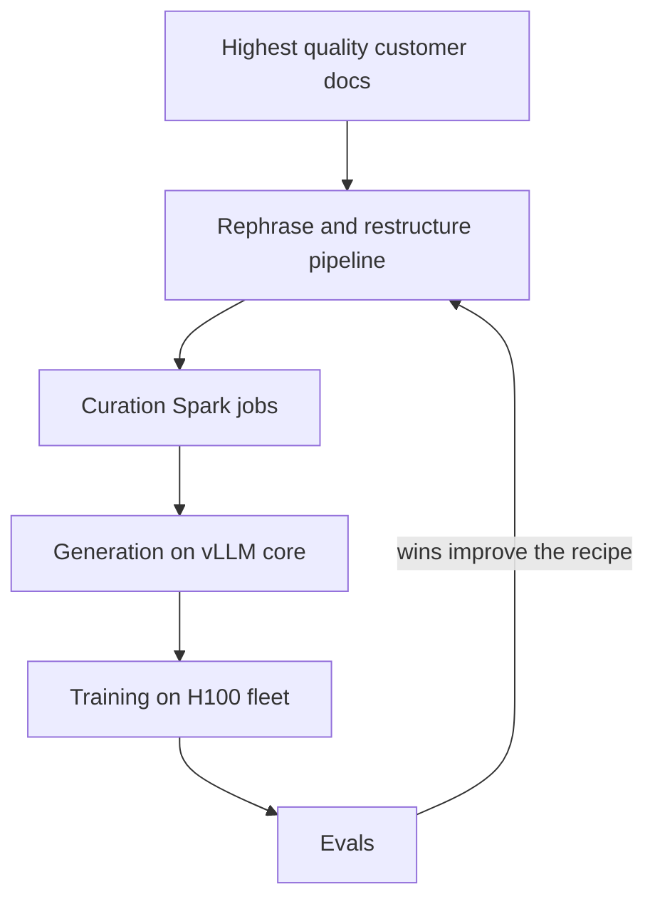
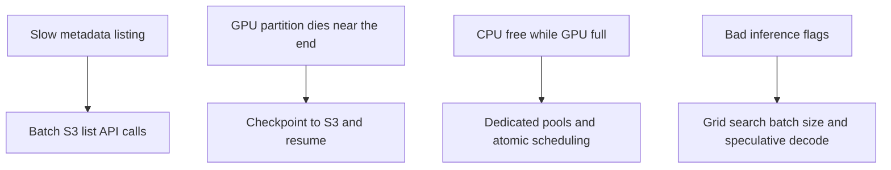

# Talk Notes: "Lessons from Generating 12 Trillion Synthetic Tokens" — Bogdan Gaza, DatologyAI

**Video:** [Lessons from Generating 12 Trillion Synthetic Tokens — Bogdan Gaza, DatologyAI](https://www.youtube.com/watch?v=FQwTqUmcbRg) · AI Engineer channel · Oct 2, 2026 · 20:31 · Recorded at AI Engineer World's Fair 2026

**Note:** YouTube's transcript was unreadable in our environment, so this is distilled from the video's own description/chapters plus biggo.com's AI-generated talk summary and vendor docs — treat biggo-derived points as secondary, not verbatim transcript.

## Thesis

Synthetic data is now load-bearing for frontier pre-training — scaling laws demand exponentially more data for linear gains while the usable public web tops out around 30T tokens. The hard part is not the data recipe but the data-engineering plumbing: DatologyAI's ~12T-token run (~7T web + ~5T math/code) was enabled by consolidating a Slurm research silo onto unified Kubernetes and fixing four concrete bottlenecks (metadata, GPU failures, cross-cluster scheduling, inference tuning).

## The mental model

Two architectures — the old research silo and the new unified pipeline — plus four bottlenecks, each with a concrete fix.

## Key points

- **BeyondWeb recipe:** rephrasing/restructuring pipeline seeded from the highest-quality documents in a customer's corpus — unseeded prompting just reproduces modes of the original training distribution.
- **Quality claims (DatologyAI's own, dated "late summer '25," now "much, much better"):** a 3B model on BeyondWeb matches 8B Nemotron Synth accuracy; same performance with ~2.7x fewer tokens than Nemotron Synth and ~5.3x fewer than Cosmopedia. Tested at 1B/3B/8B vs Nemotron Synth, Cosmopedia, QARap, RedPajama.
- **Before:** synthetic data as research-only Slurm workload, two-track codebase, manual backfill into the Asset Tracker catalog — "slow, error-prone, low velocity, under-utilized GPUs."
- **After:** control cluster (orchestration + Asset Tracker), Spark on its own K8s cluster, Ray + KubeRay + vLLM as the synthetic-data core, H100 fleet on AWS HyperPod via EKS, all data on S3 (S3-compatible APIs so pipelines deploy to AWS/GCP/on-prem); internal job scheduler; one chained workflow: curation Spark jobs → generation → training → evals.
- **Bottleneck 1 — metadata:** per-object S3 metadata ~10ms × millions of Parquet partitions + throttling → 9–11 days just to populate state. Fix: batched S3 list-API requests at ~1,000/page service limit → ~2 hours.
- **Bottleneck 2 — GPU instability:** an 8-hour partition dying in the last 5 minutes loses everything. Fix: right-sized partitions + periodic S3 checkpointing with resumable execution, idempotent overwrites, seamless recovery.
- **Bottleneck 3 — cross-cluster scheduling:** CPU schedulable while GPU pool is full and vice versa (asymmetric availability). Fix: dedicated resource pools per cluster (CPU pool for Spark, Ray-head pools) + atomic CPU/GPU scheduling — "a bin-packing problem at the end of the day."
- **Bottleneck 4 — inference config:** a dedicated vLLM benchmarking harness, grid-searching flags (batch size, speculative decoding) → ~40% throughput gains with no other change. Batch-inference workload (≠ online serving); also testing SGLang.
- **Scale:** ~30B tokens in limited runs (end 2024) → ~7T web + ~5T math/code across customers (end 2025) — roughly 400x output in ~12 months.
- **Paper:** arxiv.org/abs/2505.15743. Open areas: domain coverage (web, multilingual, math, code, legal). Hiring across data infra, cloud infra, PM.

## Notable quotes & data

- "So 11 days to two hours, that's the first one."
- "You can get a lot of gains — in this case, about 40% throughput gains — just by tweaking the flags."
- "On the web, we can find about 30 trillion tokens, give or take."
- **Stat:** 400x output in ~12 months (30B → 12T tokens).

## Tokenomics / efficiency angle

- 2.7–5.3x token efficiency vs public synthetic datasets = proportionally less training compute per capability point.
- Metadata 11 days → 2 hours avoids millions in idle GPU spend; 40% vLLM throughput gain from flags alone; atomic scheduling raises fleet utilization.

## Local-deploy takeaways

- The vLLM lesson ports directly to local inference: build a small benchmarking harness and grid-search batch size / speculative decoding before buying hardware — ~40% gains can come from flags alone.
- S3-compatible APIs (MinIO locally) mean the same curation pipelines run on-prem without cloud lock-in — matches the local-first posture.
- Seed synthetic data from your own best documents, not unseeded prompts — unseeded generation just replays the base model's distribution, which is wasted compute.

## How to apply it

1. Build a small vLLM benchmarking harness on your local inference box this week and grid-search batch size and speculative decoding flags before spending on hardware — the talk got ~40% throughput from flags alone.
2. Stand up MinIO (S3-compatible) locally and port one curation pipeline to it, proving the same jobs run on-prem without cloud lock-in.
3. For your next data-generation or fine-tuning job, seed generation from your own highest-quality internal docs — skip unseeded prompting, which just replays the base distribution.
4. Add checkpointing with resumable, idempotent overwrites to any job longer than an hour so a dead partition costs minutes, not the full run.
5. Audit your data catalog's metadata access path: replace per-object metadata calls with batched list-API requests at the service page limit.

## Sources

- biggo AI summary: https://finance.biggo.com/podcast/3c9006f63582ab1f
- Video description: https://www.youtube.com/watch?v=FQwTqUmcbRg
- Paper: https://arxiv.org/abs/2505.15743
