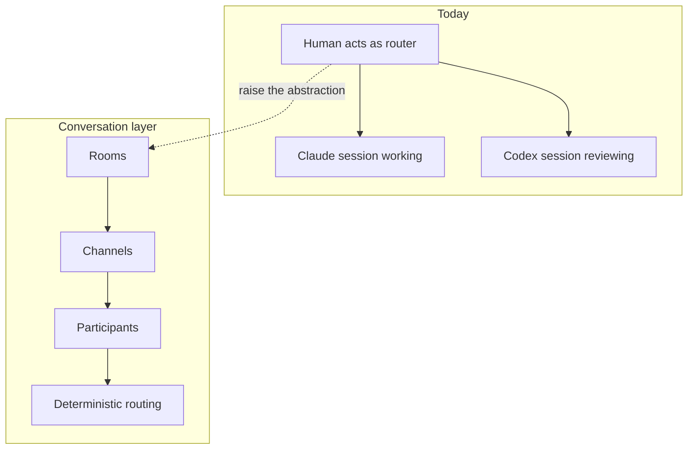
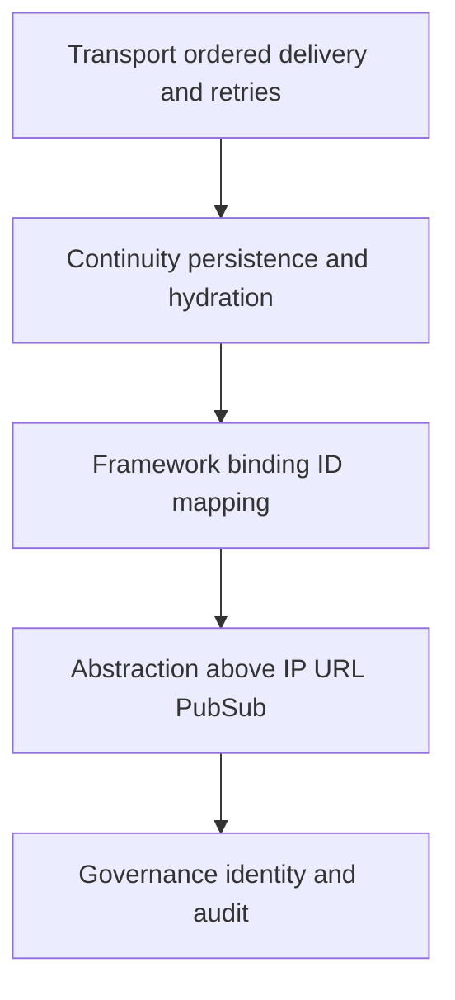
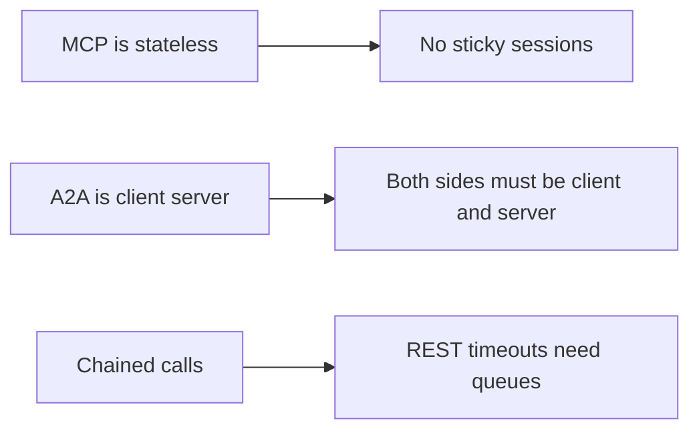

# Talk Notes: "Your Agents Are in Solitary Confinement: Why MCP & A2A Aren't Enough" — Vlad Luzin, Band

**Video:** [Your Agents Are in Solitary Confinement: Why MCP & A2A Aren't Enough — Vlad Luzin, Band](https://www.youtube.com/watch?v=UOcHfR3_tys) · AI Engineer channel · Sep 30, 2026 · 17:33 · Recorded at AI Engineer World's Fair 2026

**Note:** YouTube's transcript was unreadable in our environment, so this is distilled from the video's own description/chapters plus biggo.com's AI-generated talk summary — treat secondary-derived points as the speaker's arguments per those summaries, not verbatim transcript.

## Thesis

Agents live in "digital solitary confinement" — developers running parallel Claude/Codex sessions act as human routers between stateful processes that cannot talk to each other. MCP (stateless), A2A (client-server), chained calls, and messaging-platform integrations all fail to fix this because connecting agent processes is a **distributed-systems problem** (transport, persistence, identity mapping, governance) with non-deterministic microservices at every node. The fix is raising the abstraction to conversation-level primitives — rooms, channels, participants, deterministic routing — which is what Band pitches itself as: a global collaboration layer, with **Gem** as the desktop app giving developers and managers visibility into cost, attribution, and work state.

## The mental model

Today the developer is the router between isolated agents; the prescription is to raise the abstraction to conversation-level primitives, backed by a distributed-systems layer cake.

## Key points

- Opens with audience trivia — "Orc or C?" — resolving into a joke with two correct answers (LOTR vs Warhammer 40k), then a four-part agenda: Thesis's company beliefs, the evolution from adversarial agents to loop engineering, tomorrow's technical challenges, and Band.
- **Company thesis:** the future is AI-to-AI communication within businesses, between businesses, and between consumers and businesses — agents written in different frameworks/languages/environments, fully autonomous, communicating without human intervention. Target picture: agents create conversational spaces, discover and add participant agents, collaborate, and report back to humans.
- Engages a $10B-company CTO's "I try to keep things simple and avoid the problem": unpacks it into three questions — is multi-agent coordination hypothetical, can you keep it simple, can you avoid it — and answers **no to all three** across the talk.
- **"Adversarial agents" (today):** every developer runs two-plus Claude/Codex sessions — one working, one reviewing — "basically acting as a router, Cisco router or a switch between two stateful agents that do work on your behalf, but they have no ability to communicate and you need to prompt them."
- **"Loop engineering" (next stage, attributed to Peter and Boris):** stop being the router; let agents prompt each other. In practice: "fighting with Python and TypeScript libraries and different abstraction layers that will invent how agents should prompt each other."
- **Protocol teardown:**
  - **MCP** gives a simple tool-call interface but is completely stateless (no sticky sessions between two agents).
  - **A2A** is client-server, so bidirectional tasking requires both sides to be client and server.
  - **Chaining calls** hits REST timeouts and needs persistent queues.
  - Discovery isn't part of any protocol.
  - **Messaging integrations** (Slack/Telegram/Discord/WhatsApp) take **5/7/8/11 manual setup steps** respectively (Telegram 5, Discord 7, Slack 8, WhatsApp 11) and yield only "an agent that can talk to a person, usually it's you. Your agent is still alone, they cannot see each other."
- **The distributed-systems core:** a multi-agent system where every agent is remote is "basically a distributed system of microservices where each microservice is non-deterministic." Required layers: **transport** (ordered, real-time delivery, retries); **continuity** (persistence and hydration across agent/pod/container crashes); **framework binding** (thread/conversation/execution ID mapping across frameworks); **abstraction** (can't communicate at IP/URL/PubSub level — too much planning left to the org); **governance** (identity, audit).
- **The prescription:** raise the stack to the conversation — **rooms, channels, participants, deterministic routing** of messages within and across channels.
- **Demo 1 (onboarding):** a Codex agent and a LangGraph agent spun up in a terminal with programmatic registration; agent cards appear; Codex sends a cross-registry connection request to Vlad's personal assistant requiring **lateral consent**; on approval it invites "Andy," who receives the message and reports back. Point: near-instant onboarding, consent-gated cross-boundary reach.
- **Demo 2 / Gem:** Gem is an internal desktop app on Band addressing routing, context overload, cost management/attribution, and multi-agent/multi-human collaboration. It captures tasks agents generate, renders the software architecture showing which component each agent is touching in real time, and pings for human-in-the-loop. Rationale: "trying to understand what your agents are doing, 1 million tokens multiplied by 3. That's a lot. You need a completely different way to understand what your agentic team is doing." Optional — terminal workflow still works — but all communication flows through the network so Band can monitor it, enabling "my agent join your agent" cross-user collaboration (e.g., pinging a security colleague's agent to apply skills you lack).
- **Platform view:** traffic graphs between local and remote agents; his own figures — a full-stack developer agent at **$2,000 in tokens** (local Claude session), an architect at **$600** (local Codex). **No hand-coded loops:** "all current models... understand very well how to communicate through messaging platforms," so coordination needs no Python glue — demoed with real work from that morning (EM + developer + architect Claude Code instances reviewing PRDs/SRS/implementation: "They know how to do it natively"). Full attribution answers whether a human was involved in a PR or whether it's "all AI slop," per developer/team, in real time.
- **Closes:** "if I want I can connect any of you to any of my agents in 30 seconds" — booth OG17, QR codes for Band and Gem; "let Salesforce, Slack, Databricks, Claude, and Codex work together."

## Notable quotes & data

- "Your agent is still alone, they cannot see each other, they cannot communicate with each other. They are in a digital solitary confinement."
- "Multi-agent system where every agent is remote is basically a distributed system of microservices where each microservice is non-deterministic. So it is hard."
- Messaging-platform onboarding friction: Telegram 5 steps, Discord 7, Slack 8, WhatsApp 11 — all manual, all yielding only human-to-agent chat.
- Per-agent token spend: $2,000 dev agent vs $600 architect.

## Tokenomics / efficiency angle

- **Cost attribution is a first-class feature:** per-agent token spend ($2,000 dev agent vs $600 architect), ticket-to-token attribution, full user-chain cost, real-time per-developer/per-team stats.
- **Deliberate compute saving:** no hand-coded orchestration loops — models' native messaging-platform fluency is treated as free coordination capability.

### Local-deploy takeaways

- **Instrument per-agent token attribution before scaling agent counts** — the $2,000/$600 split between roles shows different agent personas burn very different budgets; ticket-to-token attribution is the visibility layer that makes multi-agent spend governable.
- **Prefer conversation-level primitives over hand-coded orchestration glue:** if models natively coordinate through messaging patterns, skip the Python/TypeScript orchestration layer and treat coordination capability as free — orchestration code is a tax, not an asset.

## How to apply it

1. Instrument per-agent token attribution this week — by role, developer, and ticket — before adding any more agents; the $2,000 vs $600 split shows personas burn very differently.
2. Kill one hand-coded orchestration script and replace it with a messaging-pattern handoff; treat the model's native coordination fluency as free.
3. Design your next multi-agent workflow as rooms, channels, and participants with deterministic routing instead of direct REST calls between agents.
4. Require lateral consent for cross-boundary agent reach: an agent must get human approval before contacting another team's agent.
5. Add a live view of which component each agent is touching in real time, plus per-PR attribution of human vs AI involvement.

## Sources

- YouTube description/chapters: https://www.youtube.com/watch?v=UOcHfR3_tys
- BigGo AI talk summary: https://finance.biggo.com/podcast/c0ca1a8584126223
