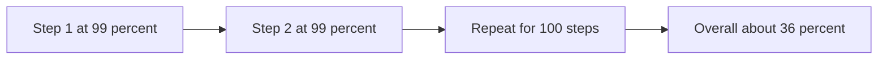
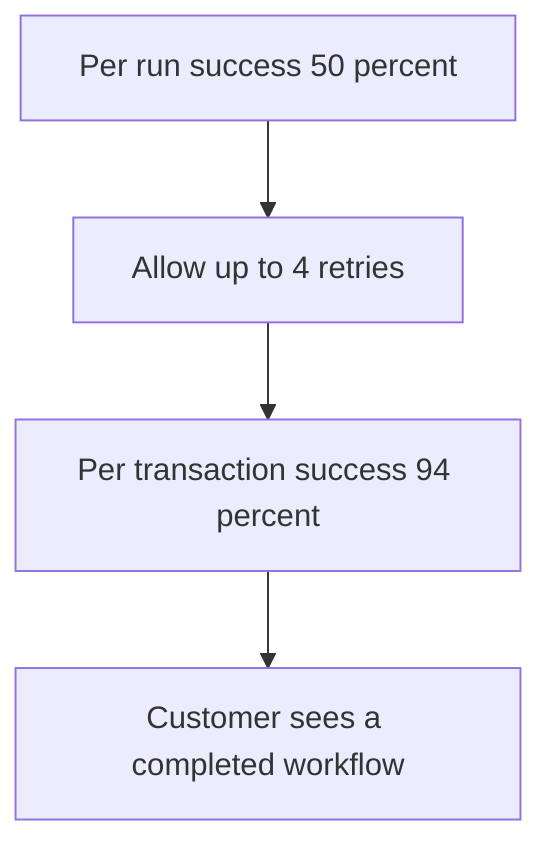
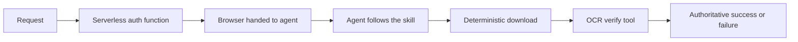

# Talk Notes: "Why 99% Accurate Browser Agents Still Fail" — Derek Meegan, Browserbase

**Video:** [Why 99% Accurate Browser Agents Still Fail — Derek Meegan, Browserbase](https://www.youtube.com/watch?v=5xi_S1f9sDU) · AI Engineer channel · Oct 2, 2026 · 16:49 · Recorded at AI Engineer World's Fair 2026

**Note:** YouTube's transcript was unreadable in our environment, so this is distilled from the video's own description/chapters plus biggo.com's AI-generated talk summary and vendor docs — treat biggo-derived points as secondary, not verbatim transcript. The video page itself showed "Video unavailable" in our browser.

## Thesis

Per-step accuracy compounds multiplicatively (99%/step over 100 steps ≈ 36% overall) — but the fix is not a smarter model, it is re-architecture: strip deterministic work out of the model's responsibility via encapsulated tools, deterministic verification, and written "skills" (SOPs for agents); measure success per transaction with retries; and evaluate the agent as a P&L line item — profit = revenue − costs, performance first, then cost, then maintainability.

## The mental model

Per-step accuracy compounds multiplicatively, retries convert per-run luck into per-transaction reliability, and the final architecture strips deterministic work out of the model.

## Key points

- **Core economics:** cost accumulates continuously while value is realized only at the terminal step — "no partial credit."
- **The 99% figure is a thought experiment, not a product benchmark:** independent 99% per-step success × 100 steps ≈ 36% overall — real dynamic, but "the math isn't the whole story."
- **Profit equation reframe:** the agent is just another line item and "should give you more than it takes."
- **Evaluation order:** performance first (once it reliably completes the task, cost and maintainability become engineering optimization problems), then cost, then maintainability.
- **A transaction's success = a concrete artifact:** confirmation email (bill pay), order ID/receipt (purchase), new record in a deterministically queryable system (form submit).
- **Retries trade cost for reliability:** 50% per-run agent + up to 4 retries → 94% per-transaction success. "The customer does not care how many retries you perform, but rather that the workflow was completed."
- **Three browser interfaces:** textual (HTML + accessibility-tree hybrid), computer use (screenshots), dynamic execution (agent writes arbitrary JS/CDP). Production mostly uses the first, the second, or both.
- **Three trajectory types on an "agenticness" spectrum:** purpose-built single-task trajectories; just-in-time arbitrary user tasks; browser-as-implementation-detail (deep research, competitor analysis).
- **Four durability risks:** (1) environment fights back — antibots; "the web is not the friendliest place for your agent"; (2) task changes under the agent; (3) better methods appear — site ships an API tomorrow (though "for the vast majority of use cases, an API isn't coming anytime soon"); (4) model strays off the critical path (nondeterminism).
- **Health-insurance-portal build, five stages:** minimum viable agent → encapsulated download tool (one tool call, no on-the-fly model decisions) → deterministic OCR verification against the system of record → authentication pulled into a reusable serverless function → written "skill" (SOP for the agent; knowing step 2 → step 3 keeps it on the critical path).
- **Final architecture:** request → serverless auth function → browser handed to agent runtime → agent navigates via skill → deterministic download → OCR verify tool → authoritative success/failure.
- **Cost anatomy:** per-run cost is predominantly model cost today, but shrinking under open-source price pressure; plus infra/compute and integration/tooling; maintenance = observability (agent decisions + actual browser behavior), reconfig labor, and re-evaluation budget as sites and models change.

## Notable quotes & data

- "Cost accumulation is continuous, while value realization is terminal."
- "Your agent is just another line item and that your agent should give you more than it takes."
- "Permit retries and measure success against a per transaction basis."
- **Stat:** 50% per-run + ≤4 retries → 94% per-transaction success.

## Tokenomics / efficiency angle

- Fewer model-owned steps = lower unit COGS (auth extraction "lowers unit COGS"); the model cost share of deployment is expected to shrink via open-source price pressure.
- Retries trade extra per-run cost for large per-transaction reliability gains (50% → 94%) — measure success per transaction, not per run.

## Local-deploy takeaways

- The architecture pattern is the local lesson: encapsulate deterministic steps (downloads, verification, auth) as tools/functions outside the model — every step the model doesn't take is tokens never spent, and a written skill (SOP) keeps the agent on the critical path instead of wandering.
- "No partial credit" reframes agent budgeting: fund transactions with concrete success artifacts, not agent runs.

## How to apply it

1. Define each agent workflow's success artifact (order ID, confirmation email, queryable record) — fund transactions, not runs; no partial credit.
2. Set a retry budget per transaction (e.g., up to 4) and report success per transaction; stop judging agents on per-run accuracy.
3. Pull auth into a serverless function, downloads into an encapsulated tool, and verification into a deterministic check — every step the model does not take is tokens never spent.
4. Write a skill (SOP) for each recurring agent path so the model stays on the critical path instead of wandering.
5. Evaluate each agent as a P&L line item in this order: performance first, then cost, then maintainability.

## Sources

- biggo AI summary: https://finance.biggo.com/podcast/7d545fe57e72f668
- Video description: https://www.youtube.com/watch?v=5xi_S1f9sDU
