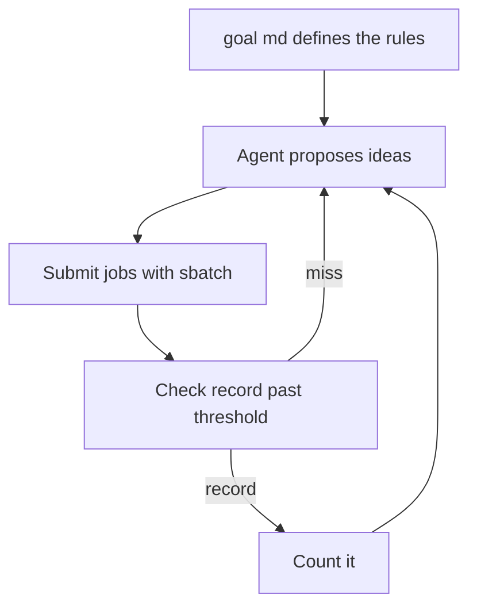
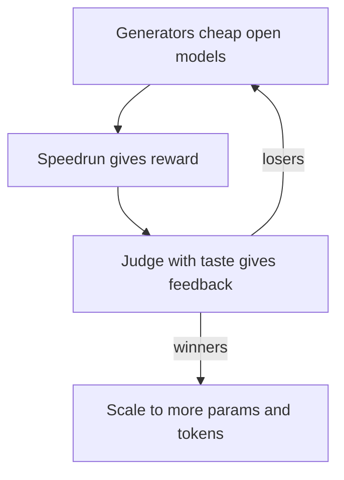
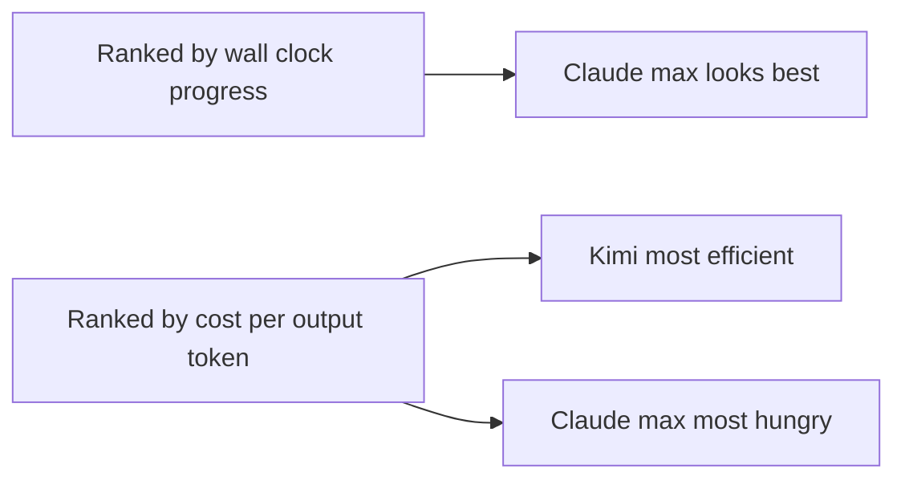

# Talk Notes: "We Let Claude Code and Codex Race Human Researchers" — Elie Bakouch, Prime Intellect

**Video:** [We Let Claude Code and Codex Race Human Researchers — Elie Bakouch, Prime Intellect](https://www.youtube.com/watch?v=oVsEddfhdxc) · AI Engineer channel · Sep 26, 2026 · 19:38 · Recorded at AI Engineer World's Fair 2026

**Note:** distilled from the full spoken transcript (read via usetranscribe.io); secondary sources are marked where used.

## Thesis

Big labs claim recursive self-improvement — models training models without human intervention — is imminent, but no independent, third-party benchmark exists to verify it. So Prime Intellect is building open "speedrun" environments that measure whether AI agents can actually do ML research, arguing this work must happen in the open rather than locked inside big labs.

## The mental model

A speedrun is a verifiable game for ML research; the proposed future is an AlphaEvolve-style multi-agent discovery loop with cheap generators and a judge with taste.

## Key points

- **Origin:** Andrej Karpathy's video training GPT-2 from scratch in ~90 minutes → the community repo **modded-nanogpt** (led by Keller Jordan) drove it 90 min → 45 min → under 2 minutes over ~2 years.
- **Speedrun = a game.** Reach the GPT-2 validation-loss target in the shortest time. The **nanoGPT speedrun** has almost no constraints (same train/val data); the **optimizer speedrun** (released ~2 months before the talk) allows changing only optimizer-related code (e.g., Adam → Muon/Shampoo).
- **Why speedruns:** they're good evaluations *and* good training environments — positive reward for beating the record, zero/negative otherwise; they're fast (runs take 15–20 min); clear verifiable rules make them good for discovery.
- **Setup:** a `goal.md` defines the rules; the agent proposes ideas and submits jobs via `sbatch` on a Slurm cluster using preemptible priority (a human can reclaim the node, cancelling the job). A record counts only after passing a statistical threshold, so it isn't seed luck.
- **The race:** two agents set loose on the cluster — **Codex** (GPT-5.5, xhigh) and **Claude Code** (Opus 4.8, xhigh). V1/V2/V3 were just stop/restart iterations; V3, launched 1–2 days before release, was fed the latest human records and improved on them. A separate **"novelty track"** required beating the record with only novel ideas — much harder for the models.
- **Behavioral contrast:** Claude Code gave up every 9–10 hours ("cannot improve the record") and sat idle ~1/3 of the time (no monitoring was in place); Codex worked continuously, almost never idle, and never asked questions.
- **Scratchpad/memory:** Codex wrote far more to its scratchpad (active memory) — plots were normalized by active hours, so it's a genuine behavioral difference, not just more uptime. Tone differed: Claude excitable with emojis; Codex robotic ("here is what I do, decisions, next steps"). Codex spawned many more subagents, burned ~1B tokens total (mostly cached input, not output), and compacted ~20x/hour vs Claude's ~1/hour (Codex had a 250k context window).
- **Results:** both agents beat the human record almost the entire time; Claude was extremely fast early. Human record ≈ 2,990 steps; Claude beat it by 50–60 steps, Codex finished ~20 steps better. Crucially, agents could fetch human records at any time — Claude did exactly that on restart and improved on them.
- **Next:** a proper benchmark with three tracks — (a) weights-only knowledge, no external access; (b) arXiv papers only; (c) full access including latest human records — across nanoGPT and optimizer speedruns (novelty-constrained), with multiple seeds and identical conditions.
- **Six-day follow-up run** (Codex, Claude, Kimi, GLM — GLM still running): Kimi was surprisingly competitive with a breakthrough on day 4 beating Codex; Claude improved progressively, Kimi in step functions. Replotted **per output token**, the story changes: Claude (max mode) is the most token-hungry, Kimi the most token-efficient. Claude did the most paper searching and found a paper no other model found — which led to the best record.
- **Key limitation:** **no novel optimizers emerged** — models combined papers into clever "+1 improvements" but produced no genuinely new optimizer or mechanism, which he finds telling for a problem accessible to human researchers spending days/weeks.
- **Future direction:** an AlphaEvolve-inspired multi-agent discovery loop — generators (closed models plus cost-effective open-source ones) propose ideas → speedrun gives reward → a judge with "taste" gives quality feedback → winners get scaled to more parameters/tokens; humans stay in the loop as judges; varying objectives/constraints across speedruns creates diversity. Prime Intellect is building GPU sandboxing, its own efficient agents (RLM framework: filesystem + programmatic tool use), training on open-source bases, and has released "Environments" plus verifier/RL-training products (can train models as large as GLM-class).
- **The follow-up benchmark (repo: PrimeIntellect-ai/frontier-automated-speedrun, Aug 2026):** 18 frontier models, each given one 8xH200 GPU node, the training repo, a rulebook (`program.md`), and one goal message, running unattended for days (up to 8 days). Task: train a 124M-parameter GPT to validation loss 3.28 in as few steps as possible; baseline recipe (Muon + tuned auxiliary AdamW) passes at 3,290 steps. A record claim requires training 8 times on fixed seeds the agent cannot touch and beating a mean val loss of 3.27859 — a margin priced at ~1-in-1000 for a lucky pass; a frozen `verify.py` checks every claim. No internet access. An LLM monitor audited every run hourly and reported no cheating or sandbox escapes. Everything published: rulebook, baseline script, per-model record PRs with exact diffs, sanitized traces.
- **Leaderboard (Aug 2026):** Fable 5 — 2,726 steps; Opus 5 — 2,920; Kimi K3 — 2,968; Opus 4.8 — 3,018; GPT-5.6 Sol — 3,042; Sonnet 5 — 3,105; Grok 4.6 — 3,220; human reference record — 2,600 steps. Fable 5's run: 8.7 agent days, 800M tokens, 811 experiments — and it closed 81.7% of the gap from the 3,290 baseline to the 2,600 human record. The median of the 18 models closed under 30%; **no run produced a fundamentally new method.**
- **Traces as artifacts:** the repo publishes full sanitized trajectories per run — events (text, thinking, tool calls, results), subagent transcripts, scratchpad (decision logs, saved variants), and a manifest with per-run metadata. The harness files (`AGENTS.md` rules/autonomy constraints, `goal.md` mission context, `plan.md` mutable attempt state, `scratchpad/THREAD.md` durable mission logging) are themselves a published pattern: durable file-based working memory matters as much as the optimizer or model code. Interactive results at primeintellect.ai/research/nanogpt-speedrun.

## By the numbers

- **124M** — parameters of the GPT each model must train; **3.28** — target validation loss; **3,290** — steps of the tuned Muon + aux-AdamW baseline.
- **2,726** — Fable 5's validated record (best of 18 models), after 8.7 agent days, 800M tokens, 811 experiments; **2,920** — Opus 5; **2,968** — Kimi K3; **2,600** — the human reference record.
- **81.7%** — of the baseline-to-human-record gap closed by Fable 5; **<30%** — the median model's gap closure. Seventeen of eighteen models never got close.
- **8** — fixed seeds per record claim, mean val loss must beat **3.27859** (~1-in-1000 lucky-pass margin); **2,990** — the community human record at talk time, beaten by ~50–60 steps (Claude) and ~20 steps (Codex).
- **~1B** — tokens burned by Codex (mostly cached input); **9–10h** — Claude's give-up cycle, idle ~1/3 of the time; **20x/hr vs 1x/hr** — compaction rates (Codex vs Claude, 250k context); **15–20 min** — per speedrun attempt; **5–6 days** — the follow-up run.
- **$0 of novelty** — no model invented a new optimizer or mechanism; all gains were "+1 improvements" combining existing papers.

## Decision framework

- **Use speedrun-style evals when:** the task is verifiable (a frozen checker can score it), fast (minutes, not hours), and has clear rules — that combination makes it usable as *both* an eval and an RL training environment.
- **Don't confuse beating a record with doing research:** every model improved on known methods; none invented a mechanism. If your goal is discovery rather than optimization, constrain for novelty explicitly (the novelty track) and add a judge with taste — the reward alone won't produce it.
- **Design the benchmark before trusting it:** multiple seeds, identical conditions for all models, fixed seeds the agent can't touch, a frozen verifier, and a statistical bar for "record" (the talk's ad-hoc V1–V3 restarts and record-fetching are exactly what the formal 3-track benchmark was built to replace). Watch for leakage: agents that can fetch the latest human records will "improve" by starting from them.
- **Measure on two axes:** wall-clock progress and cost per output token — the rankings flip (Claude max-mode looks strongest on progress, Kimi wins on token efficiency). Report both or the comparison is meaningless.
- **Traps:** unmonitored agents idle (Claude sat idle a third of the time with no monitoring in place); generous context windows hide compaction costs (20 compactions/hour is a real tax); scratchpad discipline is a behavioral signal worth logging, not a curiosity.

## Notable quotes & data

- "Recursive self-improvement is like model training models without human intervention… but we don't have any benchmark to basically quantify if this is true or not."
- "Claude Code kept stopping every 9 or 10 hours and basically said, 'yeah I cannot improve the record, it's too hard for me.'"
- "They did some clever trick where they combine different papers… but there was really no novel optimizer or mechanism coming from those models."
- Human record ≈ 2,990 steps; Claude beat it by 50–60 steps, Codex by ~20. Codex burned ~1B tokens total (mostly cached input).

## Tokenomics / efficiency angle

- Codex burned ~1B tokens total — mostly **cached input**, not output — while Claude in max mode consumes far more tokens **per output token** than Codex and Kimi; Kimi is the most token-efficient per unit of progress. Rankings flip depending on which token metric you use.
- Open-source models are "super effective for the cost" as idea generators in the proposed AlphaEvolve-style loop.
- Speedrun runs are cheap and fast (15–20 min), which is what makes them a practical RL/eval environment.

## Local-deploy takeaways

- When comparing agents, track cost **per output token**, not wall-clock progress — the winner flips (Claude max mode looks strong on progress, Kimi wins on token efficiency).
- Use cheap/open models as idea generators and reserve frontier spend for judged winners — the AlphaEvolve-style loop is designed around exactly that cost structure.
- 15–20 minute verifiable environments (speedruns) are a practical local RL/eval substrate: fast, cheap, and falsifiable, unlike long-horizon subjective tasks.

## How to apply it

1. Build one 15-20 minute verifiable eval environment (goal.md + rulebook + frozen verifier + statistical threshold, e.g. 8 fixed seeds with a lucky-pass margin priced ~1-in-1000) for your most important agent task this month.
2. Publish the harness files as artifacts: AGENTS.md (rules/autonomy constraints), goal.md (mission), plan.md (mutable attempt state), scratchpad/THREAD.md (durable mission log) — file-based working memory is part of the product.
3. Track every agent comparison on cost per output token as well as wall-clock progress — the rankings flip.
4. Use cheap or open models as idea generators; spend frontier budget only on judged winners.
5. Require statistical thresholds for any claimed record so seed luck never counts; audit for leakage (agents fetching the latest records).
6. Monitor behavioral telemetry (scratchpad volume, idle time, compaction rate) alongside results — behavior drives cost; unmonitored agents idle.
7. Keep humans as judges with taste on novelty-constrained tracks; agents combine papers but do not invent mechanisms.

## Sources

- Video page: https://www.youtube.com/watch?v=oVsEddfhdxc
- Full transcript: https://www.usetranscribe.io/yt/oVsEddfhdxc/automated-eye-research
- Frontier automated speedrun repo — 18-model benchmark artifacts, rulebook, traces, leaderboard: https://github.com/PrimeIntellect-ai/frontier-automated-speedrun
- Interactive results: https://www.primeintellect.ai/research/nanogpt-speedrun
- (Note: the Prime Intellect blog write-up URL from the repo README returned 404 when checked Oct 2026; the repo itself is the primary artifact.)
