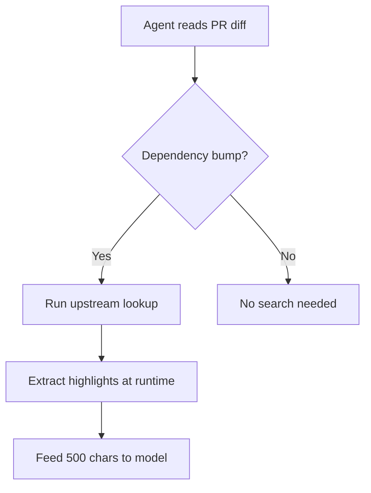
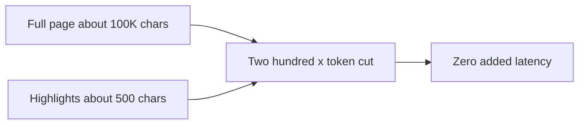

# Talk Notes: "Your Coding Agent Is 6 Months Out of Date" — Jakub Hojsan, Exa

**Video:** [Your Coding Agent Is 6 Months Out of Date — Jakub Hojsan, Exa](https://www.youtube.com/watch?v=cKhpeEBnT1o) · AI Engineer channel · Oct 2, 2026 · 12:23 · Recorded at AI Engineer World's Fair 2026

**Note:** YouTube's transcript was unreadable in our environment, so this is distilled from the video's own description/chapters plus biggo.com's AI-generated talk summary and vendor docs — treat biggo-derived points as secondary, not verbatim transcript. The video page itself showed "Video unavailable" in our browser.

## Thesis

Every LLM has a ~6-month lag between training cutoff and release, leaving a review blind spot — the model cannot even judge code it could not have written. Bolting on web search is insufficient: the agent must be instructed WHEN to search (rules — e.g., dependency-bump diffs trigger upstream lookup), and search must return distilled highlights (~500 chars computed at runtime with no LLM, zero added latency) instead of full pages. Exa's provider-agnostic, fully traceable API — plus the new Exa Agent with third-party data partners — is the pitch.

## The mental model

## Key points

- **Cutoff gap:** ~6 months between cutoff and release; example PR to the Kuder vector store fell after GPT-5.5's cutoff — invisible to the model.
- **Human vs model:** a human Stack Overflows the "inertia check" removal; the model reads the diff as a cleanup — wrong, because it is actually a dependency bump requiring a refactor. Web search pulls the repo + changelog to explain the migration.
- **Highlights, not pages:** ~500 characters fed to the model instead of ~100,000; extraction is computational (pulls specific lines at runtime, no LLM) → "zero added latency."
- **Generality demos:** same personal website → bio query vs phone-number query return different highlights; "bajillion lines" GitHub repo; latest NVIDIA news constrained to mention Jensen.
- **Two-step integration:** (1) instruct when to search — Claude Code natively has web search yet says Sonnet 4.6/4.7 "doesn't exist" because it never invokes it; (2) execute the search. "Adding it to the harness alone does not work."
- **Transparency vs native:** OpenAI/Anthropic search is a black box (sources without content, up to ~10s latency); Exa returns the full span/trace — exact queries, sources, highlights — routable into a telemetry tree.
- **Cost:** native search bills go unnoticed until workloads grow; Exa claims to be "priced much more effectively" at scale with better quality "in most instances" (vendor claim).
- **Provider neutrality:** one fixed API across GLM, new Anthropic/OpenAI models as they ship — a standardization layer decoupled from model choice.
- **Exa Agent:** orchestrated search for customers who don't want to build it; data partners SimilarWeb (web analytics), Particle (podcast intelligence), Crunchbase (private markets); targets financial firms/hedge funds (see Exa Connect).
- **Retrieval pipeline:** multistage — query embedding → keyword filtering + semantic search → re-ranking; curated index of "tens of billions" of high-quality docs (fewer than Google, higher quality).
- **Structured output:** natural-language → schema (up to 10 fields on deep, ~100 on agents); additionalProperties flag; adopted as coding-docs search API by Cursor, Cognition, Warp, CodeRabbit.
- **Distribution:** available via MCP and "essentially every provider that supports it."

## Notable quotes & data

- "You're not feeding the model 100,000 characters anymore. You're feeding it quite literally only 500 characters to answer the question."
- "Adding a search tool to your agent is not enough."
- "We're quite literally just pulling certain lines at runtime, not using an LLM."
- **Stat:** ~200x fewer tokens per search (500 vs 100,000 chars), zero added latency.

## Tokenomics / efficiency angle

- ~200x fewer tokens per search (500 vs 100,000 chars) with zero added latency — context-window and cost savings on every lookup.
- Cheaper than native provider search at scale (vendor claim).

## Local-deploy takeaways

- The two-step pattern is the portable lesson: a search tool in the harness is inert unless the agent is instructed *when* to invoke it (e.g., dependency-bump diffs trigger upstream lookup) — encode the trigger rules, not just the tool.
- Distill-then-feed (highlights, not pages; ~500 chars) is the local RAG discipline: computational extraction beats LLM summarization on both cost and latency.

## How to apply it

1. Write the trigger rules first, before buying any search API: list 3-5 diff patterns in your repos that require fresh external knowledge (dependency bumps, API migrations, changelog reads) and add them to the team's agent instructions as "when you see X, search upstream first."
2. Build the distill-then-feed layer locally: for web-fetch tool output, run a runtime line-extraction step that returns only the matching spans (~500 chars) instead of dumping full pages into context — computational extraction, no LLM summarizer.
3. Instrument the trace: log every lookup with the query, source, and returned span so the search path is auditable in your existing telemetry tree.
4. Re-audit any LLM-based summarization steps in the pipeline and replace them with the computational extraction — zero added latency, ~200x fewer tokens per lookup.
5. Prefer a provider-neutral search API surface so the lookup layer survives model swaps (GLM, new Anthropic/OpenAI releases) without rewrites.

## Sources

- biggo AI summary: https://finance.biggo.com/podcast/ff19f92438af3ba7
- Video description: https://www.youtube.com/watch?v=cKhpeEBnT1o
