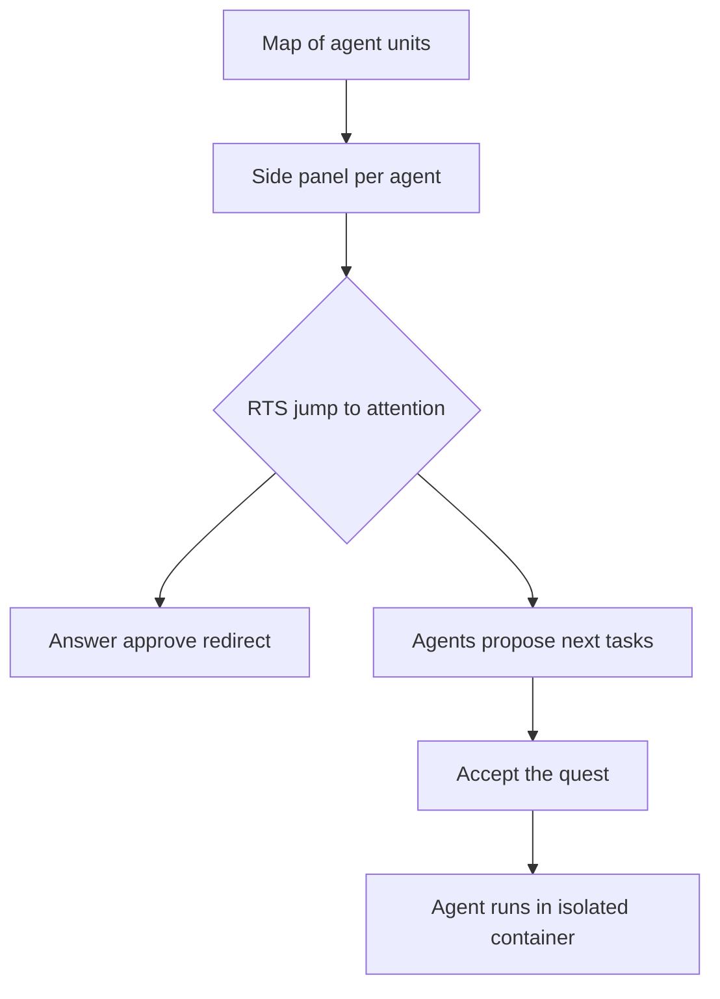
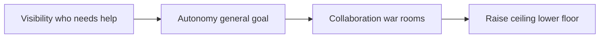

# Talk Notes: "I Turned Coding Agents Into a Strategy Game" — Ido Salomon, AgentCraft

**Video:** [I Turned Coding Agents Into a Strategy Game — Ido Salomon, AgentCraft](https://www.youtube.com/watch?v=YIVkERhy8xo) · AI Engineer channel · Sep 27, 2026 · 14:49 · Recorded at AI Engineer World's Fair 2026

**Note:** distilled from the full spoken transcript (read via usetranscribe.io); supplementary secondary sources are marked where used.

## Thesis

Humans are the bottleneck in agent utilization — steering, directing, and reviewing agents at scale is exhausting — but the supervisory skills we need already exist from video games (Warcraft, Sims, RTS). AgentCraft is a game-inspired orchestrator that raises the ceiling (visibility → autonomy → collaboration) and lowers the floor so the ~90% of non-power-users can orchestrate agents without burning out.

## The mental model

## Key points

- **The bottleneck.** "Spin up 25 Claude Code agents and you're done" doesn't work — each agent needs steering, directing, reviewing; at scale it's exhausting. "We are the bottleneck" — but the skills (supervising many units, as in Warcraft/Sims) "are with us all along."
- **AgentCraft.** A game-inspired orchestrator. Each agent is a visual unit on a map (represents a Claude Code/OpenClaw/Codex/OpenCode agent); detected on device or spawned from Craft. Prompting via a side panel with voice (multimodal).
- **The map is spatial.** Buildings = functionalities (plugins/skills management, integrated terminal, integrated git — "do all of your work from within this space"); the file system projected onto the map; files represented as runes — see which agent works on which directory/file and when; build heat maps and linkages.
- **Visibility.** Side panel shows each agent's task, last action, current activity — "who needs my attention and who doesn't."
- **RTS-style reaction.** Like pressing spacebar in Civilization to jump to whatever needs attention — answer questions, approve plans, jump between items.
- **Cognitive overload.** Can't hold 20 things in your head — so agents scan the codebase and propose next tasks; "accept the quest" and an agent does it. Babysitting 20 parallel tasks is still exhausting → **autonomy**: give a general goal, an orchestrator spawns, breaks it down, runs everything in isolated local containers, no babysitting. Loops: e.g., "scan Twitter for cool stuff to build" or "scan your GitHub" → features built in the background.
- **The review kit.** For 5–20 parallel reviews: full diffs, file-by-file, or visual evidence (videos/photos of what changed); run multiple instances in parallel and "pick the best implementation."
- **Collaboration.** "War rooms"/"war halls" — locally hosted, joinable via tunnels. Teammates join (his wife, a product designer, designs; he follows off her work and implements while she keeps working); shared workspace beyond Git; a notice board of what each person and agent is doing; chat between people and between agents. Works from mobile/Telegram too.
- **Raise the ceiling AND lower the floor.** Power users do more, but the surprise was non-technical adoption — kids orchestrating agents, "someone that flunked out of college because he played Starcraft" now doing productive work. Goal: bring ~90% of people into the agentic future "without having them burn out."
- **"Loopers" (experimental, "TBD").** A mobile-game-level simpler mode — prompt → result, projects you keep returning to, loops + autonomous agents, customizable visualization for different people.
- **Availability.** AgentCraft installable via npx as a website; Loopers is experimental — he's collecting interest/feedback. (Ido also created MCPUI, which became MCP apps / MCP steering committee.)

## Notable quotes & data

- "We are the bottleneck, but we don't have to be."
- "Someone that flunked out of college because he played Starcraft and now you can suddenly do really productive stuff with it."
- "We need to raise the ceiling but we also need to lower the floor... take probably around 90% of the people in the world and bring them into this agentic future without having them burn out."

## Tokenomics / efficiency angle

- **The review kit attacks the review bottleneck.** Visual evidence (videos/photos of changes) plus running multiple instances in parallel and picking the best implementation — eval-driven, best-of-N review at scale. Best-of-N is a deliberate spend: more generation cost, less wasted review time.
- **Autonomy via orchestrator + isolated containers + background loops** removes the per-agent babysitting cost — the human-attention side of the efficiency equation.
- **No explicit token/cost figures in the talk.** The efficiency argument is entirely about human supervisory bandwidth, not inference spend.

## Local-deploy takeaways

- War rooms are locally hosted with tunnel-based joining — the collaboration layer is self-hostable, not tied to a vendor cloud.
- Agents run in isolated local containers; orchestration is on-device — consistent with a local-first multi-agent setup.

## How to apply it

1. Build the "who needs attention" panel first: a single dashboard per team showing each running agent's task, last action, and current status — visibility before autonomy, exactly the talk's ladder.
2. Add the RTS-style triage ritual: a keyboard-first review queue where the platform team jumps between agents to answer questions, approve plans, or redirect — measure time-to-attention, not just token spend.
3. Stand up the task-proposal loop: have agents scan the codebase weekly and propose next tasks for humans to accept or reject ("accept the quest") instead of hand-writing every work item.
4. Graduate to background autonomy: define general goals with a supervising orchestrator that breaks work down and runs it in isolated local containers with no babysitting — start with one loop (e.g., scan internal repos for dependency drift).
5. Adopt the review-kit pattern for parallel agent outputs: collect full diffs plus visual evidence (screenshots, short recordings of behavior change) and run best-of-N, keeping the winner.
6. Pilot locally-hosted collaboration: war-room style shared sessions for pair work between humans and agents, joinable over your own network, nothing in a vendor cloud.

## Sources

- Video: https://www.youtube.com/watch?v=YIVkERhy8xo
