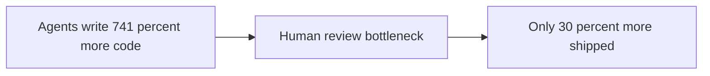
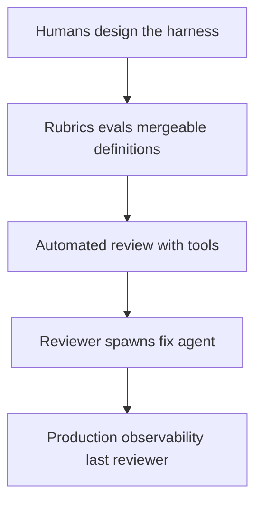

# Talk Notes: "The Death of the Code Review: What the Data Actually Says" — Laurie Voss, Arize AI

**Video:** [The Death of the Code Review: What the Data Actually Says — Laurie Voss, Arize AI](https://www.youtube.com/watch?v=_mi3alkqy4s) · AI Engineer channel · Sep 30, 2026 · 24:40 · Recorded at AI Engineer World's Fair 2026

**Note:** YouTube's transcript was unreadable in our environment, so this is distilled from the video's own description/chapters plus biggo.com's AI-generated talk summary — treat secondary-derived points as the speaker's arguments per those summaries, not verbatim transcript.

## Thesis

Generation is now nearly free but verification isn't — developers with autonomous agents wrote **741% more code yet shipped only 30% more**, because human review is the bottleneck and humans cannot scale to agent output. Neither reviewing harder nor skipping review survives the evidence (Bun's 13,044 unsafe blocks; an 88%-vs-35% prompt-injection fool rate; a public six-month "don't review" retraction), so code review must be rebuilt as an engineered system: humans stop reviewing PRs line-by-line and instead design the review harness — rubrics, evals, definitions of mergeable — with production observability as the last reviewer standing.

## The mental model

## Key points

- **The asymmetry.** Three economists tracked **100,000+ GitHub developers** against telemetry of AI adoption — autonomous-agent users wrote **741% more code but shipped only 30% more software** (~8x writing, ~⅓ more shipping); the authors are explicit that review was the bottleneck.
- **Generation scale is settled.** Stripe/Anthropic's Fable launch materials — **50M-line Ruby migration in a single day** (vs 2+ months for a team); Bun (now Anthropic) — **1M+ lines of Zig→Rust in six days**. The everyday version: "hitting the merge button and feeling guilty" about unread diffs.
- **Human review has hard limits.** A Cisco study (ten months, 2,500 reviews, 3.2M lines, two decades old — still the best available) found reviewers stop finding defects effectively **beyond 400 lines** in one sitting, with effectiveness falling off a cliff beyond **450 lines/hour**. A single unremarkable 10,000-line agent PR = **3–4 working days** of genuine review. "A developer can run a dozen agents at once (Voss is 'suspicious of the people who do')."
- **The "skip review" experiments.** OpenAI's internal product built with "no manually written code" — empty repo to **~1M lines, ~1,500 merged PRs, 3 engineers, 5 months**; "humans may review pull requests, but they are not required"; nearly all review pushed agent-to-agent. Telling omissions: what the product did, and it wasn't open-sourced. For a while every Friday was spent hand-cleaning AI slop until agents were trained to do it.
- **Anthropic/Nicholas Carlini:** a C compiler in Rust over **~2,000 agent sessions** that compiled the Linux kernel — no human approving code, but humans wrote the test harness and feedback systems. Carlini's warning: "easy to watch the tests pass and assume the job is done, and it rarely is."
- **Bun is the sharpest verification-gap exhibit:** **99.8% of the test suite passing**, yet **13,044 unsafe blocks** vs ~74 in comparable human-written Rust — three orders of magnitude more asserted-but-unproven memory safety. "There is now no knowing what is lurking under the surface."
- **The retraction.** Dexter Horthy spent six months telling people not to review code, then retracted on stage in **March 2026** — "I was wrong, please, please read the code. We tried not reading the code for like six months, it did not end well. We had to rip out and replace large parts of that system." Per Voss: "That is not a benchmark, that is somebody who ran this experiment for real."
- **Passing tests ≠ mergeable.** METR (March 2026) had four active OSS maintainers grade already-SWE-bench-passing PRs — only **about half were actually mergeable**; failures were quality and out-of-suite breakage, not correctness. Cognition's Frontier Code (June 2026) — 20+ maintainers, 150 tasks of 40+ expert hours each, grading correctness, regression safety, scope discipline, test quality, maintainability — exposes the gap: Fable 5 scored **88% on SWE-bench Pro but 29%** on Frontier Code's hardest slice; GPT 5.5 **under 6%**. "The strongest models we have are nowhere near passing human review reliably."
- **The flywheel.** Compilers and test suites are free verifiers, so models got good at exactly what's cheaply checkable — "anything that you can verify cheaply, you can train against until you beat it." A credible mergeability benchmark becomes a training signal (Sarah Guo: "a critical turning point"); precedent: OpenAI's CriticGPT (2024) — human+model reviewers beat either alone and the signal was built into models "almost instantly." "Whoever writes today's review standard is writing next year's default model behavior."
- **Production automated review is mainstream.** GitHub's Copilot reviewer — **60M reviews, more than 1 in 5 of all GitHub reviews**. Cursor's reviewer: first version ran **8 passes per diff plus shuffled re-review** (order changed outcomes) to filter false positives — Peking University replicated the multi-pass idea for up to **+44% quality**; rebuilt so the model reasons over the diff with tools, and had to be instructed to be suspicious (it defaulted to "that looks good to me, ship it"). Review is fusing with repair: Cursor's reviewer spawns a fix agent from its findings; next goal is the reviewer running code to prove its own bug report. Field-wide metric: human acceptance (CodeRabbit 13M+ PRs; Greptile's repo graph; Graphite's accept/reject eval sets; Cursor's "resolution rate" **52%→70%**).
- **The human checkpoint survives — it moves.** OpenAI's write-up echoes Cisco ("when something failed, the fix was almost never to try harder"); review "didn't disappear... it got rebuilt as a system, and that system is built by humans." The security argument is decisive: Anthropic's own auto security reviewer README warns it's not hardened against prompt injection — usable only on trusted PRs; a March 2026 study found innocent-framed vulnerable commits **fooled autonomous reviewers 88% of the time vs 35% for humans**. "You take the human out of the loop, you don't just lose a reviewer, you lose the thing that was hard to fool."
- **Prescription:** "stop reviewing PRs — it is the wrong level of abstraction for 2026." Pour judgment into the harness: codified definitions of good, company context, domain knowledge, rubrics, evals — then crank up the agents. "You can go much faster than one-third faster if you concentrate your efforts higher up the stack of reviewers, rules, and evals." And once pre-merge review is all machines, production observability becomes the last reviewer standing.

## Notable quotes & data

- 741% more code written, 30% more shipped; Bun's 13,044 vs ~74 unsafe blocks; prompt injection fools review agents 88% vs 35% for humans.
- "Once the pre-merge review is all machines, watching what the code actually does becomes the last reviewer standing."
- "Humans are moving from being the engine that drives a code review, reading code line by line, to its pilots."

## Tokenomics / efficiency angle

- **The core efficiency asymmetry:** generation nearly free, verification/trust expensive — value migrates from code production to code certification.
- **Compute-for-quality tradeoffs are explicit:** Cursor's 8-pass + shuffled re-review; multi-pass agreement **+44% quality** (Peking U) — spending compute deliberately to buy quality.
- **Eval-driven iteration at industry scale:** a mergeability benchmark wouldn't just measure — it would become a training signal (CriticGPT precedent), redirecting frontier-model training.

### Local-deploy takeaways

- **Budget verification compute explicitly:** if review is the bottleneck, the spend profile flips — invest inference tokens in multi-pass review and reviewer-with-tools loops rather than generating more diffs per token.
- **Codify your review harness, not your review queue:** write the rubrics, evals, and definitions of mergeable once as versioned artifacts (skills/eval sets), so every agent in the org inherits the same merge bar — judgment compounds, line-by-line review doesn't scale.

## How to apply it

1. Measure your own asymmetry: pull PR data for the last quarter (lines generated vs lines shipped) and confirm whether review is the bottleneck before spending anything.
2. Write the definition of mergeable as a versioned artifact: correctness, regression safety, scope discipline, test quality, maintainability — a rubric file every reviewer (human or agent) grades against, stored in the repo.
3. Budget verification compute explicitly: shift token spend from generating more diffs to multi-pass automated review — shuffled re-review and reviewer-with-tools loops, with false-positive filtering like Cursor's.
4. Fuse review with repair: let the reviewer's findings spawn a fix agent that commits the fix directly, so human triage only sees genuine questions.
5. Instruct the reviewer to be suspicious by default: agent reviewers approve too easily, and innocent-framed vulnerable commits fool autonomous reviewers far more often than humans — add a prompt-injection sanity check to the harness.
6. Make production observability the last reviewer: wire deploys so runtime signals (errors, SLO drift) feed back into the merge bar, closing the loop the talk prescribes.

## Sources

- YouTube description/chapters: https://www.youtube.com/watch?v=_mi3alkqy4s
- BigGo AI talk summary: https://finance.biggo.com/podcast/6de2edbc9a704378
