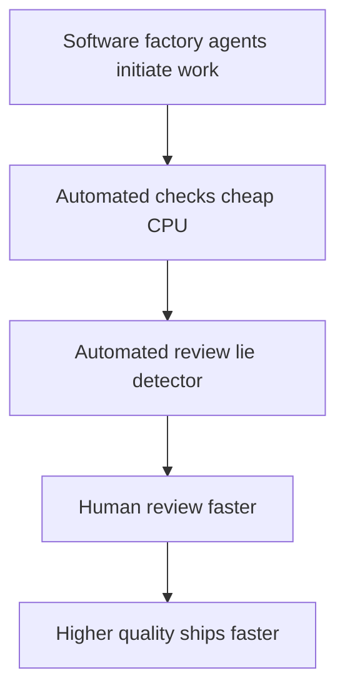
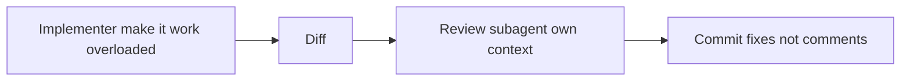

# Talk Notes: "Fixing the PR Bottleneck" — Matt Pocock, AIHero

**Video:** [Fixing the PR Bottleneck — Matt Pocock, AIHero](https://www.youtube.com/watch?v=LlgiOCmFG_w) · AI Engineer channel · Sep 25, 2026 · 22:34 · Recorded at AI Engineer World's Fair 2026

**Note:** distilled from the full spoken transcript (read via usetranscribe.io); secondary sources are marked where used.

## Thesis

AI agents massively increased PR volume — the "software factory," where agents rather than humans initiate work (classifiers turning bug reports into fixes, PlanetScale slow-query reports auto-triggering work) — which without brakes becomes a "slop cannon." The fix is three quality brakes — automated checks (cheap, deterministic), automated review (agents as lie detectors for the checks), and human review — arranged so that raising code quality counterintuitively speeds everything up: better code needs fewer human interventions. Key mechanisms: deep-module codebase design, coding standards enforced at review time rather than implementation time, one-way vs two-way door triage, human-friendly PR bodies, and a "retro" skill that compounds review learnings back into checks and standards.

## The mental model

## Key points

- The PR bottleneck predates AI (piles of unreviewed PRs), but AI massively increased the strain. The central promise of AI: agents let us scale up — "do more with less."
- **The "software factory"** (his "biggest buzzword of the day"): humans no longer initiate all work — agents do. Examples: a classifier turning bug reports into fixes/repros; PlanetScale slow-query reports triggering work; deterministic code (not humans) firing factory steps. Acceleration pushes more code through — but with only acceleration and no brakes, "you're going to end up with a slop cannon."
- **Brakes** = mechanisms that slow down to increase quality, preventing a "software entropy nightmare" — because code is the environment your agent operates in, and "bad code begets more bad code." Three brakes form a cake: automated checks → automated review → human review. Goal: make human review faster by leaning on the first two. First principle: "stop the slop" — higher shipped quality → less human review → counterintuitively faster.
- **Automated checks (layer 1) are cheap:** no tokens (unlike automated review), no human effort — just CPU cycles. (Tokens spent fixing agent bugs that tests catch are "tokens pretty well spent.") Layer loads of them on; most repos underuse them.
- **Checks can lie:** green CI ≠ ready to merge. Human and automated review are "lie detectors" for the checks.
  - **Lie 1 — tautological tests:** tests that reassert the implementation ("Opus 5 got addicted to these") — e.g., X-post char limit = 280, tested by expecting the limit to be 280. Extremely structure-sensitive: renaming a constant breaks the test.
  - **Lie 2 — structure-sensitive UI test:** reads the source file into memory and asserts "videos" appears after "content plan" in the source text, instead of rendering — any layout change breaks it.
  - **Lie 3 — tests that cannot fail:** abused mocking (useAudioBoost stubbing the DOM AudioContext with fakes) never exercises real error modes → strange production failures.
- **Design your way out: deep modules** (John Ousterhout, *A Philosophy of Software Design*) — module A hides a large implementation behind a tiny interface (deep); module B exposes a large interface where each function does little (shallow). Deep modules → fewer structure-sensitive tests, because tests sit at the interface. His codebase-design skill finds deepening opportunities and emits a before/after HTML doc (reducing duplication, creating deep testable modules) — works even on the "craziest vibe-coded codebase." It also defines a shared team language: locality (related code located together), leverage (caller gets big value from a simple call), seam.
- **Don't put coding standards in the implementer agent:** implementation is OVERLOADED (explore + change + debug in one context window) — standards make it worse. Instead, a code-review skill receives the diff, reads coding-standards.md from the repo, and checks compliance — running in a SUBAGENT with its own context window and budget; review is UNDERLOADED (a little exploration, no implementation/debugging), so it absorbs standards far better. Two-part process: implement = make it work; review = make it good — red-green-refactor across two context windows. Keep standards out of AGENTS.md (drowns the implementer); coding-standards.md is for the reviewer only.
- **Don't outsource automated review:** generic third-party reviewers (Cursor bugbot, CodeRabbit) are too general (false positives) or too specific (TypeScript-only, useless for Rust). Build your own; accumulate coding standards over time; share them across the team; put those unread docs to work.
- **The reviewer should COMMIT, not comment:** verbose PR comments just create triage work for the human. Default to commits that fix findings; comment only on genuine questions — so the human reviews "a really nice artifact." "Stop trying to one-shot good code."
- **Human-friendly PRs** (his upcoming "PR skill"):
  - **Principle 1 — not all reviews are equal;** triage with AWS one-way vs two-way doors. Most PRs are two-way doors (merge + revert — "the glorious benefit of software vs civil engineering"), but nuance matters: a trivial change that emails 60,000 people is a one-way door; expensive migrations/data loss = one-way door → "review the hell out of that PR." Attach a "merge danger" summary (door type + blast radius): two-way door with localized blast radius → light review.
  - **Make the "why" fast to grasp:** pseudocode and diagrams over prose (credit: the "show me" skill by Dex Hadley, humanlayer skills repo) — mermaid/UML sequence diagrams, CLI command/flag summaries. "It's hard to overstate" the difference.
- **Review the system, not just the code:** the process producing the code matters as much as the code — "never write the same comment twice"; never catch the agent doing the same thing across two PRs. The mechanism is his new **"retro" (retrospective) skill:** feed it a session, a PR+session, or a week's PRs+reviews, and it suggests new automated checks and coding-standards.md updates — a compounding effect where each human review raises the quality of the next. Retro also audits navigation pointers (add AGENTS.md pointers), tool economy (token efficiency of tools used), and bloat (bloated steering files/skills → reorganize).
- **Goal:** make human review fast, simple, and optional — "you really don't need to review every single two-way door. Every single one-way door you do."
- Skills at aihero.dev/skills; v1.3 shipping that week. Most-viewed of the eight at ~147K views (view count as of Oct 2026); talk given in Paris.
- **The actual skills repo** (github.com/mattpocock/skills — "Skills for Real Engineers. Straight from my .agents directory") makes the talk concrete. The named skills from the talk, as the repo defines them:
  - **code-review**: two-axis review of the diff since a fixed point — **Standards** (does it follow the repo's coding standards, plus a Fowler smell baseline?) and **Spec** (does it faithfully implement the originating issue/spec?) — run as **parallel subagents so neither pollutes the other**.
  - **retro**: "Suggest improvements to the coding agent's environment (navigation, automated checks, coding standards, steering files, tooling) after a session, most severe first." Model-invoked.
  - **pr**: "The shape a pull request body should take: a summary as the smallest visual that makes the change clear, before/after evidence that it works, and a merge-danger call (one-way or two-way door, plus blast radius)."
  - **codebase-design**: "Shared discipline and vocabulary for designing deep modules: a lot of behaviour behind a small interface, placed at a clean seam, testable through that interface."
  - Supporting cast: **tdd** (red-green-refactor, one vertical slice at a time), **diagnosing-bugs** (red-on-this-bug → minimise → hypothesise → instrument → fix → regression-test), **domain-modeling** (glossary + ADRs), **research** (cited findings as Markdown, background agent), **prototype**, **wizard** (interactive bash for human-only steps), **wayfinder** (multi-session plans as decision tickets), **resolving-merge-conflicts**.

## By the numbers

- **3** — the quality brakes (automated checks → automated review → human review) and the three lies checks tell (tautological tests; structure-sensitive tests; tests that cannot fail).
- **280** — the X-post character limit in the tautological-test example: the test asserted the constant equaled 280, i.e. reasserted the implementation.
- **60,000** — people accidentally emailed by "a very simple change": the canonical example of a trivial-looking one-way door.
- **2** — the axes of the code-review skill (Standards, Spec) run as parallel subagents; the two context windows of the red-green-refactor split (implement vs review).
- **v1.3** — the skills release shipping the week of the talk, at aihero.dev/skills.

## Decision framework

- **Build vs buy the reviewer:** buy (Cursor bugbot, CodeRabbit) when you need generic coverage fast; build when false positives from generic rules cost more than maintaining your own — Pocock's rule is to build, because generic reviewers are either too general (irrelevant flags) or too specific (TypeScript-only, useless for Rust). The tiebreaker: do you have team-specific standards worth encoding? If yes, build.
- **When retro pays:** once you have a week's worth of PRs+reviews to mine — retro needs volume to find patterns. Below that threshold, do the retrospective manually; the skill's value is compounding over repeated runs.
- **When deep modules pay:** test-heavy repos where structure-sensitive tests are the dominant failure mode. The tell: renaming a constant or moving a function breaks tests that "shouldn't" care.
- **Traps the speaker names:** green CI meaning "ready to merge" (the three lies); the reviewer commenting instead of committing (comments = more human triage work); coding standards in the implementer's context (drowns the overloaded agent — standards live in coding-standards.md for the reviewer only); misclassifying a one-way door as two-way (the 60,000-email change looked trivial); bloated steering files and skills silently degrading results (retro audits for this explicitly).
- **The one question that organizes human review:** "is this a one-way or two-way door, and what's the blast radius?" — answer it in the PR body and the review effort allocates itself.

## Notable quotes & data

- "If you just have permanent acceleration pushing stuff through your factory, you're going to end up with a slop cannon."
- "Code is the environment your agent operates in. If you have bad code in your codebase, that is going to beget more bad code."
- "Automated checks are cheap… they don't cost tokens like automated review does… just CPU cycles."
- "Does a green CI mean that the code is ready for merge? No, it does not."
- "Stop trying to one-shot good code."
- "You never want to write the same comment twice."

## Tokenomics / efficiency angle

- Automated checks cost CPU cycles, not tokens or human effort — layer them aggressively; tokens spent fixing test-caught agent bugs are "tokens pretty well spent."
- The retro skill explicitly audits **tool economy** (token efficiency of tools used) and steering-file/skill bloat (bloated skills → reorganize).
- Reviewer commits fixes directly (saves human triage); one-way/two-way-door triage focuses scarce human attention where it matters; the underloaded reviewer subagent keeps the implementer's context window lean.

## Local-deploy takeaways

- The overloaded-implementer / underloaded-reviewer split is a context-management pattern to adopt everywhere: keep standards out of AGENTS.md (drowns the implementer), run review in a separate subagent with its own context window and budget.
- Checks-first is the cheapest quality spend: deterministic CPU-cycle checks before any token-burning review — build the check layer before the review layer.
- Run the retro loop locally: feed a week's PRs+reviews to a retrospective pass that proposes new checks and standards updates — each review compounds, and the retro explicitly audits token economy and steering-file bloat.

## How to apply it

1. Layer automated checks first: turn on the cheap deterministic checks (lint, type-check, tests, structure guards) before spending a single token on review — CPU cycles before tokens. Tokens spent fixing test-caught agent bugs are "tokens pretty well spent."
2. Split implementer and reviewer contexts: keep coding standards out of AGENTS.md and the implementer's prompt (the implementer is overloaded: explore + change + debug in one window); run review in a subagent with its own context window that reads coding-standards.md and grades the diff — red-green-refactor across two context windows.
3. Make the reviewer commit fixes, not comments: default to direct commits on findings; reserve comments for genuine questions so humans triage artifacts, not threads. "Stop trying to one-shot good code."
4. Add the one-way vs two-way door triage to every PR body: door type plus blast radius at the top ("merge danger"), so humans reserve deep review for one-way doors (migrations, data loss, mass-email changes). Most PRs are two-way doors — those get light review.
5. Build your own reviewer instead of outsourcing: start from your team's coding-standards.md, accumulate standards over time, and hunt the three lies — tautological tests (Opus 5's addiction), structure-sensitive tests, tests that cannot fail. Run the review on two axes (Standards + Spec) as parallel subagents so neither pollutes the other.
6. Design deep modules where tests are structure-sensitive: hide behavior behind small interfaces at clean seams (locality, leverage, seam as the shared vocabulary); test at the interface so renames and refactors stop breaking tests.
7. Stand up the retro loop weekly: feed a week's PRs and reviews into a retrospective pass that proposes new automated checks and standards updates — and audits navigation pointers (AGENTS.md), tool economy (token efficiency of tools), and steering-file/skill bloat each round. Never write the same review comment twice.
8. Require human-friendly PR bodies: "why" as pseudocode and mermaid sequence diagrams over prose (the show-me pattern), so the human reads intent in seconds.

## Sources

- Video page: https://www.youtube.com/watch?v=LlgiOCmFG_w
- Full transcript: https://www.usetranscribe.io/yt/LlgiOCmFG_w/pr-bottleneck-fix
- The skills repo (retro, code-review, codebase-design, pr, tdd and the rest, as shipped): https://github.com/mattpocock/skills
