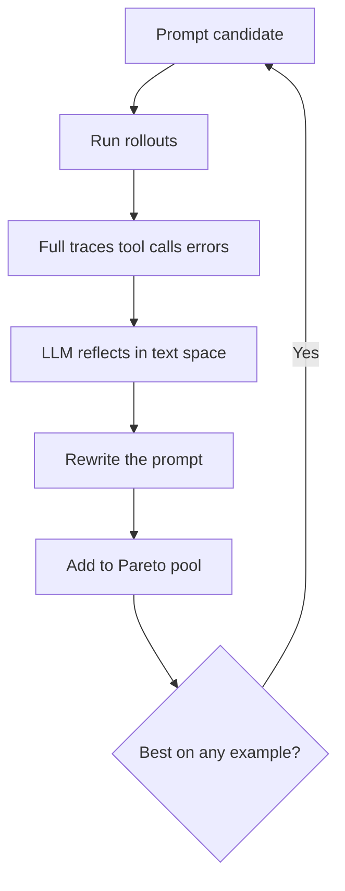
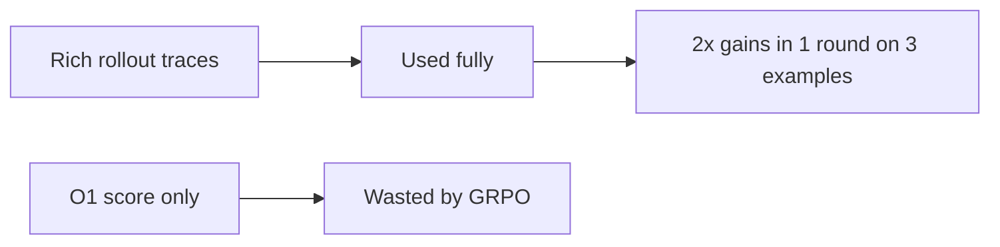

# Talk Notes: "Beating RL With Reflection: GEPA and Optimize Anything" — Lakshya A. Agrawal, GEPA

**Video:** [Beating RL With Reflection: GEPA and Optimize Anything — Lakshya A. Agrawal, GEPA](https://www.youtube.com/watch?v=OA-Mc60Rboo) · AI Engineer channel · Sep 26, 2026 · 21:27 · Recorded at AI Engineer World's Fair 2026

**Note:** distilled from the full spoken transcript (read via usetranscribe.io); secondary sources are marked where used.

## Thesis

Most teams are bottlenecked by sample efficiency — they lack the data/compute for SFT or RL. So instead of RL with verified rewards (which discards everything but a 0/1 score), GEPA does **reflective optimization in text space**: an LLM reads full rollout traces (chains of thought, tool calls, error messages) plus textual feedback and rewrites the prompt, where a single natural-language change can equal thousands of gradient steps. A Pareto candidate pool avoids local optima, and "Optimize Anything" generalizes the same loop to any text artifact — code, agent harnesses, scheduling policies.

## The mental model

## Key points

- **The sample-efficiency bottleneck.** Pretraining needs trillions of tokens, SFT tens of thousands of labels, RL hundreds of thousands of rollouts — most teams have none of that. The talk names two causes: scarce domain knowledge (too little data for offline algorithms like SFT) and expensive rollouts (long agentic tool calls, slow task metrics — agents now work for hours, so hundreds of thousands of online rollouts are infeasible).
- **RL with verified rewards (e.g., GRPO) wastes information.** Rollouts contain chains of thought, tool calls, environment responses and diagnostic error messages — yet only an O(1) score is propagated via gradients. "We learned almost nothing from all of that." GEPA's question: can we use the rich trace instead of just the score?
- **Two key ideas.** (a) Reflect in text space: an LLM or agent reads the entire rollout trace and reflects on what worked and what didn't — and can make its own tool calls, e.g. retrieval from a company knowledge base or textbook. (b) Update prompts, not weights: one natural-language change ("one-line summary" → "10-line summary") transforms behavior instantly versus thousands of tiny sequential gradient steps.
- **What GEPA is.** GEPA = Genetic-Pareto (per the paper, *GEPA: Reflective Prompt Evolution Can Outperform Reinforcement Learning*, ICLR 2026 oral): a prompt optimizer that samples trajectories (reasoning, tool calls, tool outputs), reflects in natural language to diagnose problems, proposes and tests prompt updates, and combines complementary lessons from the Pareto frontier of its own attempts. "RL in text space": score plus domain-specific textual feedback — Qwen3-8B optimizing itself, no external teacher.
- **The loop, stage by stage (repo README).** 1) **Select** a candidate from the Pareto frontier (candidates excelling on different task subsets). 2) **Execute** it on a minibatch, capturing full execution traces. 3) **Reflect**: a reflection LLM reads the traces (error messages, profiler output, reasoning logs) and diagnoses failures. 4) **Mutate**: generate an improved candidate informed by accumulated lessons from all ancestors. 5) **Accept**: add to the pool if improved, update the Pareto front. Additionally, **system-aware merge** combines the strengths of two Pareto-optimal candidates that excel on different tasks.
- **How textual feedback is produced.** The evaluator is a fitness function returning a score plus an open-ended dict of anything the domain produces: expert feedback, compiler/profiler/tool errors, documentation — "return literally anything." In the `optimize_anything` API this is emitted via `oa.log(...)` calls inside the evaluator. The repo's name for it: **Actionable Side Information (ASI)** — "the text-optimization analogue of a gradient."
- **GEPA vs GRPO.** ONE round of reflection on just THREE examples gave 2x the performance gains GRPO got after 25,000 rollouts; a few more rounds doubled the gap again. The paper (six tasks): +6% average vs GRPO, up to +20%, using up to 35x fewer rollouts; >10% over the leading prompt optimizer MIPROv2 (e.g. +12% accuracy on AIME-2025). The repo's typical budget: 100–500 evals vs 5,000–25,000+ for GRPO.
- **What GEPA learns is a detailed problem specification** — not model idiosyncrasies ("my grandmother will be angry if you don't generate a good prompt") but input semantics, pipeline-stage purpose, and lessons from data. The shown example: the second hop of a multi-hop QA system learned that first-hop docs cover one entity/aspect and the second hop should recover related docs. Fully automated, ~30–60 min per run, replacing weeks of manual prompt tweaking per new model. "Information distillation in prompt space": GPT-4.1 mini optimized to **outperform GPT-4.1** on a math task.
- **AMD NPU case.** New XDNA2 accelerator, novel API, ~zero web info, GPT-4 failing. GEPA took an existing agent from 4.25% to 30.52% (7x) with no agent changes — discovering in one step to avoid including AMD's ADEF.h/ADF.h header, which shipped with the library but didn't work on the new hardware.
- **Pareto pool — the named failure mode.** Keep every candidate that wins on even one training example, not just the top scorer. The plain alternative — asking an LLM in a loop to keep improving the prompt — gets stuck in a local optimum and exhausts its search budget (the talk shows the collapsed search tree vs the balanced Pareto tree). Across four benchmarks, more than half of GEPA's gains come from Pareto selection — ~2x the gains of the plain loop.
- **"Optimize Anything": the generalization.** Prompts are just text artifacts that determine AI system behavior — so anything expressible as text and scoreable gets the same loop: CUDA kernels (evaluator compiles/profiles, emitting ASI), numeric optimization (numbers serialized as text), full agent-harness files, cloud scheduling policies (evaluator = −cost; side info = job traces, SLA violations). The API: hand it the problems plus the evaluator, call `optimize_anything`, get back an optimized solution. Three modes: single problem; multitask search (transfer across related problems, e.g. matmul + dot-product kernels); build-a-skill (train on a set of problems, deploy to unseen new ones — the generalization mode).
- **Discovered agent harnesses.** From a 4-line Python CoT call to a 6-step agent in 16 reflection rounds, taking Gemini Flash on ARC-AGI from 32.5% → 89.5% — the discovered agent does rule-hypothesis induction, code synthesis, auto-execution and tracing, auto-debugging, then runs on test inputs. MATH-500: GPT-4.1 nano +20% via an auto-discovered 2-step agent (runnable example in the repo). Fun demo: a 3D-unicorn generator where Optimize Anything beat Claude Opus 4.6's one-shot output.
- **GSKill: skills as the artifact.** Objective given in natural language: "learn a skill from the trajectory; when the coding agent is presented with a similar problem, the skill should be helpful." Budget-constrained start on GPT-5-mini: Go repo issue resolution 24% → 93% (~3x). Skills optimized cheaply on GPT-5-mini transferred to Claude Sonnet 4.5 → 100% resolution while cutting resolution time ~50% — fewer tokens, because skills encode repo organization, test invocation, feature locations, build system. Open source in the GEPA repo (feature name GSkill).
- **Production and ecosystem results.** ~40% cloud-scheduling cost cut vs expert heuristics (repo: 40.2%); custom solvers matching/exceeding Optuna in black-box optimization; Snorkel improved internal benchmarks within 20 hours of release (tweeted about it); ~35% OCR error-rate cut on leading VLMs (externally validated); Databricks tuned GPT-OSS 120B to **outperform Claude Opus at 90x lower cost**; DSPy full-program adapter 67% → 93% on MATH; auto-learned skills 55% → 82% coding-agent resolve rate on Jinja. Named production users: Dropbox and Shopify CEOs discussing GEPA use, an OpenAI blog post on self-improving AI systems with GEPA, 50+ production uses listed in the repo (Shopify, Databricks, Dropbox, OpenAI, Pydantic, MLflow, Comet ML). Shopify CEO Tobi Lütke: GEPA is "severely under hyped."
- **The better-models counter-claim.** "As models get better, the importance of prompt optimization will go down" — wrong, the speaker argues: better instruction-following means more precise task instructions help MORE, and the Claude Opus delta exceeded the open-model delta.
- **Subjective tasks: the eval flywheel.** GEPA can learn evals for hard-to-evaluate tasks: collect production traces, have a human annotate ~50 trajectories with detailed feedback ("long response", "short response", "uses this terminology"…), use GEPA to optimize an LLM-as-judge prompt, then optimize the agent against that judge — a data flywheel used by leading production teams.
- **Co-optimizing weights and prompts.** The follow-up paper "Learning Fast and Slow" proposes fast-slow learning: model weights as slow (GRPO updates), the prompt harness as fast (GEPA evolving candidates every T RL steps while maintaining the Pareto frontier) — reported up to 3x sample efficiency with ~70% less drift from the base model (per secondary coverage, not the talk).
- **The integration surface.** `gepa.optimize(...)` takes a seed candidate (dict of named text components), trainset, valset, task_lm, reflection_lm, max_metric_calls; `dspy.GEPA(metric=..., max_metric_calls=150, reflection_lm="openai/gpt-5")` plugs into DSPy `.compile()`; built-in adapters for DSPy full programs, generic RAG (ChromaDB, Weaviate, Qdrant, Pinecone), MCP tool descriptions + system prompts, TerminalBench, math; integrations in MLflow (`mlflow.genai.optimize_prompts()`), Comet Opik, Pydantic AI, OpenAI Cookbook, HuggingFace Cookbook, Google ADK. Zero hard dependencies; works with API-only models (GPT-5, Claude, Gemini through their APIs).

## By the numbers

- **3 examples, 1 reflection round → 2x GRPO's gains after 25,000 rollouts** — multihop-QA experiment, Qwen3-8B self-optimizing, no teacher; a few more rounds doubled the gap again.
- **+6% avg (up to +20%) vs GRPO across six tasks, up to 35x fewer rollouts** — the GEPA paper's headline result (ICLR 2026 oral).
- **>10% over MIPROv2, e.g. +12% on AIME-2025** — instruction-only optimization beating the leading prompt optimizer.
- **100–500 evals vs 5,000–25,000+ for GRPO** — the repo's typical GEPA rollout budget.
- **30–60 min per run** — replacing weeks of manual per-model prompt tweaking.
- **>50% of GEPA's gains from the Pareto pool across four benchmarks; ~2x the plain LLM-in-a-loop** — the Pareto-selection ablation.
- **4.25% → 30.52% (7x)** — existing AMD XDNA2 NPU agent, GEPA prompt-only, one step discovering the ADEF.h/ADF.h exclusion.
- **32.5% → 89.5%** — Gemini Flash on ARC-AGI, 16 reflection rounds, 4-line CoT → 6-step agent.
- **+20%** — GPT-4.1 nano on MATH-500 via auto-discovered 2-step agent.
- **24% → 93% (~3x)** — GPT-5-mini on Go repo issue resolution via GSkill; **→ 100% at ~50% less resolution time** transferred to Claude Sonnet 4.5.
- **~40% (repo: 40.2%) cloud-scheduling cost cut** vs expert heuristics.
- **90x lower cost** — Databricks' tuned GPT-OSS 120B outperforming Claude Opus.
- **~35% OCR error-rate cut** on leading VLMs, externally validated.
- **+10%** prompt-only gains on QA, instruction-following, claim verification and math — domains frontier labs already optimize heavily; AIME: GPT-4.1 mini 46.6% → 56.6%.
- **67% → 93%** — MATH via the DSPy full-program adapter; **55% → 82%** — coding-agent resolve rate on Jinja via auto-learned skills.
- **20 hours** — time from GEPA's release to Snorkel improving internal benchmarks with it.
- **+9%** — Qwen3-8B-optimized prompts transferred to GPT-4.1 mini with no re-optimization, per secondary coverage of the paper (generalizable reasoning strategies, not model overfitting).

## Notable quotes & data

- "GEPA in just one round of reflection using just three data points got twice the performance gains that GRPO got after 25,000 rollouts."
- "Databricks achieved 90x cost reduction… tuned GPT-OSS 120B to outperform Claude Opus while being 90x cheaper."
- "As models get better the importance of prompt optimization will go down. I argue the opposite."
- Go issue resolution 24% → 93% (GPT-5-mini), 100% with Claude Sonnet 4.5 at ~50% less resolution time; AMD NPU agent 4.25% → 30.52%; ~40% scheduling-cost cut.

## Tokenomics / efficiency angle

- The core thesis is sample efficiency: 3 examples vs 25,000 rollouts; runs complete in 30–60 min, replacing weeks of manual prompt tuning per new model.
- 90x cheaper deployed agent (GPT-OSS 120B vs Claude Opus); ~40% scheduling-cost cut; ~50% faster issue resolution via transferred skills (skills encode repo layout/test invocation so the agent spends fewer tokens finding its way).

## Local-deploy takeaways

- GEPA runs with Qwen3-8B **self-optimizing, no external teacher** — this works with local open models, not just frontier APIs.
- The pattern to steal: full rollout traces (tool calls, error messages) + textual reflection beats O(1) score gradients on both sample and token efficiency — apply it to your own prompt/harness tuning loop.
- Skills are a token-compression device: encoding repo layout and build/test invocation into a skill cut resolution time ~50% — cheap to write locally, pays off on every run.

## Decision framework

**Reach for reflective optimization when:**
- Rollouts are expensive (long agentic tool calls, slow task metrics) — GEPA needs 100–500 evals vs 10K+ for RL (repo's "When GEPA Shines").
- Data is scarce: GEPA works with as few as 3 examples; no large training set required.
- You have no weights access — GEPA optimizes API-only models (GPT-5, Claude, Gemini) directly through their APIs.
- You need human-readable, versionable, auditable artifacts (prompts, skills, harnesses) rather than opaque weight deltas.
- You re-tune on every model release — GEPA runs replace weeks of manual prompt tweaking.
- Diagnostic material exists: errors, logs, profiler output, expert notes — reflection is only as good as the traces it reads.

**Prefer RL/fine-tuning (or sequence GEPA first) when:**
- Rollouts are cheap and plentiful and you already have SFT/GRPO infrastructure — fine-tuning can still add gains on top; the repo's own guidance is "complements RL: use GEPA for rapid initial optimization, then apply RL/fine-tuning for additional gains."
- The behavior you need can't be expressed as a text artifact — if there's nothing to rewrite, there's nothing to reflect on. (inferred)

**Measure first:**
- Define the score before anything else — GEPA optimizes exactly what the evaluator measures, and ASI is the text analogue of a gradient, so invest in the feedback dict, not just the number.
- Fix a budget: `max_metric_calls` 100–500, expect 30–60 min runs, and hold out a valset (both `gepa.optimize` and `dspy.GEPA` accept one) — don't ship on train examples alone.
- Track Pareto-front diversity, not just the top score; a collapsing front is the signal the loop is degenerating into a plain loop. (inferred)

**Traps and caveats:**
- The evaluator is the ceiling (inferred): on subjective tasks, learn the eval first (~50 human-annotated trajectories → LLM-as-judge prompt) before optimizing against it.
- Reflection-model quality matters (inferred): split roles — a cheap task_lm runs the system, a stronger reflection_lm diagnoses (the README pairs gpt-4.1-mini with gpt-5). Budget reflection tokens accordingly; every round re-reads full traces.
- Never run a plain LLM-improve-in-a-loop: it collapses into local optima and burns the budget — the Pareto pool is load-bearing, not optional.
- Few-example optimization can overfit: use the multitask or build-a-skill generalization mode and validate on held-out inputs before deploying.

## How to apply it

1. Install and pick your door: `pip install gepa` (zero hard dependencies). For DSPy pipelines: `dspy.GEPA(metric=your_metric, max_metric_calls=150, reflection_lm="openai/gpt-5")`, then `optimizer.compile(student=MyProgram(), trainset=trainset, valset=valset)`. For anything else: `gepa.optimize(seed_candidate={"system_prompt": ...}, trainset=..., valset=..., task_lm=..., reflection_lm=..., max_metric_calls=150)`; read `result.best_candidate`.
2. For non-prompt artifacts (agent harness file, scheduler, kernel, config, SVG): use `optimize_anything`. Write `evaluate(candidate) -> float` and call `oa.log(...)` inside it to emit Actionable Side Information — compiler errors, profiler output, job traces, SLA violations; pass a natural-language `objective` describing what to optimize for, and call `optimize_anything(seed_candidate=..., evaluator=..., objective=..., config=GEPAConfig(engine=EngineConfig(max_metric_calls=100)))`.
3. Respect the budgets the talk and repo give: start with as few as 3 examples; cap at 100–500 metric calls; expect 30–60 min runs. Split models by role — cheap task_lm runs the system, stronger reflection_lm diagnoses — and budget the reflection model's tokens, since every round re-reads full traces. (model-split is the repo's; the token-budget advice is inferred)
4. Copilot-shop leverage: the MCP adapter optimizes MCP tool descriptions and system prompts — point it at the MCP servers your coding agents use; the Generic RAG adapter covers retrieval prompts across ChromaDB/Weaviate/Qdrant/Pinecone; if MLflow is in the stack, `mlflow.genai.optimize_prompts()` brings GEPA to any agent framework.
5. Run the local-first path the talk proves: Qwen3-8B self-optimizing with no external teacher — reflection works on open weights on your own hardware; make the strong reflection model the only API call, and only where it pays.
6. Turn the output into a versioned skill artifact: the detailed problem specification GEPA discovers (input semantics, repo layout, test invocation, build system) becomes a team skill — the GSkill pattern that cut issue-resolution time ~50% and transfers across models.
7. Then close the loop the talk prescribes: ~50 human-annotated production trajectories → GEPA-optimize an LLM-as-judge prompt → optimize the agent against it, re-running per model release instead of weeks of manual tweaking.

## Sources

- Video page: https://www.youtube.com/watch?v=OA-Mc60Rboo
- Full transcript: https://www.usetranscribe.io/yt/OA-Mc60Rboo/beating-rl-with
- Paper: *GEPA: Reflective Prompt Evolution Can Outperform Reinforcement Learning* (arXiv:2507.19457, accepted ICLR 2026 oral) — https://arxiv.org/abs/2507.19457
- Repo + docs (README, quick start, optimize_anything API, adapters, integrations, "When GEPA Shines" — read for this pass): https://github.com/gepa-ai/gepa · https://gepa-ai.github.io/gepa/ · https://gepa-ai.github.io/gepa/guides/
- optimize_anything launch blog: https://gepa-ai.github.io/gepa/blog/introducing-optimize-anything/
