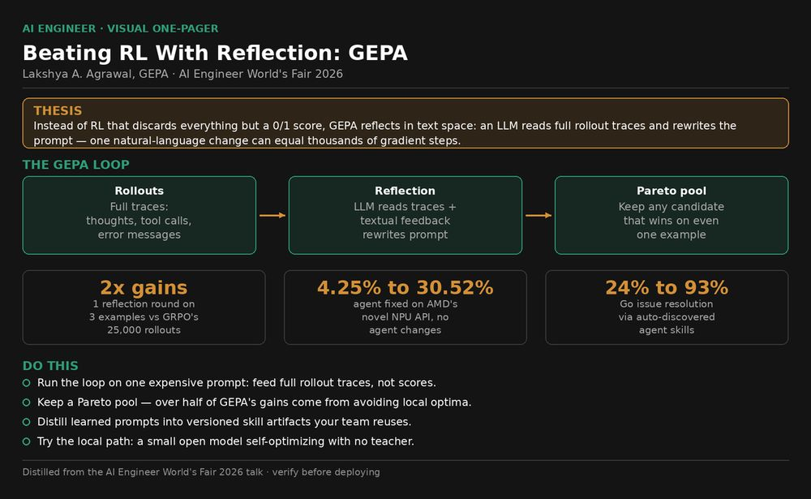
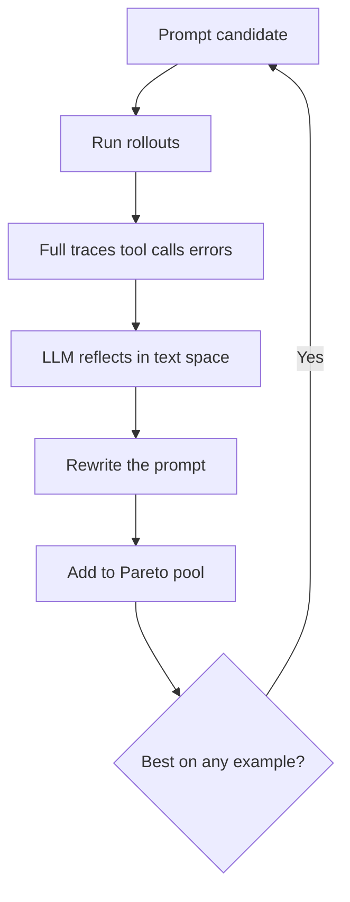
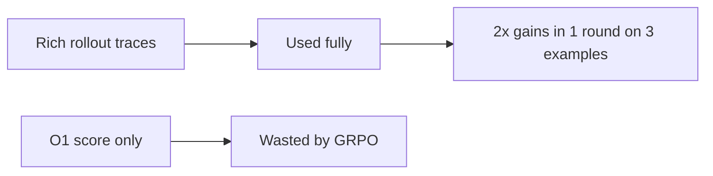

# Talk Notes: "Beating RL With Reflection: GEPA and Optimize Anything" — Lakshya A. Agrawal, GEPA

**Video:** [Beating RL With Reflection: GEPA and Optimize Anything — Lakshya A. Agrawal, GEPA](https://www.youtube.com/watch?v=OA-Mc60Rboo) · AI Engineer channel · Sep 26, 2026 · 21:27 · Recorded at AI Engineer World's Fair 2026

**Note:** distilled from the full spoken transcript (read via usetranscribe.io); secondary sources are marked where used.

## Thesis

Most teams are bottlenecked by sample efficiency — they lack the data/compute for SFT or RL. So instead of RL with verified rewards (which discards everything but a 0/1 score), GEPA does **reflective optimization in text space**: an LLM reads full rollout traces (chains of thought, tool calls, error messages) plus textual feedback and rewrites the prompt, where a single natural-language change can equal thousands of gradient steps. A Pareto candidate pool avoids local optima, and "Optimize Anything" generalizes the same loop to any text artifact — code, agent harnesses, scheduling policies.

## The mental model

## Key points

- **The sample-efficiency bottleneck:** pretraining needs trillions of tokens, SFT tens of thousands of labels, RL hundreds of thousands of rollouts — most teams have none of that. Two causes: scarce domain data and expensive rollouts (long agentic tool calls, slow task metrics).
- **RL with verified rewards (e.g., GRPO) wastes information.** Rich rollouts contain chains of thought, tool calls, environment responses, and diagnostic error messages — yet only an O(1) score is propagated via gradients.
- **Two key ideas:** (a) reflect in text space — an LLM/agent reads the whole trace and reflects on what worked, optionally retrieving from a company knowledge base or textbooks; (b) update prompts, not weights — changing "one-line summary" to "10-line summary" transforms behavior instantly versus thousands of tiny gradient steps.
- **GEPA = evolutionary loop + Pareto-based candidate selection** — "RL in text space": score plus domain-specific textual feedback. Qwen3-8B optimizing itself, no external teacher.
- **GEPA vs GRPO:** ONE round of reflection on just THREE examples gave 2x the performance gains GRPO got after 25,000 rollouts; a few more rounds doubled the gap again.
- **What GEPA learns is a detailed problem specification** — input semantics, pipeline-stage purpose, lessons from data. E.g., for multi-hop QA it learned first-hop docs cover one entity/aspect and the second hop should retrieve related docs. Fully automated, ~30–60 min per run, replacing weeks of manual prompt tweaking per new model.
- **Production wins:** optimized GPT-4.1 mini to **outperform GPT-4.1** on a math task ("information distillation in prompt space"); on AMD's new NPU XDNA2 (novel API, ~zero web info, GPT-4 failing), GEPA took an existing agent from 4.25% to 30.52% (7x) with no agent changes — discovering in one step to avoid including AMD's own ADEF.h/ADF.h header, which didn't work on the new hardware.
- **Pareto pool:** keep every candidate that wins on even one training example, not just the top scorer. A plain LLM-in-a-loop gets stuck in local optima and burns its budget; across four benchmarks, over half of GEPA's gains come from Pareto selection — ~2x the gains of the plain loop.
- **"Optimize Anything":** a universal API — supply problems plus an evaluator/fitness function returning a score and any domain side information (expert feedback, compiler/profiler/tool errors, docs — an open-ended dict), then call `optimize_anything`. Demonstrated on CUDA kernels (evaluator compiles/profiles, emitting "actionable side information"), numeric optimization (numbers serialized as text), full agent-harness files, and cloud scheduling policies (evaluator = −cost; side info = job traces, SLA violations).
- **Discovered agent harnesses:** from a 4-line Python CoT call to a 6-step agent in 16 reflection rounds, taking Gemini Flash on ARC-AGI from 32.5% → 89.5% (rule-hypothesis induction, code synthesis, auto-debugging); MATH-500: GPT-4.1 nano +20% via an auto-discovered 2-step agent (runnable example via QR code). Fun demo: a 3D-unicorn generator where Optimize Anything beat Claude Opus 4.6's one-shot output.
- **Agent skills (GSKill, open-source in the GEPA repo):** a GPT-5-mini agent on Go repo issue resolution went 24% → 93% (~3x); skills transferred to Claude Sonnet 4.5 → 100% issue resolution while cutting resolution time ~50% (fewer tokens — skills encode repo layout, test invocation, build system).
- **Three modes:** single problem; multitask search (transfer across related problems, e.g., matmul + dot-product kernels); build-a-skill (generalize to unseen deployment problems).
- **Production results:** ~40% cloud-scheduling cost cut vs expert heuristics; custom solvers matching/exceeding Optuna in black-box optimization; Snorkel improved internal benchmarks within 20 hours of release (tweeted about it); ~35% OCR error-rate cut on leading VLMs (externally validated); Databricks: tuned GPT-OSS 120B to **outperform Claude Opus at 90x lower cost**.
- **Counter-claim:** "as models get better, prompt optimization matters less" is wrong — better instruction-following means more precise task instructions help MORE; the Claude Opus delta exceeded the open-model delta.
- **Eval flywheel:** GEPA can learn evals from ~50 human-annotated production trajectories (optimize an LLM-as-judge prompt, then optimize the agent against it) — a data flywheel used by leading production teams; the "Learning Fast and Slow" paper co-optimizes weights + prompt harnesses.
- **Adoption:** Dropbox and Shopify CEOs discussing GEPA use; an OpenAI blog post on self-improving AI systems with GEPA; zero hard dependencies.

## Notable quotes & data

- "GEPA in just one round of reflection using just three data points got twice the performance gains that GRPO got after 25,000 rollouts."
- "Databricks achieved 90x cost reduction… tuned GPT-OSS 120B to outperform Claude Opus while being 90x cheaper."
- "As models get better the importance of prompt optimization will go down. I argue the opposite."
- Go issue resolution 24% → 93% (GPT-5-mini), 100% with Claude Sonnet 4.5 at ~50% less resolution time; AMD NPU agent 4.25% → 30.52%; ~40% scheduling-cost cut.

## Tokenomics / efficiency angle

- The core thesis is sample efficiency: 3 examples vs 25,000 rollouts; runs complete in 30–60 min, replacing weeks of manual prompt tuning per new model.
- 90x cheaper deployed agent (GPT-OSS 120B vs Claude Opus); ~40% scheduling-cost cut; ~50% faster issue resolution via transferred skills (skills encode repo layout/test invocation so the agent spends fewer tokens finding its way).

## Local-deploy takeaways

- GEPA runs with Qwen3-8B **self-optimizing, no external teacher** — this works with local open models, not just frontier APIs.
- The pattern to steal: full rollout traces (tool calls, error messages) + textual reflection beats O(1) score gradients on both sample and token efficiency — apply it to your own prompt/harness tuning loop.
- Skills are a token-compression device: encoding repo layout and build/test invocation into a skill cut resolution time ~50% — cheap to write locally, pays off on every run.

## How to apply it

1. Pick one expensive prompt or harness config and set up the GEPA loop: problems plus an evaluator returning a score and textual side information (tool errors, compiler output, expert notes) — no weight training, text-space reflection only.
2. Feed full rollout traces, not scores: store chains of thought, tool calls, and error messages per attempt so the reflection step can read what actually happened.
3. Keep a Pareto candidate pool instead of a single best prompt: retain any candidate that wins on even one example — the talk credits this with roughly 2x the gains of a plain loop.
4. Distill the learned prompt into a skill artifact: the detailed problem specification GEPA discovers (input semantics, pipeline purpose, repo layout, test invocation) becomes a versioned skill the whole team inherits — token compression that pays off every run.
5. Run the eval flywheel: from ~50 human-annotated production trajectories, optimize an LLM-as-judge prompt, then optimize the agent against it — co-improving the harness and its own evaluator.
6. Try the local path: Qwen3-8B self-optimizing with no external teacher proves this works on open weights on your own hardware, not just frontier APIs.

## Sources

- Video page: https://www.youtube.com/watch?v=OA-Mc60Rboo
- Full transcript: https://www.usetranscribe.io/yt/OA-Mc60Rboo/beating-rl-with
