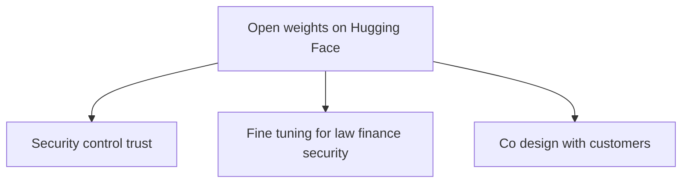
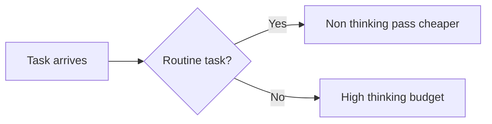

# Talk Notes: "GLM-5.2: Open Weights, Near-Frontier Intelligence" — Zixuan Li, Z.ai

**Video:** [GLM-5.2: Open Weights, Near-Frontier Intelligence — Zixuan Li, Z.ai](https://www.youtube.com/watch?v=9JFGohx4E7U) · AI Engineer channel · Sep 27, 2026 · 13:46 · Recorded at AI Engineer World's Fair 2026

**Note:** distilled from the full spoken transcript (read via usetranscribe.io); supplementary secondary sources are marked where used.

## Thesis

Open-weights models can now reach near-frontier intelligence — GLM-5.2 sits between Claude Opus 4.7 and 4.8 on the hardest long-horizon coding/agentic benchmarks — and "intelligence" means more than IQ-style math/physics tests. Z.ai open-sources the weights because users need security and control, domains need fine-tuning, and co-design requires visibility into the architecture and training recipe. The talk closes with "one more thing": Z Code, Z.ai's own coding harness.

## The mental model

## Key points

- **The name.** The company is Zhipu ("GLM" is not a brand name but a generic term: "general language model pre-training with auto-regressive blank filling," from a 2021 paper). Zhipu was among the first LLM labs, alongside OpenAI, Anthropic, and DeepMind. The original architecture is no longer used, but the name stuck (GLM-4.x → 5.1 → 5.2).
- **Redefining intelligence.** From GLM-4.5 to 4.7, the team explored the "intelligence upper bound" beyond IQ-style tests — reasoning, coding, and agentic capabilities matter more than math/physics benchmarks alone.
- **Benchmarks.** GLM-5.2 lands between Opus 4.7 and 4.8 on the hardest long-horizon tasks — DeepSWE, Terminal Bench 2.1 ("mentioned by the OpenAI team") — "on par with at least Opus 4.7." A big jump over 5.1. (Secondary — Z.ai blog: FrontierSWE 74.4, PostTrainBench 34.3, SWE-Marathon 13.0, SWE-bench Pro 62.1, Terminal Bench 2.1 81.0/82.7, HLE 40.5/54.7 with tools.)
- **Thinking levels.** A new "high" thinking level (thinking budget) for harder tasks, with attention to token efficiency. Striking claim: "even without thinking, the non-thinking model is better than the 5.1 thinking model."
- **More than a coding model.** Trained on GPQA-style, math, roleplay, and general chat. Leads other open-weight models on the Artificial Analysis Intelligence Index, close to frontier. People already use GLM inside Claude Code, Codex, and OpenCode.
- **Why open weights (three reasons).**
  1. Users want security, control, and trust — weights are on Hugging Face for on-prem enterprise/government use, especially in Western markets.
  2. Diversity — fine-tuning for law, finance, and security. Harvey is fine-tuning GLM-4.1 and considering 5.2; other companies are planning GLM fine-tunes to differentiate.
  3. Co-design — customers need to see the architecture and training recipe to "co-shape the future."
- **Community credit.** "GLM 5.2 couldn't succeed without" the open-source community (Unsloth, Ollama, individual developers) — "you are the true hero."
- **Resources.** A tech blog with the training pipeline/recipe, the Hugging Face repo, a chatbot/agent trial, the API, and a GLM Coding Plan (a Codex/Claude-style subscription).
- **Z Code.** Z.ai's own coding harness, built for GLM-5.2 but supporting all frontier models with BYOK. Codex-like operations ("go/compact" techniques). "First time we share the code to the whole community."

## Notable quotes & data

- "It's somewhere between Opus 4.7 and 4.8... on par with at least Opus 4.7" — long-horizon coding/agentic benchmarks
- "Even without thinking, the non-thinking model is better than the 5.1 thinking model."
- "If our users want security and control and we want to build trust, we can open weight model."
- (Secondary — Z.ai blog) 1M-token context; MIT license; vLLM/SGLang support

## Tokenomics / efficiency angle

- **Explicit thinking budgets.** The new "high" thinking level treats the thinking budget as a dial and token efficiency as a first-class design concern — the same spend-control logic as model routing: pay for reasoning depth only where the task needs it.
- **Non-thinking 5.2 beating 5.1-thinking** implies same-or-better quality at lower inference cost: free quality gains translate directly into per-task savings.
- **Architecture-level efficiency (secondary — Z.ai blog):** IndexShare reuses one indexer across every four sparse-attention layers (fewer per-token FLOPs); MTP speculative decoding acceptance length 4.56 → 5.47 (+20%) — faster decode means lower cost per token served.
- **Open weights as a cost lever:** on-prem deployment lets teams use dedicated compute, where caching/prefill savings (the talk's framing) accrue to the operator instead of the API provider.

## Local-deploy takeaways

- MIT-licensed open weights runnable under vLLM/SGLang on dedicated compute — a direct fit for the local-first strategy: near-frontier coding/agent quality without per-token API spend.
- The thinking-budget dial maps to local inference planning: lighter non-thinking passes for routine tasks, full thinking only for hard ones.
- Fine-tuning story (Harvey, domain-specific firms) suggests the weights are a viable base for domain-specialized local models in regulated verticals.

## How to apply it

1. Pilot GLM-5.2 under vLLM or SGLang on one dedicated box: MIT license, near-frontier long-horizon coding quality, zero per-token API spend — the local-first fit this talk makes the case for.
2. Benchmark it against your current Copilot model mix on your own tasks: DeepSWE/Terminal-Bench style long-horizon work first, then routine generation — confirm the "between Opus 4.7 and 4.8" claim on your workload, not theirs.
3. Implement the thinking-budget dial in routing: non-thinking passes for routine tasks (completions, scaffolds), high thinking budget only for hard multi-step work — pay for reasoning depth only where needed.
4. Measure the non-thinking-vs-thinking delta locally: the talk's claim that non-thinking 5.2 beats thinking 5.1 means free quality gains at lower inference cost — verify on your eval set and lock in the cheaper default.
5. Scope one fine-tuning candidate: pick a regulated or domain-specific vertical (legal, finance, security) where data can't leave the building and the Harvey-style fine-tune story justifies the effort.

## Sources

- Video: https://www.youtube.com/watch?v=9JFGohx4E7U
- Z.ai blog: z.ai/blog/glm-5.2
