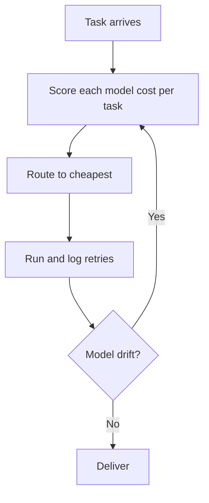
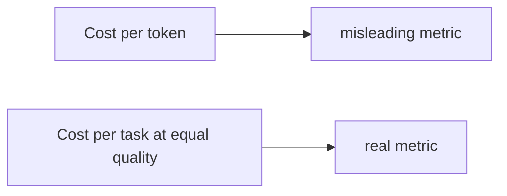

# Talk Notes: "Stop Rationing Tokens: Let the Harness Pick the Model" — Žilvinas Urbonas & Laurent Gil, Cast AI

**Video:** [Stop Rationing Tokens: Let the Harness Pick the Model — Kimchi by Cast AI](https://www.youtube.com/watch?v=48YUYDjwfYY) · AI Engineer channel · Oct 2, 2026 · 18:07 · Recorded at AI Engineer World's Fair 2026

**Note (v2 — second pass, Oct 4, 2026):** Now verified against the full spoken transcript (usetranscribe.io, ~198 lines, all 18 minutes covered) plus the open-source harness README (github.com/getkimchi/kimchi) and Cast AI's own follow-up writing. biggo-derived figures the transcript confirms are now treated as verified. Claims drawn from the README or company blog rather than the talk are labeled; anything inferred is marked (inferred).

## Thesis

Cost per token is a misleading metric because models differ in how many tokens and retries they need to finish the same task at the same quality — cost per task is the real metric. Capping developer tokens is like giving a developer a one-hour laptop battery; management's job is unlimited, inexpensive tokens. Kimchi's open-source harness routes each task to the cheapest-per-completed-task model (2.5x savings vs Claude over 3 months across Cast AI's 300-person org while token volume grew 1.5x), wrapped with Ferment (autonomous long tasks with quality scoring), Teleport (remote sandbox), and Studio (team board).

## The mental model

## Key points

- **How the routing actually works (transcript + README):** the harness is *outcome-aware* — "an automated harness that will select the right model for the task at the right time based on the outcome of the task" (Gil). In the open-source harness this is implemented as role-based delegation with tier metadata: orchestrator, planner, builder, reviewer, explorer, and researcher roles, each assigned models via `modelRoles` in `~/.config/kimchi/harness/settings.json` (toggle per role with `/multi-model`). The orchestrator picks the **lightest-tier model (light/standard/heavy) that fits the task** and escalates to heavy-tier for complex work — or as a retry after a standard-tier model has failed. Review is always delegated to a fresh context, even when the orchestrator owns the reviewer role, to preserve independence. Trap the README names: external models (Anthropic/OpenAI) have no built-in tier metadata and default to `standard`, and without metadata "selection is arbitrary" — fix it with a `modelMetadata` block in `settings.json` or `/multi-model` → "Edit model metadata".
- **The measurement plumbing that makes cost-per-task real (README):** every LLM request is auto-tagged `phase:{explore|plan|build|review|research}` + `model:{model_id}` for usage analytics and cost attribution; user tags via `/tags add key:value` or the `KIMCHI_TAGS` env var (project/global/tag defaults hierarchy). Stats — phase/step counts, timing, model usage, grade distributions — are computed on demand and exportable via `/ferment export`. This is the raw material for the routing scoreboard.
- **Crisis anecdotes (transcript):** a company in India spent $500M on Anthropic in one month; Uber's CTO tweeted he burned the year's Anthropic budget in four months. "Token maxing" is the enterprise reality the talk opens with.
- **University white-paper comparison** (cost/token vs cost/task at equal quality): Gemini 3 Flash at $3.50/M blended tokens → $705/task (on-screen chart figure — the spoken number was garbled in transcription, so treat the exact figure as chart-only) vs Minimax 2.7 at $1.50/M → $148/task (clearly stated). Minimax 2.7 is "one of my favorites" (Gil). "It means the models are not the same. They don't cost the same, but they are also not the same per task."
- **3-month internal data** (300 employees, two-thirds developers, transcript-confirmed): 2.5x savings vs the counterfactual Claude bill ("2.5 times in the amount of savings"), plotted daily — purple line = what they would have paid Claude, blue line = what they paid, same outcome. Token volume +1.5x while "the cost to code decreased by 1.5 times"; Gil's gloss: the coding agent's cost grows 2.5x *less* than the growth in tokens per task.
- **Model-selection drift (transcript):** 3 June — Kimi 2.6 winning "by far"; 12 June — visible shift (orange early-June bars → yellow late-June); 21 June — Minimax 3 winning. "No human team would re-benchmark at that cadence, but an autonomous harness obsessed with token cost will."
- **Quality scoring is the license to route cheap (transcript):** Ferment asks clarifying questions up front, breaks work into milestones, and assumes the human appears only every 2–3 hours. A scoring model grades the output — artifact is complete at **B or better**, and you can ask the agent to fix it up and iterate to **A**. A higher-order model re-checks quality and sends failures back ("it looks at the outcome and it's optimizing the token based on the quality of the outcome"). Gil's key line: "the scoring is there to prove you that whatever model we will pick for you you will always have… good enough scoring for the output on the task you're implementing" — without the score, cheap routing is just gambling on quality.
- **Full-SDLC loop (transcript):** change → build → check breakage → go back, change again, rebuild → if complete, deploy to **staging**. Staging stop is by design; production still needs "some little human in the loop… at least at this point". The stated path to auto-ship: K8s metrics, observability/SLO data, pods not crashing, application health checks passing — only then does the gate open.
- **Origin (transcript):** "we ended up spending too much on claude code like half a year ago" — the bill skyrocketed ~6 months before the talk, so they built the harness on the Pi Mono SDK and open-sourced it with intent to keep contributing. (README confirms: "Built on the pi-mono coding agent SDK".)
- **Code review (transcript):** "reading code is not enough anymore" — agentic 2,000-line PRs force reviewers to assess the *intent* and the *spec given to the agent*, not just the diff. Worse with less-technical staff in the pipeline: "imagine… product manager doing the coding" and landing a 2,000-line PR nobody can meaningfully read.
- **Teleport (transcript + README):** close the laptop, session continues. `/teleport` rsyncs the working tree to a secure cloud sandbox (Kubernetes pod on Google hyperscaler in Cast AI's case; SaaS or on-prem for fintech); managed sessions, reachable from laptop or mobile, with notifications when human input is needed. Origin story: an engineer coding on a plane — Gil explicitly corrects "it was not the Wi-Fi, it was the battery that broke." 62% of Cast AI engineers now code on Teleport exclusively. Mechanics: `/remote-sessions` to browse/reattach, `/terminal` for a raw SSH shell, `/sync up|down` to move files, `kimchi_workspace.yaml` to declare resources (cpu/memory/disk as K8s quantities), dependencies, and fail-closed egress policy; resume from CLI, the Kimchi console, **or VS Code**; `--force` overrides the 5 GB workspace limit. (inferred) This is the pattern for zero lost-session waste.
- **Studio (transcript):** Teleport for teams — a graphical Kanban board (backlog / in progress / in review) for 5–10-person "pizza teams", running on the same secure sandboxes. Plans made by the harness are reviewable by peers/PMs *before* implementation, so wrong specs are caught up front instead of discovered at production. Fixes the "terminal/CLI can't be shared" gap — "first it has to live somewhere else. So teleport is the base of what we call studio."
- **Ferment V2 (README, newer than the talk):** experimental objective controller across turns — `/ferment-v2 <objective>`, optional `--tokens <n>` budgets (default 200000), an independent tool-free evaluator returning met/impossible/continue (uses the `judge` role in multi-model mode), and self-pausing on `maxUnchangedContinuations: 3` or `maxConsecutiveErrors: 3`. This is the harness's built-in anti-runaway design — the same "automatic shutdown of runaway loops" Cast AI lists in the GA product.
- **Benchmark tooling (README):** the repo ships `benchmark/manual/` (predefined tasks run against different models), `benchmark/terminal-bench-2/` (89 tasks in Docker containers), and `benchmark/audit-session/` (audits a completed session for phase discipline, code quality, architecture, testing, model alignment, *and* cost efficiency) — i.e. the re-benchmarking cadence is scaffolded, not a weekend project.
- **Business model (transcript + company writing):** harness entirely open source (Apache-2.0, github.com/getkimchi/kimchi); Studio/Teleport need a Google account, ~5-minute install, as many sessions as you want. GA product (Kimchi Coding) runs in the customer's own VPC or on Cast AI's Nvidia B300 GPUs; Akamai is a named production customer; shadow-mode evaluations were 2.5x cheaper than a commercial-only baseline at matched-or-better spec-match and test-pass rates (itbrief).

## By the numbers

| Number | What it measures (source) |
|---|---|
| $500M | India company's Anthropic spend in a single month — crisis anecdote (transcript) |
| 4 months | How fast Uber's CTO burned a full year's Anthropic budget — crisis anecdote (transcript) |
| $3.50/M | Gemini 3 Flash blended cost per token in the university study (transcript) |
| $705/task | Gemini 3 Flash cost per *completed task* at equal quality — chart figure, spoken number garbled (secondary/biggo) |
| $1.50/M | Minimax 2.7 cost per token (transcript) |
| $148/task | Minimax 2.7 cost per *completed task* at equal quality (transcript) |
| 300 | Employees in the internal 3-month fleet; two-thirds are developers (transcript) |
| 3 months | Internal usage period for the 2.5x-savings claim (transcript) |
| 2.5x | Savings vs the counterfactual Claude bill over those 3 months, same outcome (transcript) |
| 1.5x | Token volume growth over the period — while cost-vs-Claude fell (transcript) |
| 3 / 12 / 21 June | Drift timeline: Kimi 2.6 dominant → shift visible → Minimax 3 winning (transcript) |
| B / A | Artifact grade gates: complete at B or better, iterate to A (transcript) |
| 2–3 hours | Human-in-the-loop cadence during Ferment runs (transcript) |
| 2,000 lines | The agent-authored PR size that broke diff review (transcript) |
| 62% | Share of Cast AI engineers coding on Teleport exclusively (transcript) |
| ~5 min | Teleport/Studio install time (transcript) |
| 5 GB | Default workspace size limit for `/teleport` (`--force` overrides) (README) |
| 36B/month | Current fleet token volume — 150 engineers, real agent work (dev.to, Oct 2026) |
| 12x | Cheaper than a 100% Anthropic Sonnet+Opus baseline over a 30-day window, same quality bar (dev.to, Oct 2026) |
| 59% | Minimax M3 on SWE-bench Pro — Cast AI's default builder, ahead of several commercial rivals per Cast AI (itbrief) |
| 89 tasks | terminal-bench-2 suite the repo ships for model comparison (README) |
| 200k | Default token budget for a Ferment V2 run (`--tokens` overrides) (README) |
| 3 / 3 | `maxUnchangedContinuations` / `maxConsecutiveErrors` before a Ferment V2 run self-pauses (README) |

## Notable quotes & data

- "Our job is not to prevent the developer to use coding agents. Our job is to make sure they can use it as much as they want for as long as they want in a completely unlimited fashion."
- "It means the models are not the same. They don't cost the same, but they're also not the same per task."
- "What we believe is that reading code is not enough anymore." (Urbonas)
- "No human team would re-benchmark at that cadence, but an autonomous harness obsessed with token cost will." (transcript-verified paraphrase of Gil)
- "The scoring is there to prove you that whatever model we will pick for you you will always have… good enough scoring for the output on the task you're implementing." (Gil, transcript)
- "If it doesn't stop the request, it's an alert wearing a cap's clothes." (Cast AI team, dev.to — on budget governance)
- "Governance is the buyer's problem, not the developer's" — your engineers get the best agent; you keep control of the bill. (Cast AI team, dev.to)
- **Stat:** $705/task (Gemini 3 Flash) vs $148/task (Minimax 2.7) at equal quality; 2.5x savings vs Claude over 3 months; 12x vs Sonnet+Opus baseline over 30 days (dev.to, 150 engineers, 36B tokens/month).

## Tokenomics / efficiency angle

- Cost-per-task routing beats cost-per-token shopping — the headline metric of this talk.
- Autonomous re-benchmarking captures new cheaper models within weeks without human effort; Teleport eliminates lost sessions.
- **Quality gates are what make the routing legitimate:** without a scoring model proving "good enough" output, cheap-model routing is just quality roulette. The gate (B-complete/iterate-to-A, higher-order re-check) is the other half of the tokenomics equation, not a side feature.
- **Enforcement > alerts (Cast AI's own bill, dev.to):** every request runs through a proxy that checks the budget *before* it executes — at/over limit returns HTTP 429 and the request never runs; caps cascade org → team → user → API key, tightest wins, per-model limits bind even when stricter. "You stop paying for the runaway tail, the part that turns a normal month into a board-level problem."

## Decision framework

**Use harness routing when:** agentic coding volume is large enough that the bill matters; the task mix is heterogeneous (routing gains need diversity — if one model wins every task type, there's nothing to route); new models ship faster than your team can evaluate them (drift happens in ~3 weeks); and you can automate quality gates so the harness can *prove* cheap output is good enough.

**Don't bother when:** volume is low (a weekly benchmark costs more engineer time than it saves — eyeball it); one model provably wins on cost-per-task across your whole mix; or code/data can't pass through any routing proxy (then deploy the harness fully inside your own VPC — Cast AI itself supports that).

**Measure first, in this order:**
1. Cost per *completed* task at equal quality per model per task type — log tokens, retries, and completions (Kimchi's phase:{explore|plan|build|review|research} + model:{id} auto-tags are the schema to copy).
2. Quality distribution per model — the scoring gate that justifies routing down.
3. Drift cadence — how often the winner changes; that sets your re-benchmark interval.

**Traps and caveats the speakers (and their writing) named:**
- Cost/token without a quality anchor is a meaningless comparison — "otherwise, you cannot compare apple with apple."
- Rationing tokens is a trap: it cripples developers (the one-hour-battery analogy) while leaving cost-per-task untouched.
- An alert is not a cap: "a smoke detector that watches the house burn and files a report after the fact." Copilot's "stop usage" is off by default, Claude Code has no native real-time per-user attribution, Cursor bills in arrears with no dollar attribution — buy the control, not the dashboard (dev.to).
- Reviewing diffs is no longer sufficient for 2,000-line agent PRs — review the intent and the spec given to the agent.
- Staging auto-ship is fine; production auto-ship is not, "at least at this point" — keep the human gate until SLO/observability gating exists.
- External models without tier metadata get arbitrary routing — supply `tier` + `description` or the orchestrator is guessing (README).

## Local-deploy takeaways

- Cost-per-task as the unit metric is directly adoptable: log tokens + retries per completed task per model, route automatically, and re-benchmark on a cadence no human team would — that cadence is what catches model drift like Kimi 2.6 → Minimax 3 within weeks.
- The Ferment quality-scoring loop (grade to B, iterate to A, higher-order model re-check) is a local harness pattern: quality gates replace token caps.
- "Reading code is not enough anymore" — review the spec given to the agent, not just the diff; a process change with zero tooling cost.

## How to apply it

1. **Switch the unit metric this week:** cost per completed task = total tokens × blended price ÷ tasks completed correctly, tracked per model per task type. Copy the tagging schema: auto-tag every request `phase:{explore|plan|build|review|research}` + `model:{model_id}` (Kimchi's exact schema) so the scoreboard builds itself from logs.
2. **Build the routing harness with roles + tiers, not just a price table:** define orchestrator/planner/builder/reviewer/explorer/researcher roles; tag each candidate model `light|standard|heavy`; orchestrator picks the lightest tier that fits the task, escalates to heavy on complexity or after a standard-tier failure; always delegate review to a fresh context. If you use VS Code/GitHub Copilot agents, replicate the tier escalation rule in your own harness or adopt Kimchi's (Apache-2.0, resumes from VS Code).
3. **Re-run the benchmark weekly, drift-alert on the winner:** use a fixed task sample (or Kimchi's shipped tooling — `benchmark/manual/` for predefined tasks, `benchmark/terminal-bench-2/` for the 89-task suite, `benchmark/audit-session/` for cost-efficiency audits). The Kimi 2.6 → Minimax 3 shift took three weeks; a quarterly review never catches it.
4. **Add Ferment-style quality gates before you route cheap:** clarifying questions up front, milestones with build/breakage checks, a scoring model that grades artifacts (complete at B, iterate to A), and a higher-order re-check that sends failures back. Ship to staging automatically; keep production human-gated until SLO-gated auto-ship exists.
5. **Enforce caps, don't send alerts:** if you route through any proxy, check the budget *before* the request executes (their pattern: HTTP 429 at/over limit, tightest-wins cascade across org/team/user/API-key scopes, per-model limits that bind even when stricter). An alert that fires while tokens keep flowing is decoration.
6. **Change the review process for agent PRs:** reviewers assess the intent and the spec given to the agent, not just the diff — zero tooling cost, immediate effect; mandatory once agent PRs hit the thousands of lines.
7. **Give teams remote sandboxes:** sessions that survive a closed laptop remove lost-session waste — the Teleport pattern (`/teleport`, `/remote-sessions`, workspace templates with fail-closed egress). For a local-first shop, the portable insight is the container-sync mechanism, not the Google-hyperscaler deployment.

## Sources

- Full spoken transcript (this source WORKED — the primary basis for the second pass): https://www.usetranscribe.io/yt/48YUYDjwfYY/ (all 18:07 covered, ~198 lines; alternate slug variant https://www.usetranscribe.io/yt/48YUYDjwfYY/stop-rationing-tokens was not needed)
- Open-source harness, full README (model roles, delegation, phase tracking, tags, Ferment V1/V2, Remote Sessions, benchmark tooling): https://github.com/getkimchi/kimchi (Apache-2.0; the canonical repo — the video description also points here; castai/kimchi is the older configurator repo)
- "The $500M Bill Was Always Going to Happen" — Cast AI team's own follow-up on enforcement-vs-alerts, hard proxy caps, 150 engineers / 36B tokens/mo / 12x vs Sonnet+Opus: https://dev.to/getkimchi/the-500m-bill-was-always-going-to-happen-2k10
- Kimchi Coding GA — 2.5x shadow-mode savings, runaway-loop shutdown, spend dashboard, Akamai customer: https://itbrief.co.nz/story/cast-ai-launches-kimchi-coding-for-enterprise-developers
- Minimax M3 as default builder, 59% SWE-bench Pro: https://itbrief.co.nz/story/cast-ai-adds-minimax-m3-to-kimchi-coding-as-default-model
- Independent user review of the routing + `/ferment` (useful for the "how it feels" view, not for claims): https://github.com/rothgar/justingarrison.com/blob/HEAD/content/blog/2026-09-08-kimchi.md
- biggo AI summary (original v1 source, now superseded for transcript-derived points): https://finance.biggo.com/podcast/65ae25b9fc80259b
- Video description: https://www.youtube.com/watch?v=48YUYDjwfYY
