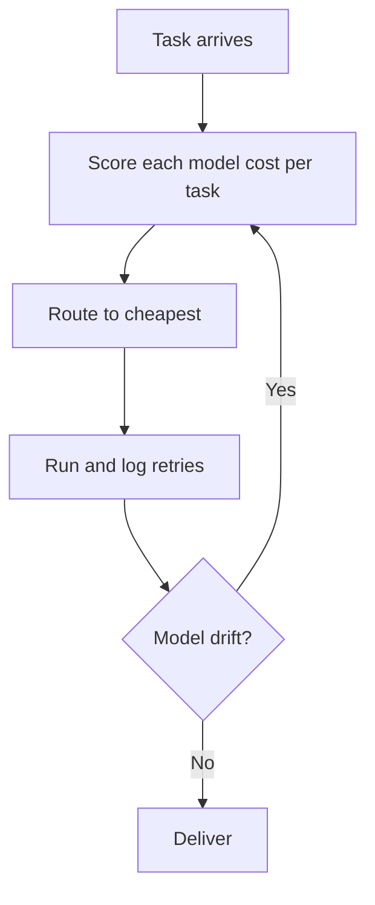
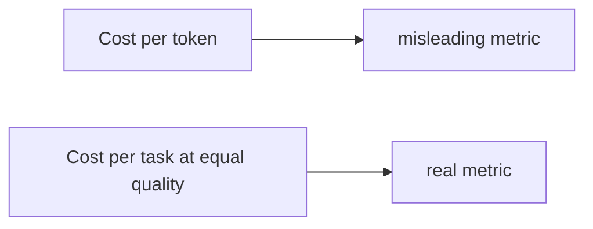

# Talk Notes: "Stop Rationing Tokens: Let the Harness Pick the Model" — Žilvinas Urbonas & Laurent Gil, Cast AI

**Video:** [Stop Rationing Tokens: Let the Harness Pick the Model — Kimchi by Cast AI](https://www.youtube.com/watch?v=48YUYDjwfYY) · AI Engineer channel · Oct 2, 2026 · 18:07 · Recorded at AI Engineer World's Fair 2026

**Note:** YouTube's transcript was unreadable in our environment, so this is distilled from the video's own description/chapters plus biggo.com's AI-generated talk summary and vendor docs — treat biggo-derived points as secondary, not verbatim transcript.

## Thesis

Cost per token is a misleading metric because models differ in how many tokens and retries they need to finish the same task at the same quality — cost per task is the real metric. Capping developer tokens is like giving a developer a one-hour laptop battery; management's job is unlimited, inexpensive tokens. Kimchi's open-source harness routes each task to the cheapest-per-completed-task model (2.5x savings vs Claude over 3 months across Cast AI's 300-person org while token volume grew 1.5x), wrapped with Ferment (autonomous long tasks with quality scoring), Teleport (remote sandbox), and Studio (team board).

## The mental model

## Key points

- **Crisis anecdotes:** a company in India spent $500M on Anthropic in one month; Uber's CTO tweeted he burned the year's Anthropic budget in four months.
- **University white-paper comparison** (cost/token vs cost/task at equal quality): Gemini 3 Flash at $3.50/M blended tokens → $705/task vs Minimax 2.7 at $1.50/M → $148/task — Minimax 2.7 "one of my favorites."
- **3-month internal data** (300 employees, two-thirds developers): 2.5x savings vs Claude; token volume +1.5x while cost-vs-Claude −1.5x ("the agent's cost grows 2.5x less than the growth in tokens per task").
- **Model-selection drift:** Kimi 2.6 dominant on 3 June → visible shift on 12 June → Minimax 3 winning by 21 June. "No human team would re-benchmark at that cadence, but an autonomous harness obsessed with token cost will."
- **Origin:** a "skyrocketing" Claude Code bill ~6 months earlier; the harness was built on the Pi Mono SDK and is being open-sourced with intent to keep contributing.
- **Ferment:** long-running autonomous task mode (human needed only every 2–3 hours); asks clarifying questions, breaks work into milestones, build/breakage checks; a scoring model grades output — artifact complete at B or better, can iterate to A; a higher-order model re-checks quality and sends failures back.
- **Full-SDLC loop:** change → build → check breakage → redeploy to staging. Production still human-gated ("at least at this point"), with K8s metrics/SLO-based auto-ship as the stated path.
- **Code review:** "reading code is not enough anymore" — agentic 2,000-line PRs force reviewers to assess intent and the spec given to the agent, not just the diff.
- **Teleport:** secure remote sandbox (Google hyperscaler; SaaS or on-prem for fintech); close the laptop, session continues; origin story = an engineer coding on a plane whose battery died. 62% of Cast AI engineers now use it exclusively.
- **Studio:** Teleport for teams — Kanban board (backlog/in progress/in review) for 5–10-person "pizza teams"; plans reviewable by peers/PMs before implementation; fixes the "terminal/CLI can't be shared" collaboration gap.
- **Business model:** harness fully open source; Studio/Teleport need a Google account, ~5-minute install.

## Notable quotes & data

- "Our job is not to prevent the developer to use coding agents. Our job is to make sure they can use it as much as they want for as long as they want in a completely unlimited fashion."
- "It means the models are not the same. They don't cost the same, but they're also not the same per task."
- "What we believe is that reading code is not enough anymore." (Urbonas)
- **Stat:** $705/task (Gemini 3 Flash) vs $148/task (Minimax 2.7) at equal quality; 2.5x savings vs Claude over 3 months.

## Tokenomics / efficiency angle

- Cost-per-task routing beats cost-per-token shopping — the headline metric of this talk.
- Autonomous re-benchmarking captures new cheaper models within weeks without human effort; Teleport eliminates lost sessions.

## Local-deploy takeaways

- Cost-per-task as the unit metric is directly adoptable: log tokens + retries per completed task per model, route automatically, and re-benchmark on a cadence no human team would — that cadence is what catches model drift like Kimi 2.6 → Minimax 3 within weeks.
- The Ferment quality-scoring loop (grade to B, iterate to A, higher-order model re-check) is a local harness pattern: quality gates replace token caps.
- "Reading code is not enough anymore" — review the spec given to the agent, not just the diff; a process change with zero tooling cost.

## How to apply it

1. Switch the unit metric this week: start logging tokens, retries, and completed tasks per model per task type — cost per completed task replaces cost per token in every report.
2. Build the routing harness: score candidate models on your own task sample at equal quality, route each task to the cheapest-per-completed-task model, and re-run the benchmark on a weekly cadence no human team would keep manually.
3. Wire model-drift detection: alert when the winning model shifts (Kimi 2.6 to Minimax 3 took three weeks) — the autonomous harness is what catches it, not a quarterly review.
4. Add Ferment-style quality gates: milestones with build/breakage checks, a scoring model that grades artifacts (complete at B, iterate to A), and a higher-order re-check that sends failures back — quality gates replace token caps.
5. Change the review process for agent PRs: reviewers assess the intent and the spec given to the agent, not just the diff — zero tooling cost, immediate effect.
6. Give teams remote sandboxes: sessions that survive a closed laptop remove lost-session waste — the Teleport pattern, hostable for your own engineers.

## Sources

- biggo AI summary: https://finance.biggo.com/podcast/65ae25b9fc80259b
- Video description: https://www.youtube.com/watch?v=48YUYDjwfYY
