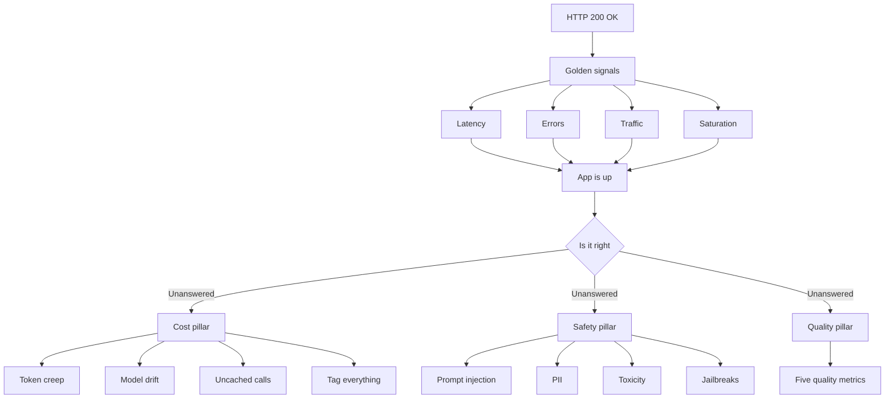

# Talk Notes: "Your LLM App Returned 200 OK. It Was Still Wrong." — Marina Petzel, Datadog

**Video:** [Your LLM App Returned 200 OK. It Was Still Wrong. — Marina Petzel, Datadog](https://www.youtube.com/watch?v=rTojoVotlD8) · AI Engineer channel · Oct 2, 2026 · 18:00 · Recorded at AI Engineer World's Fair 2026

**Note:** transcript unavailable; distilled from chapter list, description, and tagline. Kept shorter; no specifics invented beyond what's given.

## Thesis (from title/tagline/chapters)

Classic "golden signals" (latency, errors, traffic, saturation) tell you your app is up — they don't tell you if it's right. GenAI apps need additional monitoring pillars: cost, safety, and quality.

## The mental model

## Key points (from chapter list)

- **Golden signals aren't enough anymore** (0:12) — latency/errors/traffic/saturation tell you the app is up, not that it's right.
- **How GenAI apps are different** (1:12); **new attack vectors** (2:22).
- **Quality is subjective** (2:47).
- **Cost monitoring** (3:51): token creep, model drift, uncached calls (4:56).
- **Cost attribution: tag everything** (6:55).
- **Safety metrics** (9:15): prompt injection, PII, toxicity, jailbreaks (9:55).
- **Quality monitoring** (12:09): five quality metrics (13:19).
- **Putting it all together** (15:43); **Datadog Agent Observability** (16:38).
- **Referenced sources**: Google SRE book (golden signals); Datadog docs on LLM observability; Datadog blog "How to Monitor AI Agents: The Four Pillars of Agent Observability"; Datadog "AI SORT: A Framework for Evaluating AI Systems for SRE"; book "Observability Engineering" (Charity Majors, Liz Fong-Jones, George Miranda, Honeycomb); paper "Can Large Language Models Be an Alternative to Human Evaluations?" (Chiang & Lee, 2023).

## Notable quotes & data

- Tagline: "Latency, errors, traffic and saturation tell you your app is up. They don't tell you if it's right."
- Golden signals originate from the Google SRE book.

## Tokenomics / efficiency angle (from chapters)

- Cost monitoring pillar: token creep, model drift, uncached calls.
- Cost attribution: tag everything.

## Local-deploy takeaways

- **Tag everything for cost attribution**: even in a local-first stack, tag every request by use case/team/model so token creep and uncached calls are attributable — you can't control what you can't attribute.

## How to apply it

1. **Audit your dashboards this week**: list every GenAI dashboard and mark which ones measure only latency, errors, traffic, and saturation. Everything unmarked is a blind spot.
2. **Tag every request**: add team, use case, and model tags to all agent and Copilot traffic so token creep and uncached calls are attributable by owner.
3. **Add the cost pillar**: alert on token creep (rising tokens per task), model drift (same prompt, different cost), and uncached calls.
4. **Add the safety pillar**: gate inputs and outputs for prompt injection, PII leakage, toxicity, and jailbreak attempts before they reach production users.
5. **Add the quality pillar**: define five quality metrics per use case and score them with LLM judges (see the Chiang and Lee 2023 paper referenced in the talk).
6. **Change the ship gate**: no GenAI feature ships on 200 OK plus golden signals alone — cost, safety, and quality must all be green.
