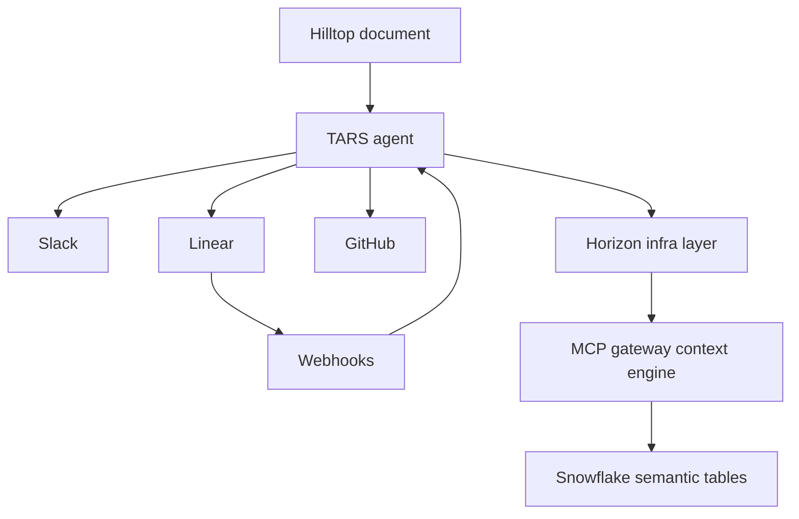
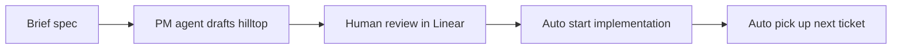
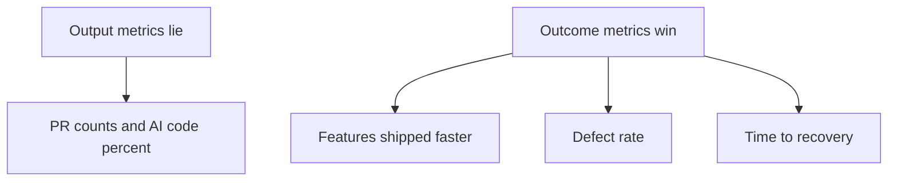

# Talk Notes: "No, That's Not a Software Factory" — Ryan Cooke, WorkOS

**Video:** [No, That's Not a Software Factory — Ryan Cooke, WorkOS](https://www.youtube.com/watch?v=HvboD89DyQ8) · AI Engineer channel · Sep 27, 2026 · 18:59 · Recorded at AI Engineer World's Fair 2026

**Note:** distilled from the full spoken transcript (read via usetranscribe.io); supplementary secondary sources are marked where used.

## Thesis

The standard "software factory" (sandbox + agent + prompt → PR) isn't a real factory, because it optimizes code output instead of product outcomes. WorkOS's factory encodes engineering processes into automation — TARS (agent interaction embedded in Slack/Linear/GitHub, driven by webhooks), Horizon (infrastructure orchestration), and an MCP gateway "context engine" — and measures outcomes (features shipped faster), not PR counts.

## The mental model

## Key points

- **The standard setup doesn't beat the baseline.** Sandbox on Cloudflare + "open code model router" + prompts → PR produced results "pretty indistinguishable" from engineers running Claude Code on laptops — no incremental or exponential outcome gain.
- **Output metrics lie.** "% of PRs," PR counts, AI-generated code in prod "disguise how well these systems are working"; "it's very hard to distinguish whether the output is actually driving outcomes."
- **The dream.** The factory "gives each of our engineers a small engineering team for themselves" → build more, ship more, complex features faster.
- **Two systems.** TARS (how users interact with the coding agent; embedded in Slack, Linear, GitHub; subscribes to webhooks to track project progress) and Horizon (infrastructure orchestration layer, "similar to Inspects and Minions," sitting in front of an MCP gateway).
- **Webhooks turn code work into product work.** Linear ticket dependencies → TARS auto-picks up the next ticket on completion; between tickets it asks "can you reevaluate the Linear project... if it's missing new tickets?" to keep the plan fresh.
- **The "hilltop" document.** WorkOS's PRD ritual in its product-engineering culture (no PMs on teams): purpose, customer evidence, competitive analysis, early design screens, milestones. Canonicalized so an agent can break it into units of work; once the hilltop is reviewed/approved via Linear, TARS starts implementation automatically — no human shepherding.
- **A dedicated PM agent** drafts the hilltop from a brief spec, adds context, reads human reviews, breaks work into tickets; humans stay in the loop (commenting/refining AI-generated tickets).
- **Demo.** Kicked off a new "Vaults" API project from Slack with a few sentences; TARS created the Linear project, Notion draft, decision logs, open questions. Solves the "blank-page problem" — agents sometimes "grossly overestimate" scope, but cutting scope is easier than setup; more teams now do brief/hilltop work because the agent seeds it.
- **Agent-agnostic.** Works with Devin, Claude Code, or local Opus harnesses — all pointed at the same tickets/docs via MCP; security team collaborates in project channels.
- **MCP gateway ("context engine").** Connects internal systems (Snowflake data lake with semantic tables on product utilization/customer conversations); builds system prompts and tool-use guidance (which tables exist, what they contain, how Linear is organized in Snowflake). Unexpected leverage: opened for direct Slack queries (data/customer analysis) — internal teams now build other tools on it.
- **Also automated:** Slack bug reports (triage + fix PRs via webhooks) and support triage in shared customer Slack channels (reads code to locate the customer's problem).
- **Self-improvement.** Using TARS to build their own sandbox infrastructure (off "sandboxes as a service") for deep control of session info and workload placement; next is a company-wide evergreen memory layer (who works on what, team/product ownership, org semantics) pluggable into the factory and other AI tools.
- **Success metrics.** Outcome metrics (shipping, customer impact, defect rate, time-to-recovery) + anecdotal (engineers choosing TARS, electing to move from local harness to cloud sandbox). Owning the infrastructure lets them observe sessions to find where to build skills and which skills are obsolete — "we use this information to self-improve the factory."
- **Honest open gap.** Authorization for agents — "we haven't figured it out yet"; he invited the audience to share ideas at the WorkOS booth.

## Notable quotes & data

- "Percentage of PRs or number of PRs may be lying... It's very hard to distinguish whether the output is actually driving outcomes."
- "The dream of the software factory is that it gives each of our engineers a small engineering team for themselves."
- "Sandboxes are great. It's cool to run an agent and have it open a PR. We really think about our software engineering practices and processes and we want to encode those in automation."

## Tokenomics / efficiency angle

- **Defect rate and time-to-recovery as guardrail metrics** so factory output doesn't buy speed with instability — cost of rework is a token/effort line item, not an externality.
- **The MCP gateway as a shared context engine reused across internal tools** — build the context plumbing once, reuse everywhere, instead of per-tool reinvention.
- **Owning the infrastructure enables session observation** to identify skill gaps and obsolete skills — an eval/iteration loop for self-improvement of the factory itself, so the spend on context goes where it demonstrably pays off.

## How to apply it

1. **Canonicalize your PRD ritual**: write the "hilltop" template for your org — purpose, customer evidence, competitive analysis, early design screens, milestones — so an agent can break it into units of work.
2. **Add a PM agent**: draft the hilltop from a brief spec, have humans comment and refine the generated tickets in Linear, then auto-start implementation on approval.
3. **Wire webhooks to the agent**: Linear ticket dependencies auto-trigger the next ticket on completion; between tickets the agent asks whether the plan needs fresh tickets.
4. **Build one context engine**: stand up an MCP gateway over your internal systems (data lake, ticket system, docs) that builds system prompts and tool guidance — one shared context layer every tool reuses instead of per-tool reinvention.
5. **Switch the dashboards**: replace PR counts and AI-code percentages with outcome metrics — shipping speed, customer impact, defect rate, time-to-recovery.
6. **Observe sessions to self-improve**: log where agents struggle, build skills for the gaps, retire obsolete ones. Own the loop, not just the output.

## Sources

- Video: https://www.youtube.com/watch?v=HvboD89DyQ8
