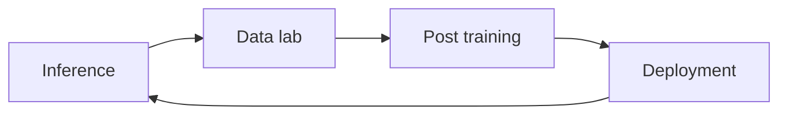
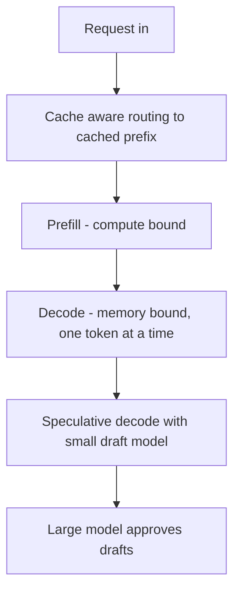
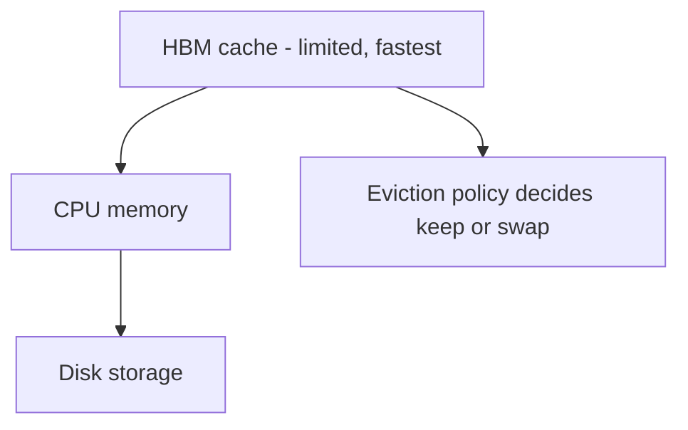

# Talk Notes: "What Makes Open Models Fast in Production" — Sujee Maniyam, Nebius

**Video:** [What Makes Open Models Fast in Production — Sujee Maniyam, Nebius](https://www.youtube.com/watch?v=TRe1u7dHYiA) · AI Engineer channel · Oct 3, 2026 · 20:31 · Recorded at AI Engineer World's Fair 2026

## Thesis

Open models are now competitive with proprietary models on quality, and Nebius makes them fast and cost-efficient in production via a full-stack "Token Factory" — selection, deployment, post-training, and a serving stack with per-model engine selection, cache-aware routing, speculative decoding with custom-trained draft models, KV-cache optimization, and disaggregated prefill/decode.

## The mental model

## Key points

- **Token Factory**: full loop — inference → data lab → post-training → deployment; 60+ models in production.
- **Inference drives quality data**: better than generic open datasets because real production requests are more representative.
- **Selection benchmark**: Artificial Analysis benchmark — open models now competitive with proprietary models.
- **NVFP4 quantization** on latest Nvidia chips (Blackwell Ultra AGXP300, GB300); Nvidia made a $2B investment in Nebius.
- **Serving-engine selection**: not one engine per model — the best serving engine is chosen for each model individually.
- **Cache-aware routing**: LLM inference has three memory layers — HBM cache (limited space), CPU memory, disk storage; an HBM cache hit = fastest response.
- **Draft models for speculative decoding**: small models generate drafts, the large model approves — up to 30% improvement even with generic data, better with custom data trained on production traffic.
- **Request-aware + cache-aware routing** (new for speculative decoding): route to the machine that already has your prefix cached.
- **KV-cache optimization**: reuse prefixes — up to 10x speedup; offload cache out of GPU memory to CPU, with an eviction policy deciding what to keep/swap.
- **Quantization sweet spot**: experiment to find the sweet spot per model — some models are fine at low quantization, others degrade.
- **Disaggregated prefill vs. decode**: prefill is compute-bound (GPUs great at it); decode is memory-bound and sequential, one token at a time — optimize each independently.
- **1 trillion-parameter models**: the stack must handle them — per-layer disaggregation (prefill/decode split per layer), KV caching, parallelism.

## Notable quotes & data

- Custom-trained draft models: "up to 30% improvement" even on generic data; better when trained on production data.
- KV-cache reuse gives "up to 10x" speedup.
- Nvidia's $2B investment in Nebius.

## Tokenomics / efficiency angle

- KV-cache reuse = up to 10x speedup; cache-aware routing maximizes HBM hits.
- Speculative decoding with draft models trained on production data → 30%+ improvement.
- Per-model quantization sweet spots; disaggregated prefill/decode optimizes compute-bound vs. memory-bound phases separately.

## Local-deploy takeaways

- **The prefix-cache idea applies locally**: wherever Matt serves local models (Ollama/vLLM), prefix caching and prompt-prefix reuse across repeated tasks (system prompts, tool schemas, session preambles) cut decode cost — same mechanics, smaller hardware.
- **Per-model quantization discipline**: benchmark quality degradation per model at each quantization level rather than applying one default — directly relevant to picking local model sizes for the enterprise router.

## How to apply it

1. **Inventory your local serving**: list every model you serve (Ollama, vLLM) and pick the best serving engine per model — not one engine for all.
2. **Enable prefix caching**: make system prompts, tool schemas, and session preambles byte-identical across repeated tasks so KV-cache reuse kicks in — up to 10x speedup on the same mechanics locally.
3. **Design prompts cache-first**: put the stable prefix first and the volatile content last so requests land on already-cached prefixes.
4. **Benchmark quantization per model**: find the quality-vs-size sweet spot for each model individually instead of applying one default quantization.
5. **Train draft models on your own traffic**: small draft models for speculative decoding improve up to 30% even on generic data — better on your production requests.
6. **Split prefill and decode thinking**: treat the compute-bound prefill phase and the memory-bound sequential decode phase as separate optimization targets when routing and sizing.
