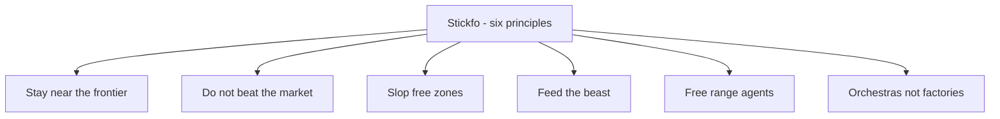
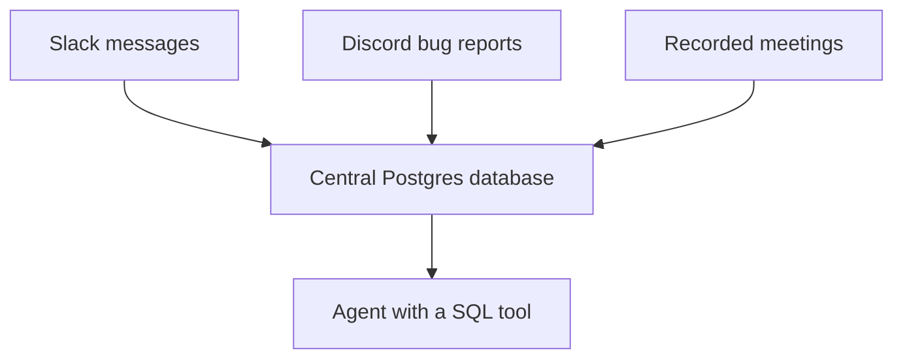
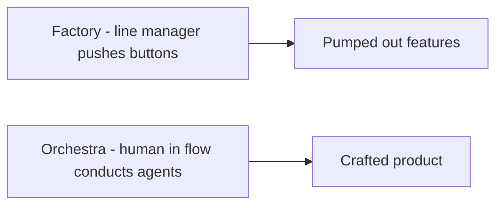

# Talk Notes: "Orchestras, Not Factories: How the Fastest Builders Work" — Charlie Holtz, Conductor

**Video:** [Orchestras, Not Factories: How the Fastest Builders Work — Charlie Holtz, Conductor](https://www.youtube.com/watch?v=TRfzFJCJ7ZE) · AI Engineer channel · Sep 27, 2026 · 17:44 · Recorded at AI Engineer World's Fair 2026

**Note:** distilled from the full spoken transcript (read via usetranscribe.io); supplementary secondary sources are marked where used.

## Thesis

The fastest builders follow six principles (his acronym "Stickfo"): stay near the frontier, don't beat the market, create slop-free zones, feed the beast, free-range agents — and frame the work as conducting an orchestra, not managing a factory: a human in flow, crafting with a team of agents, not a line manager pushing buttons to pump out features.

## The mental model

## Key points

- **Conductor.** A desktop app for managing a team of coding agents in one interface (vs. many terminal windows for Claude Code/Codex). Born as an internal tool: the team were Claude Code power users (from Feb of last year), cloned their repo 5×, discovered worktrees, and "bit by bit" built Conductor. They were previously building a different app called Chorus.
- **1 — Stay near the frontier.** Try new things the day they ship (he cites "ultra code," "/go"). The social-graph trickle-down leaves you 3–6 months behind because everything moves too fast.
- **2 — Don't beat the market.** Heuristic: "why isn't this workflow the default?" Don't over-optimize for Ralph loops — if it works for everyone, wait for Anthropic/OpenAI to build it into the default harness. Efficient-market analogy: only invest where you have "real alpha" — information about your users/codebase the models lack (their chat app must render very long chats fast, so they optimize React queries and sacrifice elsewhere).
- **"Mid-wit memeing."** Spending all your time on workflow instead of actual work. "Don't be the person who has an amazing Emacs setup but doesn't actually get stuff done."
- **3 — Slop-free zones.** Parts of the codebase requiring strict human review — careful in some areas, loose in others. Concretely: the migrations file (CI requires human review of any change); Slack assumed human-written ("slop free"); docs/CLAUDE.md/skills get heavy upfront investment. They had to rewrite their whole app "a couple of times" from neglecting this. CLAUDE.md/AGENTS.md = "whispering in the ear" of a new intern every session — context loaded into the agent each time it starts.
- **4 — Feed the beast.** The Conductor Internal Agent ("the CIA") — a centralized database of everything in the org: every Slack message → Postgres table, Discord bug reports, recorded meetings. "Put everything in a database and give your agent a SQL tool and let it handle the rest."
- **5 — Free-range agents.** Sandboxes that don't die when you close your laptop; agents can spawn more of themselves; agents collaborate with agents and humans. Conductor moved from git worktrees to cloud sandboxes (each workspace has a cloud icon). Real-time collaboration: see teammates' (Caden, Lewis, Tywan, Jackson) workspaces live, review diffs, comment in-workspace ("tabs, not spaces"), teammate replies in real time. "Collaboration is one of the most important new interface changes this year."
- **Demo.** His OpenClaw agent "Lord Crandon" with Conductor API access — from phone/Telegram/Slack he texts "create a workspace that makes all the buttons blue" → workspace created, agent works while he's away.
- **6 — Orchestras, not factories.** "I honestly kind of hate the term." Factory = automation and line managers; "we tried this 10 years ago with 'feature factories' and it just doesn't work." He wants to "feel like Steve Jobs designing the Mac with a team of amazing humans and AI agents," zooming in and out. Builders have a responsibility to make tools great for humans and to "use the words that make us feel excited... capable... in the flow."

## Notable quotes & data

- "I honestly kind of hate the term [software factory]."
- "Don't be the person who has an amazing Emacs setup but doesn't actually get stuff done."
- "I want my software to feel human and crafted. I want to feel like a human at the center of it all."

## Tokenomics / efficiency angle

- **"Don't beat the market" is a capital-efficiency rule:** don't spend engineering time optimizing workflows vendors will commoditize — invest only where you hold proprietary "alpha." Same logic applies to token spend: don't build bespoke routing/context machinery for commodity tasks.
- **Slop-free zones = targeted allocation of expensive human review attention.** Strict where it matters, loose elsewhere — review effort is a scarce resource to budget like tokens.
- **Feed the beast.** One centralized context store plus a SQL tool is cheap, reusable context retrieval for all agents — a single shared memory surface instead of per-agent re-gathering.

## How to apply it

1. **Declare your slop-free zones**: name the files and surfaces that always get strict human review (migrations, customer-facing copy, CLAUDE.md and skills) — invest heavily there, stay loose elsewhere.
2. **Feed the beast**: stand up one central database of org knowledge (chat history, bug reports, meeting notes) and give every agent a SQL tool — one shared memory surface instead of per-agent re-gathering.
3. **Apply the market test**: before building any workflow optimization, ask "why isn't this the default?" — only invest engineering time where you hold proprietary alpha about your users and codebase.
4. **Stay near the frontier**: try new models and features the day they ship; the social-graph trickle-down leaves you months behind.
5. **Make agents free-range**: use sandboxes that survive laptop closes, let agents spawn subagents, and make workspaces visible for real-time human review and comments.
6. **Treat CLAUDE.md as onboarding**: rewrite it as what you'd whisper in a new intern's ear every session — it's the highest-leverage context you load.

## Sources

- Video: https://www.youtube.com/watch?v=TRfzFJCJ7ZE
