# Talk Notes: "Beyond RAG: A Relational Context Engine That Cuts Token Burn" — Peter Werry, Unblocked

**Video:** [Beyond RAG: A Relational Context Engine That Cuts Token Burn — Unblocked](https://youtu.be/ORVh4GivEU0) · AI Engineer channel · Oct 10, 2026 · 19:44 · Recorded at AI Engineer World's Fair 2026, Expo Stage, San Francisco (July 2, 2026)

**Note:** distilled from the full spoken transcript of the talk (YouTube auto-captions pulled via the timedtext API and cleaned); screenshots are frames captured from the talk video. Speaker/company research below is from public sources, marked where used.

## The speaker

**Peter Werry** — Software Engineer (founding engineer) at Unblocked since January 2022. Previously Engineering Manager and Software Development Engineer at Apple (2018–2022), Software Engineer at buddybuild (acquired by Apple), and CTO at Yakatak. UBC Computer Science, based in Vancouver. This is his second major talk on the subject — his earlier "Mergeable by default: Building the context engine to save time and tokens" (AI Engineer, May 2026, [video](https://www.youtube.com/watch?v=5ID22ACI7IM), [transcript](https://github.com/stewdotorg/ai-swe/blob/HEAD/reading/transcripts/ai-engineer-mergeable-by-default-building-the-context-engine-to-save-time-and-tokens-peter-werry-unblocked.md)) is the 101-minute workshop version; this 20-minute talk is the distilled, live-build edition.

**Unblocked (the company):** getunblocked.com — Vancouver, founded 2021, 11–50 people. CEO Dennis Pilarinos (ex-Microsoft director on Azure, ex-Amazon/AWS; founded Buddybuild, acquired by Apple 2018, then built Xcode Cloud). Raised $20M (May 2025, TechCrunch). The product: conversational AI over a team's code, docs, and discussions (GitHub, Slack, Confluence, Linear, Jira) — answers about the codebase with the tribal knowledge attached; a Slack virtual team member; an MCP server that brings team knowledge into Cursor/Claude Code/Copilot; a PR failure agent that diagnoses CI failures. Permission-aware answers; customer data never trains shared models.

## Thesis

RAG solved the *content* half of retrieval — find the code, the PR, the Slack thread. It doesn't solve the *structural* half — "PRs I merged last week," "who reviewed payments the most," "open PRs with no reviews." A **context engine** is the layer that does both: it ingests scattered institutional knowledge (code, PRs, docs, conversations, incidents), resolves conflicts between sources, and hands the agent **grounded context** — interrelated, intent-specific, personalized, permission-aware — before the agent starts guessing. The payoff, measured: **~50% lower cost** on a real optimization task, and **-33% token cost with +7 quality** in their open-source simulator's A/B test.

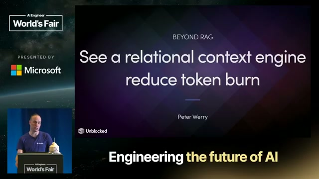

## The talk, in order

**1. You were the context layer.** "Before AI agents, you were the context layer." A new employee rips around code and docs, absorbs tribal knowledge and incident battle scars over years. An agent starts every session with none of it — so it burns expensive tool calls re-discovering what the org already knows.

**2. Scattered in, grounded out.** The problem slide every enterprise will recognize:

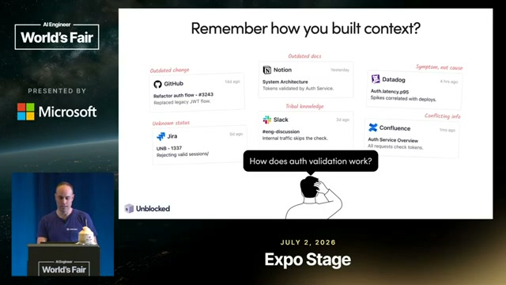

Outdated GitHub changes, outdated Notion docs, Datadog showing symptoms not causes, Jira tickets of unknown status, Slack tribal knowledge, Confluence contradicting everything. The context engine takes this scattered mess and produces grounded context — interrelated, intent-specific, personalized, permission-aware.

**3. How the context engine works.** Sources (Code + PRs, Planning Tools, Docs, Conversations, Incident Management) flow into the engine; workflows (Coding Agents, Code Review, Messaging Apps, MCP, CLI, API) consume from it. Six properties: **unified system context** (merge signals from all sources before delivery), **conflict resolution** (reconcile contradictory signals automatically), **token optimization** (exact, minimal context — no waste in the prompt window), **targeted retrieval** (deliver only information the agent needs), **personalized relevance** (tailored to the asker and their work history), **permission enforcement** (access policies applied automatically across systems).

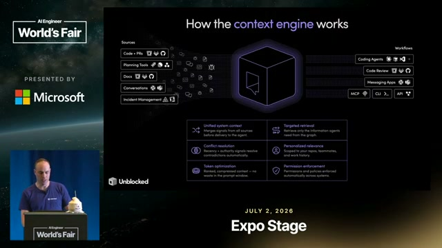

**4. Demo: Claude without vs. with.** Werry asked Claude to plan optimizing a "source map engine" component. Without the engine: Claude rips around the codebase like a new employee and "confidently projects that it's figured it out." With the Unblocked context engine attached: one call returns a tight, task-specific context bundle — source code, Notion architecture docs, PRs, the Slack conversations about optimizing that exact component — with links as jump-off points. **The numbers: $1.29 and ~1.5 minutes with the engine vs up to $2.60 and ~3 minutes without — roughly a 50% cost reduction.**

**5. Demo: the regression that found itself.** His colleague Richie noticed their code-review product was surfacing fewer issues. Asked Unblocked → it narrowed to the likely cause within minutes: they'd switched from Opus 4.6 to Opus 4.8 and the new model's behavior characteristics changed. Then: "fix it" → Unblocked opened a PR behind the scenes whose description **understood the original regressing PR and cited the exact Slack conversation** where the team had discussed it. "Which is just nuts."

**6. The two halves of retrieval.**

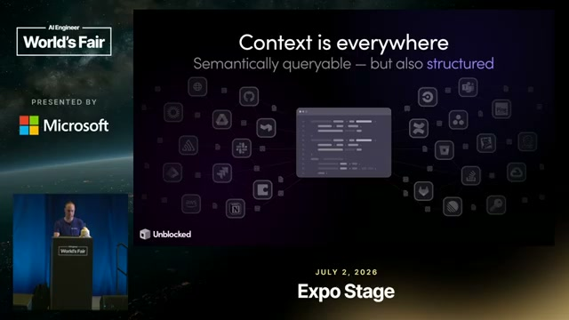

RAG nails content questions (find the code, the PR that changed it, the Slack thread debating it — wrap it in an agent loop and it goes far). It fails structural questions: PRs merged last week, who reviewed payments most, open PRs. Those aren't semantic searches — they're *queries*. Richie's regression hunt started as a query ("chart of ratio weekly since January 1st") — temporal, unanswerable from a vector store.

**7. Generating queries is the easy part.** The hard part is the scaffolding around query generation:

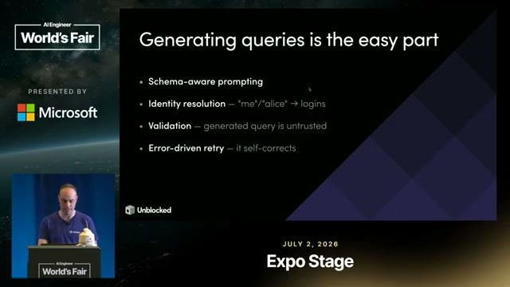

Schema-aware prompting (so the LLM emits a tightly-bound query), identity resolution ("me"/"alice" → logins), validation (the generated query is *untrusted*), error-driven retry (it self-corrects).

**8. Live build: the Document Query Engine.** Werry then builds the structured half live, against an open-source repo, in five steps (visible as git branches in his terminal: step-1-schema through step-5-retry):

- **Step 1 — Discovery: inferring enums.** Dynamic schema discovery by sampling documents in the store. The tricky bit: enum values were never declared — inferred from the docs ("renderNode() shows a|b, not string, only when the data looks enum-like"). His punchline: "don't always fall back to an LLM... this is actually quite deterministic."
- **Step 2 — Resolution: the match.** `resolveName(q)` scans a directory built at ingestion: exact login → nameContains → nameWordPrefix → loginFuzzy. Returns all matches — one person's alias set. "Deterministic string rules — an LLM tiebreaker = sledgehammer." Demo: "peter" → pwerry.
- **Step 3 — Synthesis.** Give the model the schema and **one tool**, and force it to emit a QueryPlan (`tool_choice: {type: "tool", name: "execute_mongo_query"}`). The synthesis model: **claude-haiku-4-5** — a cheap model for a bounded step.
- **Step 4 — Validation: the checks.** "The most important thing." An allowlist gauntlet runs *before MongoDB ever sees the plan*: stage in ALLOWED_STAGES, every $op in ALLOWED_OPERATORS, reject $where/$regex, fields must exist in the discovered schema, never _id or metadata. Tenant IDs get injected behind the scenes — the LLM never touches them. Returns structured `errors[]`, not a throw — which feeds step 5.
- **Step 5 — Retry.** Loop the error back into the LLM with a max retry count. Demo arc: regex query bounced by validation → retry constrained to $match (exact title, no hits) → add full-text search → works.

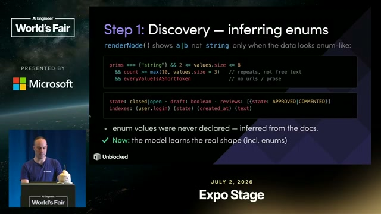

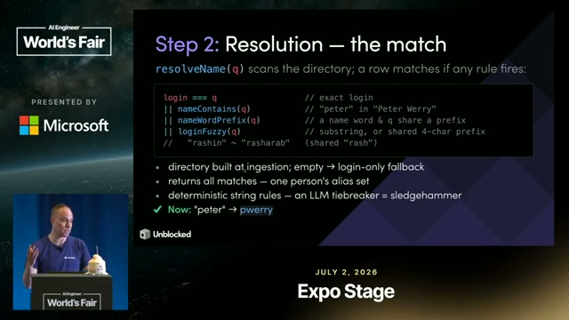

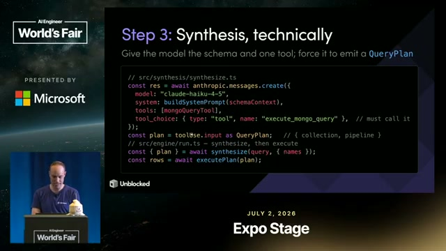

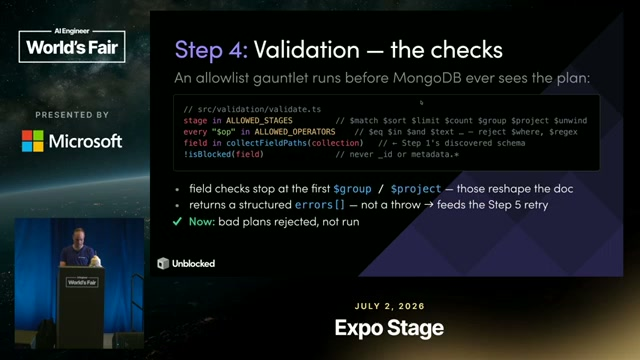

**9. What we built + the chat agent.** The engine handles "the other half of RAG": structural data, filters, aggregations, time-scoped, self-correcting. It also powers a chat agent that shows its work — every generated query visible before it reasons over the results.

**10. The Context Engine Simulator.** Don't want to wire up Unblocked yet? Their open-source simulator builds a per-task context bundle locally and A/B tests the same task with and without it:

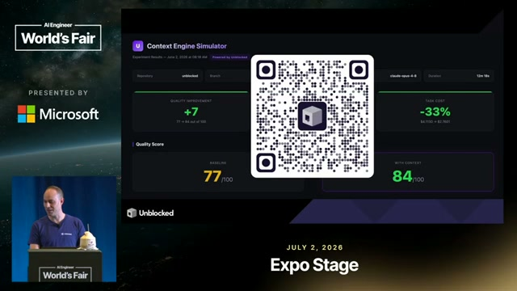

**Quality 77 → 84 (+7). Token cost -33%.** The headline number of the talk.

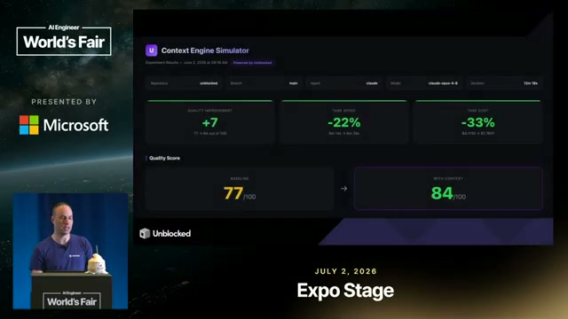

## Notable quotes & data

- "Before AI agents, you were the context layer."
- "Scattered context in, grounded context out."
- "Generating queries is the easy part. The hard part is the scaffolding that sits around it."
- "Don't always fall back to an LLM to do this kind of what looks like non-deterministic work. This is actually quite deterministic."
- "Deterministic string rules — an LLM tiebreaker = sledgehammer."
- On validation: "This is actually the most important thing."
- "RAG nails the content part... but it doesn't handle structural questions."
- The cost demo: **$1.29 / 1.5 min with the engine vs up to $2.60 / 3 min without (~50% reduction)** — Claude planning a real component optimization.
- The simulator A/B: **quality 77→84 (+7), token cost -33%.**
- Separately (BigGo Finance, Aug 2026, from his AI Engineer podcast appearance — not this talk): customer data showing ~50% fewer tokens and ~50% faster triage; the "satisfaction of search" concept — agents stop at the first plausible answer without realizing a Slack thread holds the actual rationale.
- Unblocked: founded 2021, Vancouver, 11–50 people, $20M raised May 2025; CEO Dennis Pilarinos (ex-Microsoft/Azure director, ex-AWS; Buddybuild → Apple).

## Deep dive: the pattern — deterministic scaffolding, LLM only for judgment

The talk's architecture is the same pattern this playbook keeps finding, now applied to the context layer:

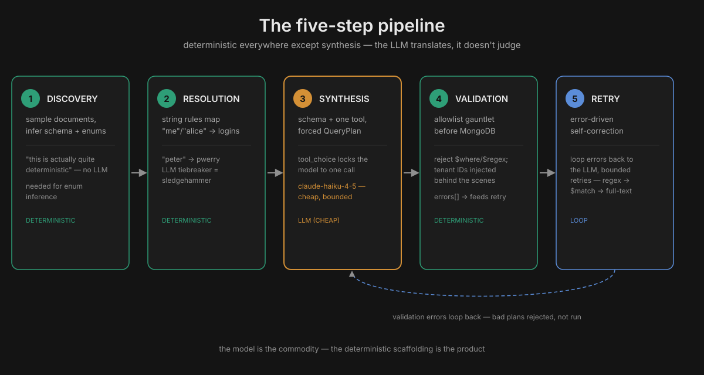

1. **Discovery** (deterministic) — schema inferred by sampling; enums from data shape, not declared. Procedural code beats an LLM here.
2. **Resolution** (deterministic) — string rules map "me"/"alice"/"peter" to logins; the LLM is demoted to tiebreaker.
3. **Synthesis** (LLM — and a *cheap* one) — Haiku 4.5 gets the schema + one tool + `tool_choice` forcing a QueryPlan. The model's job is narrowed to translation, not judgment.
4. **Validation** (deterministic) — allowlist gauntlet: stages, operators, fields, tenant isolation. "Bad plans rejected, not run." The LLM never touches tenant IDs.
5. **Retry** (loop) — structured errors feed back; bounded retries; self-correction without human intervention.

This is Stripe's Blueprints (deterministic × agentic nodes) and the Jev thesis (cheap judge, frontier only where needed) wearing a context-engine costume. The through-line of the whole playbook: **the model is the commodity; the deterministic scaffolding around it is the product.** Werry's version adds the two insights that make it a *context* engine rather than a harness: **conflict resolution** (sources disagree — the engine reconciles intent, prior attempts, rejected approaches before planning) and **permission enforcement** (the query the LLM sees is already tenant-scoped; access policy is structural, not prompted).

The enterprise read: "you were the context layer" means institutional knowledge is the moat. The companies in the Pi dossier encode *how they ship* into skills; Unblocked encodes *what the org knows* into a queryable layer. Both attack the same token burn — the agent re-discovering what the organization already knew — from opposite sides.

## Tokenomics angle

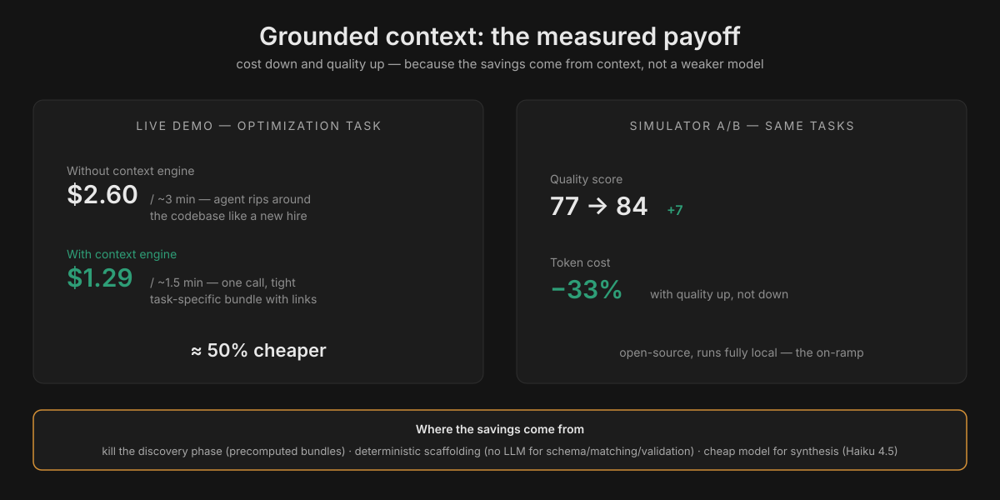

- **-33% tokens, +7 quality** is the rarest kind of number in this playbook: cost down *and* quality up, measured A/B on the same tasks. It beats the usual trade (cheaper model, worse answers) because the savings come from *not sending garbage context*, not from a weaker model.
- **The $1.29 vs $2.60 demo** decomposes the saving: without grounded context, the agent burns tokens on discovery (ripping around the codebase like a new employee). Discovery is the most expensive phase of an agent run and the most replaceable — a precomputed context bundle kills it.
- **Haiku 4.5 for synthesis** is the routing ladder in action: the bounded translation step runs on a cheap model; nothing in the pipeline needs frontier reasoning. The expensive model is never in the loop at all.
- **Conflict resolution as cost control.** Wrong context doesn't just waste the tokens that fetched it — it wastes every downstream token reasoning from it, plus the review cycle when the output is subtly wrong ("without the right context, that code costs you twice: once in tokens, again in long review cycles" — his May workshop). Reconciling sources *before* the agent plans is cheaper than rework after.
- **Local-deploy note:** the simulator is the on-ramp — fully local, per-task A/B, no vendor wiring. It produces the number (your -33%?) that justifies the bigger integration. And the whole pipeline is a candidate for the Jev-shaped audit: everywhere the system "decides" from a closed set (enum inference, name matching, allowlist checks), it's already deterministic — the remaining question is which *generation* steps could be Jev-routed.

## Links & resources

- Talk: [youtube.com/watch?v=ORVh4GivEU0](https://youtu.be/ORVh4GivEU0)
- Unblocked: [getunblocked.com](https://getunblocked.com)
- Werry's long-form version: ["Mergeable by default: Building the context engine to save time and tokens"](https://www.youtube.com/watch?v=5ID22ACI7IM) (101-min workshop, May 2026) · [transcript](https://github.com/stewdotorg/ai-swe/blob/HEAD/reading/transcripts/ai-engineer-mergeable-by-default-building-the-context-engine-to-save-time-and-tokens-peter-werry-unblocked.md)
- [BigGo Finance: "the bottleneck isn't the model — it's the memory"](https://finance.biggo.com/news/e2eebe927465860f) (Aug 2026 — the ~50% figures, "satisfaction of search")
- [$20M raise](https://techcrunch.com/2025/05/06/unblocked-raises-20-million-for-its-ai-assistant-to-help-devs-understand-legacy-codebases/) (TechCrunch, May 2025) · [LeadDev profile](https://leaddev.com/community/peter-werry)
- [AI Engineer Europe recap of the May workshop](https://github.com/larserikfinholt/ai-engineer-europe-2026-recap/blob/HEAD/sessions/mergeable-by-default-building-the-context-engine-to-save-time-and-tokens.md) — conflict resolution as the key mechanism
- In this playbook: [Pi harness dossier](../deep-dives/pi-harness.md) (the harness side) · [Cloud agent anatomy](../deep-dives/cloud-agent-anatomy.md) (the runtime side) · [Jev section](../02-jev-context-economics/) (the decision-model pattern)
