# Talk Notes: "From Your Laptop to the Pipeline: Scaling Custom Agents with GitHub Copilot" — José Palafox, GitHub

**Video:** [From Your Laptop to the Pipeline: Scaling Custom Agents with GitHub Copilot](https://youtu.be/b9UhZkKjX_A) · AI Engineer channel · Oct 10, 2026 · 19:39 · Recorded at AI Engineer World's Fair 2026, San Francisco

**Note:** distilled from the full spoken transcript of the talk (auto-captions cleaned and verified against the video); screenshots are frames captured from the talk video. Speaker/company research below is from public sources, marked where used.

## The speaker

**José Palafox** — Field Copilot Specialist at GitHub. Six and a half years at GitHub: joined right after the Microsoft acquisition, then spent five to six years on the security side after GitHub acquired Semmle (the CodeQL company); focused on AI for the last year. His current job is customer-facing: how companies implement GitHub's technologies and scale them inside their organizations. Remote, San Francisco. GitHub: [github.com/josepalafox](https://github.com/josepalafox) (public repos are mostly security-testing snapshots — OWASP Benchmarks, CVE benchmark tooling — consistent with the security background). Also speaking at WeAreDevelopers World Congress 2026 on "Agentic Code Validation and Repository Automation with Agentic Workflows." Talk description positions him as the person enterprises call when the question is "we have Copilot, now how do we scale it."

**GitHub (the company):** the talk is a field guide to GitHub's agent platform as of late 2026 — Copilot CLI with built-in and custom agents, the agent marketplace, Orchestrate for cross-repo work, and GitHub Agentic Workflows (gh-aw, [github.github.com/gh-aw](https://github.github.com/gh-aw/)): "intelligent automation for GitHub, with your own agents" — Copilot, Claude, Codex or Gemini running in GitHub Actions as a third pillar beside CI/CD ("Continuous AI"), with six security layers and per-run cost caps.

## Thesis

Most teams build an agent once, on one laptop, and never share it. Palafox's ladder takes a custom agent **from local → shared across the org → unattended in the CI pipeline**, and the move into the pipeline is what makes agents observable, governable, and cost-optimizable: once the workload leaves the laptop, every run is instrumented, budgeted, and reviewable — including agents whose job is to investigate other agents' cost overruns.

## The mental model

Three levels of agent usage, each one a superset of the previous:

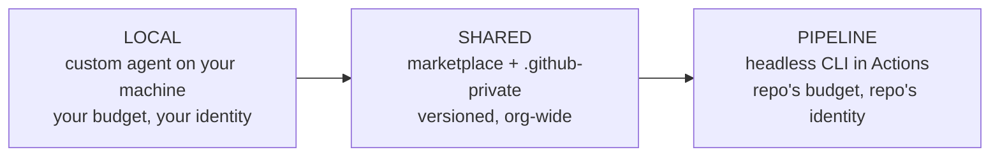

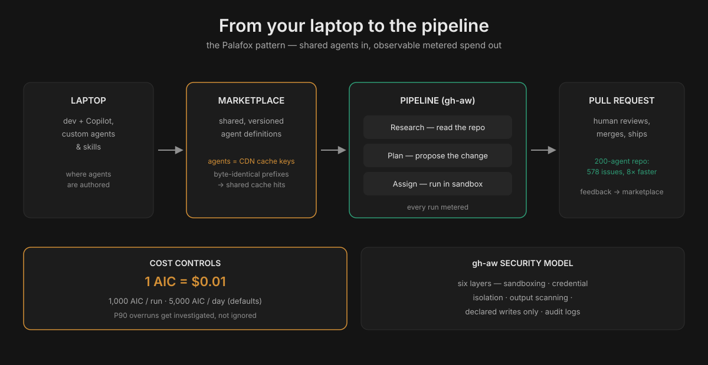

## Every step, in order

### 1. Two modes of agents (0:00–1:32)

Palafox frames everything around two modes: **autonomous agents that work in a pipeline** and **local agents** used to perform tasks. The talk covers how to build them, how to think about them, how to scale them, and what workflows become possible. His background slide: 6.5 years at GitHub, security (Semmle) for most of it, AI for the last year, now helping customers scale Copilot inside their orgs.

### 2. How Copilot works under the hood (1:32–3:32)

Many users don't know the interfaces or the architecture, so he starts with the data flow. **Interfaces (the "doors"):** the IDE, the GitHub CLI (a lightweight desktop interface), the SDK (build agents that work in Slack or Teams, serving team members who may not even have a GitHub license). Any CLI session can be **broadcast** — close the laptop and either delegate the agent to github.com to run in the background or use the `/remote` slash command to control it from a mobile device. **No matter which door you enter, you land in the same blue box:** "Cappy," the Copilot API service — also called the **harness**. It does the heavy engineering: takes input, breaks it into pieces, sends it to model providers, dedupes, handles authentication, metrics logging, auditing. The response comes back, gets filtered, and is displayed to you.

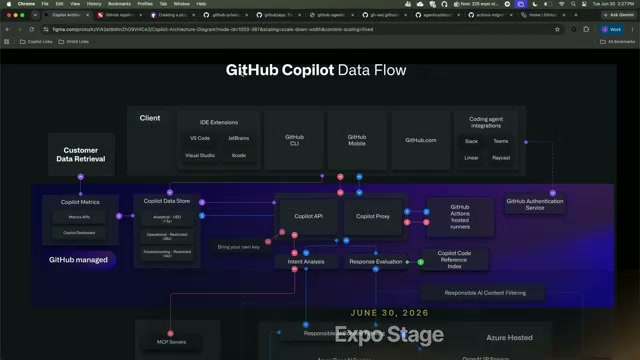

*The "GitHub Copilot Data Flow" slide: every interface funnels into the Copilot API harness; GitHub-managed components (metrics, data store) and Azure hosting sit underneath, with Responsible AI content filtering on the way out.*

### 3. Built-in agents in the CLI (3:32–5:32)

Type `/agents` in the Copilot CLI to see the standard agents — useful as a reference implementation, because "whether it's an agent or a skill, ultimately it all comes down to markdown." Two he calls out: a **specialized research agent** that explores a codebase on a small Haiku-class model (you don't need the largest model to explore), and **Rubber Duck**, which takes a plan written by one model (e.g. Opus) and has a different model (e.g. GPT, with different training data and weights) check it. In every agent the **model is specified** — when you build your own, you always control the model and the instructions.

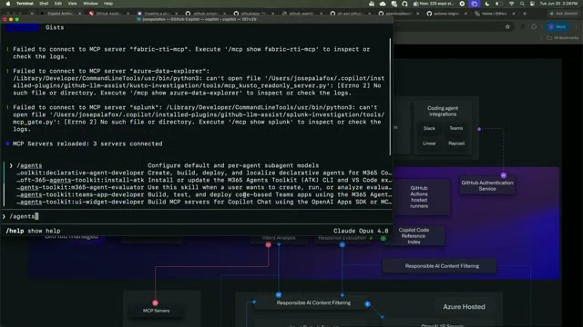

*The `/agents` listing in the Copilot CLI — each built-in agent is just YAML + markdown you can inspect and copy.*

The CLI also exposes **subagent configuration**: usage-based billing, subagent concurrency and depth limits, and a table mapping each subagent (task, explore, general-purpose, researcher, reviewer, security-review) to its origin and model.

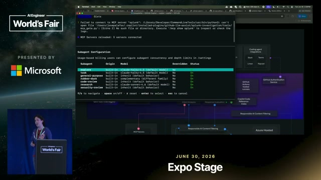

### 4. Building a custom agent (5:32–7:37)

If the built-ins don't fit — a specific audit, compliance or regulatory requirements, a particular tool to run — write your own with the **`agent` command**, which walks you through a builder workflow. First choice: **scope** — project level (this Git project) or user level (available independent of project; org or individual). Then describe what you want in one line; the builder generates the whole structure: description, input formatting, success criteria, methodology. His live example: an agent that reads the GitHub changelog and summarizes the latest Copilot changes. Everything is editable afterward — reorder sources, change the methodology, nothing complicated. The point: the builder does the structural work so a recurring task becomes a callable agent. The same builder exists in the IDE.

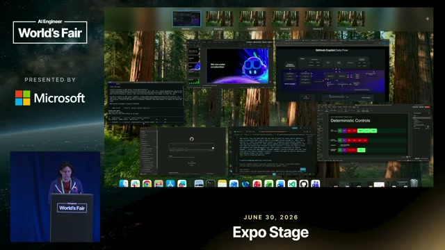

### 5. Sharing agents with a marketplace (7:37–10:52)

"How do other people use it?" The easiest path: a **marketplace** — just a repository with a little extra JSON in a directory declaring "this is a marketplace." That buys package management inside the repo: subscribe once, **update all agents at once**, manage versions, and push **security vulnerability notifications** to downstream users. This is usually the first thing he builds with companies, because most orgs have no central place where teams add agents or skills. Deployment options: sync to local clients, a directory in your org, or a separate repo — at GitHub the convention is a repo named `.github-private` at the organization level, whose agent files can be made available org-wide. In his demo, three agents live there, including a **cloud agent** callable from any surface (IDE or CLI) — the same bot object as in the repo, distributed to every user's environment. **The cost argument:** the cheapest way to use these products is cache hits — exact matches between queries on shared data. Reusable, standardized agents raise your cache-hit rate; everyone solving problems the same way instead of reinventing the wheel cuts the bill. Marketplaces can span orgs or go external; GitHub's `awesome-copilot` repo (example agents and tools) can itself be registered as a marketplace.

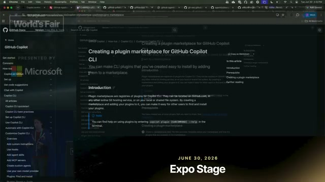

### 6. Agents across repositories — Orchestrate (10:52–12:41)

The hard limit of shared agents: a compliance agent **runs in the repository where it is hosted**, with that repo's permissions — it can't act in other repos. **`orchestrate`** is the horizontal-scaling answer: point it at a set of GitHub Issues as targets, and it launches **sub-agents that run inside the repositories they're supposed to work in**, with the right permissions there. His example: an API change in one microservice that requires commits elsewhere — Orchestrate fans out agents that commit to different repos simultaneously. You can call ready-made agents (from marketplaces or your admin) and drive them all through the Orchestrate tool.

### 7. Agentic Workflows: agents in CI (12:41–14:56)

The third level: stop running the agent on your behalf and run it **on the repository's budget, under the repository's identity** — maintenance work belongs to the project, not to you. The mechanism is simple: **Copilot CLI in headless mode** (`-p` flag — one query, no interaction) **inside a GitHub Actions runner**. Trigger on repo events: update docs on release, refresh context files weekly, and so on. His motivating example: agent-written code accretes **"spaghetti code" and duplicates** — agents are lazy about namespaces and keep creating near-duplicates — so schedule an agent to review the codebase, find dedup opportunities, and file tasks. The framework builds in **human-in-the-loop triggers**: the first agent runs on a cron schedule, finds (say) three improvement opportunities, and a developer moves a task to the next stage with a **slash command in an issue comment** — "that's when you decide to spend money on the next stage." His example chain: cron researcher → developer approves via slash command → PM agent writes the PRD → implementation agent → developer acceptance review.

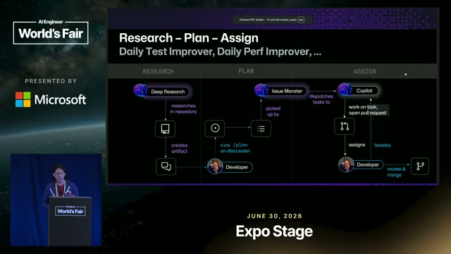

*The pipeline pattern, as a slide: RESEARCH → PLAN → ASSIGN, with the developer gating each stage. Example agents: "Daily Test Improver, Daily Perf Improver, …"*

The same deck shows the feedback-loop variant:

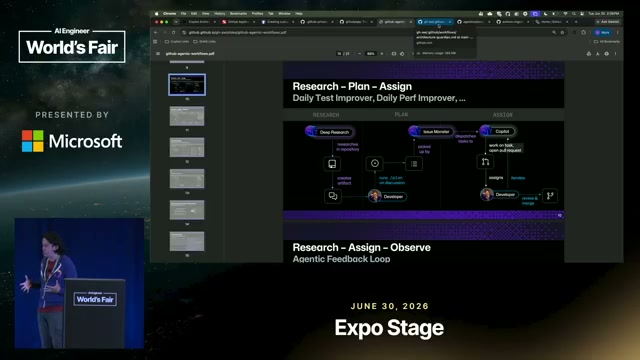

### 8. Why pipeline agents scale (14:56–18:16)

Local agents die with your laptop — close it, lose network, lose the workflow. Pipeline agents run on the platform, independent of you. The maximalist proof: **the GitHub AW project itself (the gh-aw framework) is built entirely by agents** — on the order of **200 agents** doing different parts of the pipeline, all following the Research–Plan–Assign shape, and the team's internal goal is to develop **only on mobile devices**, interacting with the project entirely through slash commands.

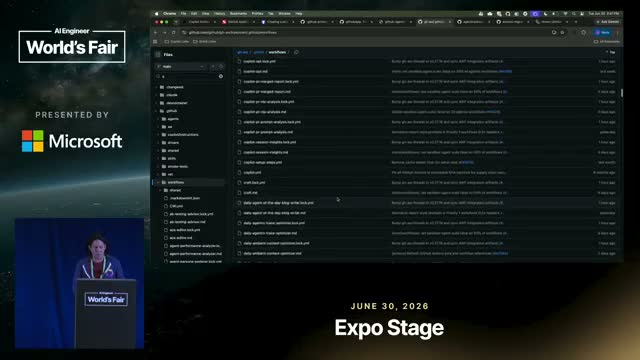

*Inside the ~200-agent repo: every pipeline job is an agentic workflow file.*

He picks one at random: a **meta-agent that checks other agents' daily reports** — runs on a daily schedule from its own `agent.md`, emits a markdown report or an input for another agent. And GitHub Next's **Agentics** project packages ~30 ready-made pipeline agents to drop into your own repos: code deduplication, reviewers (QA reviewer, even a "joker" reviewer), and more.

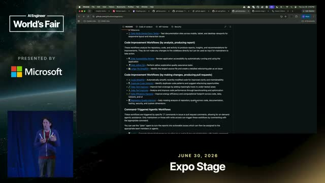

### 9. Agents that watch their own cost (18:16–18:56)

The payoff of moving work off laptops is **observability**: every pipeline agent is Otel-instrumented, so you can see in your SIEM/logging platform how the dedup agent performs across repos, what it costs, average token usage. Then you close the loop: **"every time an agent exceeds its P90 on expected work cost, investigate why"** — an agent that tells you what debugging info to use for the next evaluation round. Failing tool calls get A/B-tested across inputs and models so you can later pick a cheaper model. None of this is visible while agents run on laptops; all of it becomes possible in the pipeline. This is also why gh-aw's cost controls matter: per-run caps (`max-ai-credits`, default 1,000 AI Credits per run), daily caps (5,000/day), `gh aw logs` / `gh aw audit` for per-run tokens and turns (1 AI Credit = $0.01).

## Notable quotes & data

- "Most teams build an agent once, on one laptop, and never share it."
- "Whether it's an agent or a skill, ultimately it all comes down to markdown."
- "The cheapest way to use them is to get cache hits" — exact matches between queries on shared data; standardization cuts the bill.
- "Agents are lazy about implementing features and very lazy about namespaces" — hence the dedup-agent pattern.
- ~200 agents in the gh-aw repo; the team aims to develop on mobile devices only, via slash commands.
- ~30 ready-made pipeline agents in GitHub Next's Agentics project.
- gh-aw's Repo Assist: running in 13 open-source repos, closed 578 issues, median 8× faster close time (from the gh-aw site, Oct 2026).
- Jose Palafox: 6.5 years at GitHub; [github.com/josepalafox](https://github.com/josepalafox).

## Deep dive: shared cache hits — the mechanism

Palafox's cheapest-token line ("the cheapest way to use them is to get cache hits — exact matches between queries on shared data") is the talk's most actionable cost claim. Here's how it actually works, assembled from GitHub's own engineering writing (the [Copilot runtime Rust port post](https://github.blog/ai-and-ml/generative-ai/migrating-the-github-copilot-runtime-to-rust-using-copilot/), Sep 2026):

**The physics.** LLM providers cache the key-value tensors computed for a prompt prefix. When a new request arrives with an identical prefix, the provider reuses the cached tensors instead of recomputing them — typically billed at a ~90% discount (the post's example: $2.00 vs $0.20 per 1M input tokens). The cache key is the exact token prefix; anything that changes the prefix — reordered tools, edited system prompt, dynamic content shuffled before stable content — breaks the hit.

**Copilot's design.** "GitHub Copilot shapes the agent loop specifically to preserve a long and stable prefix (the system prompt, then the tool definitions, then the accumulated conversation), so each turn appends to context the model has already processed." The expensive part of the context is paid once, then re-read at an order of magnitude less on every subsequent call. Their measured result on the Rust port: **96.22% prompt-cache hit rate** (cache reads ÷ all input-side token volume; writes 3.07%, fresh input 0.71%). The post is explicit that this is why long autonomous sessions are economical at all — a 300-hour port re-reading its full context from scratch on every call would cost "a different order of magnitude."

**Why *shared* agents raise the hit rate.** Within one session, the stable prefix explains the 96%. Across users, the sharing comes from standardization: when 200 engineers invoke the *same* marketplace agent, the harness constructs byte-identical prefixes (same system prompt + same tool definitions + same agent instructions) for every one of them. At Copilot's request volume, the system prompt's KV cache is effectively always warm — infrastructure-level prefix sharing in the inference engine (vLLM/TensorRT-LLM class), not just a 5-minute API TTL — so identical prefixes from *different users* hit the same cached blocks. That's the "exact matches between queries on shared data": one changelog-summarizer agent used org-wide caches; 200 hand-rolled prompts don't.

**The enterprise lever.** Standardize the agents (marketplace, pinned versions) and you standardize the prefixes; standardize the prefixes and the cache-hit rate becomes an org-level property you can measure and raise. Conversely, every "helpful" customization — per-team system prompt tweaks, reordered tool lists — is a cache fragmentation event. Treat agent definitions like you'd treat a CDN cache key: stable, versioned, shared.

**What breaks it (harness rules worth stealing):** keep system prompt and instruction blocks byte-identical across turns; put stable context (instructions, project summary) before dynamic context (file contents, user query); never reorder tool definitions between calls. These are the same rules that keep any agent's cache hot — Copilot just enforces them in the runtime so every product (CLI, VS Code, coding agent, code review) inherits them.

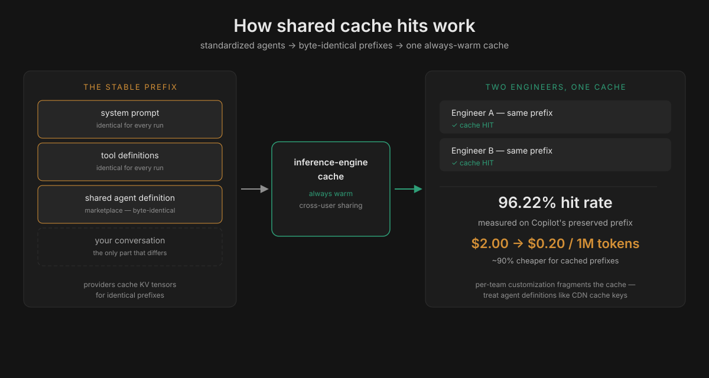

## Deeper: marketplace mechanics

The "little extra JSON" Palafox mentions makes a repo a plugin marketplace. The CLI surface:

```bash
copilot plugin marketplace add github/awesome-copilot
copilot plugin install <plugin-name>@awesome-copilot
```

GitHub's `awesome-copilot` repo ships pre-registered in current CLI/VS Code builds, so `copilot plugin install <name>@awesome-copilot` works out of the box. The marketplace gives you what Palafox listed: subscribe once, update all agents at once, version management, and a channel for security-vulnerability notifications to downstream users. For an enterprise, the marketplace repo (Palafox's `.github-private` convention) is the distribution point that makes the cache-hit story above real — one versioned agent definition, identical prefixes, org-wide.

## Deeper: the gh-aw security model

Pipeline agents run unattended with repo credentials, so the talk's CI vision only flies with guardrails. GitHub Agentic Workflows defends in six layers (from [github.github.com/gh-aw](https://github.github.com/gh-aw/)):

1. **Compile-time validation** — schema validation, expression allowlisting, pinned actions, checked before a workflow can ever run.
2. **Sandboxed agent** — read-only by default, with optional microVMs (Cloud Hypervisor) for stronger isolation.
3. **Credential isolation** — an API proxy holds the tokens; the agent never sees them and can't leak them.
4. **Integrity filtering** — untrusted GitHub content is filtered before the agent sees it.
5. **Threat detection** — a separate job scans proposed outputs and blocks suspicious ones.
6. **Safe outputs** — only declared writes are applied, by a separate job with its own permissions.

The design target is the "lethal trifecta" (private data + untrusted content + outbound access in one agent). For the cost story: `staged: true` previews every output without writing anything — a dry-run mode for new pipeline agents.

## Deeper: cost controls in practice

gh-aw's numbers make the "agents watching their own cost" step concrete (from the gh-aw site, Oct 2026): budgets are denominated in **AI Credits (1 AIC = $0.01)**. Defaults: **1,000 AIC per run** (`max-ai-credits` + `max-turns` stop a runaway), **5,000 AIC per day** (`max-daily-ai-credits`; over budget, the agent is skipped). `gh aw logs` lists tokens, AIC and turns per run; `gh aw audit` breaks a single run down; traces go to any OTLP backend so cost can be compared against outcomes. The site's example snapshot: 256.9 AIC ≈ $2.57 across 6 runs, 2.0M tokens, 17.3 avg turns. Palafox's P90-overrun investigator agent is the pattern that closes the loop on these numbers.

## Tokenomics angle

This talk is a cost-control talk wearing an adoption talk's clothes, and it maps directly onto the playbook's levers:

- **Shared agents = cache hits.** Palafox's cheapest-token argument is the serving-side twin of the playbook's prompt-caching policies: standardization across the org raises exact-match rates on shared data. One changelog-summarizer agent used by 200 engineers caches; 200 hand-rolled prompts don't. GitHub's own number: 96.22% prompt-cache hit rate on the Rust port, because the runtime preserves a long stable prefix (system prompt → tool definitions → conversation). See the deep dive above for the full mechanism and the harness rules.
- **Small models for bounded steps.** The research subagent runs Haiku-class; Rubber Duck deliberately uses a *different* model's weights to check a plan. That's the routing ladder (Lever 4): match the model to the decision, don't default to the flagship.
- **Pipeline = metered, observable spend.** Laptop agents are invisible spend; pipeline agents are Otel-instrumented line items with P90 alerts and A/B-tested model selection. The "agents that investigate their own cost overruns" pattern is the escalation-trajectory idea turned inward: mine your own runs for the expensive ones.
- **Human-in-the-loop as a spend gate.** The slash-command approval between pipeline stages is a budget control disguised as a workflow step — you only pay for stage N+1 after a human says the artifact from stage N is worth it.

## Links

- Talk: [youtube.com/watch?v=b9UhZkKjX_A](https://www.youtube.com/watch?v=b9UhZkKjX_A)
- GitHub Agentic Workflows: [github.github.com/gh-aw](https://github.github.com/gh-aw/) · repo/docs: [github.com/github/gh-aw](https://github.com/github/gh-aw)
- Copilot coding agent docs: [docs.github.com/en/copilot/concepts/agents/coding-agent](https://docs.github.com/en/copilot/concepts/agents/coding-agent/about-coding-agent)
- GitHub Copilot: [github.com/features/copilot](https://github.com/features/copilot)
- Agentics (GitHub Next, ~30 pipeline agents): via the gh-aw ecosystem
- Speaker: [github.com/josepalafox](https://github.com/josepalafox)
