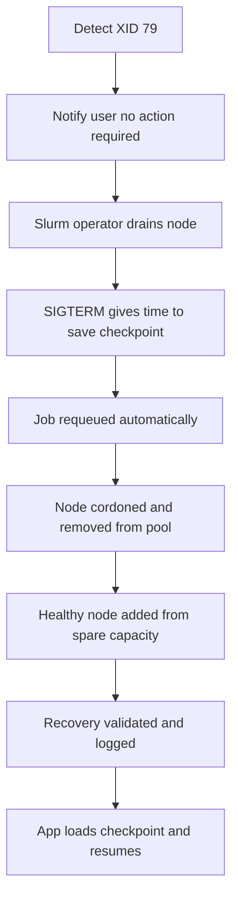
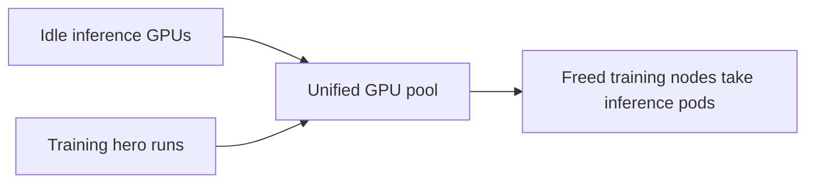
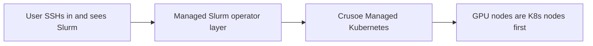

# Talk Notes: "GPU Died. Training Didn't: Self-Healing Training at Scale" — Connor Guerrero & Young Jeong, Crusoe

**Video:** [GPU Died. Training Didn't: Self-Healing Training at Scale — Connor Guerrero & Young Jeong, Crusoe](https://www.youtube.com/watch?v=bRGyYaE0lxI) · AI Engineer channel · Oct 3, 2026 · 16:53 · Recorded at AI Engineer World's Fair 2026

## Thesis

At thousands of GPUs, hardware failures are inevitable and manual remediation doesn't scale; Crusoe's managed Slurm on Kubernetes (via CMK + the open-source Slinky project) with AutoClusters automatically detects critical GPU errors (e.g., XID 79), replaces the node, and resumes training from checkpoint with no user action — full recovery in under 15 minutes.

## The mental model

The XID 79 auto-remediation flow, end to end:

The unified hardware pool:

The managed-Slurm layering:

## Key points

- **Slurm excels at training**: tight collective communication across ranks, gang scheduling, topology awareness, prologue/epilog cluster validation — 20+ years, built by researchers for researchers.
- **Slurm falls short**: today's AI workloads are dynamic (training, post-training, eval, inference on one cluster); health checks and node maintenance require manual drain scripts or tooling like NHC.
- **Observability gaps**: Slurm knows a job failed but can't tell you why; degraded performance from things like network flaps.
- **Kubernetes brings** self-healing, load balancing, autoscaling, and a mature ecosystem (observability, networking, security plugins).
- **Two stacks = double burden**: teams running both end up with two separate infrastructures and team friction.
- **Managed Slurm**: Crusoe Slurm Operator (CSO) coordinates with Crusoe Managed Kubernetes (CMK) — manages Slurm users, partitions, configurations, storage; users SSH in and it's just a Slurm cluster; the platform team sees a Kubernetes service.
- **Unified hardware pool**: training and inference share GPUs — idle inference GPUs reallocated to training "hero runs"; freed training nodes immediately schedule inference pods.
- **AutoClusters remediation flow for XID 79** (GPU completely unusable): user notified (no action required); Slurm operator drains that specific node; process gets SIGTERM with time to save checkpoints/flush logs; job automatically requeued; node cordoned/drained, removed from the node pool, replaced with a healthy node from spare capacity; recovery validated and logged; app code loads the model + checkpoint and resumes.
- **Live demo**: PyTorch training via sbatch, simulated XID79, GPU utilization drops, node replaced — total downtime under 15 minutes.
- **One-click Slurm**: single command provisions the K8s cluster, Slurm controller, nodes, and storage; GPU node pool is one more command.
- **Design for failure**: Slurm + K8s stay in sync; neither platform nor ML teams change workflows; GPU nodes are K8s nodes first.
- **Slinky** = the open-source Slurm-on-Kubernetes project.

## Notable quotes & data

- "Back to training in under 15 minutes" — total downtime from critical error to resumed training.
- "Fixing them by hand at 3 a.m. doesn't scale."
- XID 79 = GPU completely unusable.

## Tokenomics / efficiency angle

- Unified pool reduces idle GPU waste — idle inference GPUs reallocated to training, freed training nodes immediately schedule inference pods.
- Auto-remediation replaces engineers logging in at 3 a.m. for hours — less downtime = fewer burned GPU-hours.

No direct local-deploy relevance (datacenter-scale training infrastructure talk), noted here rather than inventing one.

## How to apply it

1. Mandate checkpoint-on-SIGTERM discipline. Every training job must flush checkpoints and logs when it receives SIGTERM — no checkpoint hygiene, no self-healing.
2. Codify the remediation flow as an automated runbook: detect → notify (no action required) → drain → requeue → cordon/remove → replace from spares → validate/log → resume, with each step timed against the 15-minute bar.
3. Run a simulated failure drill. Inject a GPU error on a sacrificial node, clock time from error to resumed training, and log where the minutes leak — repeat quarterly.
4. Collapse separate GPU reservations into one unified pool so idle inference GPUs feed training hero runs and freed training nodes immediately take inference pods.
5. If your team runs both Slurm and Kubernetes today, evaluate the open-source Slinky project to kill the double-infrastructure burden instead of maintaining two stacks.
