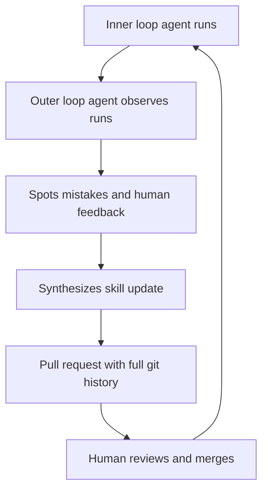
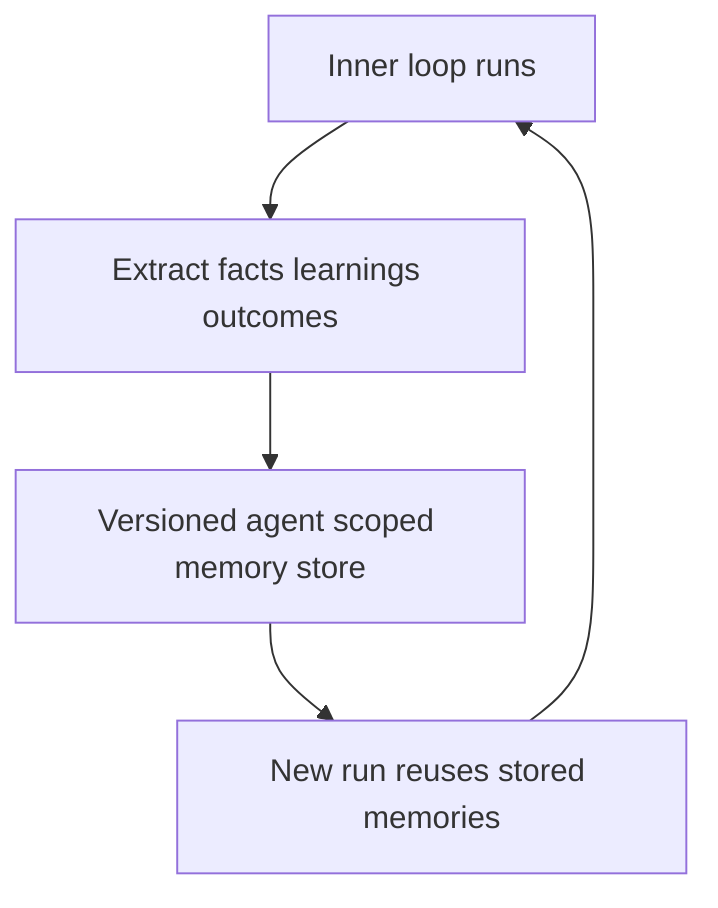
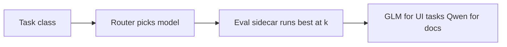

# Talk Notes: "Building Self-Improving Agent Software Factories" — Suraj Gupta, Warp

**Video:** [Building Self-Improving Agent Software Factories — Suraj Gupta, Warp](https://www.youtube.com/watch?v=TN3mj92oZ8I) · AI Engineer channel · Sep 27, 2026 · 12:52 · Recorded at AI Engineer World's Fair 2026

**Note:** distilled from the full spoken transcript (read via usetranscribe.io); supplementary secondary sources are marked where used.

## Thesis

Software factories should self-improve — getting better, more efficient, faster over time — via three concrete mechanisms: (1) skills that improve through an outer-loop agent observing the inner loop, (2) persistent memory as an agent-scoped fact store, and (3) eval-driven model routing. This is becoming a core software-engineering job as we shift from building products to building and maintaining factories. (Warp context: ~1M active users of its agentic dev environment; now building the "Oz" cloud agent platform for software factories.)

## The mental model

Mechanism 1 — the outer-loop skill improvement cycle:

Mechanism 2 — the persistent memory loop:

Mechanism 3 — eval-driven model routing:

## Key points

- **Framing.** Self-improvement = agents/models improving over time with humans phased out of the improvement loop; software factories = automations from triage to production. Factories themselves must get better/more efficient/faster.
- **Mechanism 1 — Skills: procedural memory.** E.g., how a triage agent reproduces issues. Skills go stale: humans give feedback, agents learn in their trajectories. Fix: an outer-loop agent observes the inner loop's runs, spots mistakes and human feedback, and synthesizes skill updates. Warp's internal example: a triage agent on their open-sourced client repo — GitHub issue arrives → agent determines what's missing / whether to dedupe; feedback signals are thumbs up/down, user comments, Warp employee comments.
- **Skill updates land as a pull request.** Full git observability of how the skill evolves over time, and a human reviews the update so the outer loop can't make the triage agent worse.
- **Mechanism 2 — Persistent memory: an agent-scoped fact store.** Without it, a Sentry agent re-gathers context on every repeat issue (wasted tokens, no guarantee of the same root cause). An outer-loop agent extracts facts/learnings/outcomes from inner-loop runs. Demo: a Sentry agent's memory store of past root-cause analyses — on a new run it used 5 stored memories to speed up triage. Memories are versioned, human-editable/deletable, and source-traceable (open the run a memory came from; drop "local maxima").
- **Memory works across all harnesses on Oz** (Warp's own, Claude Code, Codex — names as transcribed): auto-created, fully traceable, human-reviewable.
- **Mechanism 3 — Model routing.** "Prohibitively expensive to run all of your agents that are doing simple things like triage or fixing simple CI failures with Opus." Warp's "auto models": out-of-the-box routers continuously evaluated for Pareto efficiency as new models arrive — better than pinning to Opus or Haiku. Users can also define custom routing rules in config: task classes → models (his example: database migrations → GLM, runbooks/API docs → Qwen).
- **Eval-driven routing.** Task-class routing is "more art than science" today; next step is customer-facing evals (define what you care about, which knobs to turn). Internally, an "eval sidecar" uses a best-at-k approach — run agents across models on Oz for a prompt; finding: "UI tasks are really well done with GLM. We don't really need to run those with Opus." Workflow-specific evals, not generic benchmarks. Being productized for customers.
- **The platform behind the talk: Oz.** Warp's cloud agent orchestration platform (launched Feb 2026) is the control plane the three mechanisms run on: it runs Claude Code, Codex, and Warp Agent side by side with consistent access controls, governance, and audit logs; automatic multi-agent orchestration with real-time tracking; cross-harness persistent memory (research preview) so agents "remember how their team works across every session" — with companies owning their memory corpus. Warp's client repo is open-source (AGPL) and itself run as a factory: agents do the bulk of implementation, humans focus on ideas, direction, and verification. (warp.dev/oz; SD Times, May 2026.)
- **Proof it's not just Warp's own demo:** Rectangle Health built "Rex" on Warp — an AI teammate living in Slack, connected to Jira, writing 35,000 lines of code per week, 54% of its own code. Lloyd: Warp automates 30–35% of its own tasks weekly, "and as models improve, as the context improves, as the harness improves, that number is going to go up." (TechCrunch, Aug 2026.)

## By the numbers

- **~1M** — active users of Warp's agentic dev environment (talk context).
- **5** — stored memories the demo Sentry agent reused to speed up triage on a repeat root-cause analysis.
- **3** — the self-improvement mechanisms (outer-loop skill improvement; persistent memory; eval-driven model routing).
- **35,000 lines/week / 54%** — what Rectangle Health's "Rex" teammate writes on Warp, and the share of its own code it authors (TechCrunch).
- **30–35%** — of Warp's own tasks automated weekly, per Lloyd — his "going up over time" as models, context, and harness improve.
- **Feb 2026** — Oz launch; the multi-harness + cross-harness-memory update landed May 2026.
- **best-at-k** — the eval sidecar's method: run one prompt across N models, pick the cheapest that clears the bar; the concrete finding was "UI tasks → GLM, no Opus needed."

## Decision framework

- **Which mechanism first:** skills when the work is a repeatable procedure (triage, repro, release chores); persistent memory when the same issues recur and context re-gathering is the tax (Sentry-style root-cause work); model routing when routine agent volume is high — that's where "prohibitively expensive" lives.
- **The human's non-negotiable seats:** skill updates land as PRs a human reviews (the outer loop must not be allowed to make the inner loop worse); memories are human-editable/deletable with source traces (prune "local maxima" — plausible-but-wrong memories that trap the agent).
- **Routing maturity ladder:** (1) stop pinning everything to the frontier model → (2) task-class rules in config (migrations → GLM, docs → Qwen) → (3) eval sidecar with best-at-k on your own workflows → (4) auto models re-evaluated for Pareto efficiency as new models land. Don't skip to (4) without (3): without your own evals, routing is "more art than science."
- **Traps:** stale skills (procedures decay as the repo changes — that's what the outer loop is for, not a one-time write); memory without provenance (a fact store you can't audit becomes a rumor store); routing on generic benchmarks instead of workflow-specific evals; running agents on someone else's infrastructure when the enterprise requirement is data ownership (the Oz pitch is explicitly "your infrastructure, your data").
- **Buy-vs-build read:** Warp productized all three mechanisms into Oz (multi-harness control plane, shared memory, auto routing) — if you're already in that ecosystem, the decision is configuration; if not, each mechanism is independently implementable locally (sqlite fact store, config-file routing, best-at-k harness).

## Notable quotes & data

- "It can become prohibitively expensive to run all of your agents that are doing simple things like triage or fixing simple CI failures with Opus."
- "UI tasks are really well done with GLM. We don't really need to run those with Opus."
- ~1M active Warp users; skill improvements tracked through git PRs with human review
- Sentry agent used 5 stored memories to speed up triage on a repeat issue

## Tokenomics / efficiency angle

- **Model routing for Pareto efficiency.** Auto models re-evaluated as new models land; best-at-k eval sidecar; task-class routing (GLM for UI work, Qwen for docs) instead of defaulting to Opus — the direct answer to "everything runs on the frontier model."
- **Persistent memory avoids re-gathering context on repeat issues** — direct token savings, plus consistency (same root cause, not a re-derived guess).
- **The skill-improvement loop** (outer-loop agent → git PR → human review) is eval-driven iteration on the factory itself — improvement compounds instead of being re-paid per session.

## Local-deploy takeaways

- The persistent-memory pattern (versioned, human-editable, source-traceable fact store) is implementable locally — e.g., a sqlite-backed store — without Warp's Oz platform.
- Task-class routing config (migrations → GLM, docs → Qwen) maps directly onto a local Ollama/multi-model setup: cheap local models for routine agent chores, frontier only where evals justify it.
- The best-at-k eval sidecar is a repeatable local pattern: run the same agent prompt across models, measure, pin the cheapest that clears the bar.

## How to apply it

1. Pick one agent — e.g., your Sentry-style triage agent — and stand up the outer-loop observer: it reviews trajectories plus thumbs-up/down and user comments, synthesizes skill updates, and lands them as a PR for human review so the loop can't make the agent worse. Warp runs its own open-sourced client repo this way.
2. Create a versioned, human-editable fact store for that agent's repeat issues (start with sqlite). Link every memory to its source run and prune "local maxima" — stale memories that trap the agent. Measure the hit rate: how often repeat runs reuse stored memories instead of re-gathering context, and the token delta — that is the direct savings ledger.
3. Write a task-class routing config: migrations → GLM, runbooks/API docs → Qwen (or your local Ollama equivalents); keep the frontier model pinned only where evals justify it. Climb the maturity ladder: rules in config → best-at-k eval sidecar on your own workflows → auto re-evaluation as new models land.
4. Run a best-at-k eval sidecar on one workflow next week: same prompt across models, measure pass rate, pin the cheapest model that clears the bar, and re-run as new models arrive to stay on the Pareto frontier.
5. Decide the data-ownership posture up front: if the enterprise requirement is "our infrastructure, our data," self-host the fact store and routing — the mechanisms don't require Warp's platform.

## Sources

- Video: https://www.youtube.com/watch?v=TN3mj92oZ8I
- Full transcript: https://www.usetranscribe.io/yt/TN3mj92oZ8I/self-improving-agent-factories
- Oz cloud agent platform (multi-harness control plane, cross-harness memory, auto routing): https://www.warp.dev/oz
- Warp Factories customer proof point — Rectangle Health's "Rex" (35K lines/week, 54% own code) and Lloyd's 30–35% automation figure (TechCrunch, Aug 2026): https://techcrunch.com/2026/08/18/warps-new-system-is-an-out-of-the-box-software-factory-for-ai-development/
- Oz multi-harness + memory update (SD Times, May 2026): https://sdtimes.com/ai/warp-updates-oz-to-help-enterprises-orchestrate-coding-agents-across-any-model-or-harness/
