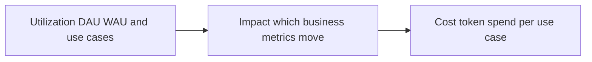
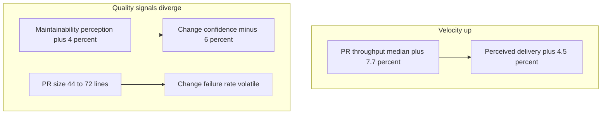
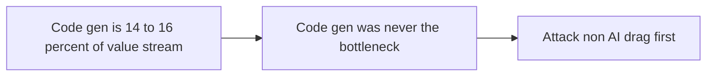

# Talk Notes: "The State of AI in Software Development: Data from 400+ Orgs" — Justin Reock, DX

**Video:** [The State of AI in Software Development: Data from 400+ Orgs — Justin Reock, DX](https://www.youtube.com/watch?v=Se8jHLliLXE) · AI Engineer channel · Sep 30, 2026 · 19:09 · Recorded at AI Engineer World's Fair 2026

**Note:** YouTube's transcript was unreadable in our environment, so this is distilled from the video's own description/chapters plus biggo.com's AI-generated talk summary — treat secondary-derived points as the speaker's arguments per those summaries, not verbatim transcript.

## Thesis

DX's platform telemetry (**~200,000 engineers, 400+ organizations**; the team behind DORA/SPACE/DevEx) shows AI is genuinely lifting raw velocity but modestly and unevenly — median **+7.7% PR throughput**, +4.5% perceived delivery, **nobody near 2x** — while quality signals turn volatile and developer confidence diverges from maintainability. Code generation is only **14–16% of the value stream**, so it was never the bottleneck; durable value comes from treating AI as a throughput/capacity story (not headcount replacement) and investing in platform readiness.

## The mental model

The three-dimension measurement framework:

The velocity/quality split:

The bottleneck argument:

## Key points

- **Deployment frequency (DORA) is up but tapering.** North America trends up while Europe pulled back slightly last quarter (attributed to work practices, token-spend budgeting, regulation). Caveat: the metric covers only PR-creation-to-production and ignores reverts and defect ratios.
- **Perceived rate of delivery rose only ~4.5% over a full year** — modest against total AI spend. Contrast with the METR study from February (16 engineers; Reock calls it "infamous" and "flawed," noting the authors' follow-up): actual productivity **−19%** while perceived rose **+20%**, a ~40-point spread; at DX's aggregate scale perception stays flat.
- **PR throughput (Nov 2024–Feb 2025):** median **+7.7%**, average **+13%**, top performers **~70%** — "nobody hit 2x, 5x, or 10x."
- **Change failure rate data is "extremely volatile":** each line is one company; some show increases up to **~2 percentage points** against an industry benchmark of **~4%** — i.e., roughly **50% more defects**. AI changed the amplitude, not the shape: "We always see this type of shift in volatility, but not usually to these extremes. And that's the AI effect."
- **The psychological split:** perceived code maintainability rose nearly **4%** while change confidence fell **6%** — historically correlated metrics diverging. "Agents and assistants are making it easier for me to understand and modify the code that's in front of me. But I trust the outputs less. I'm more afraid now of breaking things than I was a year ago."
- **PR size is "one of the most important metrics of the year":** average **~44 → 72 lines** over roughly a year. Causes: models output mediocre-by-averages code, and **45–60-minute builds** incentivize cramming multiple AI-generated functions into one PR. Perception of incremental delivery fell **10%** (hurting rollback-ability and reviewability).
- **Skill-level split:** juniors are the heaviest AI users (less to unlearn) but **burn more tokens per use case** (learning curve); staff-plus engineers save about the same time while burning **fewer tokens** (they spot hallucinations, know the architecture). Smaller companies lead in time savings (simpler pipelines, less org complexity).
- **DX literally measures "agent experience"** — asking agents about working with humans, their use cases, and tokens spent.
- **Three-dimension AI measurement framework:** utilization (DAU/WAU, use cases) → impact (which business metrics move) → **cost (token spend**, "getting expensive — joking that 15 years after the last hype cycle we still haven't figured out cloud costs"). Framing question: "Spent 10 million or way more — where's our 10x productivity?"
- **Platform readiness is the second pillar:** "In 2024, we gave everybody a coding assistant. In 2025, we started building agents. Now we're realizing that our infrastructure wasn't ready for any of this." Readiness = clear docs, clean data relations, simulations, modular code, **reliable local CI, non-flaky tests** — "this used to just be called good developer experience... what's good for humans turns out to be good for agents."
- **Strategic conclusion:** "Code generation was never the bottleneck... Even if engineers are getting 100% accurate instant code from the models, you would still only be attacking anywhere from maybe **14% to 16%** of the overall value stream." Invokes Goldratt: "an hour saved on something that isn't the bottleneck is worthless." Non-AI drag (meetings, context switching, interruptions, env friction) outweighs AI time saved.
- **Four enterprise case studies:**
  - **Morgan Stanley's DevGen** — interprets legacy Natural/COBOL/Perl mainframe code, generates PRDs, killing a reverse-engineering step → **~300,000 hours/year** saved.
  - **Zapier** — agent ecosystem for admin overhead; stand-ups 5x→2x/week; onboarding ~2 weeks vs >1-month benchmark; **~15% additional value per engineer** — and it's "hiring more than at any point in its history": "This is a throughput story... not a headcount replacement story."
  - **FAIR** — ~3,000 automated code reviews/week, superficial issues, humans in loop, PR comments as system of record.
  - **Spotify** — SRE agent assembling runbook remediation + incident context into comms channels, killing minutes of discovery.

## Notable quotes & data

- Median +7.7% PR throughput (Nov 2024–Feb 2025); perceived delivery +4.5%/year; nobody reached 2x.
- "Code generation was never the bottleneck in the first place... you would still only be attacking anywhere from maybe 14% to 16% of the overall value stream."
- "An hour saved on something that isn't the bottleneck is worthless."

## Tokenomics / efficiency angle

- **Token spend is an explicit third measurement pillar** ("getting expensive"); DX tracks **tokens per use case** via "agent experience" feedback, finding juniors burn more tokens than seniors for equal time saved.
- **Platform readiness** (docs, modular code, reliable CI, non-flaky tests) framed as the prerequisite for efficient agent token spend — "good developer experience" renamed.

### Local-deploy takeaways

- **Measure tokens per use case, not just total spend** — the junior/senior split shows the same tooling burns very different tokens depending on operator skill; per-use-case tracking is the cost lever.
- **Invest readiness before inference:** clear docs, modular code, reliable local CI, and non-flaky tests reduce the token burn per successful agent task — the cheapest tokens are the ones the agent never has to retry.

## How to apply it

1. Stand up the three-dimension dashboard: utilization (DAU/WAU, use cases) → impact (delivery metrics that move) → cost (token spend per use case). If a tool can't show all three, you can't answer "spent ten million — where's our 10x productivity?"
2. Slice token spend by seniority. When juniors burn more tokens per use case than staff-plus engineers, add guardrails — tighter task scopes, smaller diffs — instead of blanket throttles.
3. Track PR size and change failure rate weekly. PRs drifting from ~44 toward 72 lines and volatile failure rates are the early warning that velocity gains are being paid for in quality.
4. Run the platform-readiness audit before standing up new agents: clear docs, clean data relations, modular code, reliable local CI, non-flaky tests. Every gap is token burn, because agents retry what flaky infra breaks.
5. Fund the throughput story, not headcount math. Frame the AI budget around PR throughput and value per engineer (the Zapier case) and attack the non-AI drag — meetings, context switching, env friction — that Goldratt's rule says is the real bottleneck.

## Sources

- YouTube description/chapters: https://www.youtube.com/watch?v=Se8jHLliLXE
- BigGo AI talk summary: https://finance.biggo.com/podcast/75a5a1c4b638f4d6
