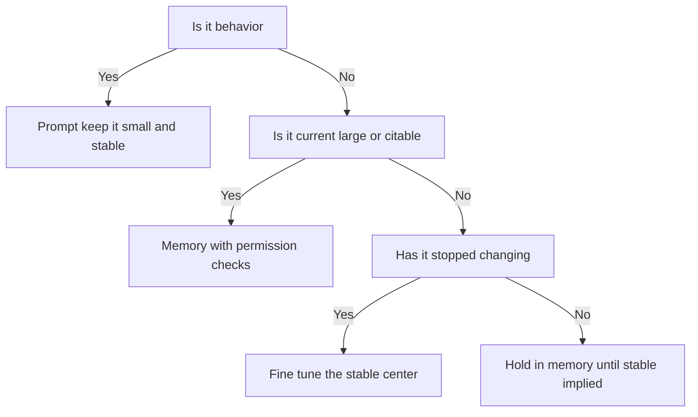
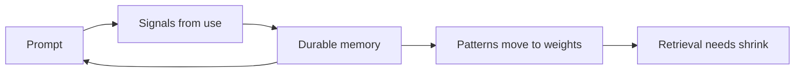

# Talk Notes: "Stop Fine-Tuning to Fix Retrieval Problems" — Anant Srivastava

**Video:** [Stop Fine-Tuning to Fix Retrieval Problems — Anant Srivastava](https://www.youtube.com/watch?v=qflLT3SoVbw) · AI Engineer channel · Oct 3, 2026 · 20:11 · Recorded at AI Engineer World's Fair 2026

**Speaker:** Anant Srivastava, Principal Technologist for Data and AI Platforms, Oracle (per the video description).

**Note:** distilled from the video's own description/chapters (the speaker's outline, with timestamps) plus biggo.com's AI-generated talk summary — the description's chapter structure and framing lines are the speaker's own words via YouTube.

## Thesis

Most teams never deliberately decide where knowledge lives — prompt, memory/retrieval, or model weights — so six months of normal product work decides it for them by accident. These aren't a ladder to climb but three tools for three jobs, and you need a deliberate harness for circulating knowledge between them; fine-tuning should be reserved for knowledge that has stopped changing.

## The mental model

The placement decision — which job goes where:

The circulation loop:

When fine-tuning earns its keep:

## Key points

- **The opening line (from the video description):** "Most AI teams never decide where their knowledge lives. Six months of normal product work decides for them." The talk's arc: "How every prompt edit, indexed doc and training sample is an architecture decision" — each one quietly places knowledge in prompt, memory, or weights, and teams that never choose get an architecture by accident ("Accumulated, not designed").
- **Three tools, not a ladder:** prompt, memory and weights "aren't a ladder you climb when answers go wrong. They're three tools for three jobs." The diagnostic question per layer (from the description):
  - **Prompt** — "for small, stable behavior"
  - **Memory** — "for knowledge that's current, large, citable or access-controlled"
  - **Weights** — "only for reflexes that have stopped changing"
- **The support assistant that went wrong:** the cautionary tale is a support assistant that "kept inventing product names after a fine-tune" — the team baked knowledge into weights that was actually a retrieval problem. Fine-tuning made it *confidently wrong*: stale or invented facts, now embedded where they can't be cited, updated, or permission-checked.
- **Prompt's job = behavior**: small, stable, editable knowledge about how to act (e.g., support-agent tone, "offer human escalation after three failures" — the 5:59 support-agent prompt example). Wrong job: storing facts — too many instructions dilute, and "you pay the cost for it" in context tokens on every call.
- **Memory's job = knowledge that is current, large, and citable** — covers both agent memory and external/RAG memory like refund policies (6:59). Changes faster than you can fine-tune; can't fit in a prompt; and it's the only layer where knowledge can be cited back to a source.
- **Wrong job for memory: behavior/reasoning** (8:09) — if the model can't reason over retrieved docs, more context doesn't help; you need the right model, not a bigger pile of chunks.
- **Access control belongs in memory** (8:49) — per-user/per-repo data must be retrievable with permission checks, never baked into weights. Weights can't do ACLs: once knowledge is in the weights, every caller gets it.
- **Code-assistant example** (9:14): don't fine-tune on code (changes too fast); use code-aware chunking, filtering, and denormalized metadata (repo, user, commit) to retrieve exact chunks (10:08). The retrieval quality bar is *exact chunks*, not vibes.
- **Weights = what has stopped changing** (11:23); fine-tuning needs a strong reason — retraining locks in a boundary that may still be moving, and every retrain is a migration.
- **Classic fine-tuning mistake** (12:28): a team fine-tuned on documentation when it was actually a retrieval problem — stale docs got baked into weights, the same failure shape as the inventing-product-names support assistant.
- **When fine-tuning works** (13:53): ambiguous judgment tasks (content moderation, claims processing) — bootstrap with a frontier model + human corrections, wait until human override rates flatline, fine-tune the stable "center," keep humans on the contested edge.
- **Medical coding example (ICD-10, 70k codes; IMO Health / Mount Sinai)** (15:08): fine-tune the reflex (format understanding), not the codes themselves — "why you fine-tune reflexes, not facts."
- **Fine-tuning decision = capability vs. cost** (16:13) — fine-tune a small model and run volume cheap (e.g., 10M requests/day) when it's a cost problem, not a capability problem.
- **Decision table** (16:58): prompt = behavior; memory = what to know (facts); weights = how to act (reflexes).
- **Circulating architecture** (17:33): prompt → signals → durable knowledge in memory → memory pulled back into prompt on new sessions; over time, patterns move memory → weights via fine-tuning and retrieval needs shrink — "the agent gets better by doing its job." The loop makes the agent better without anyone re-deciding the architecture.
- Close (19:27): "The model is the easy part. What you build around the model... is the key architecture."

## By the numbers

- **3** — tools for three jobs (prompt / memory / weights), not a ladder
- **6 months** — of normal product work that decides your knowledge architecture by accident if you never decide deliberately
- **70,000** — ICD-10 codes: fine-tune the format reflex, not the codes (IMO Health / Mount Sinai pattern)
- **10M** — requests/day: the volume class where fine-tuning a small model wins on cost, not capability
- **3** — failures before human escalation in the support-agent prompt example (behavior, not facts, belongs in the prompt)

## Notable quotes & data

- "The model is the easy part. What you build around the model... is the key architecture."
- ICD-10 has 70,000 codes — fine-tune the format reflex, not the codes.
- Human override rates flatlining = the signal that knowledge is stable enough to fine-tune.

## Tokenomics / efficiency angle

- Stuffing facts into the prompt wastes context tokens ("you pay the cost for it") and dilutes instruction-following.
- Fine-tune small models to run high volume cheaply when it's a cost problem, not a capability problem.
- Circulating memory → weights reduces retrieval needs over time.

## Local-deploy takeaways

- **Keep a standing decision table for every skill/pipeline**: behavior → prompt/skills, facts → local RAG/retrieval, reflexes → fine-tuned small local model. Review it whenever a new knowledge source enters the system.
- **The circulation loop is the local strategy**: use local retrieval (sqlite/LanceDB) for fast-changing knowledge, and only bake the stable center into a locally fine-tuned small model — exactly the Ollama + local RAG split Matt already runs.
- **Access control is the hard constraint for local-first**: per-user/per-repo data must stay retrievable with permission checks, never baked into weights — weights can't do ACLs.

## Decision framework

- **Run the diagnostic on every knowledge source, in order** (question wordings inferred from the description's per-layer diagnostics — the talk names "the diagnostic question" per layer without publishing exact wording):
  1. "Is this small, stable behavior?" → prompt.
  2. "Is it current, large, citable, or access-controlled?" → memory.
  3. "Has it stopped changing?" → weights. If not, hold it in memory.
- **Fine-tune only when both hold:** (a) the knowledge is a *reflex* that has stopped changing — proven by human override rates flatlining on the frontier-model + human-corrections bootstrap; and (b) there's a capability reason (ambiguous judgment) or a cost reason (10M-request/day volume on a small model).
- **Never fine-tune:** documentation (that's a retrieval problem wearing a training costume); fast-changing knowledge like code; anything needing per-user/per-repo access control; facts — "fine-tune reflexes, not facts."
- **The trap to name in reviews:** the support assistant that "kept inventing product names after a fine-tune." Baked-in knowledge goes stale silently and hallucinates confidently — and unlike a bad retrieval result, you can't cite-check a weight.
- **Measure first:** human override rates on every fine-tuning candidate (flatline = green light); retrieval precision on exact-chunk tests before concluding retrieval "doesn't work."
- **Revisit cadence:** the circulation loop means placements expire — what was memory six months ago may be weights-worthy now, and what was weights may have started moving again.

## How to apply it

1. Put the standing decision table in your skill repo and run the three-question diagnostic on every knowledge source: small stable behavior → prompt; current/large/citable/access-controlled → local RAG; stopped-changing reflex → weights. Review it every time a new knowledge source enters the system — "every prompt edit, indexed doc and training sample is an architecture decision."
2. Audit existing prompts for facts masquerading as behavior (the most common accident). Pull them into local retrieval (sqlite/LanceDB) with code-aware chunking and denormalized metadata — repo, user, commit — and test that retrieval returns *exact chunks*.
3. Before anyone proposes fine-tuning, ask for the retrieval-precision evidence: run exact-chunk tests first. Most "retrieval doesn't work" claims are chunking/metadata problems, per the 10:08 code-RAG section.
4. Run the circulation loop deliberately: harvest signals from each session into durable memory, pull memory back into the prompt at session start, and only bake pattern-stabilized knowledge into weights so retrieval needs shrink over time.
5. Track human override rates on every fine-tuning candidate. Do not fine-tune until the rate flatlines — then fine-tune the stable center and keep humans on the contested edge, exactly the ICD-10 pattern (fine-tune the format reflex, not the 70,000 codes).
6. Keep access control in the memory/retrieval layer with per-user/per-repo permission checks. Never bake ACLs into weights — weights cannot enforce permissions, and every caller gets baked-in knowledge.
7. When fine-tuning for cost (not capability), fine-tune the *small* model and run the 10M-request/day volume on it — that's the economics that justify training at all.

## Sources

- Video: https://www.youtube.com/watch?v=qflLT3SoVbw
- Video description with chapter timestamps (speaker's outline — diagnostic questions, support-assistant story, decision table, circulating architecture): https://www.youtube.com/watch?v=qflLT3SoVbw
