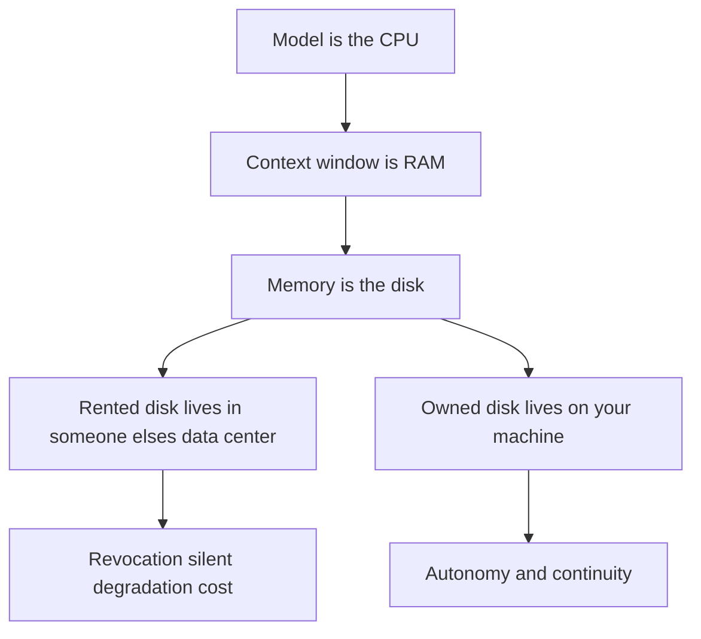
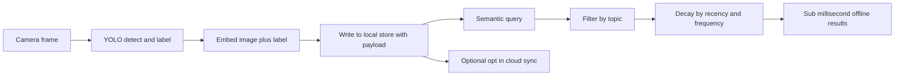
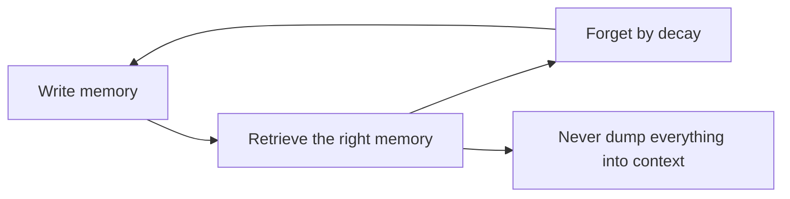

# Talk Notes: "Stop Renting Your AI's Memory" — Dylan Couzon, Qdrant

**Video:** [Stop Renting Your AI's Memory — Dylan Couzon, Qdrant](https://www.youtube.com/watch?v=apyrzaWj0Z4) · AI Engineer channel · Oct 2, 2026 · 15:16 · Recorded at AI Engineer World's Fair 2026

**Note:** YouTube's transcript was unreadable in our environment, so this is distilled from the video's own description/chapters plus biggo.com's AI-generated talk summary — treat secondary-derived points as the speaker's arguments per those summaries, not verbatim transcript.

## Thesis

The industry solved the wrong half of the ownership problem — running frontier-class models locally is now cheap (a sub-$2,500 machine runs "last year's frontier"), but the memory that makes an assistant actually yours still lives in someone else's data center. Memory is a three-verb system (**write, retrieve, forget**); owning inference buys autonomy, owning memory buys continuity — and continuity is the real product. A live fully-offline drone demo proves the point: **92 objects, 300+ vectors, 15MB total, sub-millisecond retrieval.**

## The mental model

The Karpathy framing — model is CPU, context window is RAM, memory is disk:

The demo pipeline — camera frame to sub-millisecond offline memory:

Memory is a three-verb loop, not a folder dump:

## Key points

- **Three failure modes of rented models, each already fired:**
  1. **Access revocation** — a government order "last month" pulled two flagship models, named **Fable and Mythos 5**, for every customer.
  2. **Silent degradation** — providers retire versions and throttle remaining capacity when economics tighten.
  3. **Cost** — agentic loops burn far more tokens than chat; developers burning "over $5,000 a month of compute on a $200 plan," a subsidy he expects to vanish.
- "If we don't fix that, the most powerful technology any of us will ever touch ends up owned by whoever holds the lease, not the people it was built for."
- **Owning inference = autonomy** (nobody can switch it off); **owning memory = continuity** — and continuity is what every frontier lab is now packaging and selling back, since every lab shipped a memory feature in the past year because models carry nothing between sessions.
- "A system that starts simple and keeps learning you will always feel smarter than one that starts brilliant but forgets everything about you." Assistants today are "geniuses with no long-term memory"; the compounding assistant is "a second mind."
- **Karpathy's framing:** the model is the CPU, the context window is RAM, memory is the disk. RAM is fast but forgets; for almost every assistant on Earth the disk sits in someone else's data center.
- **Memory = three verbs — write, retrieve, forget** — "the same three things your brain actually does." Rejects the "big folder of Markdown" objection on retrieval grounds: retrieving the right memory beats dumping everything; you can filter by topic, decay by recency/frequency, let relevance shift like human memory.
- **The infrastructure was ready for years:** HNSW dates to **2016**, embeddings ran locally since **2019**. "The memory side of superintelligence was never difficult — we were just pointing it at ourselves."
- **Live demo (fully offline, on his laptop):** a drone's first flight over a house; YOLO labels every object; image+label → embeddings written to a local vector store; 2D projection shows similar memories clustering. Results: **92 distinct objects, 300+ vectors, 15MB total memory+engine footprint**; clicking a coffee table returns every sighting in **under 1ms** with image, first/last-seen timestamps, a definition, and sighting count.
- **Pipeline:** camera frame → YOLO detection/labeling → embed image+label → write to local store with payload → semantic query/filter/decay → <1ms offline results → optional opt-in cloud sync ("hive mind" for drone/robot swarms; same pattern for chatbots, voice agents, code assistants).
- **The engine (his team's):** embeds in the application process, opens a local store; same Rust core as Qdrant's cloud product; with quantization, **a million memories fit in under 1GB** — phone/Raspberry Pi scale; memory survives app close; per-app isolated stores; the folder follows the user across models and hardware as long as the embedding model is kept.
- **Warning:** frontier labs are already building an index of every user (relationships, habits, inner life) — "coming whether you opt in or not"; the only question is whether you own it or "rent access to yourself." Sharing must be local-first and opt-in (family hive-mind example with recording glasses); the same mechanism enables consensual sharing or non-consensual extraction.
- **Close:** give a local model a memory and picture it five years out — "not a smaller superintelligence — it is the only one worth wanting."

## Notable quotes & data

- "We've spent years asking when, but I think when is kind of the boring question. I think the real one is who it belongs to."
- Demo numbers: 92 objects, 300+ vectors, 15MB footprint, **<1 millisecond retrieval, fully offline**.
- "Some developers burn through over $5,000 a month of compute on a $200 plan. That's a subsidy. And those subsidies will ultimately disappear."

## Tokenomics / efficiency angle

- **Sub-millisecond local vector retrieval** with zero network round-trip (latency); quantization packs ~1M memories into <1GB (storage/compute efficiency at phone/Raspberry Pi scale).
- **Fixed owned-hardware cost vs. metered token burn** of rented agentic loops ($5k/mo on $200 plans) — owning the stack converts variable spend into sunk hardware.

### Local-deploy takeaways

- **The demo is the template:** embed the vector engine in the application process, keep the store local and per-app isolated, and the same pattern covers chatbots, voice agents, and code assistants — no hosted vector DB required.
- **Design memory as a three-verb API (write / retrieve / forget)** with decay-by-recency/frequency and topic filtering, rather than dumping a Markdown folder into context — retrieval precision is the context-savings lever.
- **Quantization makes the scale trivial:** ~1M memories in <1GB means on-device memory for phones and Raspberry Pis; the folder follows the user across models and hardware as long as the embedding model is kept — memory becomes portable, model-agnostic state.

## How to apply it

1. Pick one pilot surface (a team assistant or dev agent) and embed the vector engine in the app process — no hosted vector DB. One local store per app, isolated.
2. Define memory as a three-verb API — write, retrieve, forget — with topic filters and recency/frequency decay, instead of dumping memory files into the context window.
3. Enable quantization from day one and budget storage at roughly 1M memories per GB so the design stays device-scale.
4. Pin the embedding model so the store folder stays portable across models and hardware.
5. Measure before/after: retrieval latency (target sub-ms) and tokens per answered query versus the dump-everything baseline.
6. Keep any cloud sync opt-in and explicit; default to local-only.

## Sources

- YouTube description/chapters: https://www.youtube.com/watch?v=apyrzaWj0Z4
- BigGo AI talk summary: https://finance.biggo.com/podcast/8ecb3ddf484198ae
