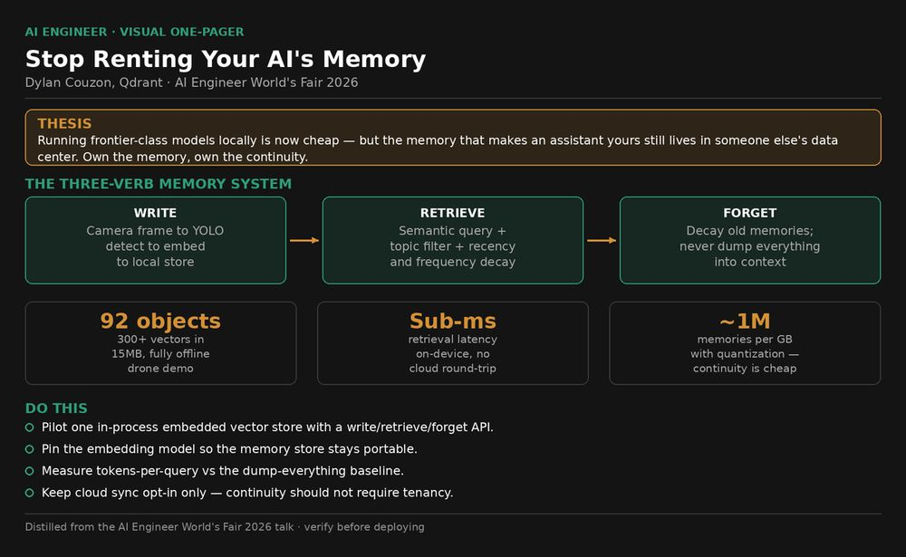
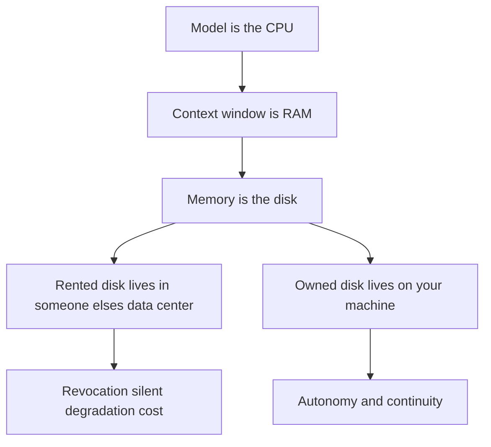
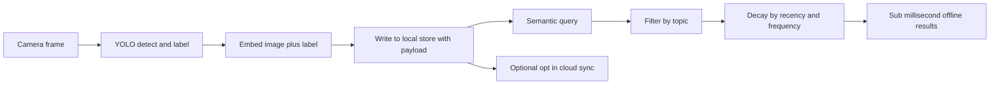
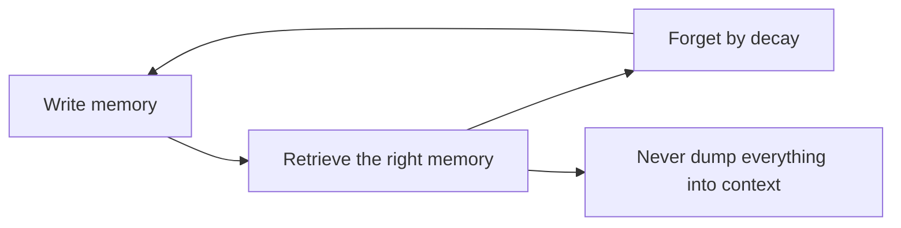

# Talk Notes: "Stop Renting Your AI's Memory" — Dylan Couzon, Qdrant

**Video:** [Stop Renting Your AI's Memory — Dylan Couzon, Qdrant](https://www.youtube.com/watch?v=apyrzaWj0Z4) · AI Engineer channel · Oct 2, 2026 · 15:16 · Recorded at AI Engineer World's Fair 2026

**Note:** distilled from the full spoken transcript (via ainotes.us, captions sourced from the original YouTube video); the Qdrant Edge launch post fills in product specifics. Direct quotes are the speaker's words per the transcript.

## Thesis

The industry solved the wrong half of the ownership problem — running frontier-class models locally is now cheap (a sub-$2,500 machine runs "last year's frontier"), but the memory that makes an assistant actually yours still lives in someone else's data center. Memory is a three-verb system (**write, retrieve, forget**); owning inference buys autonomy, owning memory buys continuity — and continuity is the real product. A live fully-offline drone demo proves the point: **92 objects, 300+ vectors, 15MB total, sub-millisecond retrieval.**

## The mental model

The Karpathy framing — model is CPU, context window is RAM, memory is disk:

The demo pipeline — camera frame to sub-millisecond offline memory:

Memory is a three-verb loop, not a folder dump:

## Key points

- **The talk's actual title, in his words:** "the frontier is coming home." Two versions of superintelligence: one lives in someone else's data center and you pay by the token; the other is yours — it learns from your life, your context stays private, and nobody can switch it off, throttle it, or take it away.
- **The hardware half is already won:** "A machine under $2,500 today can run what was basically last year's frontier. And open weights models are closing on fast. The gap is shrinking every quarter." But "a model on its own is just a brilliant stranger" — what makes it yours is everything it knows about you, and that part hasn't come home yet.
- **Three failure modes of rented models, each already fired:**
  1. **Access revocation** — a government order "last month" pulled two flagship models, named **Fable and Mythos 5**, for every customer. "Compare that to weights already sitting on your desk. Nobody can reach into your machine and flip those off."
  2. **Silent degradation** — providers retire versions and throttle remaining capacity. "When the economics gets tight, the model you rely on can quietly get worse or vanish. Weights you own never change unless you change them."
  3. **Cost** — "People don't write prompts anymore. They run agents or loops for hours. And one task can burn **thousands of times more tokens** than a chat message." Developers burning "over $5,000 a month of compute on a $200 plan" — "That's a subsidy. And those subsidies will ultimately disappear."
- "If we don't fix that, the most powerful technology any of us will ever touch ends up owned by whoever holds the lease, not the people it was built for."
- **Owning inference = autonomy** (nobody can switch it off); **owning memory = continuity** — and continuity is what every frontier lab is now packaging and selling back: "Every Frontier Lab shipped a memory feature" in the past year, "not because the models got smarter, but because they don't carry anything between sessions. That gap is the actual product."
- "A system that starts simple and keeps learning you will always feel smarter than one that starts brilliant but forgets everything about you." Assistants today are "geniuses with no long-term memory"; the compounding assistant is "a second mind."
- **Karpathy's framing:** the model is the CPU, the context window is RAM, memory is the disk. RAM is fast but forgets the moment the session ends; the disk is what remembers you across every conversation. "And right now for almost every AI assistant on Earth, that disk is in someone else's data center."
- **Memory = three verbs — write, retrieve, forget** — "the same three things your brain actually does." Rejects the "big folder of Markdown" objection on retrieval grounds: "retrieving the right memory beats dumping everything and praying the model finds it." And: "**Retrieval gives you something a prompt cannot. It is control.** You can filter by topic. You can decay by recency and frequency. You can let relevance shift over time. The way human memory actually works."
- **The infrastructure was ready for years:** HNSW dates to **2016**, "embeddings have been running locally since 2019, long before any model could really use them at scale." "The memory side of superintelligence was never the hard part. We were just pointing it at ourselves."
- **The engine (his team's):** "a vector search engine that embeds directly into your app... It opens a local store inside your process. You write embeddings with payloads. Then query offline sub millisecond time. **Same Rust core as Qdrant in the cloud, just running where you are.**" With quantization, **a million memories fit in under 1GB** — phone/Raspberry Pi scale. "Close the app, come back a year later, the memory is intact." Every app gets its own isolated store.
- **Live demo (fully offline, on his laptop):** a drone's first flight over a house; YOLO labels every object; image+label → embeddings written to a local vector store; 2D projection shows similar memories clustering. Results: **92 distinct objects, 300+ vectors** ("300 different representations of those 90 objects"), **15MB total memory+engine footprint**. Clicking a coffee table returns every sighting in **under 1ms** — the image, first-seen timestamp, last-seen timestamp, a definition, and sighting count. "This is all being run and processed locally. There's no network attachment at all."
- **Pipeline:** camera frame → YOLO detection/labeling → embed image+label → write to local store with payload → semantic query/filter/decay → <1ms offline results → optional opt-in cloud sync ("Edge can sync parts of your store to the Qdrant cloud out of the box when you choose to" — the "hive mind" for drone/robot swarms). Same pattern covers chatbots, voice agents, code assistants.
- **The compounding argument:** "if you create those memories for just a few weeks, the stranger just disappears. It remembers your corrections, your preferences, the dead ends you only had to hit once. And a model that's merely good, but never forgets you and keeps compounding over the years starts to feel superhuman in practice. Not because the model changed, but because it never stopped learning you."
- **Portability is the design constraint:** "Swap the model, change the hardware, none of it matters. It all comes with you **if you keep the same embedding model** and that folder becomes permanent. A lifetime of context, fully yours, moving from device to device."
- **Beyond the laptop:** point the same memory at a whole day via smart glasses — "Where did I leave my badge? What was her daughter's name again? What was on that whiteboard? What was the song that was playing when we met? Every one of those is just a retrieval query." "It's not a smarter you. It's a you that doesn't forget."
- **Warning:** frontier labs are already building an index of every user — "They have your relationships. They have your habits. They have your whole inner life. That index is coming whether you opt in or not. The only question is whether you own it or you're renting access to yourself." "A memory can be shared with consent or it can be extracted without it. That's exactly why it has to start local and why sharing should always be opt-in, never the default." Family hive-mind example: separate memories per person, pulled into one the family owns. But the alternative future is "one company's superintelligence serving billions of identical people" vs "thousands of small private ones, each shaped by a life, a family, a team."
- **Close:** "Take the stranger home and give it memory." Picture it five years out — "not a chatbot, a private mind that never forgets you, that nobody can switch off, and that knows you better than any system ever has because you were the only one who ever trained it. That's not a smaller superintelligence. That's the only one worth wanting."
- **Qdrant Edge (the product behind the talk, from the launch post):** Qdrant's three waves of vector search — RAG 1.0 (context providers for LLMs) → Agentic AI (long-term memory modules for agents) → **Embedded AI** (on-device reasoning without reliable network or cloud compute). Edge is a lightweight embedded engine: **in-process execution as a library, not a service** — no background optimizers or update threads, all operations synchronous under app control; multitenancy-aware (each device a tenant with isolated data/compute); retains filterable HNSW, hybrid sparse+dense search, multivector/ColBERT-style semantics. Currently in **private beta** — API may change.

## By the numbers

- **<$2,500** — price of a machine that runs "basically last year's frontier" (open-weights gap "shrinking every quarter")
- **1,000s×** — tokens burned by one agentic task vs a single chat message
- **>$5,000/mo** — compute some developers burn on a $200 plan ("That's a subsidy. And those subsidies will ultimately disappear.")
- **92** — distinct objects the drone recognized in the live demo
- **300+** — vectors stored ("300 different representations of those 90 objects")
- **15MB** — total memory + engine footprint for the whole demo store
- **<1ms** — offline semantic retrieval latency (coffee-table query, fully local, no network)
- **1M** — memories fitting in <1GB with quantization (phone / Raspberry Pi scale)
- **2016 / 2019** — HNSW published; embeddings running locally since — "the memory side of superintelligence was never the hard part"
- **Every frontier lab** shipped a memory feature in the past year — the continuity gap "is the actual product"

## Notable quotes & data

- "We've spent years asking when, but I think when is kind of the boring question. I think the real one is who it belongs to."
- Demo numbers: 92 objects, 300+ vectors, 15MB footprint, **<1 millisecond retrieval, fully offline**.
- "Some developers burn through over $5,000 a month of compute on a $200 plan. That's a subsidy. And those subsidies will ultimately disappear."

## Tokenomics / efficiency angle

- **Sub-millisecond local vector retrieval** with zero network round-trip (latency); quantization packs ~1M memories into <1GB (storage/compute efficiency at phone/Raspberry Pi scale).
- **Fixed owned-hardware cost vs. metered token burn** of rented agentic loops ($5k/mo on $200 plans) — owning the stack converts variable spend into sunk hardware.

### Local-deploy takeaways

- **The demo is the template:** embed the vector engine in the application process, keep the store local and per-app isolated, and the same pattern covers chatbots, voice agents, and code assistants — no hosted vector DB required.
- **Design memory as a three-verb API (write / retrieve / forget)** with decay-by-recency/frequency and topic filtering, rather than dumping a Markdown folder into context — retrieval precision is the context-savings lever.
- **Quantization makes the scale trivial:** ~1M memories in <1GB means on-device memory for phones and Raspberry Pis; the folder follows the user across models and hardware as long as the embedding model is kept — memory becomes portable, model-agnostic state.

## Decision framework

- **Use local memory when:** continuity across sessions is the product (assistants, agents, copilots); you need sub-ms retrieval or offline operation; the context is personal/team and must stay private; you want the store to survive model and hardware swaps.
- **Don't use it as an excuse to skip the architecture question:** the speaker explicitly scoped out "which memory architecture wins" — "That's definitely a different talk." His claim is only about *where the disk lives*, not what the disk is shaped like.
- **Measure first:** tokens per answered query vs the dump-everything-into-context baseline; retrieval latency (his bar: sub-millisecond, offline); memory footprint per 1k memories (his bar: ~1MB per 1k with quantization).
- **Traps the speaker named:**
  - The index is being built *anyway* — "coming whether you opt in or not." Opt-out is not on the menu; ownership is the only open question.
  - Sharing defaults: "should always be opt-in, never the default" — a memory store that syncs by default is a surveillance device.
  - Embedding-model lock-in: portability holds only "if you keep the same embedding model." Changing it orphans the folder.
  - Qdrant Edge specifically is **private beta** — partner-gated, API subject to change; fine for experiments, not for production commitments yet.
- **The test he proposes:** "if you create those memories for just a few weeks, the stranger just disappears" — run a 2–3 week pilot on one assistant and check whether it still feels like a stranger.

## How to apply it

1. Pick one pilot surface (a team assistant or dev agent) and run it 2–3 weeks with local memory — his test is whether "the stranger just disappears."
2. Embed the vector engine in the app process (in-process library, no background service) — one local, isolated store per app. Evaluate Qdrant Edge's private beta for device fleets, but don't commit production to a beta API.
3. Define memory as a three-verb API — write, retrieve, forget — with topic filters and recency/frequency decay, instead of dumping memory files into the context window. "Retrieval gives you something a prompt cannot. It is control."
4. Enable quantization from day one and budget storage at roughly 1M memories per GB so the design stays device-scale.
5. Pin the embedding model — the folder only follows you across models and hardware if the embedding model stays constant.
6. Measure before/after: retrieval latency (target sub-ms, offline) and tokens per answered query versus the dump-everything baseline.
7. Keep any cloud sync opt-in and explicit; default to local-only. Sync is for consensual hive-minds (family, team, swarm), never the default.

## Sources

- YouTube description/chapters: https://www.youtube.com/watch?v=apyrzaWj0Z4
- BigGo AI talk summary: https://finance.biggo.com/podcast/8ecb3ddf484198ae
- Full spoken transcript (captions from the original video): https://ainotes.us/summary/1505
- Qdrant Edge launch post ("three waves of vector search", in-process architecture, beta status): https://qdrant.tech/blog/qdrant-edge/
- Qdrant Edge docs: https://qdrant.tech/documentation/edge/
