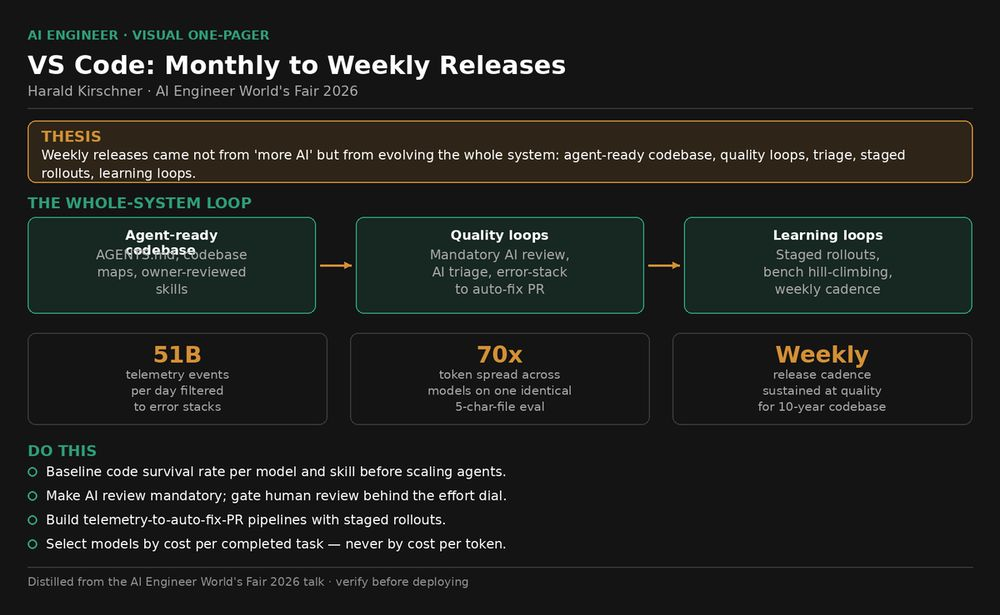
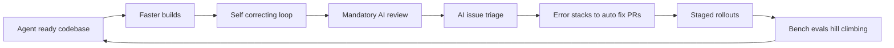
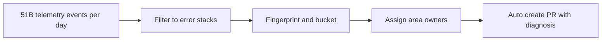
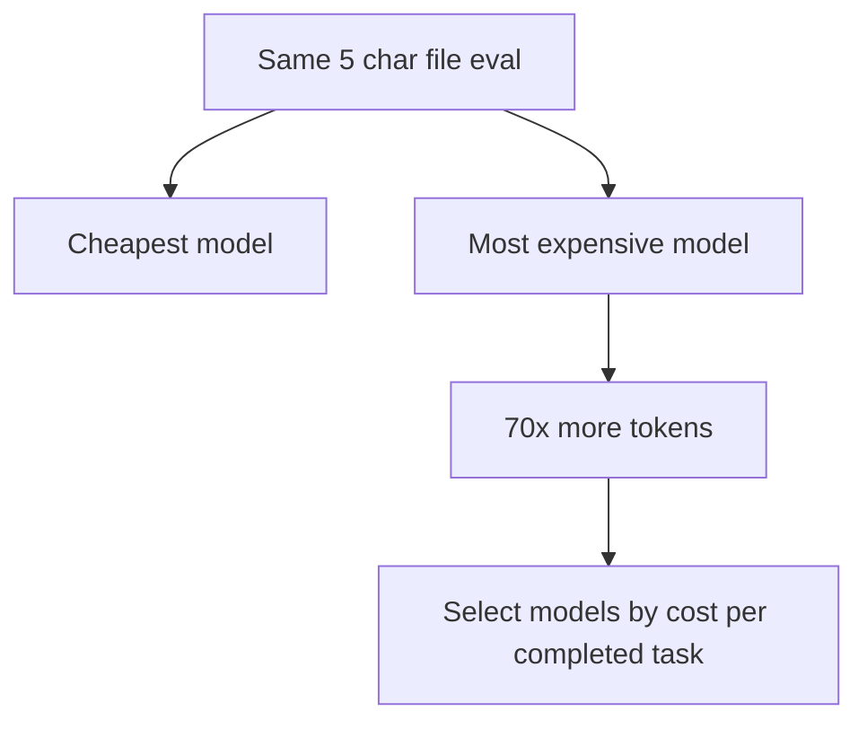

# Talk Notes: "How VS Code Went from Monthly to Weekly Releases with AI" — Harald Kirschner

**Video:** [How VS Code Went from Monthly to Weekly Releases with AI — Harald Kirschner](https://www.youtube.com/watch?v=I2LL_wd89-A) · AI Engineer channel · Oct 3, 2026 · 19:34 · Recorded at AI Engineer World's Fair 2026

## Thesis

After 10 years of monthly releases, VS Code moved to weekly releases not from "more AI" but by evolving the whole system — codebase agent-readiness, quality loops, triage, staged rollouts, and learning loops — so higher velocity ships at quality and the team learns faster.

## The mental model

The whole-system evolution loop that took releases from monthly to weekly:

The telemetry-to-fix pipeline:

The token-efficiency insight — identical eval, wildly different cost:

## Key points

- **Code survival metric** (% of agent-written code actually committed): 55% → 86%, tracked over a year.
- **Success created problems**: massive increase in issues (AI helps file issues — more quality issues but also automated low-quality ones), more open PRs from team velocity and community.
- **The litmus test**: "Can a PM vibe code here?" — Harald himself vibe codes in the VS Code repo; accepted by engineering.
- **Agent-ready codebase**: AGENTS.md files (a slash command generates a good draft), a map of the codebase for agents.
- **Skills**: expert knowledge encoded as skills — e.g., an accessibility best-practices skill, reviewed and maintained by the area owner.
- **TypeScript Go**: 10x faster builds — critical because slow CI/CD compounds when 10–20 agents are running.
- **Let agents use your app**: component browser — automated builds screenshot every component, diffs point out unexpected changes; faster PR review (attach video/screenshots).
- **Self-correcting loop with Playwright**: the /launch skill launches a browser and the agent verifies the fix actually works.
- **Mandatory AI code review**: low/medium/high effort dial for cost-benefit; humans don't even look at a PR until all review comments are resolved.
- **Holding quality**: AI issue triage — filters spam, enriches, translates, assigns area owners; agent mistakes feed back into agent work up front.
- **Error stacks → auto-fix PRs**: 51 billion telemetry events per day filtered down to error stacks; fingerprinting/bucketing; assigned to area owners; a PR is auto-created with an initial diagnosis (example: a cancellation request missing from the RPC protocol).
- **Staged rollouts**: previously YOLO releases to 100%; now staged with monitoring, because rollbacks on installed apps are expensive.
- **VSC-Bench**: their own evals of their agentic product — issues filed to add new scenarios, picked up by an agent from a template; hill climbing against scenarios; offline + online experimentation.
- **70x tokens for a 5-character file**: a simple eval (write a hello-world file) — the most expensive model took 70x more tokens than the cheapest; insight into how you evaluate models.
- **Daily sprints, smaller squads, durable ownership**; 50M+ users on a very small team.
- **Blogs**: "What 50,000 Runs of a 5-Line Eval Taught Us" and "Improving token efficiency in GitHub Copilot."

## Notable quotes & data

- Code survival 55% → 86%.
- 51 billion telemetry events per day → error stacks → auto-fix PRs.
- Most expensive model took 70x more tokens for the same 5-character file.

## Tokenomics / efficiency angle

- Token efficiency: 70x token spread across models for an identical eval — token efficiency is a first-class model criterion.
- TypeScript Go: 10x faster builds unblock agent CI/CD loops.
- AI code-review effort dial (low/medium/high) for explicit cost-benefit.

## Local-deploy takeaways

- **Make token efficiency a model-selection criterion**: the 70x spread on an identical eval proves price-per-token tells you almost nothing — benchmark cost-per-completed-task per model before putting it behind the enterprise router.
- **Code survival rate (agent-written code actually committed) is the deployable metric** for agent quality — track it per model/skill combo; it directly measures wasted generation tokens vs. kept output.
- **Review-effort dials are the cost-control pattern**: low/medium/high effort settings with explicit cost-benefit tradeoffs — apply the same dial to retrieval depth, planning effort, and verification loops.

## How to apply it

1. Baseline code survival rate (agent-written code actually committed) per model and skill combo; re-measure quarterly. The VS Code arc was 55% to 86%.
2. Add AGENTS.md and a generated codebase map to every active repo; encode area expertise as skills reviewed and maintained by the area owner.
3. Turn on mandatory AI code review with a low/medium/high effort dial; block human review until AI review comments are resolved.
4. Stand up AI issue triage — spam filter, enrich, translate, assign area owners — and feed agent mistakes back into prompts and skills up front.
5. Pipe telemetry into error-stack fingerprinting; auto-open PRs with an initial diagnosis routed to area owners; ship via staged rollouts with monitoring.
6. Build an internal agentic bench in the VSC-Bench pattern: template-generated scenarios, hill-climb against them, offline plus online runs; rank models by tokens per completed task and expect large spreads.
