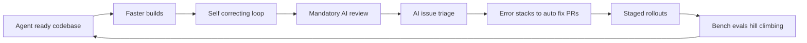
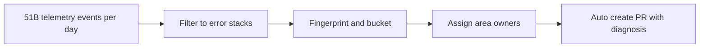
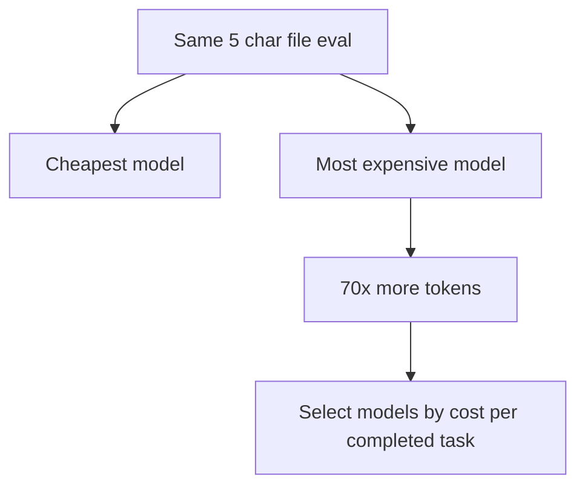

# Talk Notes: "How VS Code Went from Monthly to Weekly Releases with AI" — Harald Kirschner

**Video:** [How VS Code Went from Monthly to Weekly Releases with AI — Harald Kirschner](https://www.youtube.com/watch?v=I2LL_wd89-A) · AI Engineer channel · Oct 3, 2026 · 19:34 · Recorded at AI Engineer World's Fair 2026

## Thesis

After 10 years of monthly releases, VS Code moved to weekly releases not from "more AI" but by evolving the whole system — codebase agent-readiness, quality loops, triage, staged rollouts, and learning loops — so higher velocity ships at quality and the team learns faster.

## The mental model

The whole-system evolution loop that took releases from monthly to weekly:

The telemetry-to-fix pipeline:

The token-efficiency insight — identical eval, wildly different cost:

## Key points

### The arc: three evolutions, in order

1. **Ship faster** — agent-ready codebase, 10× faster builds, prototypes and daily feedback.
2. **Hold quality at speed** — mandatory AI review with an effort dial, AI issue triage, telemetry-to-PR pipeline, staged rollouts.
3. **Learn faster** — VSC-Bench hill-climbing, prototyping, daily sprints, smaller squads, durable ownership. ("A lot of people are missing out ... applying that product taste and applying that learning" as they write more code.)

### Code survival — the headline metric

- **Code survival** (% of agent-written code actually committed): **55% → 86%**, tracked over the past year. Started with GPT-4.1 (transcription of the talk's "GBD 4.1"; inferred), now Claude Opus 4.6 — the gain came from **improving the harness *and* new models**.
- The increase is the trust signal: developers ship AI code faster and in higher volume because more of it survives.

### Success created problems

- **Issue flood**: AI helps people file issues → more *quality* issues from people in more language backgrounds, but also more automated low-quality ones.
- **More open PRs** from team velocity plus community contributions — and counter-intuitively, the number of **community merged PRs is going up too**, not just garbage PRs.
- Context: VS Code shipped **monthly for 10 years** since 1.0 (moved to weekly "several months ago"). Fun fact: the January release ships in February — iteration naming lag, not lateness.

### Agent-ready codebase

- **AGENTS.md as living docs**: every agent in VS Code now has a slash command that generates a good AGENTS.md draft. They must be **lightweight** — a map of the codebase pointing at where to look — and **living**: they evolve as the agent makes mistakes and works.
- **DevEx compounds**: teams that invested in good documentation and onboarding win twice, because agents read the same docs humans do.
- **Skills**: encode expert knowledge that always gets bottlenecked on one person. Example: VS Code's long accessibility investment became an **accessibility best-practices skill**, reviewed and maintained by the accessibility **area owner** — short work previously requiring a human pull-in now ships everywhere.
- **The litmus test**: "Can a PM vibe code here?" — Kirschner vibe codes in the VS Code repo himself and measures acceptance by engineering: how much work does it cost, does it work out of the box locally, does it break when shipped.

### Faster builds — because agents compound slowness

- **TypeScript Go: 10× build improvement.** A slow build is merely annoying for a human (context-switch while CI runs); with **10–20 agents** hitting the same bottleneck, every slow part of CI/CD **compounds**. Automatic PRs + agents fixing code need the CI/CD loop as their feedback channel, so build speed is a velocity ceiling.
- **Prototype before PR**: his scrappy "ask questions tool" PR at the start of the year unblocked the conversation; within weeks the team had a polished, designed experience. Prototypes unlock participation and deeper design discussion instead of landing most of his work directly as VS Code PRs.

### Let agents use your app — UI feedback loops

- **Component browser**: an automated build runs on every VS Code change, screenshots **every component**, and diffs them — catching ripple effects (example: adding a back button to the customization screen shifting something else). Doubles as fast PR review.
- Every developer is asked to attach a video or screenshot of their implementation so nobody re-runs everything from scratch — now automated by the component explorer.
- **Self-correcting loop with the /launch skill**: VS Code is an Electron app (all HTML), so Playwright can launch it, click through a specific scenario, collect logs, and **verify a fix before and after** — the agent reports back once it verified it worked. "Hit launch, move on to the next task."
- His rule: **"If your agent cannot use your application, your product directly to get this feedback loop of is it all working, then that's a really big investment that pays off every time you work on UI."** Alternatives: Xcode MCP for iOS apps ("magical"), Android tooling exists.

### Mandatory AI code review

- GitHub Copilot automated review started unimpressive ("we're not convinced yet") but **massively improved over weeks/months** — now a **mandatory review on every PR**.
- **Effort dial (low/medium/high)**: dial review effort by repo risk — explicit cost-benefit, not one-size-fits-all.
- The gate: **humans don't even look at a PR until all review comments are resolved and addressed.**

### AI issue triage

- AI filters spam, enriches, translates, and **assigns area owners** — raising signal-to-noise on the flood.
- **Human feedback loop on the automation**: agents make mistakes, so they built a Chrome extension letting humans fix duplicated issues; corrections feed back into the agent's upstream work. "That's a really important thing to think about as you have agents doing the work — that you get the human feedback as well."

### Telemetry → auto-fix PRs

- **All own data, own tooling — no external tool.** They'd had ML doing error sorting before; it's now a mix of criteria.
- Pipeline: **51B raw telemetry events/day** → filter to error stacks with the full stack → fingerprint/group/bucket → **10 issues filed, assigned to specific area owners** → an agent auto-creates a **PR with an initial diagnosis**.
- An error dashboard shows every stack with hit counts and affected-user counts so they can react fast.
- Example: the agent traced an error to a **missing cancellation request in the RPC protocol** (introduced by a change connected to find-symbols) — PR opened, ready to merge. "You don't care about errors, you just want a more stable codebase."

### Staged rollouts

- From YOLO releases (release day → open the floodgates to 100%) to **staged rollouts with monitoring** of error logs and issues — web-app practice applied to a desktop app, because **rollbacks on an installed app are expensive**. "We should have probably done it earlier."

### VSC-Bench — learning faster, on their own product

- **Own evals of their agentic product**, always at hand and easy to extend — **all in GitHub issues**.
- Low friction by design: file an issue to add a scenario → **an agent picks it up from a template and bootstraps the scenario for you** — pulling developer scenarios from issues and customer conversations into evals cheaply.
- Then **hill-climb against the scenarios**, confirm improvement **offline**, then **online experimentation** — "classic product lifecycle."
- What VSC-Bench covers (per the team's harness blog): custom agent modes, extension workflows, MCP and tool use, terminal and browser interaction, multi-turn conversations, multi-language tasks (TypeScript, Python, C++, …). Each task runs in a **reproducible, containerized workspace**; the harness launches VS Code, sends prompts, and evaluates the full agent loop — not just final code but whether the agent used editor, terminal, language services, browser, and tools the VS Code way.
- Measures **solution correctness, agent effort, token efficiency, and latency** — and the effort finding matters: scatter data showed an **xhigh reasoning setting using more tokens while resolving slightly fewer tasks** — past the useful effort sweet spot where extra thinking stops converting into better outcomes.
- **PR-gated evals**: any PR touching a core tool, system prompt, or loop behavior gets a `~requires-eval-assessment` label → Azure DevOps build of the merge ref → published as a versioned eval agent (`0.0.0-dev.<sha>`) to the `vscode-evals` npm feed (dev tag) → evald opens a pinned evaluation issue → analysis link posted back on the PR. Harness changes ship with benchmark numbers before merging.

### The 70× token spread — "What 50,000 Runs of a 5-Line Eval Taught Us"

- The `say_hello` eval: **"Add HELLO to HELLO.txt"** with two assertions (file exists, file contains "HELLO"). Same empty workspace, same tools, same fixed prompt, VS Code agent harness — a smoke test run **before every benchmark suite**, which quietly accumulated **50,974 runs across 30 models over six months**.
- Realistic floor: **~50 output tokens** for the one-tool-call direct path (`create_file`); the most disciplined model (Model-L) hit 55.
- **Direct-path rates**: one model (Model-A) takes the direct path in **100% of passing runs**; most models take it only occasionally; **five models never do** — they always plan, explore, search, or narrate first, even for a five-character file.
- Overhead patterns: planning before acting (52–99% of runs across 16 models); exploring an empty workspace (56–96%); narrating reasoning (1,441–3,676 tokens — **29–74× the floor**); wrong tool for the job (one model uses a patch tool 95% of the time); terminal commands when a file API exists.
- **Leanest vs. heaviest ≈ 70× for identical output** — and the most expensive model "was not the high reasoning model" (models anonymized in the blog, so no names).
- **Model size does not predict overhead**: a larger model used 160 tokens vs. a smaller sibling at 485; a "mini" model was the single highest-overhead at 3,676 tokens. Newer generations trend more disciplined — **training maturity, not parameter count**, predicts effort calibration.
- Caveat (theirs): don't overfit the smoke test — keep the full benchmark alongside it. And the goal isn't to eliminate planning; it's to know **"whether a model can tell the difference between a one-step task and a 30-step task."**

### Harness-level token efficiency (Copilot blog, same team)

- **Cached input tokens up to 10× cheaper** than uncached — prompt-prefix stability is direct cost reduction. Extended prompt caching (`prompt_cache_retention: "24h"`, cache moved to roomier GPU-local storage) raised cache hit rates **+919% relative** for GPT-5.4 at 40–60 min request gaps — picking up a session after a long break stays cheap.
- **Tool search (`defer_loading`)**: only tool metadata up front; parameter schemas load on demand, and deferred tools sit *outside* the cached prefix so cache gains keep working. Results: **−8.97%/−10.92% session tokens** for the median Copilot user (GPT-5.4/5.5); Anthropic variant **−18.03% session tokens, −11.09% per-turn tokens**, plus **−4.01% user error rate** after moving to client-side embedding-guided tool search with a curated always-loaded core toolset.
- Anthropic prompt caching: **4 deliberate breakpoints** (end of tool defs, end of system prompt, two rolling anchors) → ~**94% cache hit rate** on agentic workloads.
- **WebSockets** became the default OpenAI transport (GPT-5.2+): TTFT p50 **−19.46%** (GPT-5.3-Codex).
- The trend driving it all: **each new model generation consumes more tokens per task** — harness efficiency is the counter-trend. Next: specialized subagents on the smallest, cheapest models for search/commands/summarization, and transparency UI for cache cold starts.

## By the numbers

- **55% → 86%** — code survival rate (agent-written code actually committed) over the past year; the trust signal behind shipping more AI code.
- **10 years** — monthly release cadence since VS Code 1.0 (the January release ships in February); weekly for "several months."
- **50M+** — users shipped to by a very small team.
- **51B/day** — raw telemetry events per day, filtered down to full error stacks before fingerprinting.
- **10** — issues filed to specific area owners after bucketing (each with an auto-created fix PR).
- **70×** — output-token spread between leanest and heaviest model on the identical 5-character `say_hello` eval.
- **50,974** — runs across 30 models over 6 months behind that finding; ~50 tokens is the realistic floor (best model: 55).
- **100% / 0%** — direct-path rates: the most disciplined model vs. five models that never take the direct path.
- **29–74×** — overhead of the extreme band (Model-AB 3,676 avg tokens) vs. the realistic floor.
- **10×** — TypeScript Go build improvement; also the cost ratio of uncached vs. cached input tokens (OpenAI cached pricing).
- **10–20** — concurrent agents at which a slow CI/CD bottleneck compounds.
- **5–10 min** — default OpenAI prompt-cache lifetime (up to ~1 hr); extended retention keeps it warm for 24h.
- **+919%** — relative cache-hit-rate increase for GPT-5.4 at 40–60 min request gaps (extended prompt caching).
- **94%** — Anthropic prompt-cache hit rate on agentic workloads after reworking breakpoint placement.
- **−18%** — median-user session token cut from Anthropic tool search (−9 to −11% from the OpenAI variant).
- **−19%** — WebSocket TTFT p50 reduction (GPT-5.3-Codex); WebSockets now default for OpenAI GPT-5.2+ across Copilot products.
- **4** — deliberate cache breakpoints (Anthropic): end of tool definitions, end of system prompt, two rolling message anchors.
- (No public figures were given for effort-dial distribution — the only stated dial stat is qualitative: low/medium/high effort set by repo risk.)

## Notable quotes & data

- Code survival 55% → 86%.
- 51 billion telemetry events per day → error stacks → auto-fix PRs.
- Most expensive model took 70x more tokens for the same 5-character file.
- "It's not about using more AI as you work day-to-day... You're not token maxing. It's about evolving the whole system, how you're shipping software, to actually make better use of AI along the whole process."
- "If your agent cannot use your application, your product directly to get this feedback loop of is it all working, then that's a really big investment that pays off every time you work on UI."
- "Don't just tune how you work with agents, but tune where they get feedback. How do you build these loops?" (closing: "find out where your bottlenecks are... and figure out... what's blocking you to move even faster — it's a constant iterative cycle.")
- "The model is the engine, the harness is the car." (VS Code harness blog — why they spend most engineering time on context assembly, tools, loops, and evaluation, not model choice.)
- "The goal is not to eliminate planning. It is to understand whether a model can tell the difference between a one-step task and a 30-step task." (50,000-runs blog)

## Tokenomics / efficiency angle

- Token efficiency: 70x token spread across models for an identical eval — token efficiency is a first-class model criterion.
- TypeScript Go: 10x faster builds unblock agent CI/CD loops.
- AI code-review effort dial (low/medium/high) for explicit cost-benefit.
- **Price-per-token tells you nothing; cost-per-completed-task is the metric.** The 70× eval ran anonymized models (Model-A…AC) — selection must come from your own benchmark on your own harness, because overhead comes from *behavior* (planning, exploring, wrong tools, narrating), not size: a mini model was the worst offender; a larger model beat its smaller sibling. Newer generations trend more disciplined.
- **Model selection shouldn't be the developer's burden**: route on effort calibration, token efficiency, and tool discipline automatically — that's what VS Code's auto model selection invests in.
- **Cache is money**: cached input up to 10× cheaper; prefix stability (breakpoints, stable tool-def boundaries, 24h retention) is a direct cost lever. Flag cache cold starts (session resume after a long pause) as cost events.
- **Tool search is proven, A/B-tested savings**: −9% to −18% session tokens with success rate held — load schemas on demand, keep deferred tools outside the cached prefix.
- **Effort has a sweet spot**: VSC-Bench showed xhigh effort costing more tokens while resolving *fewer* tasks. Dial effort by risk — low/medium/high — and verify, don't assume more thinking = better.
- **Counter-trend awareness**: each new model generation consumes more tokens per task; harness-level wins (caching, deferral, subagents on the cheapest models) are what keep cost per task flat. Measure tokens per *passing* task, not per run.
- **Log tool sequences, not just counts**: `{tool_sequence, output_tokens, pass}` tells you where overhead came from — the only way to attribute and cut it.

## Local-deploy takeaways

- **Make token efficiency a model-selection criterion**: the 70x spread on an identical eval proves price-per-token tells you almost nothing — benchmark cost-per-completed-task per model before putting it behind the enterprise router.
- **Code survival rate (agent-written code actually committed) is the deployable metric** for agent quality — track it per model/skill combo; it directly measures wasted generation tokens vs. kept output.
- **Review-effort dials are the cost-control pattern**: low/medium/high effort settings with explicit cost-benefit tradeoffs — apply the same dial to retrieval depth, planning effort, and verification loops.
- **The telemetry-to-PR pipeline runs on their own data with their own tooling — no external service.** That's the local-first pattern: fingerprint error stacks, route to owners, auto-open diagnosed PRs, all inside your stack.
- **PR-gated evals for harness changes**: any PR touching prompts, tools, or loop behavior ships with benchmark numbers before merging (`~requires-eval-assessment` pattern: build → versioned eval agent → evald issue → report link on the PR).
- **Stand up a smoke eval first** (`say_hello` pattern): smallest unambiguous task, run constantly as preflight before nightly evals, model onboarding, and infra changes; log tool sequences + output tokens so harness regressions show up before they get expensive across long sessions.

## Decision framework

Kirschner never hands you a checklist — he gives an order of operations and a method for finding the next bottleneck:

1. **Fix in this order**: (1) *ship faster* — agent-ready codebase (AGENTS.md, codebase maps, skills) plus fast builds, because 10–20 agents compound every bottleneck; (2) *hold quality at speed* — mandatory review with effort dials, AI triage with human feedback loops; (3) *learn faster* — own evals, hill-climbing, online experimentation. Skip a stage and the previous one strands you: speed without quality gates → issue/PR floods; quality gates without evals → shipping fast but not the right thing.
2. **Measure first, then evolve**: code survival rate before adding more agents; tokens per completed task before routing models; find the bottleneck, fix it, then find the next one — "a constant iterative cycle."
3. **Traps he named**:
   - "More AI" alone doesn't do it — "you're not token maxing." Velocity is a system property, not an adoption percentage.
   - Don't tune agent craft before feedback loops: "don't just tune how you work with agents, but tune **where they get feedback**. How do you build these loops?"
   - Every automated loop needs a human correction path that feeds mistakes **back upstream** (triage extension → agent prompts/skills; review gate → PRs) — don't let automation drift.
   - Don't overfit one eval: keep the broad suite alongside the smoke test.
   - Staged rollouts for anything installed: rollbacks are expensive; "we should have probably done it earlier."
   - Prefer prototypes to big PRs when unblocking discussion — a scrappy PR that gets the idea visible beats a perfect one that never starts the conversation.

## How to apply it

1. Baseline code survival rate (agent-written code actually committed) per model and skill combo; re-measure quarterly. The VS Code arc was 55% to 86%.
2. Add AGENTS.md and a generated codebase map to every active repo — keep them lightweight and treat them as living docs that evolve as the agent makes mistakes; encode area expertise as skills reviewed and maintained by the area owner. Run the PM litmus test: can a non-engineer vibe code in this repo without breaking things?
3. Attack build/CI speed before scaling agents: any step 10–20 concurrent agents will hit becomes a compounded bottleneck. Target 10× on the worst offender (VS Code's was the TypeScript build).
4. Stand up a self-correcting UI loop: automated component screenshots on every build with diffing, plus a `/launch`-style skill so the agent can click through your app, collect logs, and verify fixes before/after — never accept "it looks perfect" without the agent driving the app.
5. Turn on mandatory AI code review with a low/medium/high effort dial keyed to repo risk; block human review until AI review comments are resolved.
6. Stand up AI issue triage — spam filter, enrich, translate, assign area owners — and build a human correction path (e.g., a fix-duplicates tool) whose corrections feed back into prompts and skills up front.
7. Pipe telemetry into error-stack fingerprinting on your own data; auto-open PRs with an initial diagnosis routed to area owners; ship via staged rollouts with monitoring (rollbacks on installed apps are expensive).
8. Build an internal agentic bench in the VSC-Bench pattern: template-generated scenarios seeded from GitHub issues (an agent bootstraps each scenario from a template to keep authoring cheap), hill-climb against them, offline then online runs; rank models by tokens per completed task and expect large spreads. Gate harness PRs on bench numbers before merge.
9. Add a smoke eval (`say_hello` pattern) as preflight before nightly evals, model onboarding, and infra changes; log `tool_sequence` + `output_tokens`, not just pass/fail.
10. Apply harness-level token levers before buying more model: keep prompt prefixes stable and caches warm (cached input up to 10× cheaper), defer tool schemas until searched, and push narrow work (search, command-running, summarization) to subagents on the smallest/cheapest models.

## Sources

- **Full spoken transcript** (worked): https://www.usetranscribe.io/yt/I2LL_wd89-A/
- **Video**: https://www.youtube.com/watch?v=I2LL_wd89-A
- **"What 50,000 Runs of a 5-Line Eval Taught Us"** — VS Code Eval Team, Jun 19 2026 (the 70× eval, overhead patterns, model-size finding): https://code.visualstudio.com/blogs/2026/06/19/what-50000-runs-taught-us
- **"Improving token efficiency for GitHub Copilot in VS Code"** — Ryan Caldwell & Bhavya U, Jun 17 2026 (prompt caching, tool search, WebSockets, subagent direction): https://code.visualstudio.com/blogs/2026/06/17/improving-token-efficiency-in-github-copilot
- **"The Coding Harness Behind GitHub Copilot in VS Code"** — Julia Kasper, Megan Rogge & Aaron Munger, May 15 2026 (VSC-Bench design, PR-gated eval assessment, "the model is the engine, the harness is the car"): https://code.visualstudio.com/blogs/2026/05/15/agent-harnesses-github-copilot-vscode
- Note: the three blogs are VS Code *team* posts Kirschner referenced in the talk (the 70× eval and token-efficiency blogs by name); none is bylined to him personally.
