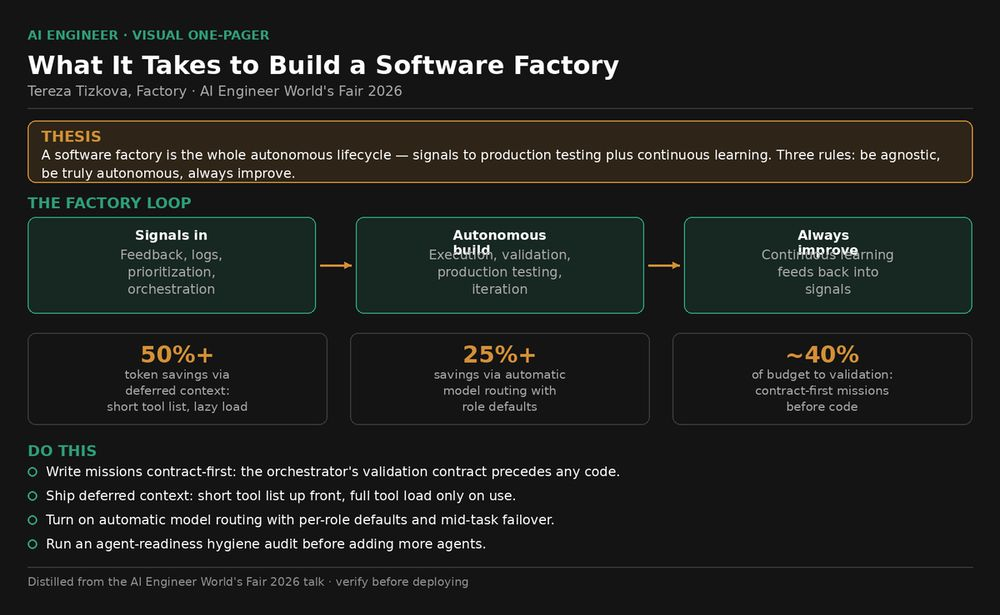
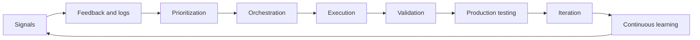
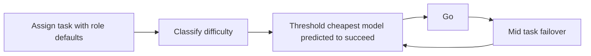
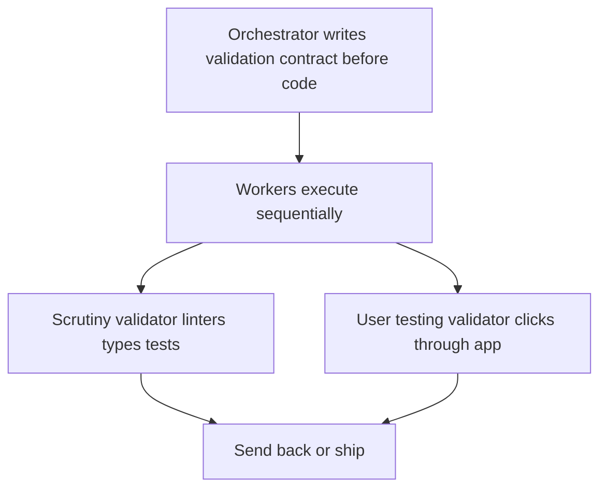

# Talk Notes: "What It Actually Takes to Build a Software Factory" — Tereza Tížková, Factory

**Video:** [What It Actually Takes to Build a Software Factory — Tereza Tížková, Factory](https://www.youtube.com/watch?v=vGCJ7diEtrw) · AI Engineer channel · Sep 27, 2026 · 22:49 · Recorded at AI Engineer World's Fair 2026

**Note:** distilled from the full spoken transcript (read in full via https://www.usetranscribe.io/yt/vGCJ7diEtrw/), cross-checked against Factory's own writing (research posts linked in Sources). Secondary/tertiary claims are marked where used.

## Thesis

A software factory isn't a coding agent or even a swarm of agents — it's the whole autonomous software lifecycle (signals → feedback/logs → prioritization → orchestration → execution → validation → production testing → iteration + continuous learning). Building one takes three things — be agnostic, be truly autonomous, always improve — and requires rebuilding the organization from the ground up, not bolting on a consultancy. (In production for enterprises like EY and Adobe; Factory's own announcements add NVIDIA, Palo Alto Networks, Adyen, Blackstone, Wipro, Comarch.) She frames the talk around five questions: what a software factory is, whether to build your own or outsource it, what works in production, the main challenges — and how much it all costs (0:36).

## The mental model

The software factory definition loop — the whole autonomous lifecycle:

Automatic model routing — cheapest model predicted to succeed:

Missions — validation contract before code, validators that judge code they did not write:

## Key points

- **Definition.** The whole loop of developing software with autonomy: collecting signals, reacting to user feedback and logs, prioritizing, orchestrating, executing, validating, testing in production, iterating, continuously improving and gaining knowledge/skills. Factory's own 2.0 announcement phrases the same loop: signals (bug reports, internal conversations, customer feedback, business requirements) → triaged into planned changes → built, tested, reviewed, secured, shipped, monitored → monitoring generates more signals, "the entire system is a continuous feedback loop."
- **Why now.** 2023-era attempts (AutoGPT, BabyAGI) failed — hallucinating LLMs, context length, reasoning quality, and no good isolated environments where agents can work in isolation. The tech has caught up, so the paradigm is becoming popular and actually useful.
- **What it's not.** Not a coding agent, "not even a swarm of coding agents, even thousands of agents" — "generating code... that's the easy part"; engineers don't spend most time writing code. Not a consultancy or abstract strategy someone sells your organization — "you can't invite a consultancy and just throw something in the middle of your organization. You should really be mindful and rebuild it from scratch."
- **The three rules — what each concretely requires.**
  - **(a) Be agnostic — on two axes.** Independent of LLM choices *and* independent of how you already work as an organization. As a builder you must work across the environments people already use (Slack, GitHub, "connected to everything") and let people bring the subscriptions they already have, because frontier models and benchmarks churn constantly — "it's so difficult to catch up but also to predict what will be winning."
  - **(b) Be truly autonomous.** Give agents the right trust, permissions, and governance, and let them run long: "the predictions are that agents will run even a year or more years without the human in the loop" — "our missions already... run for weeks. So it's not that crazy." The hard problem isn't loops (the Ralph loop — specifying tasks and splitting to subtasks — is a known concept); it's defining what "done" means for open-ended, nondeterministic, open-world tasks. She gives a colleague's example: a loop of agents 3D-printing the company logo — verification there means checking something physical got printed.
  - **(c) Always improving.** Onboard agents the way you onboard humans: codebase understanding, good structure, documentation — then let them gain new knowledge and share it within the team. The parallel: when you join a company, most rules "are not really codified anywhere... you just learn and observe" — the same "between the lines" problem exists for agents. Factory's answer: **plugins** — packaged, reusable skills and context, plus auto-updating documentation that reviews what you have.
- **Model agnosticism — the Coinbase chart.** CEO-of-Coinbase tweet: the org kept growing token usage ("token maxing") while flattening spend. How: different default models per role ("stop pushing people to use only the frontier as a default"), caching, no spending limits but requiring visible results when you spend a lot, and smart routing — "token optimizing between the LLMs."
- **Factory's "automatic model routing" (product name: Factory Router, launched June 2026).** Four parts, in order: (1) **assign the task** — as an org you set permissions and different default models per role (marketing/sales vs engineers can differ); (2) **classification — "the magic of the routing"**: look at the structure of the prompt, the codebase, how difficult the task is, what tools are being used — all these factors — and produce a difficulty classification; (3) **threshold**: "what is enough to accomplish the task" — choose the cheapest model above the threshold, "cheapest model that is predicted to accomplish your task"; (4) **go**, with automatic failover mid-task if the model is failing or in trouble — "but it usually doesn't happen." Beyond cost: reliability and speed — open models are often faster, and if one LLM provider fails it switches automatically. She fielded the hard questions (does it work, what if it mis-routes, slower, more expensive, what if the model needs upgrading mid-task, how does caching interact) — the honest answer: building a good router is difficult because you must classify well and avoid switching too often, but even switching mid-task to a harder model still nets out worthwhile. Her benchmark is deliberately conservative: "you can save for example 25% but even more probably."
- **Why routing belongs in the harness, not a gateway** (Factory Research, Abhay Singhal, Aug 2026 — Factory's deeper writeup of the same system). Every model call repeats most of the session; providers cache the processed prefix for a *particular* model at ~a tenth of fresh rates, but moving the transcript to another model reprocesses it at 5–10× cached rates. Only the harness owns the task state needed to judge a switch: whether work has stalled, what the latest result changed, how much remains. The harness must also choose the model *before* assembling the request — system instructions, tool definitions, and reasoning settings differ per model (model families aren't always wire-compatible; switching can discard encrypted reasoning content). "The cheapest next call often comes from the model that is already warm, even when another model lists a lower price. Staying put is itself a routing decision." Related defaults from the same writeup: an efficient model explores/searches and gathers context while a frontier model diagnoses and synthesizes; Factory's default validator comes from a **different model family** than the default implementer.
- **Caching.** "Just a pricing decision. It's not a technical challenge because everyone can do caching. It's just what price you pass on the users and what deals you make with the API providers." The labs save by caching and skipping context prefill — and open models can do this too: host them on dedicated compute and "take the same advantage of the caching."
- **The scary chart.** Autonomous run durations keep growing — but "even if you can run for a very long time, it doesn't mean that it will be reliable in production." Cheating is the named failure mode: "if you write what it means to be done in the wrong way, the agent can try to pass your tests but not really... accomplish [the task], but instead try to solve just passing your test."
- **Factory "missions."** Long-running agent sessions ("we send the agent to the mission"); they "work in the loop and iterating on task until it's done and they can do it even for weeks." Structure: a main **orchestrator** agent "decides and writes the conditions what needs to be done" (the validation contract, *before any code*), assigns work to **worker** agents, and **validators** review. Workers run in **sequence, not a parallel swarm** — "we actually found that if you do this you end up with more fresh context and kind of fresh head. Same as... when humans have like other colleagues verifying their code" — though each worker in the sequence may itself run parallel sub-agents (web research, building files). Validators review output, give feedback, and send it back to the beginning. She visualizes a mission as "a loop with smaller loops because every of the agents are running in loops as well, but overall it's like one big loop." (Note: Factory's 2.0 announcement describes Missions as "decomposing work into parallel tracks" — the talk's emphasis is sequential workers with parallelism *inside* each worker; treat as different levels of decomposition.) Real customer mission: **16 hours, with validation taking "even 40%" of the whole process.**
- **Validators judge code they didn't write.** Two types: **scrutiny validator** — "really verifies how the codebase looks... the linters, types, tests, it's really rigorous check of the code"; **user-testing validator** — "in the arena," works in its virtual computer, "clicks on the stuff and really checks if everything works." The case she gives: an engineer migrating codebases with "droid" (Factory's agent) *needed* the click-through agent, because other products produced a dummy that looked right in code but "wasn't interactive." Enabled by progress in computer use plus persistent VMs for agents — "wasn't here before... but now it's really great." Factory's research writeup adds the mechanics: an **information wall** — the validator's instrument (its cases and raw results) never crosses to the implementer; only the candidate and clustered findings cross; the orchestrator adjudicates, rejects noise, and issues directives at the level of missing features/subsystems; the validator may *expand* the instrument as it learns but never *weaken* it to fit what was built.
- **Context: the "deferred context engine."** "The elephant in the room" for long missions: enterprises use *hundreds* of tools (Figma, Notion, Gmail, Drive, Slack), each with specifications, schemas, parameters, and long descriptions — so agents bloat with context, pick the wrong tool when two sound similar, and fill the context window until it must compress. "This is really dangerous." The engine **progressively discloses** tools: a short list with short descriptions first; full tool definitions load only when actually needed. Crucially: "nothing is actually removed, it's just hidden and not reachable until needed." Savings scale with tool count: "the more [tools] actually you save... you can save 50% of tokens or more."
- **Power law of adoption.** "When adopting AI you either succeed big or you can fail big." An unready codebase makes the software factory *degrade* your code — "a big and growing gap in productivity between those who just adopted AI versus those who actually thought about it a bit more." She cites Stanford data: without a structured codebase and good documentation, AI can make your code worse — "this can really compound more and more and it's difficult to go back."
- **Agent readiness.** A "hygiene check" of the codebase (she dislikes the word "framework"): "nice correlation between how your codebase is looking... and how good you're going to adopt the AI." Checks: how reproducible the developer environment is, good tests, documentation, code style, linters — "everything that you would do also to keep codebase clean." Bigger customers go through the checks and follow up with recommended fixes.
- **Humans.** Won't be obsoleted — "we just [keep] moving up levels to the cooler tasks": human computers → programming languages → coding agents → software factories. "We should be as humans deciding what to build in the software, not how to build it." Her "warning chart": AI will take the annoying stuff — enterprise alignment meetings, status syncs, the context-gathering "between the lines" — "and you could be just talking about the cool stuff." Close: "go touch some grass and let your agents build for you."
- **Production context.** Per the talk, the factory is "possible to build... in production for enterprises like EY or Adobe." Factory's 2.0 announcement widens the list: NVIDIA, Palo Alto Networks, Adyen, Blackstone, Wipro, Comarch — and describes the graduated autonomy spectrum: well-defined tasks run as simple Droids/skills, recurring workflows as Automations, long-running or local execution on Droid Computers, multi-agent execution over hours/days as Missions — "not every process should use long-horizon autonomous tasks."

## By the numbers

Every hard number from the talk and Factory's writing, with what it measures:

- **50%+ token savings** — deferred context engine on tool-heavy enterprise setups; savings *grow* with tool count (talk; her phrasing: "you can save 50% of tokens or more").
- **25%+ cost savings** — automatic model routing, her deliberately conservative talk benchmark ("you can save for example 25% but even more probably").
- **58% aggregate cost cut** vs pricing every call at the frontier model; **median session 76%**, **9-in-10 sessions saved ≥50%** — Factory Router over 2+ months of production customer work (Factory Research, Aug 2026).
- **81s → 49s median turn latency** — frontier-pinned vs routed sessions (routing is faster, not just cheaper).
- **99% of frontier pass rate at ~20% lower cost/run (Terminal-Bench 2); 96% at ~25% lower (Legacy-Bench)** — routed vs frontier-only on the same tasks; cost per successful run 80.5% / 78.0% of frontier (vendor-published benchmarks — read with usual care).
- **0% savings can be the right answer** — one production session (Prisma/Supabase migration, 67 turns) stayed on the frontier model throughout because the work never offered a safe step-down (research).
- **2.12× baseline** — modeled cost of cache-blind gateway switching at turns 61–150 (vs all-frontier single-model baseline); cache-aware harness routing stays at **0.19–0.28×** (research).
- **423 turns, 10 sessions, ~12h** — median Factory Mission; routing saves **37.8%** of full mission cost vs all-frontier pricing (research).
- **16 hours, 40% validation** — real customer mission in the talk; validation is nearly half the work.
- **36% → 90% behavioral parity** — GDAL cleanroom reimplementation: single agent (17k lines, stopped because *it* judged itself done) vs orchestrator/implementer/validator system with a pre-written validation instrument (115k lines); cost was 14× credits and 13× wall time (8.5h → 96h) — but every single-agent run ended because the agent *decided* to end it, so budget wasn't the differentiator. 7-Zip went 54→95%, DuckDB 34→80% (Factory Research).
- **56.7 → 89.3** median (Fable, 73% of the gap closed), **45.1 → 75.4** (Kimi), **48.6 → 66.2** (GPT-5.6-sol) — single-agent vs system medians across the 24 hardest ProgramBench tasks (research).
- **Weeks** — Factory missions already run for weeks (talk); predictions of a year or more without human in the loop.

## Notable quotes & data

- "Software factory is not just coding agent and it's not even a swarm of coding agents even thousands of agents because generating code... that's the easy part."
- "You can save for example 25% but even more probably" (model routing); "you can save 50% of tokens or more" (deferred context engine)
- "What is enough to accomplish the task" — the routing threshold, verbatim.
- "Staying put is itself a routing decision." (Factory Research)
- "We should be as humans deciding what to build in the software, not how to build it."
- "Go touch some grass and let your agents build for you."
- Real mission: 16 hours, 40% of it validation; missions already run for weeks

## Tokenomics / efficiency angle

- **Automatic model routing.** Classify task difficulty → cheapest model above the capability threshold; ~25%+ cost savings plus reliability/speed (open models often faster, provider failover). The Coinbase "token maxing with flat spend" example is the enterprise playbook: per-role defaults, caching, visible results, smart routing.
- **Routing belongs in the harness.** A gateway-level router is cache-blind and can make long sessions *cost more* (modeled 2.12× frontier baseline at turns 61–150); harness routing prices switches against warm prefix cache and task state, landing at 0.19–0.28× baseline. Production savings concentrate in the longest sessions — the same sessions that dominate inference spend.
- **Deferred context engine.** Progressive tool disclosure saves 50%+ tokens at scale — the same retrieval-before-inclusion principle as the playbook's context-management stack, applied to tool definitions.
- **Caching as pricing, not tech.** Open models on dedicated compute capture the same prefill savings the labs do — a cost-structure argument for self-hosting.
- **Validation is a first-class budget line.** 40% of a 16-hour mission went to validation — factory economics must price eval cost, not just generation cost. The GDAL result sharpens this: the system run cost 14× credits and 13× wall time to go from 36% to 90% parity — quality is bought with validation compute.

## Local-deploy takeaways

- Self-hosted open models on dedicated compute unlock the same caching/prefill savings API providers price in — a concrete cost case for local inference infra.
- The deferred context engine pattern (short tool list + lazy load) is directly implementable in a local harness to cut per-task token overhead.
- The "agent readiness" hygiene checklist (reproducible dev env, tests, docs, linters) is a prerequisite any local factory deployment should audit first.
- Copy the harness-level router design, not a gateway: route at request-construction time (per-role defaults, difficulty classification, cheapest-above-threshold, failover-only switching), keep the warm model warm, and default validators to a different model family than implementers — all of this is implementable in a local harness.
- Sovereignty is productized: Factory ships cloud, BYOK, self-hosted data plane, EU-specific, and fully air-gapped deployments with learning that stays inside the customer's walls (company announcement) — the local-first pattern has enterprise precedent.

## Decision framework

How the three rules read as build-vs-buy and org-design guidance:

1. **Agnostic → buy agnosticism, not models.** Don't bet on a model winner (frontier churn makes it unwinnable); buy or build the integration layer — BYO subscriptions, Slack/GitHub-native operation — and put routing *in the harness*, where the request is built and the cache is warm, never at a cache-blind gateway.
2. **Autonomous → rebuild the org, don't bolt on.** A consultancy dropped "in the middle of your organization" doesn't work; trust, permissions, and governance have to be redesigned. Graduate autonomy by readiness — Droids/skills for well-defined tasks, Automations for recurring workflows, long-horizon Missions only where warranted — and define "done" (validation contract, instrument) *before* adding loops, or agents will optimize for passing tests instead of the task.
3. **Always improving → compound knowledge as assets.** Plugins (packaged skills + context), auto-updating docs, and validation instruments are durable capital that survives individual sessions; the factory's capability should grow with every mission.
- **What to fix first:** agent-readiness hygiene *before* agents. Power law applies — unready codebases don't just underperform, they degrade (Stanford data). The bigger customers do the checks and the recommended fixes first.
- **Traps she named:** (a) bolting on a consultancy instead of rebuilding; (b) gateway-level routing that looks cheaper but is cache-blind (up to ~2.12× baseline on long sessions); (c) defining "done" loosely and getting cheating; (d) pushing the frontier model as the org-wide default; (e) chasing per-task savings targets — 0% can be the right answer for a session (inferred from the Prisma case).

## How to apply it

1. **Mission template.** Orchestrator writes the validation contract *before any code*: an inventory of what must be established, procedures for establishing each part, and the evidence that counts (the GDAL instrument used weighted invocation cases plus a grading policy byte-comparing exit code, stdout, stderr, and full work-tree delta against an oracle). Hold an **information wall**: the validator keeps its cases, workers never see them — only the candidate and clustered findings cross. Workers execute **sequentially** (fresh context; each may run parallel sub-agents inside). Orchestrator adjudicates findings, rejects noise, and issues directives at feature/subsystem level. Budget ~40% of runtime for validation.
2. **Routing.** Per-role default models; classify difficulty from prompt structure, codebase, task difficulty, and tools used; pick the cheapest model above the threshold; fail over mid-task only on failure or trouble. Prefer the warm model (switching discards prefix cache); accept 0%-savings sessions; measure cost per completed task and the per-session savings distribution, not just the mean.
3. **Deferred context engine.** Short tool list + short descriptions up front; full definitions lazy-loaded on demand; nothing removed, just hidden. Audit for near-duplicate tools (wrong-tool selection is the failure mode). Target 50%+ token savings on tool-heavy setups — savings grow with tool count.
4. **Agent-readiness audit before scaling autonomy:** reproducible dev environment, tests, docs, code style, linters. Fix what fails first — the bigger customers do checks + recommended fixes before ramping up.
5. **Split validators:** scrutiny (linters, types, tests) and user-testing (computer-use agent clicking through the app in a persistent VM — catches the non-interactive dummies static checks miss). Default the two to different model families.
6. **Package reusable knowledge** as plugins/skills with auto-updating docs so the factory gains knowledge instead of re-learning it; treat validation instruments as durable assets, not session scratch.

## Sources

- Video: https://www.youtube.com/watch?v=vGCJ7diEtrw
- Full spoken transcript (primary for the talk content above): https://www.usetranscribe.io/yt/vGCJ7diEtrw/
- Factory Research, "Why model routing must be in the harness" (Abhay Singhal, Aug 24, 2026) — Factory Router production numbers, harness-vs-gateway mechanics, cache-blindness analysis: https://factory.ai/news/model-routing-belongs-in-the-harness
- Factory Research, "What it Takes for Coding Agents to Complete Large Software Tasks" (Aug 27, 2026) — validation-contract/instrument experiment (GDAL 36%→90%), information wall, mission structure: https://factory.ai/news/what-it-takes-for-coding-agents-to-complete-large-software-tasks
- Factory, "Factory 2.0: From coding agents to software factories" (Matan Grinberg, Eno Reyes, Jun 15, 2026) — software-factory definition, model independence, sovereign intelligence, autonomy spectrum, production customer list: https://factory.ai/news/software-factory
