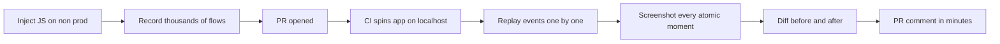
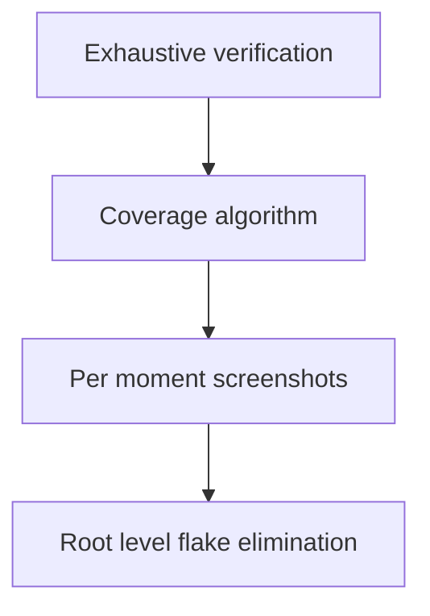
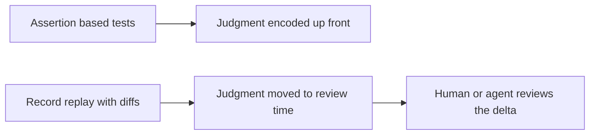

# Talk Notes: "Why AI Didn't Actually Make You Ship Faster" — Gabriel Spencer-Harper, Meticulous

**Video:** [Why AI Didn't Actually Make You Ship Faster — Gabriel Spencer-Harper, Meticulous](https://www.youtube.com/watch?v=HLTa7Vcs4X0) · AI Engineer channel · Oct 2, 2026 · 11:14 · Recorded at AI Engineer World's Fair 2026

**Note:** YouTube's transcript was unreadable in our environment, so this is distilled from the video's own description/chapters plus biggo.com's AI-generated talk summary and vendor docs — treat biggo-derived points as secondary, not verbatim transcript.

## Thesis

AI writes code faster than humans can review it, so verification — not generation — is now the bottleneck. Assertion-based tests cannot exhaustively define correct behavior up front; Meticulous inverts the model: record real user workflows → replay them on CI → screenshot every atomic moment → diff before/after → human or agent judges expected vs unexpected. "If you have exhaustive verification, then you can ship code at the speed that your agents write it."

## The mental model

The record-to-verdict pipeline on every PR:

The interdependent stack — each layer depends on the one below:

The testing-model inversion:

## Key points

- **Three consequences of the verification gap:** (1) bugs/regressions with business impact; (2) orgs spending double-digit percentages of time maintaining e2e suites — manual validation, review, flake debugging, test updates; (3) foregone capability (could bump all dependencies, do sweeping refactors, but don't dare).
- **Framing question:** if an engineer AI-generated a PR, would you merge without checking feature flags, roles, permissions, settings, configs, edge cases? Most orgs answer no.
- **Assertion-based testing encodes judgment up front;** Meticulous shows diffs and moves judgment to review time ("I or an agent does" the review).
- **Pipeline:** one line of JS injected on non-production (localhost/QA/dev/staging) records thousands to tens of thousands of flows → PR opened → CI spins app on localhost:3000 → replay a subset, dispatching events one by one → screenshot at every atomic moment before/after → diff sequences → PR comment within minutes.
- **Demo:** a name change and an introduced drop-down error surfaced as diffs in light mode, dark mode, and the logical error's manifestation.
- **Network mocking:** record all requests/responses at record time, stub at replay → idempotency (1,000 identical runs), per-test isolation (no race conditions), horizontal parallelization → results in minutes.
- **Deterministic browser:** augmented "from the scheduling engine layer up" — eliminates flakes from CPU clock speed, setTimeout/setInterval interleaving, animation timing. "Orders of magnitude fewer flakes" than Cypress/Playwright.
- **Scale:** screenshot volume is tens to hundreds of millions; per-moment screenshotting is only viable because flakiness is fixed at the root.
- **Code coverage reframe:** coverage is "a terrible metric for every tool in the world apart from Meticulous" — a 100%-coverage Cypress test with one assertion proves nothing. Meticulous replays each workflow against main, maps workflows to executed lines, selects the coverage-maximizing subset, so code-covered ≈ code-tested (example: 412-step flow, single-pixel diff flagged).
- **Interdependent stack:** exhaustive verification ← coverage algorithm ← per-moment screenshots ← root-level flake elimination.
- **Adoption:** entire engineering orgs at Discord, Wiz, Dropbox, Notion, ElevenLabs, LaunchDarkly. Daily use by anyone touching front-end; zero developer effort.

## Notable quotes & data

- "If you have exhaustive verification, then you can ship code at the speed that your agents write it. If you don't, then someone somewhere at your organization is spending time verifying code, and that is now your new bottleneck."
- "Code-covered is not the same as code-tested, but with Meticulous, it actually is approximately the same."
- "AI writes code faster than humans can review it. And review and verification is now the new bottleneck."
- **Stat:** orgs spend double-digit percentages of eng time maintaining e2e suites; tens to hundreds of millions of screenshots; 412-step flow, single-pixel diff flagged.

## Tokenomics / efficiency angle

- Horizontal parallelization → verification results in minutes; orders-of-magnitude fewer flakes = less rerun/maintenance waste.
- Attacks the double-digit-percentage eng-time tax of e2e suite maintenance; zero developer effort to adopt.

## Local-deploy takeaways

- The core insight is harness-shaped: record-replay with network stubbing gives 1,000 identical runs and per-test isolation — a local deterministic replay rig removes both flakes and the cloud CI queue for front-end verification.
- Diff-at-review-time (judgment moved to review) maps to agent workflows: agents generate, cheap diffs surface, humans judge only the delta.

## How to apply it

1. Inject the recording snippet on non-prod environments this week and capture the real flows users already run — thousands of flows, zero developer effort.
2. Build the replay side in CI: spin the app locally, dispatch recorded events one by one, screenshot every atomic moment, diff against main, post the delta as a PR comment within minutes.
3. Add network mocking: record requests/responses at record time, stub at replay — this buys idempotency (1,000 identical runs), per-test isolation, and horizontal parallelization.
4. Fix flakiness at the root with a deterministic browser layer (CPU clock, setTimeout/setInterval interleaving, animation timing) before scaling screenshot volume.
5. Add coverage-maximizing subset selection over recorded workflows so code-covered becomes code-tested, then prune the assertion suites it replaces.
6. Track the KPI that matters: share of eng time spent maintaining e2e suites and reviewing — drive it down as verification gets exhaustive.

## Sources

- biggo AI summary: https://finance.biggo.com/podcast/55a2eff08aedad5a
- Video description: https://www.youtube.com/watch?v=HLTa7Vcs4X0
