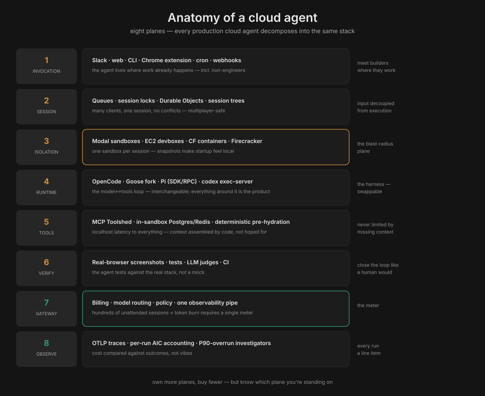
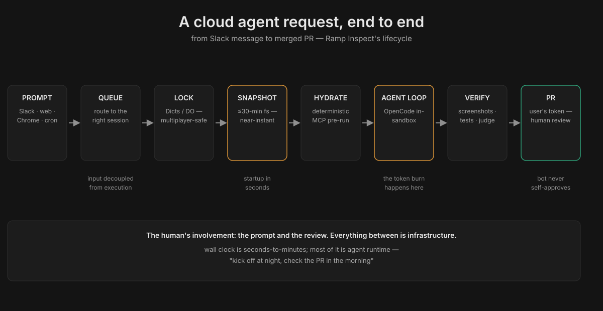

# Anatomy of a Cloud Agent

**What this is:** the distributed-systems anatomy of agents that live in the cloud — not a CLI on your laptop, but an agent invoked from Slack, executing in an isolated sandbox, persisting beyond any single device, and serving hundreds of concurrent sessions. The reference implementation is Ramp's Inspect on Modal; the primitives come from Cloudflare, Stripe, Coinbase, and Pi Durable. This dossier maps every layer, the request lifecycle, and the build recipe.

**Related:** [Pi harness dossier](pi-harness.md) (the runtime layer) · [Palafox talk](scaling-custom-agents-copilot-palafox.md) (the pipeline/cost layer)

## What a cloud agent is

A local agent (Pi, Claude Code on your laptop) is a process you start and watch. A **cloud agent** is infrastructure:

- **Invoked remotely** — Slack message, web UI, Chrome extension, cron schedule, webhook — not a terminal you babysit.
- **Executes in isolated compute** — its own sandbox/VM/container per session, not your laptop's filesystem.
- **Persists beyond devices** — kick it off at night from your phone; check the PR in the morning. Laptop sleep is irrelevant.
- **Serves many** — hundreds of concurrent sessions, multiplayer collaboration on one session, zero local setup for non-engineers.

Ramp's Inspect is the canonical example: an internal background coding agent that now starts **~50% of all merged PRs** at Ramp, with **80%+ of Inspect's own codebase written by Inspect itself**. Nobody mandated it; it won on merit in a couple of months.

## Why cloud: the four unlocks

Local agents hit four walls. Cloud removes all four:

1. **Unlimited parallelism.** A laptop runs a few agents; Ramp's builders get "effectively hundreds of computers that they can work on simultaneously." Stripe's 10-second devboxes, Modal's infinite sandboxes — concurrency becomes an infrastructure property, not a laptop constraint. This was Ramp's explicit reason for building: engineers wanted more parallel agents than local machines support.
2. **Persistence.** Sessions outlive the device. Modal's queues decouple input from execution; Cloudflare's Durable Object alarms are a built-in "resume work later" primitive. The workflow becomes: prompt at night, PR in the morning.
3. **Multiplayer.** Several engineers watch and guide one session simultaneously (Ramp: session state coordinated through shared locks; all sessions public, 150+ contributors). A local agent is a solo instrument; a cloud agent is an ensemble.
4. **Full-stack environments, zero setup.** Each Inspect session is a complete dev stack — Postgres, Redis, Temporal, RabbitMQ, Vite, Chromium via VNC — identical to an engineer's machine. A PM or designer gets the exact same setup without installing anything. "The only thing stopping them is this 12 pixel tall wall of code in the editor" — the cloud agent removes the wall.

The bottleneck shift, in Ramp's words: from **"can the agent write correct code"** to **"how many agents can you run in parallel."**

## The eight planes

Every production cloud agent — Ramp's, Stripe's, Coinbase's, Cloudflare's reference architectures — decomposes into the same eight planes. Own more planes, buy fewer; but know which plane you're standing on.

### 1 · Invocation — meet builders where they work
Slack bot, web UI (hosted VS Code, streamed desktop), CLI, Chrome extension (visual element selection for non-engineers), cron schedules, webhooks (Sentry alerts, GitHub events). Ramp's rule: the agent must be reachable from everywhere work already happens. The Chrome extension is the telling one — it lets a designer point at a UI element and describe the change, no code literacy required.

### 2 · Session / state — input decoupled from execution
The hard distributed-systems problem: many clients, one session, no conflicts. The patterns:
- **Queues** route prompts from any client into the right session (Modal Queues) — input and execution are separate concerns.
- **Locks + metadata** coordinate multiplayer (Modal Dicts hold session locks and image metadata).
- **Durable Objects** (Cloudflare): one object ID → one active single-threaded instance, globally addressable, with private SQLite-backed storage and **alarms** — at-least-once "resume work later" timers with backoff. An agent becomes an actor with durable identity, scheduled work, and recoverable execution (the Cloudflare Agents SDK formalizes exactly this).
- **Trees** (Pi): sessions as branchable trees; `/tree` to resume anywhere.

### 3 · Isolation — one sandbox per session
The blast-radius plane. Options, cheapest to heaviest:
- **Git worktrees** (Coinbase Mux) — cheapest, shares the repo; no real isolation.
- **Containers** (Cloudflare Sandbox/Containers, Modal Sandboxes) — real filesystem/process/network isolation; the cloud-agent default.
- **MicroVMs** (Vercel Sandbox on Firecracker; E2B; Daytona) — strongest isolation; E2B/Daytona add **RAM-preserving pause** (true suspend/resume).
- **Cloud devboxes** (Stripe's EC2) — full machines, pre-warmed, ~10s spin-up, isolated from prod and the internet.

Cloudflare just rebuilt Containers around how agents actually use them: the new `durable_object` scheduling policy lets **code choose the sandbox's image and compute size at runtime** (an `if` statement, not a deployment), and median startup fell **4.049s → 648ms (6.2×)**. The sandbox is evolving from "something developers deploy ahead of time" into "something an agent creates, configures, pauses, restores, and discards as part of its workflow."

### 4 · Agent runtime — the harness loop
The model↔tools loop itself: OpenCode (Ramp), Stripe's Goose fork, Pi (via SDK/RPC), `codex exec-server` (Cloudflare's OpenAI template — OpenAI webhooks → Worker → Durable Object per session → container; files never leave your Cloudflare account). The harness is interchangeable; everything around it is the product. (See the [Pi dossier](pi-harness.md) for the runtime deep dive.)

### 5 · Tools / context — never limited by missing context
Ramp's design rule: the agent should be "never limited by missing context or tools, but only by model intelligence itself." Two mechanisms:
- **Everything local to the sandbox.** No network hop between the agent and the test suite, no remote filesystem to sync. Services, files, tools at localhost latency — this is why "as fast as local" was the adoption requirement.
- **Deterministic pre-hydration.** Stripe runs relevant MCP tools over likely-looking links *before* the agent loop starts. Context is assembled by code, not hoped for by the model.
- **One curated tool surface** — Stripe's 500-tool Toolshed MCP; Cloudflare's generated AGENTS.md across 3,900 repos.

### 6 · Verification — close the loop like a human would
Inspect's VNC/Chromium stack takes **before-and-after screenshots** and navigates the app in a real browser — visual verification, not just `tests pass`. Then the nested loops from the Pi dossier: deterministic checks → LLM judges → CI. The sandbox makes verification honest: the agent tests against the real stack, not a mock.

### 7 · Gateway — the meter
One internal LLM proxy: one billing relationship, one credential store, one policy enforcement point, one observability pipe. Unchanged from the Pi dossier — but in cloud agents it's load-bearing: hundreds of concurrent sessions × per-session token burn, with no human watching, *requires* centralized metering and budgets.

### 8 · Observability — every run a line item
OTLP traces, per-run token/AIC accounting (`gh aw logs`), P90-overrun investigators, cost-vs-outcome comparisons. The Palafox pattern, applied to a fleet.

## The request lifecycle

What actually happens between "Slack message" and "merged PR":

1. **Prompt** arrives from any client (Slack thread, web UI, Chrome extension, cron).
2. **Queue** routes it to the right session — input decoupled from execution; multiple clients can feed one session.
3. **Session lock** acquired (Dicts / Durable Object) — multiplayer-safe; colleagues can watch and steer.
4. **Sandbox restored** from the latest filesystem snapshot (≤30 min old) — near-instant sync to repo head, deps pre-installed.
5. **Deterministic pre-hydration** — MCP tools run over likely links; context assembled before the model sees anything.
6. **Agent loop** runs in-sandbox (OpenCode / Goose fork / Pi) with localhost access to the full stack.
7. **Verification** — tests, real-browser screenshots, LLM judge, CI.
8. **PR opened** under the user's GitHub token (Ramp's rule: the bot must never be a path to unreviewed self-approval) → human review → merge.

The whole cycle is measured in seconds-to-minutes of wall clock, most of it agent runtime — the human's involvement is the prompt and the review.

## Sandbox persistence: three models

The deepest cloud/sandbox design decision: what survives when the sandbox sleeps.

| | Filesystem snapshots | RAM-preserving pause | Fresh + externalized |
|---|---|---|---|
| **How** | `stop()` auto-snapshots the filesystem as diffs; restore mounts as overlay | True suspend: RAM + process state frozen | Sleep wipes the container; state must live outside (R2/KV/D1/SQLite) |
| **Resume** | Filesystem only, near-instant | Everything, instant | Fresh container; rehydrate from external state |
| **Cost** | Cheap (diffs only) | Expensive (RAM billed) | Cheapest (pay only when active) |
| **Who** | Modal, Vercel Sandbox, Cloudflare (beta) | E2B, Daytona | Cloudflare default |
| **Wins when** | Coding agents: repo + deps dominate; RAM is expendable | Long-running processes, open editors, debuggers | Many small agents; hibernation is free (Durable Objects) |

Cloudflare's trajectory is instructive: default is fresh+externalized (cheapest at scale), with snapshots now in public beta for the coding-agent case — because for coding agents, rebuilding the filesystem (clone + install + build) is the expensive part, and diffs make it cheap.

## The players, mapped

- **Ramp / Modal** — the reference: full-stack sandboxes, 30-min snapshots, Dicts+Queues coordination, multiplayer, zero-setup clients. Prototype in days → hundreds of concurrent sessions, no rewrite.
- **Stripe** — EC2 devboxes (10s warm), Goose fork, Blueprints (deterministic × agentic), 500-tool Toolshed. The unattended extreme: 1,300+ PRs/week, zero human-written code.
- **Coinbase** — internal cloud agent fleet + Mux (worktrees) for orchestration; Forge at 95% AI-generated code.
- **Cloudflare** — the primitives vendor: Durable Objects + Sandbox + Agents SDK + AI Gateway; the Codex-in-your-account template; 648ms sandbox starts.
- **Pi Durable** — the portable substrate: the "effect sandwich" (record intent → run effect → persist result), idempotency keys for tool calls, versioned documents for state. Runs on Node, Bun, Cloudflare DO, E2B, or a phone — durability without marrying one cloud.
- **Vercel / E2B / Daytona** — sandbox primitives with different persistence bets (see the table above).

## Build your own: the recipe

Distilled from the builds above, cheapest-first:

1. **Sandbox primitive** — Modal (fastest path: sandboxes + cron + dicts + queues in one API), Cloudflare (cheapest at scale, DO coordination), E2B/Daytona (RAM-preserving pause), or Fly/EC2 (full control).
2. **Harness** — Pi (SDK/RPC, MIT, minimal) or OpenCode; keep the runtime interchangeable.
3. **Session coordination** — a queue feeding session locks; Durable Objects if on Cloudflare, Redis/Modal Dicts elsewhere. Decouple input from execution on day one — multiplayer is a feature you'll want later.
4. **Snapshot pipeline** — cron every 30 min: clone, install, build, snapshot. This single job is what makes startup feel local.
5. **Invocation** — Slack first (where work happens), web UI second, cron/webhooks third.
6. **Gateway + budgets** — before the fleet grows: one proxy, per-run caps, P90 alerts. Hundreds of unattended sessions × token burn with no meter is how you get a surprise bill.
7. **Verification** — real-browser screenshots if you touch UI; deterministic checks → judge → CI otherwise. And Ramp's auth rule: PRs open under the *user's* token, never the bot's.

## Tokenomics angle

Cloud agents change the shape of the bill, not just its size:

- **Two meters, not one.** Sandbox-compute (billed per active CPU-second; idle sleep policies are a cost control) **plus** tokens. A fleet of 100 idle-but-awake sandboxes is infra burn with zero output — the sleep-after and keep-alive settings are budget decisions.
- **Snapshots amortize cold starts.** Clone + install + build on every session is token-cheap but time-expensive; 30-min snapshot diffs convert it to near-zero marginal cost. The snapshot cron is the cheapest performance engineering in the stack.
- **Parallelism multiplies token burn.** "Hundreds of computers simultaneously" × per-run token cost is the new budget equation — which is why per-run caps (1,000 AIC) and daily caps (5,000 AIC) exist, and why the gateway stays the single meter.
- **Model arbitrage still applies.** The harness is swappable; route per task at the gateway. A cloud fleet makes this *more* valuable, not less — the spread applies to every one of those hundreds of parallel sessions.
- **The local-first counterpoint.** For Matt's setup: the cloud anatomy is worth studying even if you don't deploy it — the planes (invocation, session, isolation, verification, gateway) are the same; only the isolation plane changes (local containers instead of Modal/CF). Pi Durable is the bridge: durable agents that run on a laptop today and a cloud tomorrow.

## Further reading & resources

**Reference builds**
- [How Ramp built Inspect on Modal](https://modal.com/blog/how-ramp-built-a-full-context-background-coding-agent-on-modal) — the canonical build story (snapshots, Dicts, Queues, multiplayer)
- [Run Codex with the OpenAI Agents API in a Cloudflare sandbox](https://developers.cloudflare.com/sandbox/coding-agents/openai-agents-api/) — webhooks → Worker → Durable Object → container, files stay in your account
- [Stripe Minions](https://stripe.dev/blog/minions-stripes-one-shot-end-to-end-coding-agents) (parts 1–2) · [Coinbase Mux](https://www.coinbase.com/blog/coding-had-a-concurrency-problem-how-mux-helped-solve-it) · [Shopify Helix](https://shopify.engineering/helix)

**Primitives**
- [Cloudflare Sandbox lifecycle](https://github.com/championswimmer/sites.arnavg.in/blob/HEAD/learning/cloud-coding-agents/research/07-cloudflare-primitives.md) — getSandbox, sleep/keepAlive, backup/restore, mountBucket (community research notes, Sep 2026)
- [Sandbox primitives compared: Vercel, Cloudflare, E2B, Daytona, Fly, Modal](https://github.com/championswimmer/sites.arnavg.in/blob/HEAD/learning/cloud-coding-agents/research/05-sandbox-primitives.md)
- [Cloudflare rebuilt Containers for agents (648ms starts)](https://techscoop.substack.com/p/cloudflare-just-made-ai-agent-sandboxes) · [8 managed agent runtimes compared](https://devops-daily.com/posts/managed-agent-runtimes-compared-2026)
- [Pi Durable](https://earendil.com/posts/pi-durable/) — the effect sandwich, idempotency keys, versioned documents

**In this playbook**
- [Pi harness dossier](pi-harness.md) — the runtime plane, the companies, the enterprise stack
- [Palafox talk](scaling-custom-agents-copilot-palafox.md) — pipeline, cache hits, cost controls
