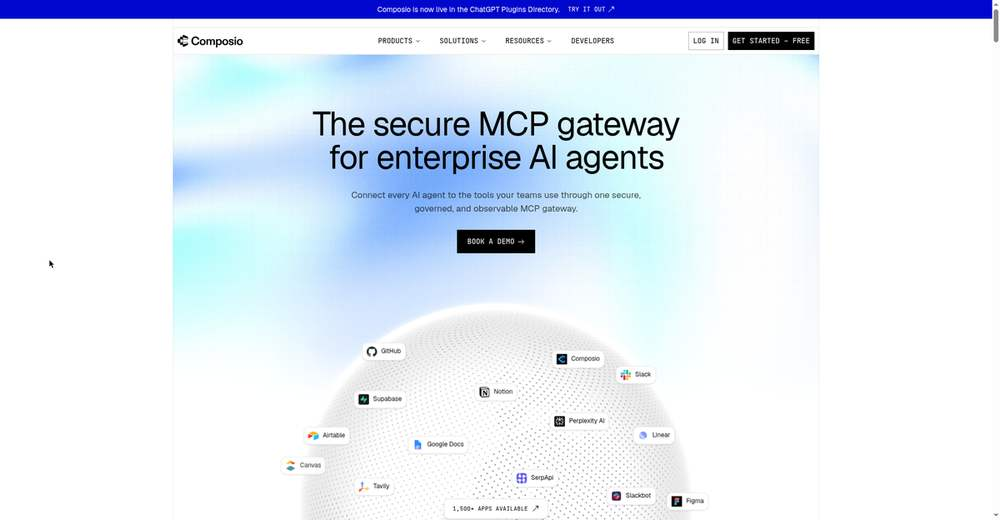
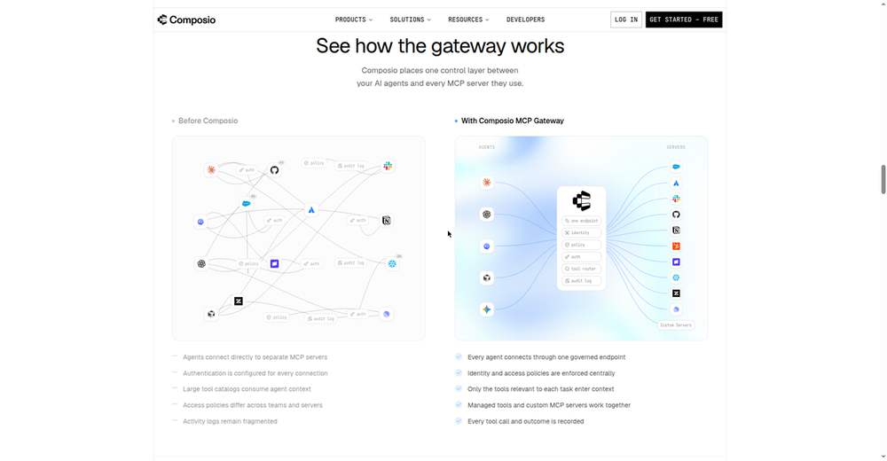
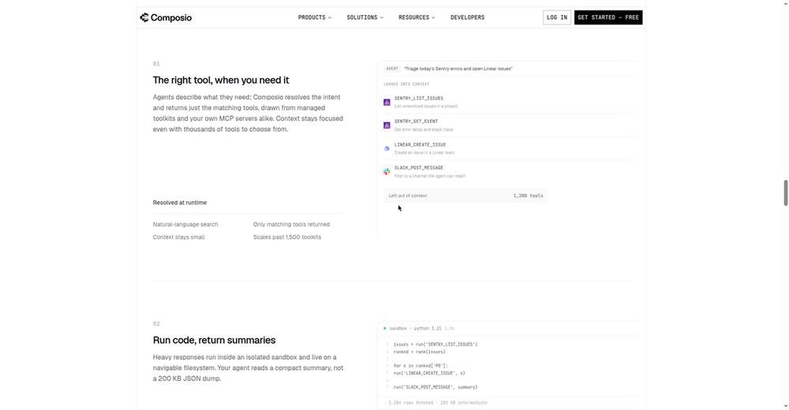
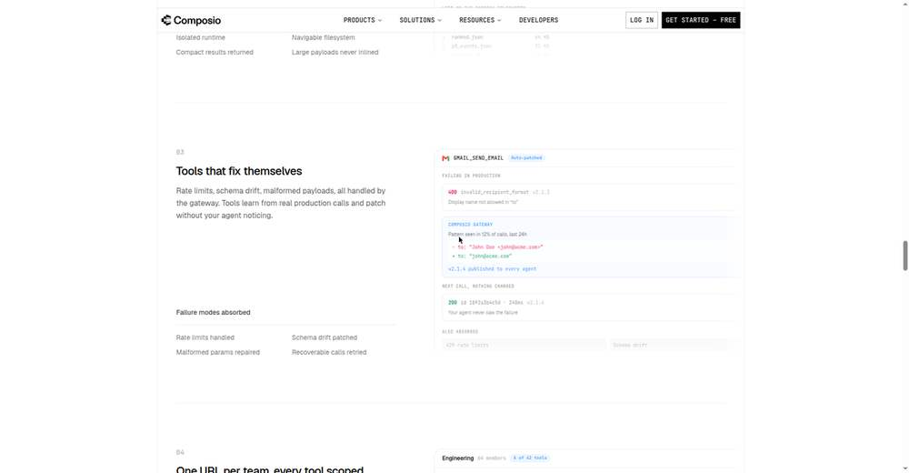
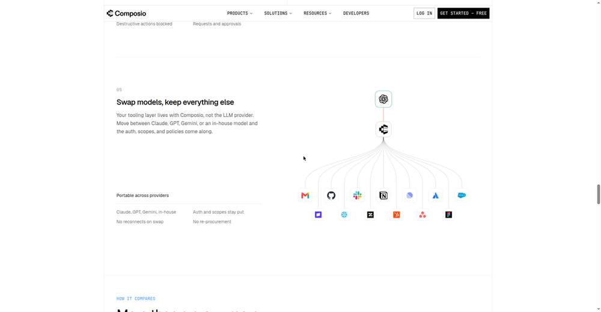

# Deep Dive: "Dashboards Are Dead" — Sarah Simionescu, Composio

**Video:** [Dashboards Are Dead — Sarah Simionescu, Composio](https://www.youtube.com/watch?v=YiFqcu9YA38) · AI Engineer channel · Oct 3, 2026 · 10:41 · Recorded at AI Engineer World's Fair 2026, San Francisco

**Speaker:** Sarah Simionescu, Member of Technical Staff at Composio ([github.com/sarahsimionescu](https://github.com/sarahsimionescu))

## Thesis

Every dashboard and query language ever built was a translation layer between humans and data — necessary only because machines couldn't understand what we wanted. Now agents are a new species of user: they don't have eyes, they won't click your sparkle button, and they judge your product on exactly one thing — whether they can get the job done. The next era belongs to products that are easy for *agents* to use, not humans.

## The postmortem: how dashboards died

**2022 — five tools, five query languages.** A Slack bug report meant five windows: Slack for context, Datadog with its own query syntax, session data elsewhere, VS Code for the fix, GitHub for the PR. Every tool had its own query language (Datadog syntax, JQL, Slack modifiers), and even the ones claiming SQL disagreed on the dialect. Redesigns were the least of it.

**2023 — the sparkle button.** LLMs would write a sometimes-correct query for you — as long as your question needed fewer than two joins. Dashboards became "AI native." Problem solved? Not quite.

**2024 — MCP arrives.** Anthropic's open standard let your everyday agent generate the query, execute it, and hand you the answer. The end of the story? Far from it — MCP is a protocol, a channel. It's up to each service to decide *how* to talk to the agent, and that choice makes all the difference.

## Why MCP alone is a mess (three reasons)

1. **Agents don't learn.** Every conversation starts from zero — no memory of fumbling Slack link formatting yesterday, so it fumbles again today. Skills were the patch, but skills are a band-aid: agents get *dumber* the more context you load.
2. **Too many tools drown the model.** Wire up enough servers and you're dumping thousands of tool definitions into context. Composio's GitHub toolkit alone has 200+ tools. The model grabs the wrong tool, can't resolve call order, can't figure out which to call first.
3. **Every app is isolated.** Each MCP server knows itself and nothing else. Cross-app tasks — which is all real tasks — leave the agent standing in thousands of separate rooms with no map and no memory.

## The Composio answer: an interface designed for agents

Instead of raw MCP servers, Composio's gateway gives the agent two things native servers don't:

- **Tool search + execution plans.** The agent states what it wants to accomplish; the gateway returns not just the right tools but a *plan* for using them (e.g., "find the Slack channel ID before querying messages"). Dependencies resolved up front instead of trial-and-error in context.
- **Summaries, not dumps.** Cross-app analysis pulls user IDs from PostHog, samples the Metabase schema, then uses a "Remote Workbench" to dynamically generate SQL with a regex over those IDs — *without ever loading the full result sets into the context window*.

**Demo 1 — Slack bug report → fix PR (4:56).** Paste a Slack message link, say "find the root cause, draft a PR, make no mistakes." The agent searches Sentry issues, Datadog logs, and the codebase in parallel, identifies the root cause, and opens a fix PR in under five minutes. No workflow built, no skill written — just Claude on Composio's MCP.

**Demo 2 — cross-app analysis (7:20).** "What vertical do users pick at onboarding?" → PostHog query. Then: "for the e-commerce cohort, what toolkits do they use?" → user IDs from PostHog (saved, not loaded), Metabase schema sampled, dynamic SQL via Remote Workbench, answer in minutes — data from both sources, context intact.

**Measured results (6:25).** Early unreleased numbers comparing Composio against each app's native MCP server on the same tasks with the same model show a clear gap in favor of the agent-designed interface.

## Why this matters for tokenomics + context management

This talk is a direct brief for Matt's remit, four layers deep:

1. **Tool definitions are context spend.** Thousands of tool schemas in-context is the same token-bloat problem as dumping file trees. Tool *search* (retrieve-then-call) is the Jev-MCP pattern from the playbook: a small decision surface picks tools so the main context stays clean.
2. **Plans beat fumbling.** An execution plan up front eliminates the trial-and-error tool calls that burn tokens and pollute context with errors. Same economics as jevgrep: better retrieval → fewer wasted calls.
3. **Summaries, not dumps.** The Remote Workbench pattern — compute over the data, return the answer — is context management as architecture. Never move data through the context window when you can move the question to the data.
4. **"Agents don't learn" is a memory-layer gap.** The talk names the exact problem the playbook's memory sections address: persistent, compounding memory across sessions instead of starting from zero.

## Links

- Composio: https://composio.dev/
- Composio MCP gateway: https://composio.dev/mcp-gateway
- Speaker GitHub: https://github.com/sarahsimionescu

*Note: video playback was unavailable in the research environment, so this dossier is built from the full published transcript, description, and Composio's own product pages — not from watched footage.*
