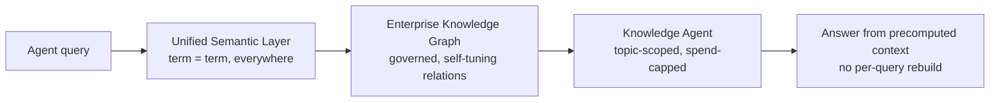

# Dell AI Data Platform — semantic layer + knowledge graph as token-cost control

**What it is.** Dell's Oct 6, 2026 expansion of the Dell AI Data Platform (the data foundation of the Dell AI Factory, built with NVIDIA). Three new features that make enterprise data machine-readable: a **Unified Semantic Layer**, an **Enterprise Knowledge Graph**, and **Knowledge Agents**. The release pitches itself straight at the token bill — Dell: "agents burn tokens reconstructing answers that should already exist. Every query means more steps, more compute, more cost." Because enterprise data was never organized for machine readers, every agent request re-answers two questions from scratch: *what does this term mean* and *how does it relate to everything else?*

**The three pieces.**

- **Unified Semantic Layer** — one consistent business meaning across structured and unstructured data: rules, definitions, a searchable glossary. "Client" in system A = "account" in system B. Imports existing ontologies and classification taxonomies; Dell is enabling **NVIDIA Auto-Ontology** (described as an open-source library that builds knowledge graphs from enterprise data) to extend it.
- **Enterprise Knowledge Graph** — maps how data relates across tables, data products, multimodal data, and vector indexes "wherever they live"; self-tunes from metadata, lineage, and query history. An agent's question pulls in every related piece it's allowed to see (governance-aware retrieval).
- **Knowledge Agents** — each grounded in a defined slice of the graph, acting as a topic-scoped advisor. The telling detail: customers set the rules — **what guidance it follows, what data it can see, the quality bar it must clear, and how much it's allowed to spend.** Token budgets as a first-class governance primitive, sold by a major enterprise vendor.

**Stack notes.** NVIDIA Nemotron Retriever for document parsing, embedding, and reranking (also powers Knowledge Agents' reasoning); cuVS accelerates vector indexing/search; cuDF on RTX PRO 4500 Blackwell accelerates data processing. Everything runs **inside the customer's data center** — on-prem context layer, with no lock-in to any single model, data, or storage provider claimed.

**The tokenomics angle.** This is the "amortize context once" lever: precompute semantics and relationships into shared infrastructure instead of letting N agents rebuild context per query. Cost model shifts from per-query RAG rebuilds (redundant embedding/search/parse tokens every call) to build-once-index-once with governed, scoped retrieval. The Knowledge Agent **spend cap** is the enterprise-grade version of token budgeting — worth naming in the playbook as a pattern even if you never buy Dell: *budgets as agent governance, not just rate limits.*

**What's real vs. pending.** ✅ The problem statement is real and your-shaped (context rebuilds are the token tax). ✅ On-prem, model-agnostic framing; spend caps as governance. ❌ **Nothing here ships today**: Semantic Layer / Knowledge Graph / Knowledge Agents land **1H 2027**; data-processing acceleration Dec 2026; PowerScale security/multitenancy Nov 2026. ❌ Performance figures are Dell internal testing (3.9x avg / 20.4x peak GPU-vs-CPU speedup, Sept 2026, default configs, "results may vary"). ❌ NVIDIA Auto-Ontology open-source claim unverified (no standalone repo surfaced in one search). Treat as announcement-grade: pattern worth stealing, product worth watching.

**Local watchlist.** (1) theCUBE's Dell AI Data Platform event **Oct 21** — "running AI on the data enterprises already own, with context, governance and sovereignty built in." (2) NVIDIA Auto-Ontology — verify it's actually open-source; if so, it's the deployable piece of this announcement. (3) Your own stack: the pattern maps onto your memory/context work — a shared governed context layer with per-agent budget caps is the enterprise complement to the local-first tooling in 03-agent-memory.

**Links.** Dell announcement (Oct 6, 2026): https://www.businesswire.com/news/home/20261006142491/en/Dell-Technologies-Turns-Enterprise-Data-Into-Trusted-Context-for-AI-Agents · theCUBE event page (Oct 21): https://siliconangle.com/2025/10/09/dell-ai-data-platform-event-join-thecube-dellaidataplatform/
