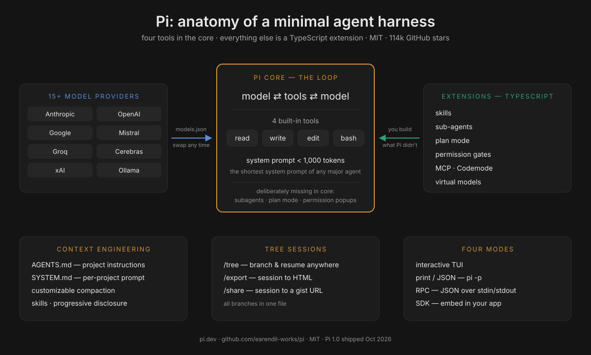
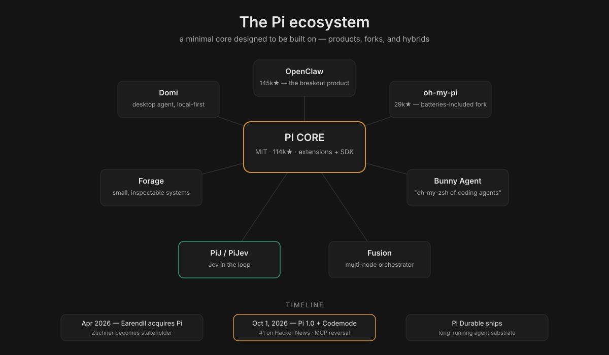
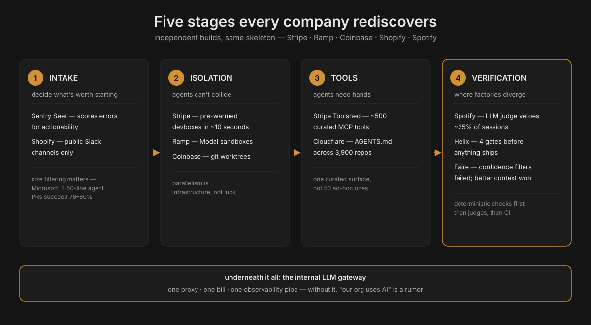
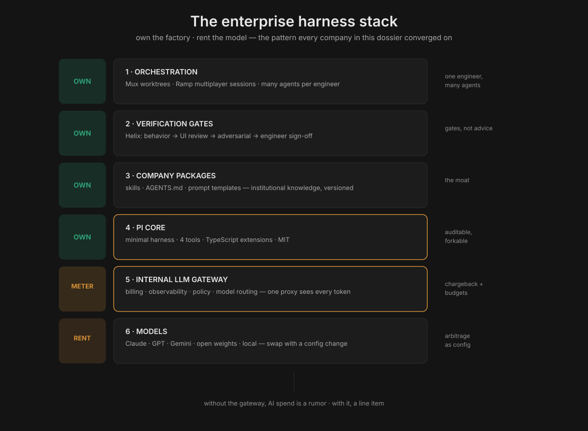

# Pi: The Minimal Agent Harness Coinbase and Shopify Are Betting On

**Trigger:** [@sourcerypod reel](https://www.instagram.com/reel/DeRBnnilHgX/) (Oct 9, 2026, 694 likes) — USV's Fred Wilson: Coinbase and Shopify "dumped Claude" and built their own coding-agent harness on the open-source **Pi**. "The CTO and engineering leaders look at it and say, we can't just build everything on top of Claude. We have to have something more flexible that we can evolve with our needs." Wilson identifies himself as an investor in the company behind Pi.

**Note:** this dossier assembles the Pi project (pi.dev, GitHub), the companies' own engineering writing (Coinbase's Mux and Forge posts, Shopify's Helix post), and contemporaneous reporting. Where claims conflict (notably "layers on Claude" vs "dumped Claude"), both are presented with dates.

## What Pi is

**Pi** ([pi.dev](https://pi.dev), [github.com/earendil-works/pi](https://github.com/earendil-works/pi)) is an open-source, MIT-licensed, terminal-first AI coding agent and agent harness — **114,000+ GitHub stars** as of Oct 2026, TypeScript monorepo, Windows/macOS/Linux.

- **Author:** Mario Zechner (`badlogic`), creator of the libGDX game framework. He wrote Pi out of frustration that every coding agent was an unexplainable black box; the repo was `badlogic/pi-mono` until ~April 2026.
- **Company:** **Earendil Works** (Earendil Inc., Vienna) — co-founded by Armin Ronacher (creator of Flask, ex-Sentry) — **acquired** the Pi open-source project in 2026; Zechner became a major stakeholder and team member. Early backers per the announcement: Accel, Balderton, and founders of n8n, OpenClaw, Revolut, Sentry, Slack. (Wilson's USV investment claim comes from the reel; USV is not named in Earendil's public backer list — treat as his claim.)
- **Not** Inflection's Pi chatbot, Google's robotics PI, or "Pieces."

## The design thesis: primitives, not features

Pi's tagline is "a minimal agent harness": **adapt Pi to your workflows, not the other way around.** The signature is what it deliberately leaves out:

- **Four built-in tools.** read, write, edit, bash. That's the whole default toolset. System prompt under 1,000 tokens — "the shortest system prompt of any major agent."
- **No subagents, no plan mode, no permission popups in core.** Everything else — sub-agents, plan mode, permission gates, path protection, SSH execution, sandboxing, MCP integrations — is a **TypeScript extension** you build or install. "The strength is in what they didn't build."
- **Model-agnostic by construction.** 15+ providers (Anthropic, OpenAI, Google, Azure, Bedrock, Mistral, Groq, Cerebras, xAI, Hugging Face, Kimi, MiniMax, NVIDIA, OpenRouter, Ollama) plus custom providers via `models.json` or extensions. Mid-session model switching (`/model`, `Ctrl+L`). Pi is the harness; the model is a plug-in.
- **Context engineering as first-class surface.** `AGENTS.md` (project instructions from `~/.pi/agent/`, parent dirs, cwd), `SYSTEM.md` (replace/append the default system prompt per-project), **customizable compaction** (implement topic-based or code-aware summarization, or swap the summarization model, via extensions), **skills** (capability packages loaded on-demand — progressive disclosure without busting the prompt cache), prompt templates (`/name` expansion), and extensions that inject messages before each turn, filter history, or build long-term memory/RAG.
- **Tree-structured sessions.** `/tree` navigates to any previous point and continues from there; all branches in one file; `/export` to HTML, `/share` to a gist URL.
- **Four modes:** interactive TUI, print/JSON (`pi -p "query"`, `--mode json` event streams), **RPC** (JSON over stdin/stdout), and an **SDK** for embedding. **OpenClaw** — the 145k-star agent project — is built on Pi.
- **Packages:** bundle extensions + skills + prompts + themes, install from npm or git (`pi install npm:@foo/pi-tools`). 50+ examples in the repo.

## Under the hood: the extension points

The "build it yourself" promise is concrete, not marketing. Three integration depths, from cheapest to deepest (distilled from the Pi docs and community research):

1. **Extension** (stay on upstream): `pi.registerTool()` + `pi.setActiveTools()` to add tools, plus event hooks — inject messages before each turn, filter conversation history, swap the compaction summarizer or its model, add path protection and sandboxing. Upstream Pi keeps shipping; you keep your customizations.
2. **SDK consumer** (embed Pi): `createAgentSession()`, `defineTool()` — build your own product on Pi's loop. This is the OpenClaw route.
3. **Hard fork** (own everything): legal under MIT, but upstream's velocity (dozens of releases, 2.65M npm downloads/week as of Sep 2026) makes this the costliest option — you inherit the merge treadmill.

The PiJ/PiJev experiments show what depth-1 looks like in practice: Jev ranks the repo's files before the first call, picks which skills to load, and triages failures — the coding model just writes code. Classifier in the loop, minimal core untouched.

## Pi 1.0: the October 2026 update

Pi hit **1.0 on Oct 1, 2026** and went to **#1 on Hacker News** (1,200+ points; Pi Durable also charted). The headline was the 180: Pi — whose creator spent a year dismissing MCP as unnecessary — **shipped native MCP support**. Earendil's rationale: MCP improved, and their own MCP changes made other integrations easier — "the changes we have made to MCP also enable the use of Jev more easily within Pi." What else shipped:

- **Codemode**: a harness-side sandbox for tool calls, with MCP, decision models, and image models pluggable.
- **Deferred tool loading**: tools aren't stuffed into context up front (a direct tokenomics win — smaller prefix, less cache-write cost).
- **Cache warming** for Anthropic models; **mid-conversation system messages**; extension support for **virtual models**.
- **Pi Durable** (separate package, same MIT): the orchestration layer for long-running, multi-surface agentic applications — SQLite + JSONL storage, kept distinct from core to preserve the minimalism.
- The governing quote from the 1.0 post: "We wait until something has proven itself, and only then do we consider adopting it; weighing its true functionality against its inherent added complexity." The "things we said no to" list is longer than the feature list — which is why the MCP reversal mattered.

For enterprises: 1.0 is the stability signal. A hardened, MIT-licensed harness with hundreds of thousands of weekly users is now a safe dependency to standardize on.

## The Pi ecosystem: who builds on it

Pi's extension/SDK design means adoption compounds — products, not just users:

- **OpenClaw** (145k+ ⭐): the breakout agent product built on Pi — the proof that Pi works as a substrate, not just a CLI.
- **oh-my-pi** (28.9k ⭐ in 8 months, ~114k npm downloads/week): a hard fork by Stencil Labs that ships the batteries Pi deliberately omits — the "feature-complete" pole to upstream Pi's "minimal-core" pole. (Enterprise note: extreme release velocity — ~1.6 releases/day — with a latest-only security policy; upstream is the safer-lifecycle choice.)
- **Domi**: a desktop coding agent powered by Pi (git worktrees per task, local-first sessions).
- **Bunny Agent**: "the oh-my-zsh of coding agents" — pre-wired Pi with harness-ready tools, multi-model CLI.
- **Forage**: built on Pi's philosophy of small, inspectable systems — explicit skills, user-owned model access.
- **Fusion** (runfusion.ai): multi-node orchestrator (kanban + worktrees + approval gates) powered by Pi.
- **PiJ / PiJev**: Pi with **Jev in the loop** — Jev ranks repo files before the first call, picks skills, triages failures; the coding model writes the code. The Jev+harness fusion this playbook has been tracking, now shipping in the wild.

## More companies building their own harness

Coinbase and Shopify aren't alone. The pattern — own the harness, rent the model — is now the enterprise default:

### Stripe: Minions (the benchmark)

The industry reference for unattended one-shot coding at scale: **[stripe.dev/blog/minions-stripes-one-shot-end-to-end-coding-agents](https://stripe.dev/blog/minions-stripes-one-shot-end-to-end-coding-agents)** (two parts, by the Leverage team).

- **Scale:** 1,300+ PRs merged per week (~185/day), human-reviewed, **zero human-written code** in agent PRs.
- **Harness:** an internal **fork of Block's Goose** (forked late 2024), customized with one policy: **remove everything that assumes a human is watching** — no interruptibility, no confirmation dialogs, no interactive prompts. Safety comes from isolation, not permission popups: each run gets a **pre-warmed devbox** (the same machines engineers use, spun up in ~10 seconds, isolated from prod and the internet), so the agent runs with full permissions inside a limited blast radius.
- **Blueprints:** the architectural heart — workflow templates that **interleave deterministic nodes** (git ops, linters, tests — same output every time) **with agentic nodes** (LLM reasoning). Deterministic steps are guardrails; agentic steps are intelligence. When models improve, the improvement drops in without touching the scaffolding.
- **Toolshed:** a centralized **MCP server with ~500 curated tools**; relevant MCP tools are run deterministically over likely links *before* the run starts, to hydrate context.
- **Rules:** minions read the same agent rule files as Cursor/Claude Code, but almost all rules are **conditionally applied by subdirectory** — a global rule file doesn't scale.
- Engineers invoke minions from **Slack, CLI, or web** and get back a complete PR. Stripe keeps the headless Goose fork for autonomous work *and* gives engineers Cursor/Claude Code for interactive work — different tools for different modes, coexisting.

### Ramp: Inspect (the open blueprint)

**[modal.com/blog/how-ramp-built-a-full-context-background-coding-agent-on-modal](https://modal.com/blog/how-ramp-built-a-full-context-background-coding-agent-on-modal)** — and Ramp open-sourced the blueprint so anyone can replicate it.

- **Stack:** **OpenCode** as the agent runtime on **Modal sandboxes** — each session gets a full dev stack (Postgres, Redis, Temporal, RabbitMQ, Vite, Chromium), with filesystem snapshots every 30 minutes for near-instant startup.
- **Scale:** ~50% of merged PRs started by Inspect (Ramp's claim); **80%+ of Inspect's own codebase is written by Inspect itself**.
- **The differentiator is context, not the model:** "Inspect is never limited by missing context or tools, but only by model intelligence itself." Multiplayer sessions (state via Cloudflare Durable Objects) let several engineers watch and guide simultaneously.
- **Radical visibility:** all Inspect sessions are **public with no opt-out** — 150+ Ramp employees have contributed. (Same instinct as Shopify's River public-channel rule: a visible agent teaches the org.)
- **Why build:** local machines can't run agents in parallel at the scale they wanted, and "the only way you're going to ensure that it is the best, most productive, most efficient for your organization is to build it yourself."
- Three clients: Slack bot, web UI (hosted VS Code), Chrome extension for visual React editing.

### The rest of the field (brief)

- **Spotify — Honk** (Claude Code + Agent SDK): 650+ PRs/month, 60–90% time savings on migrations; nested verification loops (deterministic checks → LLM judge vetoing ~25% of sessions → CI).
- **Uber**: Claude Code + internal Minion/Shepherd/uReview tooling; 84% of developers, 65–72% of code AI-generated.
- **Nubank + Devin**: 8-year-old ETL monolith migration — 12× engineering efficiency, 20× cost savings vs the 1,000-engineer plan.

### The convergence: five stages every company rediscovers

Independent builds keep landing on the same skeleton — **intake → isolation → tools → verification** (plus the gateway underneath):

1. **Intake** decides what work is worth starting (Sentry's Seer scores errors; Shopify routes through public Slack).
2. **Isolation** prevents collisions: git worktrees (cheapest), containers, or cloud sandboxes (Stripe's 10-second devboxes, Modal, K8s pods).
3. **Tools** give agents hands: one curated MCP surface (Stripe's 500-tool Toolshed; Cloudflare's generated AGENTS.md across 3,900 repos).
4. **Verification** is where designs diverge — and where the money is: deterministic checks first, then LLM judges, then CI. (Faire's lesson: filtering review comments by model confidence failed; better context + a second model asking "is this worth a human's time" worked.)
5. **The gateway underneath it all**: one proxy, one billing relationship, one observability pipe — the difference between "our org uses AI" and "every team has a different vendor and exposure surface."

The lavx synthesis puts the business point bluntly: "the moat of software companies will shift from 'the code they wrote' to the 'means of production' of that code. The alpha is in your factory."

## Why enterprises pick it: Wilson's argument

Wilson's claim, stripped of hype: a CTO cannot build the company's entire engineering future on a proprietary model endpoint. The reasons are the ones this playbook has been documenting all along — **model churn** (the model you tuned for gets replaced), **pricing power** (rate limits in 2025 taught enterprises this), **evolvability** (you can't change what you can't see). Pi inverts the dependency: the harness is yours (MIT, forkable, hackable), the model is a commodity you swap. When Claude 6 or GPT-7 or a local distilled model wins, you change one line in `models.json`, not your whole platform.

## Pi vs the alternatives

| Harness | License | Model lock-in | Minimal core? | The one-liner |
|---|---|---|---|---|
| **Pi** | MIT | none (15+ providers) | yes — 4 tools, sub-1k prompt | the harness you own; model is a plug-in |
| **oh-my-pi** | MIT | none | no — batteries included | Pi's maximalist fork (29k★, ~1.6 releases/day) |
| **OpenCode** | MIT | none | moderate | terminal agent, similar spirit, different API |
| **Goose** (Block) | Apache-2.0 | none | moderate | the fork Stripe built Minions on |
| **Claude Code** | proprietary | Anthropic | no | what Coinbase/Shopify scaffolded first — and may be leaving |
| **Codex** | proprietary | OpenAI | no | same lock-in shape, different vendor |

The honest read: Pi doesn't win on features — oh-my-pi and Claude Code ship more out of the box. It wins on **ownability**: MIT, tiny auditable core, model-agnostic by construction. For an enterprise, that's the difference between a dependency and a foundation.

## The companies

### Coinbase: Forge and Mux

Coinbase's trajectory is the most documented enterprise agent build-out:

- **Forge** (previously Cloudbot, originally Claudebot): as of July 2026, **>95% of Coinbase's code is AI-generated** (up from 40% in February), the system accounts for **5% of all merged PRs**, PR cycle time fell from **~150 hours to ~15 hours**, and **1,200 AI agents** run at full-time-equivalent capacity — each engineer working with 5–10 simultaneously. Built from scratch: in-house sandboxes, MCPs + custom Skills, Slack-native invocation, **agent councils + auto-merge** as the validation pattern.
- **Mux** ([coinbase.com/blog](https://www.coinbase.com/blog/coding-had-a-concurrency-problem-how-mux-helped-solve-it), May 2026): the concurrency story. Agents made individuals faster, but engineers still worked "one branch, one terminal, one task" — while the agent worked, the engineer waited. Mux gives each agent its own git worktree, branch, and terminal. Started as one engineer's side project, grew to **600+ users, 5,068 merged PRs across 461 repos**, with users merging **3.5× more PRs** (39.6 vs 11.4 baseline). "The bottleneck had moved. It was no longer how fast we could write code. It was how many things one engineer could orchestrate at once."
- **The build-vs-buy lesson** (Coinbase's own words): "AI changed the build-vs-buy calculus for internal tooling… Internal tools that encode institutional knowledge are suddenly cheap to build and expensive to ignore." The substrate that made Mux possible: an **internal LLM Gateway**, a growing **MCP server ecosystem**, and a culture of experimentation. Their answer to "did we have to build this ourselves": the value isn't the multi-agent UI (that exists everywhere) — it's the institutional knowledge baked in (internal cloud agent dispatch, Codeflow deploys, team review flows, repo conventions as reusable commands).

### Shopify: Helix, River, Roast

Shopify's public work shows the same harness instinct in three places:

- **Helix** ([shopify.engineering/helix](https://shopify.engineering/helix)): the internal tool that rebuilt the Shop mobile app (React Native → native Swift/Kotlin) in 12 weeks and is now migrating the 300-screen Shopify app. The pattern: **checkpoints small enough to review at a glance** + **four gates strict enough to stop anything unproven** — (1) Behavior (CLI tests, no simulator needed), (2) UI review (Gemini as a "perfectionist design reviewer" comparing screenshots, listing every difference with severity and location), (3) adversarial review (two independent, context-isolated reviewer agents; loop until both approve), (4) engineer sign-off with feedback recorded to memory so later checkpoints need less oversight. "An attempt is allowed to be wrong. It is not allowed to ship until it isn't."
- **River**: a Slack-based coding/knowledge agent living under one deliberate constraint — **no direct messages; every conversation in a public channel**. Watching a colleague debug with River teaches the org faster than any training doc, and public visibility keeps quality honest. Underneath sits **Aquifer**, the infrastructure for durable, resumable agent sessions. Extended into autonomous security remediation (grouping vuln findings into threads, driving fixes to merge).
- **The platform underneath**: an **internal LLM proxy** (one billing relationship, one observability pipe) and a custom review harness called **Roast**; VP Engineering Farhan Thawar: "Shopify is not yet at the place where we allow AI to check in code automatically."

### The honest tension

August 2026 reporting (The Information, via webpronews/Medium): Coinbase and Shopify were building **custom layers on top of Claude Code** — "the model is not being replaced, it's being scaffolded" — with the wrappers adding memory, routing, and guardrails. Wilson's October reel says they **dumped Claude** for Pi. Both can be true in sequence (scaffold first, swap the harness later — which is exactly what a model-agnostic harness enables), or different teams may be at different stages. Don't present "dumped Claude" as settled fact; present it as Wilson's claim, directionally consistent with the documented trajectory.

## How to build your own: the Pi-based enterprise pattern

Distilled from what Coinbase and Shopify actually did, mapped onto Pi's surfaces:

1. **Start with the harness, not the model.** Deploy Pi (MIT) as the agent substrate. Four tools and a sub-1k system prompt mean the thing you own is small enough to audit. The model becomes a config line.
2. **Centralize the gateway.** One internal LLM proxy: one billing relationship, one credential store, one observability pipe, one policy enforcement point. This is the prerequisite for everything below (Coinbase's LLM Gateway, Shopify's proxy). Route models per task here — the cost lever.
3. **Encode institutional knowledge as packages.** `AGENTS.md` + `SYSTEM.md` per repo, skills for team workflows, prompt templates for repeated jobs. Bundle as Pi packages, distribute via npm/git or an internal registry. This is the Mux lesson: the plugins and skills *are* the moat — they encode how your company ships.
4. **Gates, not advice.** Copy Helix: checkpoints small enough to review at a glance; automated gates (behavior tests, visual review, adversarial review) that block; engineer sign-off that feeds memory. An attempt may be wrong; it may not ship until it isn't.
5. **Make agent work visible.** Shopify's River rule — public channels only — or the equivalent: shared session trees (`/share`), public dashboards. A private agent teaches one person; a public one teaches the org, and visibility is a quality control.
6. **Orchestrate, don't just chat.** The Mux pattern: one worktree/branch/terminal per agent, many agents per engineer. The engineer's job moves up the stack to scoping, review, and exception-handling.
7. **Instrument cost from day one.** Per-run budgets, per-team dashboards, P90-overrun investigation (the Palafox pattern from this playbook's talk notes). Model-agnosticism lets you A/B models per task and pick the cheapest that clears the gate.

## Best ways for a company to do it: the short playbook

- **Harness is the product; the model is the commodity.** Own the harness (open-source, forkable). Rent the model (routable, replaceable). This is the single decision everything else follows.
- **Centralize the narrow waist, distribute the edges.** One gateway, one package registry, one set of gates — but skills and workflows authored by the teams that own the repos.
- **Start where the evidence is.** Mux began as one engineer's side project solving their own problem; Helix began with one app migration. Grassroots tools that encode real workflows beat top-down platform mandates. Leadership's job is the substrate (gateway, MCP servers, permission to experiment), not the tool.
- **Measure the loop, not the demo.** PR cycle time (Coinbase: 150h → 15h), % AI-generated code, merged PRs per engineer (Mux: 3.5×), rework rate. Faros AI's warning stands: raw output speed ≠ developer productivity once rework is counted.
- **Treat agent definitions like cache keys.** Standardized, versioned, shared agents produce identical prompt prefixes → shared cache hits (see the Palafox talk page's deep dive: 96.22% hit rates are a property of the harness, and per-team customization fragments them).
- **Don't skip the security model.** Unattended agents with repo credentials need the gh-aw treatment: sandboxing, credential isolation, output scanning, declared writes only.

## Tokenomics angle

Pi is the local-first thesis compiled into a product: the harness is a fixed, ownable cost; the model is a metered, routable one. Three tokenomics consequences:

- **Model arbitrage becomes a config change.** 15+ providers and mid-session switching mean the routing ladder (this playbook's Lever 4) is a `models.json` edit, not a migration. When a cheaper model clears your gates, you capture the spread the same day.
- **The minimal core is a smaller bill.** A sub-1k-token system prompt and four default tools mean every turn's cached prefix is smaller; skills load on-demand with progressive disclosure instead of front-loading context. Less prefix → less cache-write cost → cheaper turns.
- **The gateway is the meter.** One proxy sees every token from every team — the precondition for chargeback, budgets, and the P90-overrun pattern. Without it, "AI spend" is a rumor; with it, it's a line item.

## Further reading & resources

**Official**
- [pi.dev](https://pi.dev) — install: `curl -fsSL https://pi.dev/install.sh | sh` · [docs](https://pi.dev/docs) (extensions, SDK, sessions, compaction, packages, MCP, Codemode) · [changelog](https://pi.dev/changelog) · Pi Discord (linked from pi.dev)
- Repo: [github.com/earendil-works/pi](https://github.com/earendil-works/pi) (114k ⭐, MIT) — including the [minimal system prompt source](https://github.com/earendil-works/pi/blob/main/packages/coding-agent/src/core/system-prompt.ts) itself and 50+ extension examples
- [Example shared session](https://pi.dev/session/#0ea51497613daf7e1de28ee99950b074) — what `/share` produces

**Earendil**
- [Pi acquisition + Lefos announcement](https://github.com/earendil-works/website/blob/HEAD/posts/announcing-pi-and-lefos.md) · [Pi 1.0](https://earendil.com/posts/pi-1-0/) · [Pi Durable](https://earendil.com/posts/pi-durable/)
- Zechner's own account of the acquisition: ["I've sold out"](https://github.com/badlogic/mariozechner.at/blob/HEAD/src/posts/2026-04-08-ive-sold-out/index.md) (Apr 2026) — governance, trademark-not-license-tricks, no CLA

**Voices**
- [State of Agentic Coding](https://www.youtube.com/watch?v=b0SYAChbOlc) — Ronacher + Ben Vinegar's monthly podcast (practitioner-level: model dynamics, token economics, quality crises); [episode transcripts](https://github.com/colmarius/with-agents/blob/HEAD/src/content/transcripts/coding-with-agents/state-of-agentic-coding-episode-7.md); [ep. 8 with Zechner](https://www.youtube.com/watch?v=_lfpEy_9vf0)
- ["Code Isn't Free" — Zechner interview](https://www.youtube.com/watch?v=GhjU-KvXtT0) — spec-driven dev as hyper-waterfall, local AI on a MacBook, token prices and budgets
- [Syntax.fm: "Claude Code is overkill — Pi is all you need"](https://www.youtube.com/watch?v=AEmHcFH1UgQ) — Zechner + Ronacher on the harness philosophy
- [Ronacher's agentic workflow](https://www.youtube.com/watch?v=SxuQs9GGYbk) — how he actually works day to day · his blog: [lucumr.pocoo.org](https://lucumr.pocoo.org)

**Companies building their own**
- Stripe Minions: [part 1](https://stripe.dev/blog/minions-stripes-one-shot-end-to-end-coding-agents) + [part 2](https://stripe.dev/blog/minions-stripes-one-shot-end-to-end-coding-agents-part-2) (1,300+ PRs/week, Goose fork, Blueprints)
- Ramp Inspect: [Modal's build story](https://modal.com/blog/how-ramp-built-a-full-context-background-coding-agent-on-modal) (~50% of PRs, open blueprint)
- Shopify Helix: [shopify.engineering/helix](https://shopify.engineering/helix) (checkpoints + 4 gates)
- Coinbase Mux: [the concurrency problem](https://www.coinbase.com/blog/coding-had-a-concurrency-problem-how-mux-helped-solve-it) · Forge (95% AI code, 1,200 agents): via ainvest summary
- The Information via [webpronews](https://www.webpronews.com/coinbase-shopify-bet-big-on-custom-ai-coding-agents-to-supercharge-claude/) (Aug 2026 — "layers on Claude", the before to Wilson's after)
- Trigger reel: [instagram.com/reel/DeRBnnilHgX](https://www.instagram.com/reel/DeRBnnilHgX/) (@sourcerypod, Oct 9, 2026)

**Community & builds**
- [nomansland](https://github.com/matagus/nomansland/blob/HEAD/docs/agentic-workflows.md) — runs **Pi through gh-aw** in GitHub Actions: the bridge between this dossier and the Palafox talk page
- [oh-my-pi](https://github.com/can1357/oh-my-pi) (29k ⭐) · [OpenClaw](https://github.com/openclaw/openclaw) (145k ⭐) · [Domi](https://github.com/restflux/domi) · [Bunny Agent](https://github.com/buda-ai/bunny-agent) · [Forage](https://github.com/tenzki/forage) · [Fusion](https://github.com/Runfusion/Fusion)
- [Enterprise supply-chain assessment of Pi/oh-my-pi](https://github.com/kuanpak/enterprise-harness-agents/blob/HEAD/research/omp-public-assessment.md) — release velocity, telemetry, installer risks (Sep 2026)
- [LLM-optimized Pi docs mirror](https://github.com/x0retnop/pi-extensions/blob/HEAD/docs/off-doc-llm/INDEX.md) — every doc page as tables and type signatures
- Field notes: [software-factory enterprise adoption](https://github.com/chipagosfinest/software-factory/blob/HEAD/docs/enterprise-adoption.md) · [internal-agents-map](https://github.com/steel-experiments/internal-agents-map)

**In this playbook**
- [Palafox talk](scaling-custom-agents-copilot-palafox.md) — the GitHub-side mirror: marketplace → pipeline → cost observability
- The [Jev section](../02-jev-context-economics/) — the decision-model pattern Pi is now absorbing (Codemode, PiJev)
