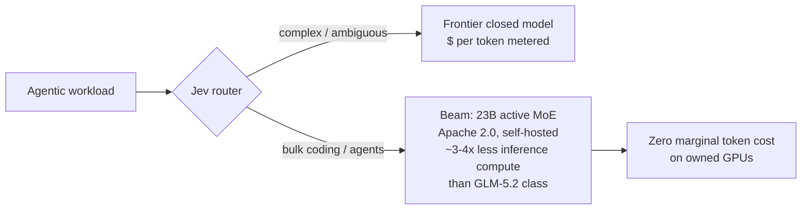

# Reflection Beam — open-weight MoE at 3–4x less inference compute

**What it is.** Reflection AI's first frontier open-weight model, unveiled Oct 5, 2026. Text-only mixture-of-experts trained with heavy RL for reasoning, coding, and agentic work — pitched explicitly as the Western answer to DeepSeek/Qwen/Z.ai. Reflection's headline claim is not benchmark supremacy; it's **cost per token**: parity with leading Chinese open models on advanced reasoning at a "fraction of the token cost and inference time compute."

**Specs (Reflection-published, not independently verified).**

| | Beam | Z.ai GLM-5.2 (for reference) |
|---|---|---|
| Total params | 501B | ~744B |
| Active params/token | 23B | 40B |
| Pretraining | 23.8T tokens | — |
| Context window | 1M tokens | — |
| Modality | text-only | — |

Reflection says Beam scores **on par with GLM-5.2** on advanced reasoning benchmarks at **3–4x less inference compute** (about 1/4 of GLM-5.3's in their reasoning-efficiency comparison), **outperforms today's leading Western open models**, and outscores Mira Murati's **Inkling** on four coding tests where both report results (Inkling is multimodal; Beam is text-only).

**The tokenomics angle.** This is a second, parallel cost lever to the local-first/hardware bet (RTX Spark): cheaper *weights*, not just cheaper *silicon*. The MoE arithmetic is what makes the claim plausible — with only 23B active per token (57% of GLM-5.2's), per-token FLOPs fall mechanically; the rest of the 3–4x comes from architecture/RL efficiency claims Reflection hasn't detailed. For an enterprise already routing workloads (Jev model router pattern), Beam is the model you'd route *coding/agent bulk work* to: frontier-adjacent reasoning at a per-token cost that undercuts both Chinese open weights and every closed metered API.

**Deploy math.** 501B total params means ~500GB at FP8 / ~250GB at INT4 — this is a **multi-GPU server model**, not a laptop one: expert-parallel serving across 8×H100/H200-class GPUs, or quantized/distilled variants for smaller estates. The 1M context window cuts per-token cost *per answer*, but KV-cache memory at 1M tokens is itself enormous — realistic enterprise configs will run shorter windows. It fits the playbook's "local complements" lever as **fixed capex at zero marginal token cost** for bulk workloads, complementing the per-call metered stack. Expect quantized/community checkpoints to make it runnable on smaller hardware within weeks of the weights drop.

**What's real vs. pending.** ✅ Specs, benchmark claims, Apache 2.0 license, founders ($4.7B raised, $25B valuation, ex-DeepMind Misha Laskin & Ioannis Antonoglou, $7B+ compute commitments incl. SpaceX/Colossus and Nebius GB300 through 2029). ❌ **Weights not yet released** — Reflection says weights + full technical details ship this month (Oct 2026), distributed via hyperscalers/neoclouds with open-source library integrations. Independent verification of the 3–4x claim: none yet. Don't build production on it until weights land and your eval set runs against it.

**Local watchlist.** (1) Weights drop on reflection.ai / Hugging Face — build the eval path now with a downloadable MoE (Qwen/DeepSeek) so Beam swaps in day one. (2) Hosted inference pricing — the 3–4x claim only matters if providers price it that way. (3) Inkling vs Beam: multimodal vs text-only cost/performance for your actual workload mix.

**Links.** TechCrunch announcement: https://techcrunch.com/2026/10/05/reflection-debuts-beam-a-open-weight-ai-model-to-rival-chinese-models-at-lower-compute-cost/ · Founders interview: https://sources.news/p/reflection-founders-open-weight-beam-release
