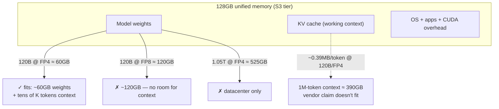
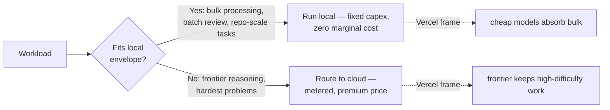

# RTX Spark keynote (Oct 7, 2026) — official pricing, what fits in 128GB, and the local-vs-metered math

**What it is.** The Microsoft/NVIDIA "local AI" keynote (Nadella, Huang, Pavan Davuluri on stage, Oct 7, 1 PM ET) made RTX Spark official: a 20-core Grace CPU + Blackwell GPU (6,144 CUDA cores) platform with up to **128GB unified memory**, ~1 petaflop at FP4 (theoretical, with sparsity), pitched at running 120B-parameter models locally. Six OEM laptops plus a Surface Laptop Ultra and an RTX Spark Dev Box. This is the distillation of the keynote into the numbers that matter for the tokenomics playbook: what was announced, what actually fits in 128GB at realistic quantization, and local cost-per-task vs metered Copilot credits.

## What was announced (official)

- **Surface Laptop Ultra** — starts **$2,599.99**, preorders open Oct 7, ships **Oct 16**. Two tiers: **S2** (18-core CPU, 5,120-core GPU, 24–32GB unified) and **S3** (20-core CPU, 6,144 CUDA cores, 32/48/64/128GB, ~1 petaflop FP4 theoretical). Top config **$5,899**; the 64→128GB step alone adds ~$1,600. (thurrott.com, techrepublic.com, gagadget.com)
- **Surface RTX Spark Dev Box** — **$5,999**, preorders open, US-only via Microsoft.com, ships **November**. Monitor and keyboard sold separately. Ships the exact dev stack preinstalled: VS Code, GitHub Copilot, WSL2 + CUDA on 128GB unified. (unite.ai)
- **Other OEMs** — HP OmniBook Ultra 16 from **$3,199**; Asus ProArt P14/P16 shipping Oct 16. Up to **$1,000 MacBook Pro trade-in cash back** on Laptop Ultra purchases Oct 7–Nov 23 (US/Canada Microsoft Store). (marketwatch.com, mobilesyrup.com)
- **Software** — Microsoft's "Hybrid Intelligence" framing (local AI when possible, cloud when required); **Execution Containers** generally available; a new Copilot app that uses local files as context **"at no cost"**; **MAI Code 1.1 Flash** running on-device; Meta's **Muse agent** coming to Windows as a native app. (thurrott.com, marketwatch.com)

## What actually fits in 128GB — the quantization math

The honest headline first: **the $2,599 base (S2, 24–32GB) cannot hold 120B-parameter models.** The tier matching the local-LLM thesis is the S3 128GB. Here's the memory budget at realistic quantization:

| Model | Params | FP8 weights | FP4 weights | Fits 128GB? |
|---|---|---|---|---|
| 120B-class dense (e.g. GPT-OSS-style) | 120B | ~120GB — no room for context | **~60GB** — yes, with KV headroom | FP4 only |
| Kolibri (sparse MoE) | 78B total / 3.46B active | **~78GB** — comfortable, ~50GB left for KV | ~39GB | Yes, easily |
| Mistral Large 4 ("Le Chonk") | 1.05T total / 49B active | ~1TB | ~525GB | **No — datacenter-class** |

And the KV-cache reality check the keynote glossed over: for a 120B-class model (~48 layers, 8192 hidden dim), per-token KV cache at FP4 is roughly 2 × 48 × 8192 × 0.5 bytes ≈ **0.39MB/token**. A "1M-token context" would need ~390GB of KV cache alone — so the vendor's 1M-token-context claim does not survive contact with 128GB. Realistic: **tens of thousands of tokens** of context alongside a 120B/FP4 model, not millions. The 128GB envelope is a genuine local-LLM machine at FP4 with working context windows — it is not a datacenter in a laptop.

## Local cost-per-task vs metered Copilot credits

The billing context: Copilot's metered **AI Credits** (1 credit = $0.01, plan fee ≈ credits allowance) replaced premium requests June 1, 2026; Business/Enterprise promo credits ended in August — so September was the first fully metered month. What the box displaces is not the seat license, it's the **agentic/chat overage**.

Break-even on the ~$5,899 S3-128GB machine (Dev Box $5,999 is nearly identical):

| Monthly displaced metered spend | Payback |
|---|---|
| $500/mo | ~12 months |
| $1,000/mo | ~6 months |
| $2,500/mo | ~2.4 months |

Worked example: a nightly batch agent run of 10M input + 2M output tokens at Claude Opus 4.8 rates ($6.25/$25 per 1M) ≈ **$2,475/mo** over 22 working days → the box pays back in ~2.4 months. A single heavy agentic session with 1M output tokens is $25 — nearly two-thirds of a Pro+ month's allowance in one sitting.

The caveat that keeps this honest: the local box runs **open weights, not frontier-class models**. The Vercel bifurcation holds — volume goes local/open, the hardest work still pays frontier prices. The box doesn't eliminate the metered bill; it moves the bulk tier off it.

## The tokenomics angle

This is the **"local complements" lever** made concrete: fixed hardware capex converting metered per-task spend to zero marginal cost for the workloads that fit. And the software announcements are the vendor version of the playbook's own patterns — "Hybrid Intelligence" (local when possible, cloud when required) is route-by-difficulty with Microsoft's branding, and a Copilot app using local files as context "at no cost" is free context expansion at the IDE layer. The pattern to steal isn't the hardware, it's the routing discipline: every workload gets classified local-vs-cloud by fit, not by habit.

**What's real vs. pending.** ✅ Official pricing, tiers, shipping dates, Dev Box, software announcements — all confirmed Oct 7. ❌ **No independent benchmarks**: only Microsoft's vendor claims (2.1x time-to-first-token, 4.3x image gen, 6.2x video gen vs MacBook Pro M5 Pro — AI workloads only, selected preproduction units) and one pre-release Clang test. The Fouquin prototype hands-on (TechPowerUp/TweakTown) showed immature drivers — CUDA didn't work on pre-release drivers, 100°C under load — but that's an engineering sample, not a review. ❌ The 1-petaflop figure is theoretical FP4-with-sparsity. ❌ Exact US price of a standalone 128GB S3 config not yet reported (only the $5,899 top config and the ~$1,600 64→128GB step).

**Local watchlist.** (1) Independent retail reviews — the embargo lift is the next real data point; watch for measured tokens/sec on 120B/FP4. (2) llama.cpp / Ollama support and real throughput numbers on RTX Spark — the difference between "runs" and "runs well." (3) European/UK availability and pricing. (4) Your own September Copilot bill — the first fully metered month is the baseline to hold every future capex decision against.

**Links.** Keynote livestream ("Something new is coming from Windows | October 7"): https://www.youtube.com/watch?v=ilmBGeGldrI · Dev Box details: https://www.unite.ai/surface-rtx-spark-dev-box-ships-in-november-at-5-999/ · Pricing/tiers: https://www.thurrott.com/windows/windows-11/342563/microsoft-surface-laptop-to-start-at-2599 · https://www.techrepublic.com/article/news-microsoft-surface-laptop-ultra-nvidia-rtx-spark/ · https://www.marketwatch.com/story/microsoft-and-nvidia-are-teaming-up-on-a-supercharged-ai-laptop-f58b28d8 · https://gagadget.com/en/729177-surface-laptop-ultra-2599-windows-laptop-with-nvidias-rtx-spark-chip/ · https://mobilesyrup.com/2026/10/07/microsoft-surface-laptop-ultra-reveal/
