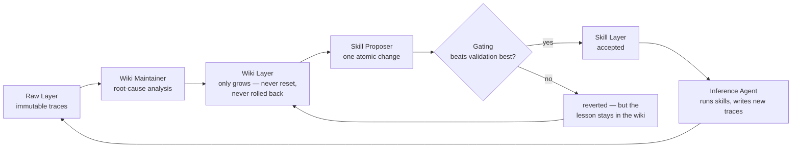

# WikiSkill — Google's persistent memory for agents: the wiki that never resets, the skills that get gated

**What it is.** A Google Research framework (Liyan Tang, Cyrus Rashtchian, Chun-Sung Ferng, Andrew Tomkins, Da-Cheng Juan, Tu Vu; arXiv:2608.27454, submitted Aug 27, 2026) for compiling an agent's experience into persistent knowledge that supports long-term skill evolution. The problem it names: agents have amnesia — every run's workarounds and dead ends vanish when the run ends, so a job done thousands of times never gets easier. The lineage is Karpathy's 2026 "LLM Wiki" perspective: compile model experience into compounding knowledge instead of letting it scatter. A "skill" here means a reusable file-based module (SKILL.md + conditions for use) that extends an agent without touching model weights; prior work (Trace2Skill, EvoSkill, SkillOpt) already tried discovering skills from runs automatically. WikiSkill's contribution is what sits between raw experience and those skills: a structured, growing wiki.

## The three layers: raw, wiki, skill

The design separates three things most systems mush together — what happened, what was learned, what to do next — and gives each its own layer.

- **Raw Layer (`raw/`)** — the diary. Complete execution traces from each run: reasoning, every tool call, every result, the final answer. Immutable; nothing gets rewritten after the fact.
- **Wiki Layer (`wiki/`)** — the heart. A directory of pattern pages, each documenting one failure mode or one successful strategy with a concrete workaround, plus an evolution log and a skill-impact tracker. The load-bearing rule: **the wiki never resets and is never rolled back.** It only accumulates — even a failed skill experiment leaves its lesson written down.
- **Skill Layer (`skills/`)** — what the agent actually reads at work. Each folder has a `SKILL.md` and a `PURPOSE.md` mapping the skill back to the wiki patterns that motivated it. Unlike the wiki, skills are reversible: a change that hurts performance gets reverted.

The asymmetry is the clever bit: **permanent memory, reversible action.**

## The four-step evolution loop

1. **Inference Agent** runs the current skills on training tasks and produces raw traces. Counterintuitive detail: the paper deliberately **blocks this agent from reading the wiki during training**. An ablation showed letting it peek *hurt* final skill quality (63.7% → 60.9%) — if the agent answers from the wiki instead of the skills, its traces stop being useful evidence for improving the skills.
2. **Wiki Maintainer** reads a sample of successful and failed traces, does root-cause analysis on failures, extracts strategies from wins, writes pattern pages.
3. **Skill Proposer** — a multi-turn agent starting from the wiki index, reading specific pattern pages on demand — proposes exactly one atomic change: a new skill or an edit.
4. **Gating and rollback.** The proposed skill set is scored on a separate validation split. Beats the running best → accepted. Doesn't → reverted. Either way, the wiki keeps the record. The paper's ALFWorld case study: a first "goal-directed-action" skill was rejected as too abstract; because the rejection and its reasoning stayed in the wiki, the next iteration wrote a sharper accepted skill with a specific rule ("never return an item to its origin location"), refined further as new failure variants appeared.

## Does it work? The numbers

Five models × five benchmarks (math, web search, spreadsheets, long-context document QA, interactive tasks), three runs each:

- Giving the Skill Proposer access to the persistent wiki lifted average performance **48.7% → 63.7%** — a 15-point jump. The memory is where most of the gain comes from.
- WikiSkill beat Trace2Skill, EvoSkill, and **SkillOpt** (already on this playbook's GitHub Repos page) on average for all five models — and unlike those methods, rarely made any single benchmark *worse*. That reliability is the quiet headline: a method that helps on average but tanks one task in three is hard to trust in production.
- **Skills substitute for scale:** Qwen-3.5-9B with WikiSkill (47.4%) beat the much larger Qwen-3.6-27B with no skills (39.4%). Single-benchmark jumps were larger: Gemini-3.5-Flash on math went 33.0% → 72.6%.
- **Skills transfer across models and families** — and transferred skills frequently beat a model's own self-evolved skills. On ALFWorld, Qwen-3.5-9B hit 70.2% using a skill the 27B model evolved, vs 63.4% with its own. Small-to-large works too: the tiny 4B model's skills lifted Gemma-4-31B on math and interactive tasks. The authors' read: discovering a good skill and executing it are different abilities, and self-evolution conflates them.
- Transfer isn't free: model-specific workarounds backfire. The 4B's spreadsheet skills (full of low-level Python hacks) cut Gemini-3.5-Flash from 50.5% to 18.1%. Test transfer case by case.

## The honest catch

The weights never change — this is a workaround, not real learning. The agent writes better instructions for itself after each run. The paper is upfront about the limits: **no wiki pruning** (it only grows, so stale patterns will eventually need forgetting, which doesn't exist yet); **strict gating** (a proposal must *improve* validation to be kept, discarding neutral changes that might pay off later); **no skill retrieval tested** (all skills were injected into the prompt to isolate skill quality — what happens with hundreds of skills is untested); **no official code** as of September 2026. That last one is softening: independent reimplementations exist (kenhuangus/wikiskill, ivanlukianenko/wikiskill), and one developer's run corroborated the gate catching two harmful skills — the safety check does real work.

## The tokenomics angle

This is the memory-layer answer to the token bill, and it lands on three of the playbook's standing frames. First, **skills substitute for scale**: a 9B model with evolved skills beating a 27B model without them means procedural knowledge compounds while per-call inference cost stays at the small model's rate — the cheapest token is the one a better skill never had to spend. Second, **transfer is a cost strategy**: evolve skills on the frontier model, deploy them on the cheap/local model — expensive discoveries compiled into the cheap model's playbook. Third, the never-reset wiki is the enterprise version of the playbook's "amortize context once" lever: experience becomes infrastructure instead of per-run reconstruction. It also rhymes with the Jev decision system — a permanent record of what was tried and why, gating what gets to act.

**What's real vs. pending.** ✅ Paper on arXiv with 5-models × 5-benchmarks numbers; ablations isolating the wiki's contribution. ✅ Independent reimplementations corroborate the mechanics (loop, gating, transfer). ❌ No official Google code; no pruning mechanism; no retrieval-at-scale testing. ❌ All benchmarks are research tasks — production support queues and enterprise workflows are untested territory.

**Local watchlist.** (1) Official code release — the deployable piece; until then the reimplementations are the starting point. (2) The playbook's GitHub Repos page already scores **microsoft/SkillOpt** (8.0/10) — WikiSkill beat it in the paper; worth a "skill-evolution methods" cross-note when the repos page is next touched. (3) The transfer property as a team pattern: run skill evolution on frontier, ship the skills to the local/cheap tier — a direct fit for the local-first routing ladder in the token cost playbook.

**Links.** Explainer (the link you sent): https://www.eesel.ai/blog/wikiskill · Paper: https://arxiv.org/abs/2608.27454 · Reimplementation with paper mapping: https://github.com/ivanlukianenko/wikiskill · Runnable reimplementation: https://github.com/kenhuangus/wikiskill
